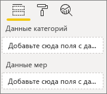
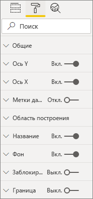
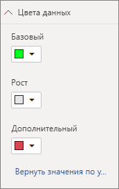

# <a name="build-a-bar-chart"></a>Создание линейчатой диаграммы

Эта статья представляет собой пошаговое руководство по созданию примера визуального элемента линейчатой диаграммы Power BI с помощью кода. Полный пример кода можно получить по адресу [https://github.com/Microsoft/PowerBI-visuals-sampleBarChart](https://github.com/Microsoft/PowerBI-visuals-sampleBarChart).

## <a name="view-model"></a>Просмотр модели
Сначала необходимо определить модель представления линейчатой диаграммы и выполнить итерацию по отображаемому визуальному элементу при его создании.

```typescript
/**
 * Interface for BarCharts viewmodel.
 *
 * @interface
 * @property {BarChartDataPoint[]} dataPoints - Set of data points the visual will render.
 * @property {number} dataMax                 - Maximum data value in the set of data points.
 */
interface BarChartViewModel {
    dataPoints: BarChartDataPoint[];
    dataMax: number;
};

/**
 * Interface for BarChart data points.
 *
 * @interface
 * @property {number} value    - Data value for the point.
 * @property {string} category - Corresponding category of the data value.
 */
interface BarChartDataPoint {
    value: number;
    category: string;
};
```

### <a name="use-static-data"></a>Использование статических данных

Использование статических данных — это отличный способ протестировать визуальный элемент, не выполняя привязку данных. Модель представления не изменится даже после добавления привязки данных на более позднем этапе.

```typescript
let testData: BarChartDataPoint[] = [
    {
        value: 10,
        category: 'a'
    },
    {
        value: 20,
        category: 'b'
    },
    {
        value: 1,
        category: 'c'
    },
    {
        value: 100,
        category: 'd'
    },
    {
        value: 500,
        category: 'e'
    }];

let viewModel: BarChartViewModel = {
    dataPoints: testData,
    dataMax: d3.max(testData.map((dataPoint) => dataPoint.value))
};
```

## <a name="data-binding"></a>Привязка данных 
Вы добавляете привязку данных, определяя возможности визуального элемента в файле *capabilities.json*. В образце кода уже есть схема, которую можно использовать.

Привязка данных работает с контейнером **Поле** в Power BI.



### <a name="add-data-roles"></a>Добавление ролей данных
В примере кода уже есть роли данных, но их можно настроить.

- `displayName` — это имя, отображаемое в контейнере **Поле**.
- `name` — это внутреннее имя, используемое для перехода на роль данных.
- `kind` — это тип поля. *Группирование* полей (0) имеет дискретные значения. Поля *Показатель* (1) содержат числовые значения данных.

```json
"dataRoles": [
    {
        "displayName": "Category Data",
        "name": "category",
        "kind": 0
    },
    {
        "displayName": "Measure Data",
        "name": "measure",
        "kind": 1
    }
],
```

Дополнительные сведения см. в разделе [Роли данных](./capabilities.md#define-the-data-fields-that-your-visual-expects-dataroles)

### <a name="add-conditions-to-dataviewmapping"></a>Добавление условий в DataViewMapping
Определите условия в `dataViewMappings`, чтобы задать, сколько полей можно привязать к каждому полю. Используйте внутренние `name` роли данных для перехода к каждому полю.

```json
    "dataViewMappings": [
        {
            "conditions": [
                {
                    "category": {
                        "max": 1
                    },
                    "measure": {
                        "max": 1
                    }
                }
            ],
        }
    ]
```

Дополнительные сведения см. в разделе [Сопоставление представлений данных](./dataview-mappings.md)

### <a name="define-and-use-visualtransform"></a>Определение и использование visualTransform
`DataView` — это структура, которую Power BI предоставляет визуальному элементу, который содержит запрашиваемые данные для визуализации. Однако `DataView` может предоставлять данные в различных формах, например категориальных и табличных. Чтобы создать категориальный визуальный элемент, такой как линейчатая диаграмма, в`DataView` необходимо использовать только категориальное свойство. Определение `visualTransform` позволяет преобразовать `DataView` в модель представления, которую будет использовать визуальный элемент.

Чтобы назначить цвета и выбрать их при определении отдельных точек данных, используйте `IVisualHost`. 

```typescript
/**
 * Function that converts queried data into a view model that will be used by the visual
 *
 * @function
 * @param {VisualUpdateOptions} options - Contains references to the size of the container
 *                                        and the dataView which contains all the data
 *                                        the visual had queried.
 * @param {IVisualHost} host            - Contains references to the host which contains services
 */
function visualTransform(options: VisualUpdateOptions, host: IVisualHost): BarChartViewModel {
    /*Convert dataView to your viewModel*/
}

```

## <a name="color"></a>Цвет 
Цвет предоставляется как одна из служб, доступных на `IVisualHost`.

### <a name="add-color-to-data-points"></a>Добавление цвета к точкам данных
Каждая точка данных представлена другим цветом. Цвет добавляется в интерфейс `BarChartDataPoint`.

```typescript
/**
 * Interface for BarChart data points.
 *
 * @interface
 * @property {number} value    - Data value for the point.
 * @property {string} category - Corresponding category of the data value.
 * @property {string} color    - Color corresponding to the data point.
 */
interface BarChartDataPoint {
    value: number;
    category: string;
    color: string;
};
```

### <a name="the-colorpalette-service"></a>Служба colorPalette
Служба `colorPalette` управляет цветами, используемыми в визуальном элементе. Ее экземпляр доступен в `IVisualHost`.

### <a name="assign-color-to-data-points"></a>Назначение цвета точкам данных
Вы определили `visualTransform` как конструкцию для преобразования `dataView` в модель представления, которую может использовать линейчатая диаграмма. Поскольку вы выполняете итерацию по точкам данных в `visualTransform`, это также идеальное место для назначения цветов.

```typescript
let colorPalette: IColorPalette = host.colorPalette; // host: IVisualHost
for (let i = 0, len = Math.max(category.values.length, dataValue.values.length); i < len; i++) {
    barChartDataPoints.push({
        category: category.values[i],
        value: dataValue.values[i],
        color: colorPalette.getColor(category.values[i]).value,
    });
}
```

## <a name="selection-and-interactions"></a>Выбор и взаимодействия
Выбор позволяет пользователю взаимодействовать как со своими визуальными элементами, так и с другими. 

### <a name="add-selection-to-each-data-point"></a>Добавление выделенного фрагмента к каждой точке данных
Так как каждая точка данных уникальна, добавьте выделенный фрагмент в каждую точку данных. Вы добавляете свойство выбора в интерфейс `BarChartDataPoint`.

```typescript
/**
 * Interface for BarChart data points.
 *
 * @interface
 * @property {number} value             - Data value for the point.
 * @property {string} category          - Corresponding category of data value.
 * @property {string} color             - Color corresponding to data point.
 * @property {ISelectionId} selectionId - Id assigned to data point for cross filtering
 *                                        and visual interaction.
 */
interface BarChartDataPoint {
    value: number;
    category: string;
    color: string;
    selectionId: ISelectionId;
};
```

### <a name="assign-selection-ids-to-each-data-point"></a>Назначение идентификаторов выбора каждой точке данных
Поскольку вы выполняете итерацию через точки данных в `visualTransform`, это также идеальное место для создания идентификаторов выбора. Переменной узла является `IVisualHost`, содержащий службы, которые могут использоваться визуальными средствами, такие как конструктор выбора и цвета. 

Используйте фабричный метод `createSelectionIdBuilder` в `IVisualHost`, чтобы создать новый идентификатор выбора. Создайте новый конструктор выбора для каждой точки данных.

Поскольку вы делаете выборы только на основе категории, необходимо определить только выбранные элементы `withCategory`.

```typescript
for (let i = 0, len = Math.max(category.values.length, dataValue.values.length); i < len; i++) {
    barChartDataPoints.push({
        category: category.values[i],
        value: dataValue.values[i],
        color: colorPalette.getColor(category.values[i]).value,
        selectionId: host.createSelectionIdBuilder()
            .withCategory(category, i)
            .createSelectionId()
    });
}
```

Дополнительные сведения см. в разделе [Создание экземпляра конструктора выбора](./selection-api.md#create-an-instance-of-the-selection-builder).

### <a name="interact-with-data-points"></a>Взаимодействие с точками данных
Вы можете взаимодействовать с каждой панелью линейчатой диаграммы, если идентификатор выбора назначается точке данных. Линейчатая диаграмма прослушивает события `click`.

Используйте фабричный метод `selectionManager` в `IVisualHost`, чтобы создать диспетчер выбора для перекрестной фильтрации и очистки выбранных элементов.

```typescript
let selectionManager = this.selectionManager;

//This must be an anonymous function instead of a lambda because
//d3 uses 'this' as the reference to the element that was clicked.
bars.on('click', function(d) {
    selectionManager.select(d.selectionId).then((ids: ISelectionId[]) => {
        bars.attr({
            'fill-opacity': ids.length > 0 ? BarChart.Config.transparentOpacity : BarChart.Config.solidOpacity
        });

        d3.select(this).attr({
            'fill-opacity': BarChart.Config.solidOpacity
        });
    });

    (<Event>d3.event).stopPropagation();
});
```

Дополнительные сведения см. в разделе [Использование SelectionManager для выбора точек данных](./selection-api.md#how-to-use-selectionmanager-to-select-data-points).

## <a name="static-objects"></a>Статические объекты

Для дальнейшей настройки визуального элемента можно добавить объекты в область **Свойство**. Эти настройки могут быть как изменениями пользовательского интерфейса, так и изменениями, связанными с запрашиваемыми данными. В примере статические объекты используются для преобразования оси X для линейчатой диаграммы.

Включить или отключить объекты можно на панели **Свойство**.



### <a name="define-objects-in-capabilities"></a>Определение объектов в capabilities
Определите свойство `objects` внутри файла *capabilities.json* для объектов, отображаемых в области **Свойство**.
- `enableAxis` — это внутреннее имя, на которое ссылается `dataView`. 
- `displayName` — это имя, отображаемое на панели **Свойство**.
- `bool` — это примитивное значение, которое обычно используется со статическими объектами, такими как текстовые поля или переключатели.
- `show` — это специальное свойство для `properties`, которое включает параметр `show` для объекта. Поскольку `show` является переключателем, он вводится как `bool`.


```typescript
"objects": {
    "enableAxis": {
        "displayName": "Enable Axis",
        "properties": {
            "show": {
                "displayName": "Enable Axis",
                "type": { "bool": true }
            }
        }
    }
}
```

Дополнительные сведения см. в статье [Объекты и свойства визуальных элементов Power BI](./objects-properties.md).

### <a name="define-property-settings"></a>Определение параметров свойств

В следующих разделах описываются основные принципы определения параметров свойств. Для определения параметров свойств можно также использовать служебные классы, определенные в пакете `powerbi-visuals-utils-dataviewutils`. Дополнительные сведения см. в документации и примерах для класса [DataViewObjectsParser](https://github.com/Microsoft/powerbi-visuals-utils-dataviewutils/blob/master/docs/api/data-view-objects-parser.md).


Хотя это необязательно, лучше локализовать большинство параметров на один объект, чтобы упростить переход.

```typescript
/**
 * Interface for BarCharts viewmodel.
 *
 * @interface
 * @property {BarChartDataPoint[]} dataPoints - Set of data points the visual will render.
 * @property {number} dataMax                 - Maximum data value in the set of data points.
 * @property {BarChartSettings} settings      - Object property settings
 */
interface BarChartViewModel {
    dataPoints: BarChartDataPoint[];
    dataMax: number;
    settings: BarChartSettings;
};

/**
 * Interface for BarChart settings.
 *
 * @interface
 * @property "show" enableAxis - Object property that allows axis to be enabled.
 */
interface BarChartSettings {
    enableAxis: {
        show: boolean;
    };
}
```

### <a name="define-and-use-objectenumerationutility"></a>Определение и использование ObjectEnumerationUtility
Значения свойств объекта доступны в виде метаданных в `dataView`, однако службы которая помогла бы получить эти свойства, нет. `ObjectEnumerationUtility` — это набор статических функций, которые можно использовать для получения значений объектов из `dataView`, а также для других проектов визуальных элементов. `ObjectEnumerationUtility` является необязательным, но отлично подходит для итерации по `dataView` для получения свойств объекта.

```typescript
/**
 * Gets property value for a particular object.
 *
 * @function
 * @param {DataViewObjects} objects - Map of defined objects.
 * @param {string} objectName       - Name of desired object.
 * @param {string} propertyName     - Name of desired property.
 * @param {T} defaultValue          - Default value of desired property.
 */
export function getValue<T>(objects: DataViewObjects, objectName: string, propertyName: string, defaultValue: T ): T {
    if(objects) {
        let object = objects[objectName];
        if(object) {
            let property: T = object[propertyName];
            if(property !== undefined) {
                return property;
            }
        }
    }
    return defaultValue;
}
```

См. [objectEnumerationUtility.ts](https://github.com/Microsoft/PowerBI-visuals-sampleBarChart/blob/master/src/objectEnumerationUtility.ts), чтобы узнать сведения об исходном коде.

### <a name="retrieve-property-values-from-dataview"></a>Получение значений свойств из dataView
`visualTransform` — идеальное место для управления моделью представления визуального элемента. Чтобы продолжить использование этого шаблона, извлеките свойства объекта из `dataView`.

Определите стандартное состояние свойства и используйте `getValue`, чтобы получить свойство из `dataView`.

```typescript
let defaultSettings: BarChartSettings = {
    enableAxis: {
        show: false,
    }
};

let barChartSettings: BarChartSettings = {
    enableAxis: {
        show: getValue<boolean>(objects, 'enableAxis', 'show', defaultSettings.enableAxis.show),
    }
}
```

### <a name="populate-property-pane-with-enumerateobjectinstances"></a>Заполнение области "Свойство" с помощью enumerateObjectInstances
Необязательный метод `enumerateObjectInstances` для `IVisual` перечисляет все объекты и помещает их в область **Свойство**. Каждый объект вызывается с `enumerateObjectInstances`. Имя объекта доступно в `EnumerateVisualObjectInstancesOptions`.

Определите свойство с его текущим состоянием для каждого объекта.

```typescript
/**
 * Enumerates through the objects defined in the capabilities and adds the properties to the format pane
 *
 * @function
 * @param {EnumerateVisualObjectInstancesOptions} options - Map of defined objects
 */
public enumerateObjectInstances(options: EnumerateVisualObjectInstancesOptions): VisualObjectInstanceEnumeration {
    let objectName = options.objectName;
    let objectEnumeration: VisualObjectInstance[] = [];

    switch(objectName) {
        case 'enableAxis':
            objectEnumeration.push({
                objectName: objectName,
                properties: {
                    show: this.barChartSettings.enableAxis.show,
                },
                selector: null
            });
    };

    return objectEnumeration;
}
```

### <a name="control-property-update-logic"></a>Управление логикой обновления свойства
После добавления объекта на панель **Свойство** каждый переключатель активирует обновление. Добавьте конкретную логику объекта в блоках `if`:

```typescript
if(settings.enableAxis.show) {
    let margins = BarChart.Config.margins;
    height -= margins.bottom;
}
```

## <a name="databound-objects"></a>Объекты с привязкой к данным
Объекты с привязкой к данным похожи на статические объекты, но обычно имеют дело с выбором данных. Например, можно изменить цвет, связанный с точкой данных.



### <a name="define-object-in-capabilities"></a>Определение объекта в capabilities
Как и статические объекты, определите другой объект в файле *capabilities.json*. 
- `colorSelector` — это внутреннее имя, на которое ссылается `dataView`.
- `displayName` — это имя, отображаемое на панели **Свойство**.
- `fill` — это значение структурного объекта, не связанного с примитивным типом.

```typescript
"colorSelector": {
    "displayName": "Data Colors",
    "properties": {
        "fill": {
            "displayName": "Color",
            "type": {
                "fill": {
                    "solid": {
                        "color": true
                    }
                }
            }
        }
    }
}
```

Дополнительные сведения см. в статье [Объекты и свойства визуальных элементов Power BI](./objects-properties.md).

### <a name="use-objectenumerationutility"></a>Использование ObjectEnumerationUtility
Как и в случае со статическими объектами, необходимо получить сведения об объекте из `dataView`. Однако значения объектов не находятся в метаданных, а связаны с каждой категорией.

```typescript
/**
 * Gets property value for a particular object in a category.
 *
 * @function
 * @param {DataViewCategoryColumn} category - List of category objects.
 * @param {number} index                    - Index of category object.
 * @param {string} objectName               - Name of desired object.
 * @param {string} propertyName             - Name of desired property.
 * @param {T} defaultValue                  - Default value of desired property.
 */
export function getCategoricalObjectValue<T>(category: DataViewCategoryColumn, index: number, objectName: string, propertyName: string, defaultValue: T): T {
    let categoryObjects = category.objects;

    if(categoryObjects) {
        let categoryObject: DataViewObject = categoryObjects[index];
        if(categoryObject) {
            let object = categoryObject[objectName];
            if(object) {
                let property: T = object[propertyName];
                if(property !== undefined) {
                    return property;
                }
            }
        }
    }
    return defaultValue;
}
```

См. [objectEnumerationUtility.ts](https://github.com/Microsoft/PowerBI-visuals-sampleBarChart/blob/master/src/objectEnumerationUtility.ts), чтобы узнать сведения об исходном коде.

### <a name="define-default-color-and-retrieve-categorical-object-from-dataview"></a>Определение цвета по умолчанию и получение объекта категории из dataView
Каждый цвет теперь связан с каждой категорией в `dataView`. Каждой точке данных можно присвоить соответствующий цвет.

```typescript
for (let i = 0, len = Math.max(category.values.length, dataValue.values.length); i < len; i++) {
    let defaultColor: Fill = {
        solid: {
            color: colorPalette.getColor(category.values[i]).value
        }
    }

    barChartDataPoints.push({
        category: category.values[i],
        value: dataValue.values[i],
        color: getCategoricalObjectValue<Fill>(category, i, 'colorSelector', 'fill', defaultColor).solid.color,
        selectionId: host.createSelectionIdBuilder()
            .withCategory(category, i)
            .createSelectionId()
    });
}
```

### <a name="populate-property-pane-with-enumerateobjectinstances"></a>Заполнение области "Свойство" с помощью enumerateObjectInstances
Используйте `enumerateObjectInstances`, чтобы заполнить панель **Свойство** с помощью объектов. 

Для этого экземпляра добавьте палитру цветов для отображения каждой категории на панели **Свойство**. Для этого добавьте дополнительный вариант в инструкцию `switch` для `colorSelector` и выполните итерацию по каждой точке данных с соответствующим цветом. 

Чтобы связать цвет с точкой данных, необходимо сделать выбор.

```typescript
/**
 * Enumerates through the objects defined in the capabilities and adds the properties to the format pane
 *
 * @function
 * @param {EnumerateVisualObjectInstancesOptions} options - Map of defined objects
 */
public enumerateObjectInstances(options: EnumerateVisualObjectInstancesOptions): VisualObjectInstanceEnumeration {
    let objectName = options.objectName;
    let objectEnumeration: VisualObjectInstance[] = [];

    switch(objectName) {
        case 'enableAxis':
            objectEnumeration.push({
                objectName: objectName,
                properties: {
                    show: this.barChartSettings.enableAxis.show,
                },
                selector: null
            });
            break;
        case 'colorSelector':
            for(let barDataPoint of this.barDataPoints) {
                objectEnumeration.push({
                    objectName: objectName,
                    displayName: barDataPoint.category,
                    properties: {
                        fill: {
                            solid: {
                                color: barDataPoint.color
                            }
                        }
                    },
                    selector: barDataPoint.selectionId.getSelector()
                });
            }
            break;
    };

    return objectEnumeration;
}
```

После предоставления селектора для каждого свойства вы получаете следующий массив объектов `dataView`:


Каждый элемент в массиве `dataViews[0].categorical.categories[0].objects` соответствует конкретной категории набора данных.

Функция `getCategoricalObjectValue` просто предоставляет удобный способ доступа к свойствам по индексу категории. Необходимо указать `objectName` и `propertyName`, соответствующие объекту и свойству в файле *capabilities.json*.

## <a name="other-features"></a>Другие возможности 
В линейчатую диаграмму можно добавить элемент управления "Ползунок" или подсказки. Чтобы добавить код, ознакомьтесь с фиксациями в разделах [Добавление ползунка на панели свойств для управления непрозрачностью](https://github.com/Microsoft/PowerBI-visuals-sampleBarChart/commit/e2e0bc5888d9a3ca305a7a7af5046068645c8b30) и [Добавление поддержки для подсказок](https://github.com/Microsoft/PowerBI-visuals-sampleBarChart/commit/981b021612d7b333adffe9f723ab27783c76fb14). Дополнительные сведения о всплывающих подсказках см. в статье [Подсказки в визуальных элементах Power BI](./add-tooltips.md).

## <a name="packaging"></a>Упаковка

Прежде чем загрузить визуальный элемент в [Power BI Desktop](https://powerbi.microsoft.com/desktop/) или поделиться им с сообществом в [коллекции визуальных элементов Power BI](https://visuals.powerbi.com/), вам потребуется упаковать его. Перейдите к корневой папке проекта визуального элемента, который содержит файл *pbiviz.json*, и выполните следующую команду, чтобы создать файл *pbiviz*:

```bash
pbiviz package
```
Эта команда создает файл *pbiviz* в каталоге визуального проекта *dist/* , а также перезаписывает любой файл *pbiviz* из предыдущих операций пакета.

## <a name="next-steps"></a>Дальнейшие действия
К визуальному элементу можно добавить следующие возможности:
* [Добавление контекстного меню в визуальный элемент](./context-menu.md)
* [Целевая страница](./landing-page.md)
* [Открытие URL-адреса](./launch-url.md)
* [Поддержка языковых стандартов](./localization.md)