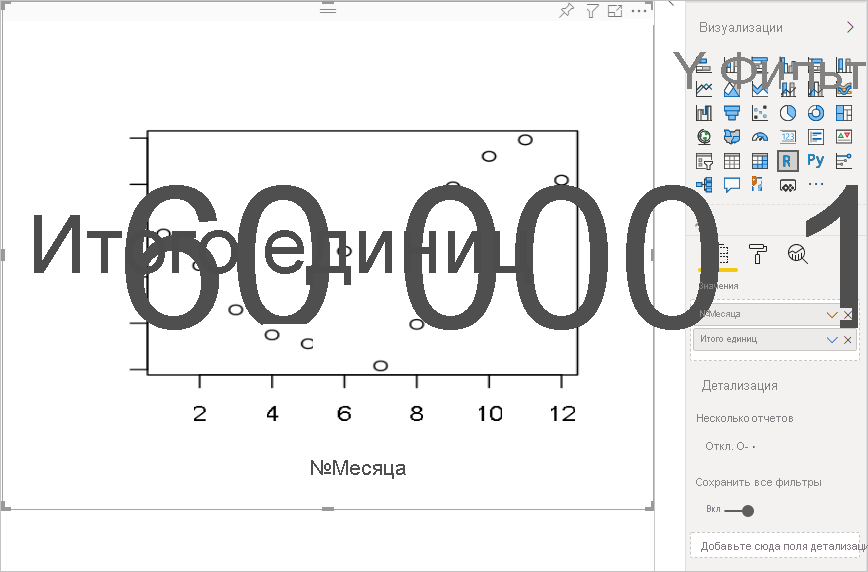
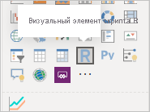
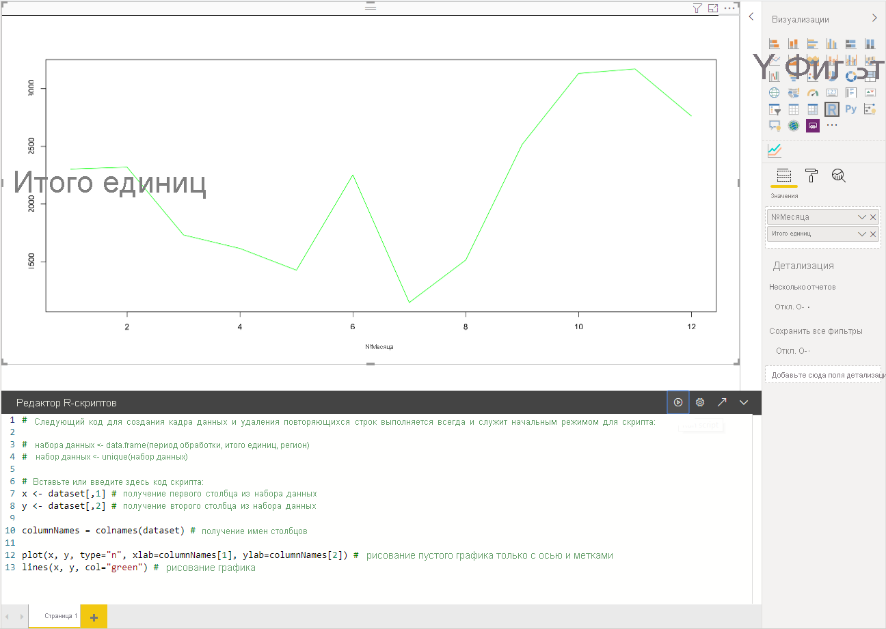
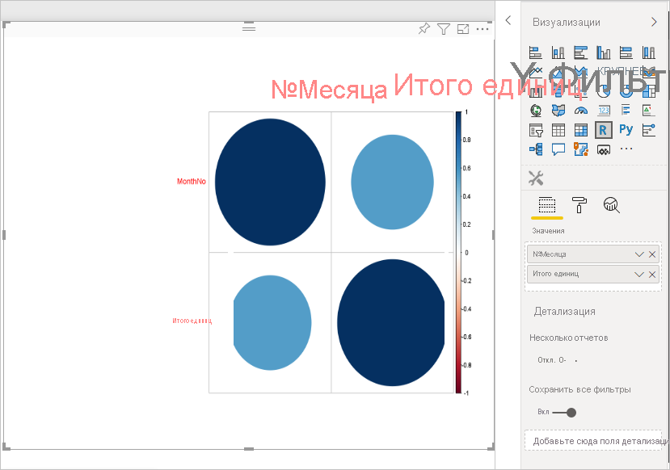
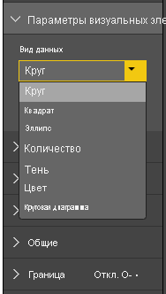
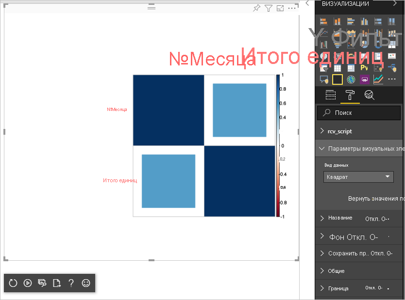

# <a name="tutorial-create-an-r-powered-power-bi-visual"></a>Руководство по Создание визуальных элементов Power BI с использованием языка R

В этом учебнике описывается создание визуального элемента Power BI с использованием R.

В этом руководстве описано следующее:

> [!div class="checklist"]
>
> * Создание визуальных элементов с использованием R
> * Изменение R-скрипта в Power BI Desktop
> * Добавление библиотек в визуальный элемент
> * Добавление статического свойства

## <a name="prerequisites"></a>Предварительные требования

* Учетная запись **Power BI Pro**. [Зарегистрируйтесь для получения бесплатной пробной версии](https://powerbi.microsoft.com/pricing/) перед началом работы.
* Подсистема R. Вы можете скачать и установить R бесплатно из разных источников, в том числе со [страницы загрузки Revolution Open](https://mran.revolutionanalytics.com/download/) и [репозитория CRAN](https://cran.r-project.org/bin/windows/base/). Дополнительные сведения см. в статье [Создание визуальных элементов Power BI с помощью языка R](../../create-reports/desktop-r-visuals.md).
* [Power BI Desktop](../../fundamentals/desktop-get-the-desktop.md).
* [Windows PowerShell](/powershell/scripting/install/installing-windows-powershell?view=powershell-6) версии 4 или более поздней для пользователей Windows ИЛИ [терминал](https://macpaw.com/how-to/use-terminal-on-mac) для пользователей OSX.

## <a name="getting-started"></a>Начало работы

1. Подготовьте образец данных для визуального элемента. Эти значения можно сохранить в базу данных Excel или файл *CSV* и импортировать в Power BI Desktop.

    | №Месяца | Итого единиц |
    |-----|-----|
    | 1 | 2303 |
    | 2 | 2319 |
    | 3 | 1732 |
    | 4 | 1615 |
    | 5 | 1427 |
    | 6 | 2253 |
    | 7 | 1147 |
    | 8 | 1515 |
    | 9 | 2516 |
    | 10 | 3131 |
    | 11 | 3170 |
    | 12 | 2762 |

1. Чтобы создать визуальный элемент, откройте PowerShell или терминал и выполните следующую команду:

   ```cmd
   pbiviz new rVisualSample -t rvisual
   ```

   Эта команда создает новую структуру папок на основе шаблона `rvisual`. Этот шаблон содержит базовый, готовый к работе визуальный элемент R, который выполняет этот R-скрипт:

   ```r
   plot(Values)
   ```

   Кадр данных `Values` будет содержать столбцы в роли данных `Values`.

1. Назначьте данные визуальному элементу разработчика, добавив **MonthNo** и **Total units** в раздел **Values** визуального элемента.

   

## <a name="editing-the-r-script"></a>Изменение R-скрипта

При использовании `pbiviz` для создания визуального элемента R на основе шаблона `rvisual` создается файл с именем *script.r* в корневой папке визуального элемента. Этот файл содержит скрипт R, который создает изображение для пользователя. Вы можете создавать R-скрипты в Power BI Desktop.

1. В Power BI Desktop выберите **Визуальный элемент скрипта R**.

   

1. Вставьте этот код R в **редактор R-скриптов**.

    ```r
    x <- dataset[,1] # get the first column from dataset
    y <- dataset[,2] # get the second column from dataset

    columnNames = colnames(dataset) # get column names

    plot(x, y, type="n", xlab=columnNames[1], ylab=columnNames[2]) # draw empty plot with axis and labels only
    lines(x, y, col="green") # draw line plot
    ```

1. Чтобы увидеть результат, щелкните значок **Запуск скрипта**.

    

1. Когда скрипт R будет готов, скопируйте его в файл `script.r` в проекте визуального элемента, созданном на одном из предыдущих шагов.

1. Измените `name` в разделе `dataRoles` в файле *capabilities.json* на `dataRoles`. Power BI передает данные в качестве объекта кадра данных `dataset` для визуального элемента скрипта R, но визуальный элемент R получает имя кадра данных в соответствии с именами `dataRoles`.

    ```json
    {
      "dataRoles": [
        {
          "displayName": "Values",
          "kind": "GroupingOrMeasure",
          "name": "dataRoles"
        }
      ],
      "dataViewMappings": [
        {
          "scriptResult": {
            "dataInput": {
              "table": {
                "rows": {
                  "select": [
                    {
                      "for": {
                        "in": "dataset"
                      }
                    }
                  ],
                  "dataReductionAlgorithm": {
                    "top": {}
                  }
                }
              }
            },
            ...
          }
        }
      ],
    }
    ```

1. Добавьте следующий код для поддержки изменения размера изображения в файле *src/visual.ts*.

    ```typescript
      public onResizing(finalViewport: IViewport): void {
          this.imageDiv.style.height = finalViewport.height + "px";
          this.imageDiv.style.width = finalViewport.width + "px";
          this.imageElement.style.height = finalViewport.height + "px";
          this.imageElement.style.width = finalViewport.width + "px";
      }
    ```

## <a name="add-libraries-to-visual-package"></a>Добавление библиотек в визуальный пакет

Эта процедура позволяет визуальному элементу использовать пакет `corrplot`.

1. Добавьте зависимость библиотеки для визуального элемента в `dependencies.json`. Вот пример содержимого этого файла:

    ```json
    {
      "cranPackages": [
        {
          "name": "corrplot",
          "displayName": "corrplot",
          "url": "https://cran.r-project.org/web/packages/corrplot/"
        }
      ]
    }
    ```

    Пакет `corrplot` является графическим представлением матрицы корреляции. Дополнительные сведения о `corrplot`см. в статье [Знакомство с пакетом corrplot](https://cran.r-project.org/web/packages/corrplot/vignettes/corrplot-intro.html).

1. После внесения этих изменений начинайте использовать пакет в файле `script.r`.

    ```r
    library(corrplot)
    corr <- cor(dataset)
    corrplot(corr, method="circle", order = "hclust")
    ```

Результат использования пакета `corrplot` выглядит так же, как и в следующем примере:



## <a name="adding-a-static-property-to-the-property-pane"></a>Добавление статического свойства в область свойств

Разрешите пользователям изменять параметры пользовательского интерфейса. Для этого добавьте в область свойств свойства, изменяющие поведение в зависимости от действий пользователя в скрипте R.

`corrplot` можно настроить с помощью аргумента `method` для функции `corrplot`. В скрипте по умолчанию используется круг. Измените визуальный элемент, чтобы пользователь мог выбрать один из нескольких вариантов.

1. Определите объект и свойство в файле *capabilities.json*. Затем используйте данное имя объекта в методе перечисления, чтобы получить эти значения из области свойств.

    ```json
    {
      "settings": {
      "displayName": "Visual Settings",
      "description": "Settings to control the look and feel of the visual",
      "properties": {
        "method": {
          "displayName": "Data Look",
          "description": "Control the look and feel of the data points in the visual",
          "type": {
            "enumeration": [
              {
                "displayName": "Circle",
                "value": "circle"
              },
              {
                "displayName": "Square",
                "value": "square"
              },
              {
                "displayName": "Ellipse",
                "value": "ellipse"
              },
              {
                "displayName": "Number",
                "value": "number"
              },
              {
                "displayName": "Shade",
                "value": "shade"
              },
              {
                "displayName": "Color",
                "value": "color"
              },
              {
                "displayName": "Pie",
                "value": "pie"
              }
            ]
          }
        }
      }
    }
    ```

1. Откройте файл *src/settings.ts*. Создайте класс `CorrPlotSettings` с общим свойством `method`. Задайте тип `string` и значение по умолчанию `circle`. Добавьте свойство `settings` в класс `VisualSettings` со значением по умолчанию:

    ```typescript
    "use strict";

    import { dataViewObjectsParser } from "powerbi-visuals-utils-dataviewutils";
    import DataViewObjectsParser = dataViewObjectsParser.DataViewObjectsParser;

    export class VisualSettings extends DataViewObjectsParser {
      public rcv_script: rcv_scriptSettings = new rcv_scriptSettings();
      public settings: CorrPlotSettings = new CorrPlotSettings();
    }

    export class CorrPlotSettings {
      public method: string = "circle";
    }

    export class rcv_scriptSettings {
      public provider;
      public source;
    }
    ```

    После выполнения этих действий можно изменить свойство визуального элемента.

   

    Наконец, скрипт R должен начинаться со свойства. Если пользователь не изменяет свойство, визуальный элемент не получает для него никакого значения.

    В случае переменных среды выполнения R для свойств используется соглашение об именовании `<objectname>_<propertyname>`. В данном случае `settings_method`.

1. Измените скрипт R в визуальном элементе, чтобы он соответствовал следующему коду:

    ```r
    library(corrplot)
    corr <- cor(dataset)

    if (!exists("settings_method"))
    {
        settings_method = "circle";
    }

    corrplot(corr, method=settings_method, order = "hclust")
    ```

Окончательная версия визуального элемента выглядит следующим образом:



## <a name="next-steps"></a>Дальнейшие действия

Дополнительные сведения о визуальных элементах на платформе R см. в статье [Использование визуальных элементов Power BI на основе R в Power BI](../../create-reports/desktop-r-powered-custom-visuals.md).

Дополнительные сведения о визуальных элементах на основе R в Power BI Desktop см. в статье [Создание визуальных элементов Power BI с помощью языка R](../../create-reports/desktop-r-visuals.md).