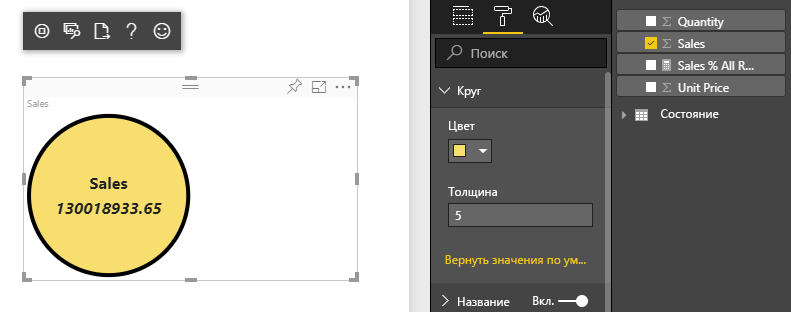

# <a name="tutorial-create-a-react-based-visual"></a>Руководство. Создание визуального элемента на основе React

В этом руководстве содержатся сведения о создании визуального элемента Power BI с помощью [React](https://reactjs.org/). Визуальный элемент отображает значение в кружке. Визуальный элемент имеет адаптивные размер и параметры для настройки. С помощью сведений, приведенных в этой статье, можно создавать собственные визуальные элементы Power BI, используя React.



Из этого руководства вы узнаете, как выполнять следующие задачи:

> [!div class="checklist"]
>
> * Настройка среды разработки
> * Создание визуального элемента React.
> * Настройка возможностей визуального элемента.
> * Преобразование данных из Power BI для просмотра.
> * Изменение размера визуального элемента.
> * Создание возможностей настройки визуального элемента.

## <a name="prerequisites"></a>Предварительные требования

* Учетная запись **Power BI Pro** . [Зарегистрируйтесь для получения бесплатной пробной версии](https://powerbi.microsoft.com/pricing/) перед началом работы.
* [Visual Studio Code](https://www.visualstudio.com/).
* [Windows PowerShell](/powershell/scripting/install/installing-windows-powershell) версии 4 или более поздней для пользователей Windows ИЛИ [терминал](https://macpaw.com/how-to/use-terminal-on-mac) для пользователей OSX.
* Среда, настроенная по инструкциями из статьи [Настройка среды для разработки визуального элемента Power BI](environment-setup.md).

## <a name="getting-started"></a>Начало работы

Сначала создайте минимальный визуальный элемент Power BI с помощью `pbiviz`. Дополнительные сведения о проектах и структуре проектов визуальных элементов Power BI см. на [этой странице](visual-project-structure.md). Полный исходный код этого визуального элемента см. на странице[Визуальный элемент React Circle Card](https://github.com/Microsoft/powerbi-visuals-circlecard-react).

Вы можете клонировать или скачать полный исходный код визуального элемента на сайте [GitHub](https://github.com/Microsoft/powerbi-visuals-circlecard-react).

1. Откройте PowerShell и выполните следующую команду:

   ```powershell
   pbiviz new ReactCircleCard
   ```

   Команда создает папку с именем *ReactCircleCard* .

1. Перейдите в эту папку и откройте Visual Studio Code.

   ```powershell
   cd ./ReactCircleCard
   code .
   ```

1. Запустите сервер разработчика для визуального элемента.

   ```powershell
   pbiviz start
   ```

   

Этот базовый визуальный элемент представляет число обновлений. Преобразуйте его в круговую карточку на следующем шаге.

## <a name="change-the-visual-to-a-circle-card"></a>Изменение визуального элемента на круговую карточку

Этот базовый визуальный элемент представляет число обновлений. Затем преобразуйте его в круговую карточку, которая представляет меру и ее заголовок.

1. Выполните следующую команду, чтобы установить зависимости:

   ```powershell
   npm i react react-dom
   ```

1. Чтобы установить React 16 и соответствующие версии `react-dom`, а также вводимые элементы, выполните следующую команду:

   ```powershell
   npm i @types/react @types/react-dom
   ```

1. Создайте класс компонентов React. В Visual Studio Code выберите **Файл** > **Создать файл** . Скопируйте в файл приведенный ниже код.

    ```typescript
    import * as React from "react";

    export class ReactCircleCard extends React.Component<{}>{
        render(){
            return (
                <div className="circleCard">
                    Hello, React!
                </div>
            )
        }
    }

    export default ReactCircleCard;
    ```

1. Выберите **Сохранить как** . Перейдите в каталог *src* . Введите имя *component* . Для параметра **Тип файла** выберите **TypeScript React** .

1. Откройте *src/visual.ts* . Замените текущий код следующим кодом:

    ```typescript
    "use strict";
    import powerbi from "powerbi-visuals-api";

    import DataView = powerbi.DataView;
    import VisualConstructorOptions = powerbi.extensibility.visual.VisualConstructorOptions;
    import VisualUpdateOptions = powerbi.extensibility.visual.VisualUpdateOptions;
    import IVisual = powerbi.extensibility.visual.IVisual;

    import "./../style/visual.less";

    export class Visual implements IVisual {

        constructor(options: VisualConstructorOptions) {

        }

        public update(options: VisualUpdateOptions) {

        }
    }
    ```

1. Импортируйте зависимости React и только что добавленный компонент.

    ```typescript
    import * as React from "react";
    import * as ReactDOM from "react-dom";
    ...
    import ReactCircleCard from "./component";
    ```

   Параметры TypeScript Power BI по умолчанию не принимают *TSX* -файлы. Visual Studio Code выделяет `component` как ошибку.

1. Откройте файл *tsconfig.json* и добавьте две строки в начале элемента `compilerOptions`.

    ```json
    {
      "compilerOptions": {
        "jsx": "react",
        "types": ["react", "react-dom"],
        //...
      }
    }
    ```

   Ошибка в `component` должна быть исправлена.

   Чтобы преобразовать компонент для просмотра, добавьте целевой элемент HTML. Этим элементом является `HTMLElement` в `VisualConstructorOptions`, который передается в конструктор.

1. Измените класс `Visual`, как показано в следующем коде:

    ```typescript
      private target: HTMLElement;
      private reactRoot: React.ComponentElement<any, any>;

      constructor(options: VisualConstructorOptions) {
          this.reactRoot = React.createElement(ReactCircleCard, {});
          this.target = options.element;

          ReactDOM.render(this.reactRoot, this.target);
      }
    ```

1. Сохраните изменения и запустите имеющийся код с помощью следующей команды:

    ```bash
    pbiviz start
    ```

   > [!NOTE]
   > Если вы ранее запускали `pbiviz`, необходимо выполнить перезапуск, чтобы применить изменения в *tsconfig.json* .

  

## <a name="configure-capabilities"></a>Настройка возможностей

Вы можете настроить возможности визуального элемента.

1. Откройте файл `capabilities.json`. Удалите объект `Category Data` из `dataRoles`. `ReactCircleCard` отображает одно значение, поэтому нам нужно только `Measure Data`. Ключ `dataRoles` теперь выглядит следующим образом:

    ```json
    "dataRoles": [
        {
            "displayName": "Measure Data",
            "name": "measure",
            "kind": "Measure"
        }
    ],
    ```

1. Удалите все содержимое ключа `objects`. Вы заполните его позже.

    ```json
        "objects": {},
    ```

1. Скопируйте следующий код свойства `dataViewMappings`. Значение `max: 1` указывает, что можно отправить единственный столбец меры.

    ```json
        "dataViewMappings": [
            {
                "conditions": [
                    {
                        "measure": {
                            "max": 1
                        }
                    }
                ],
                "single": {
                    "role": "measure"
                }
            }
        ]
    ```

Теперь можно перенести данные из области `Fields` в параметры визуального элемента.


## <a name="receive-properties-from-power-bi"></a>Получение свойств из Power BI

Данные можно преобразовать для просмотра с помощью React. Компонент может отображать данные своего собственного состояния.

1. Измените *src/component.tsx* .

    ```javascript
    export interface State {
        textLabel: string,
        textValue: string
    }

    export const initialState: State = {
        textLabel: "",
        textValue: ""
    }

    export class ReactCircleCard extends React.Component<{}, State>{
        constructor(props: any){
            super(props);
            this.state = initialState;
        }

        render(){
            const { textLabel, textValue } = this.state;

            return (
                <div className="circleCard">
                    <p>
                        {textLabel}
                        <br/>
                        <em>{textValue}</em>
                    </p>
                </div>
            )
        }
    }
    ```

1. Добавьте стили для новой разметки, изменив *styles/visual.less* .

    ```css
    .circleCard {
        position: relative;
        box-sizing: border-box;
        border: 1px solid #000;
        border-radius: 50%;
        width: 200px;
        height: 200px;
    }

    p {
        text-align: center;
        line-height: 30px;
        font-size: 20px;
        font-weight: bold;

        position: relative;
        top: -30px;
        margin: 50% 0 0 0;
    }
    ```

1. Визуальные элементы получают текущие данные в качестве аргумента метода `update`. Откройте *src/visual.ts* и добавьте код для `ReactCircleCard.update`.

    ```typescript
    //...
    import { ReactCircleCard, initialState } from "./component";
    //...

    export class Visual implements IVisual {
        //...
        public update(options: VisualUpdateOptions) {

            if(options.dataViews && options.dataViews[0]){
                const dataView: DataView = options.dataViews[0];

                ReactCircleCard.update({
                    textLabel: dataView.metadata.columns[0].displayName,
                    textValue: dataView.single.value.toString()
                });
            }
            } else {
                this.clear();
            }
        }

        private clear() {
            ReactCircleCard.update(initialState);
        }
    }
    ```

    Код выбирает `textLabel` и `textValue` из `DataView` и, если данные существуют, обновляет состояние компонента.

1. Чтобы отправить обновления в экземпляр компонента, вставьте в класс `ReactCircleCard` следующий код:

    ```typescript
        private static updateCallback: (data: object) => void = null;

        public static update(newState: State) {
            if(typeof ReactCircleCard.updateCallback === 'function'){
                ReactCircleCard.updateCallback(newState);
            }
        }

        public state: State = initialState;

        public componentWillMount() {
            ReactCircleCard.updateCallback = (newState: State): void => { this.setState(newState); };
        }

        public componentWillUnmount() {
            ReactCircleCard.updateCallback = null;
        }
    ```

1. Протестируйте визуальный элемент. Убедитесь, что запуск `pbiviz start` выполнен, и сохраните все файлы. Обновите визуальный элемент.

   

## <a name="make-component-resizable"></a>Создание компонента с изменяемым размером

В этом разделе вы создадите компонент с изменяемым размером. В настоящее время компонент имеет фиксированную ширину и высоту.

Получите текущий размер окна просмотра визуального элемента из объекта `options`.

1. Откройте *src/visual.ts* . Импортируйте интерфейс `IViewport` и добавьте свойство `viewport` в класс `visual`.

    ```typescript
    import IViewport = powerbi.IViewport;

    //...

    export class Visual implements IVisual {
        private viewport: IViewport;
        //...
    }
    ```

1. Добавьте в метод `update` `visual` следующий код.

    ```typescript
      if (options.dataViews && options.dataViews[0]) {
          const dataView: DataView = options.dataViews[0];

          this.viewport = options.viewport;
          const { width, height } = this.viewport;
          const size = Math.min(width, height);

          ReactCircleCard.update({
              size,
              //...
          });
      }
    ```

1. Добавьте свойства в интерфейс `State` в *src/component.tsx* .

    ```typescript
    export interface State {
        //...
        size: number
    }

    const initialState: State = {
        //...
        size: 200
    }
    ```

1. Внесите следующие изменения в метод `render` в *src/component.tsx* :

    ```typescript
        render() {
            const { textLabel, textValue, size } = this.state;

            const style: React.CSSProperties = { width: size, height: size };

            return (
                <div className="circleCard" style={style}>
                    {/* ... */}
                </div>
            )
        }
    ```

1. Замените правила `width` и `height` в *style/visual.less* на `min-width` и `min-height`.

    ```css
        min-width: 200px;
        min-height: 200px;
    ```

Теперь можно изменить размер окна просмотра. Диаметр круга соответствует минимальному размеру, основываясь на ширине или высоте.

## <a name="make-your-power-bi-visual-customizable"></a>Создание настраиваемого визуального элемента Power BI

В этом разделе вы создадите настраиваемый визуальный элемент.

1. Откройте *capabilities.json* . Добавьте следующие параметры в свойство `objects`.

    ```json
    //...
        "objects": {
            "circle": {
                "displayName": "Circle",
                "properties": {
                    "circleColor": {
                        "displayName": "Color",
                        "description": "The fill color of the circle.",
                        "type": {
                            "fill": {
                                "solid": {
                                    "color": true
                                }
                            }
                        }
                    },
                    "circleThickness": {
                        "displayName": "Thickness",
                        "description": "The circle thickness.",
                        "type": {
                            "numeric": true
                        }
                    }
                }
            }
        },
    //...
    ```

1. Замените имеющийся код в *src/settings.ts* следующим кодом:

    ```typescript
    "use strict";

    import { dataViewObjectsParser } from "powerbi-visuals-utils-dataviewutils";
    import DataViewObjectsParser = dataViewObjectsParser.DataViewObjectsParser;

    export class CircleSettings {
        public circleColor: string = "white";
        public circleThickness: number = 2;
    }

    export class VisualSettings extends DataViewObjectsParser {
        public circle: CircleSettings = new CircleSettings();
    }
    ```

1. Добавьте следующие операторы `import` в начало *src/visual.ts* :

    ```typescript
    import VisualObjectInstance = powerbi.VisualObjectInstance;
    import EnumerateVisualObjectInstancesOptions = powerbi.EnumerateVisualObjectInstancesOptions;
    import VisualObjectInstanceEnumerationObject = powerbi.VisualObjectInstanceEnumerationObject;

    import { VisualSettings } from "./settings";

    ```

1. Добавьте метод `enumerateObjectInstances` в *src/visual.ts* . Этот метод используется для применения параметров визуального элемента.

    ```typescript
    export class Visual implements IVisual {
        private settings: VisualSettings;

        //...

        public enumerateObjectInstances(
            options: EnumerateVisualObjectInstancesOptions
        ): VisualObjectInstance[] | VisualObjectInstanceEnumerationObject {

            return VisualSettings.enumerateObjectInstances(this.settings || VisualSettings.getDefault(), options);
        }
    }
    ```

1. Добавьте код, чтобы объект `dataView` теперь мог получить параметры.

    ```typescript
        public update(options: VisualUpdateOptions) {

            if(options.dataViews && options.dataViews[0]){
                //...
                this.settings = VisualSettings.parse(dataView) as VisualSettings;
                const object = this.settings.circle;

                ReactCircleCard.update({
                    borderWidth: object && object.circleThickness ? object.circleThickness : undefined,
                    background: object && object.circleColor ? object.circleColor : undefined,
                    //...
                });
            }
        }
    }
    ```

1. Примените соответствующие изменения в *src/component.tsx* , добавив сначала эти значения в `State`:

    ```typescript
    export interface State {
        //...
        background?: string,
        borderWidth?: number
    }
    ```

1. Затем добавьте следующий код в метод `render`:

    ```typescript
        const { /*...*/ background, borderWidth } = this.state;

        const style: React.CSSProperties = { /*...*/ background, borderWidth };
    ```

    

## <a name="next-steps"></a>Дальнейшие действия

Дополнительные сведения о разработке Power BI см. на страницах [Рекомендации по визуальным элементам Power BI](guidelines-powerbi-visuals.md) и [Визуальные элементы в Power BI](power-bi-visuals-concept.md).