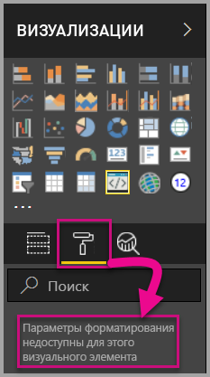
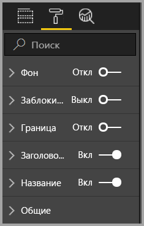
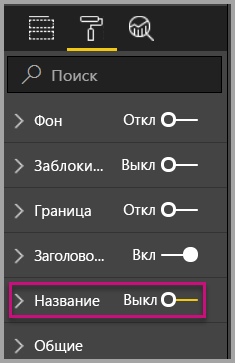
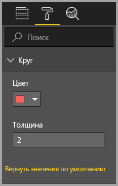
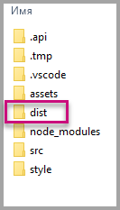
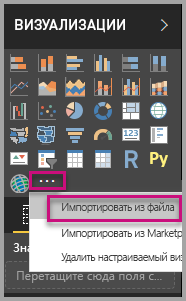
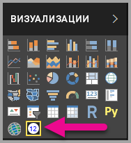

# <a name="tutorial-adding-formatting-options-to-a-power-bi-visual"></a>Руководство. Добавление параметров форматирования в визуальные элементы Power BI

В этом руководстве описывается добавление типичных свойств в визуальные элементы.

Из этого руководства вы узнаете, как выполнять следующие задачи:
> [!div class="checklist"]
> * Добавление свойств визуальных элементов.
> * Упаковка визуальных элементов.
> * Импорт пользовательских визуальных элементов в отчет Power BI Desktop.

## <a name="adding-formatting-options"></a>Добавление параметров форматирования

1. В **Power BI** выберите вкладку **Формат**.

    Вы увидите сообщение *Параметры форматирования недоступны для этого визуального элемента*.

    

2. В **Visual Studio Code** откройте файл *capabilities.json*.

3. Перед массивом **dataViewMappings** добавьте объект **objects** (после строки 8).

    ```json
    "objects": {},
    ```

    

4. Сохраните файл **capabilities.json**.

5. Еще раз просмотрите параметры форматирования в **Power BI**.

    > [!Note]
    > Если параметры форматирования не изменились, **перезагрузите пользовательский визуальный элемент**.

    

6. Установите для параметра **Заголовок** значение *Откл.* Обратите внимание, что в левом верхнем углу визуального элемента перестало отображаться имя меры.

    

    

### <a name="adding-custom-formatting-options"></a>Добавление пользовательских параметров форматирования

Вы можете добавить пользовательские свойства, позволяющие настроить цвет круга и ширину границы.

1. Остановите пользовательский визуальный элемент в PowerShell.

2. В Visual Studio Code в файле **capabilities.json** вставьте в объект **objects** следующий фрагмент кода JSON.

    ```json
        {
            "circle": {
                "displayName": "Circle",
                "properties": {
                    "circleColor": {
                        "displayName": "Color",
                        "description": "The fill color of the circle.",
                        "type": {
                            "fill": {
                                "solid": {
                                    "color": true
                                }
                            }
                        }
                    },
                    "circleThickness": {
                        "displayName": "Thickness",
                        "description": "The circle thickness.",
                        "type": {
                            "numeric": true
                        }
                    }
                }
            }
        }
    ```

    Этот фрагмент JSON описывает группу с именем circle, которая состоит из двух параметров с именами circleColor и circleThickness.

   

3. Сохраните файл **capabilities.json**.

4. В **области обозревателя** в папке **src** выберите файл **settings.ts**. *Этот файл представляет параметры начального визуального элемента*.

5. В файле **settings.ts** замените два класса следующим кодом:

    ```typescript
    export class CircleSettings {
        public circleColor: string = "white";
        public circleThickness: number = 2;
    }
    export class VisualSettings extends DataViewObjectsParser {
        public circle: CircleSettings = new CircleSettings();
    }
    ```

    

    Этот модуль определяет два класса. Класс **CircleSettings** определяет два свойства с именами, которые соответствуют объектам, определенным в файле **capabilities.json** (**circleColor** и **circleThickness**), а также задает значения по умолчанию. Класс **VisualSettings** наследует класс **DataViewObjectParser** и добавляет свойство с именем **circle**, соответствующее объекту, определенному в файле *capabilities.json*, и возвращает экземпляр **CircleSettings**.

6. Сохраните файл **settings.ts**.

7. Откройте файл **visual.ts**.

8. В файле **visual.ts** сделайте следующее.

    Импортируйте `VisualSettings`, `VisualObjectInstanceEnumeration` и `EnumerateVisualObjectInstancesOptions`:

    ```typescript
    import { VisualSettings } from "./settings";
    import VisualObjectInstanceEnumeration = powerbi.VisualObjectInstanceEnumeration;
    import EnumerateVisualObjectInstancesOptions = powerbi.EnumerateVisualObjectInstancesOptions;
    ```

    В класс **Visual** добавьте следующее свойство:

    ```typescript
    private visualSettings: VisualSettings;
    ```

    Это свойство содержит ссылку на объект **VisualSettings**, описывающий параметры визуального элемента.

    

9. В классе **Visual** перед методом **update** добавьте следующий метод. Этот метод используется для заполнения параметров форматирования.

    ```typescript
    public enumerateObjectInstances(options: EnumerateVisualObjectInstancesOptions): VisualObjectInstanceEnumeration {
        const settings: VisualSettings = this.visualSettings || <VisualSettings>VisualSettings.getDefault();
        return VisualSettings.enumerateObjectInstances(settings, options);
    }
    ```

    Этот метод используется для заполнения параметров форматирования.

    

10. В методе **update** после объявления переменной **radius** добавьте следующий код:

    ```typescript
    this.visualSettings = VisualSettings.parse<VisualSettings>(dataView);

    this.visualSettings.circle.circleThickness = Math.max(0, this.visualSettings.circle.circleThickness);
    this.visualSettings.circle.circleThickness = Math.min(10, this.visualSettings.circle.circleThickness);
    ```

    Этот код извлекает параметры форматирования. Он корректирует любое значение, передаваемое в свойство **circleThickness**, преобразовывая его в 0, если оно отрицательное, или в 10, если оно больше 10.

    

11. Для элемента **circle** замените значение **стиля заливки** следующим выражением:

    ```typescript
    this.visualSettings.circle.circleColor
    ```

    

12. Для элемента **circle** замените значение **стиля ширины штриха** следующим выражением:

    ```typescript
    this.visualSettings.circle.circleThickness
    ```

    

13. Сохраните файл visual.ts.

14. В PowerShell запустите визуальный элемент.

    ```powershell
    pbiviz start
    ```

15. В **Power BI** на панели инструментов над визуальным элементом выберите **Включить автоматическую перезагрузку**.

16. В параметрах **форматирования визуального элемента** разверните элемент **Circle** (Круг).

    

    Измените параметры **color** (цвет) и **thickness** (толщина).

    Укажите для параметра **thickness** значение меньше нуля, а затем — больше 10. Обратите внимание, что визуальный элемент корректирует значение до допустимого минимума или максимума.

## <a name="packaging-the-custom-visual"></a>Упаковка пользовательского визуального элемента

Введите значения свойств для проекта пользовательского визуального элемента, обновите файл значка и упакуйте пользовательский визуальный элемент.

1. Остановите пользовательский визуальный элемент в **PowerShell**.

2. Откройте файл **pbiviz.json** в **Visual Studio Code**.

3. В объекте **visual** укажите для свойства **displayName** значение *Circle Card* (Карта круга).

    Это значение имени появляется, когда мы наводим указатель мыши на значок на панели **Визуализации**.

    

4. В свойство **description** добавьте следующий текст:

    *Отображает отформатированное значение меры внутри круга*

5. Заполните поля **supportUrl** и **gitHubUrl** для визуального элемента.

    Пример:

    ```json
    {
        "supportUrl": "https://community.powerbi.com",
        "gitHubUrl": "https://github.com/microsoft/PowerBI-visuals-circlecard"
    }
    ```

6. Добавьте сведения о себе в объекте **author**.

7. Сохраните файл **pbiviz.json**.

8. В объекте **assets** вы увидите, что документ определяет путь к значку. Изображение значка отображается в области **_Визуализации_** . Оно должно иметь формат **PNG** и размер *20 на 20 пикселей*.

9. В проводнике Windows скопируйте файл icon.png и вставьте его вместо файла по умолчанию, размещенного в папке assets.

10. В Visual Studio Code в области обозревателя разверните папку assets и выберите файл icon.png.

11. Просмотрите значок.

    

12. В Visual Studio Code убедитесь, что все файлы сохранены.

13. Чтобы упаковать пользовательский визуальный элемента, введите в PowerShell следующую команду:

    ```powershell
    pbiviz package
    ```

    

Пакет будет размещен в папке проекта **dist**. Этот пакет содержит все необходимое для импорта пользовательского визуального элемента в службу Power BI или в отчет Power BI Desktop. Итак, вы упаковали пользовательский визуальный элемент и он теперь готов к использованию.

## <a name="importing-the-custom-visual"></a>Импорт пользовательского визуального элемента

Теперь откройте отчет Power BI Desktop и импортируйте пользовательский визуальный элемент Circle Card.

1. Откройте **Power BI Desktop** и создайте новый отчет с помощью любого *примера набора данных*.

2. На панели **_Визуализации_** выберите **кнопку с многоточием** и щелкните **Импортировать из файла**.

    

3. В **окне импорта** выберите **Импортировать**.

4. В окне "Открыть" перейдите к папке **dist** в каталоге проекта.

5. Выберите файл **circleCard.pbiviz**, а затем — **Открыть**.

6. Когда импорт визуального элемента успешно завершится, выберите **ОК**.

7. Убедитесь, что визуальный элемент добавлен на панель **_Визуализации_** .

    

8. Наведите указатель мыши на значок **Circle Card** и убедитесь, что отображается всплывающая подсказка.

## <a name="debugging"></a>Отладка

Советы по отладке настраиваемого визуального элемента см. в [руководстве по отладке](https://microsoft.github.io/PowerBI-visuals/docs/how-to-guide/how-to-debug/).

## <a name="next-steps"></a>Дальнейшие действия

Вы можете сделать свои новые визуальные элементы доступными другим пользователям, отправив их в **AppSource**. Дополнительные сведения: [Публикация настраиваемых визуальных элементов в AppSource](../office-store.md).
