# <a name="tutorial-developing-a-power-bi-visual"></a>Руководство. Разработка визуального элемента Power BI

Мы предоставляем разработчикам возможность легко добавлять визуальные элементы Power BI в Power BI и использовать их для информационных панелей и отчетов. Мы опубликовали код для всех визуальных элементов на GitHub, чтобы помочь вам приступить к работе.

Кроме платформы визуализации мы предоставили набор тестов и инструменты, которые помогут участникам сообщества создавать высококачественные визуальные элементы Power BI.

В этом руководстве показано, как разработать пользовательский визуальный элемент Power BI с именем Circle Card, который отображает форматированное значение внутри круга. Визуальный элемент Circle Card поддерживает настройку цвета заливки и толщины линии круга.

В отчете Power BI Desktop карточки будут изменены на элементы Circle Card.

  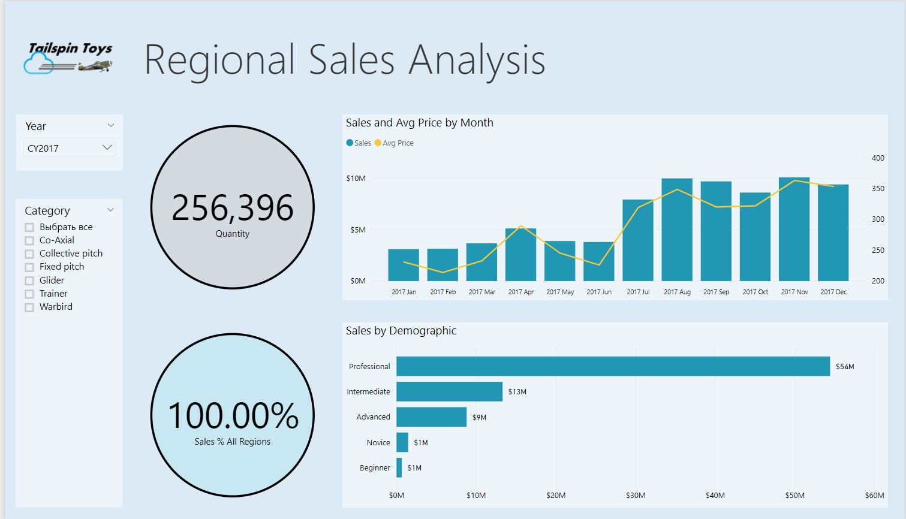

Из этого руководства вы узнаете, как выполнять следующие задачи:
> [!div class="checklist"]
> * Создание пользовательского визуального элемента Power BI.
> * Разработка пользовательского визуального элемента с на основе визуальных элементов D3.
> * Настройка привязки данных для визуальных элементов.
> * Форматирование значений данных.

## <a name="prerequisites"></a>Предварительные требования

* Если вы не зарегистрированы в **Power BI**, перед началом работы [пройдите бесплатную регистрацию](https://powerbi.microsoft.com/pricing/).
* У вас должен быть установлен редактор [Visual Studio Code](https://www.visualstudio.com/).
* Вам потребуется [Windows PowerShell](https://docs.microsoft.com/powershell/scripting/install/installing-windows-powershell?view=powershell-6) версии 4 или более поздней для пользователей Windows либо [Terminal](https://macpaw.com/how-to/use-terminal-on-mac) для пользователей OSX.

## <a name="setting-up-the-developer-environment"></a>Настройка среды разработки

Вам нужно установить еще несколько средств, помимо указанных в предварительных требованиях.

### <a name="installing-nodejs"></a>Установка Node.js

1. Чтобы установить Node.js, откройте в веб-браузере страницу [Node.js](https://nodejs.org).

2. Скачайте последнюю версию установщика MSI.

3. Запустите этот установщик и следуйте инструкциям. Примите условия лицензионного соглашения и сохраните все значения по умолчанию.

   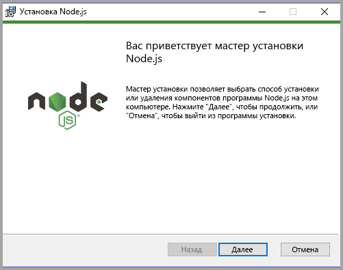

4. Перезагрузите компьютер.

### <a name="installing-packages"></a>Установка пакетов

Теперь нужно установить пакет **pbiviz**.

1. После перезагрузки компьютера откройте Windows PowerShell.

2. Чтобы установить pbiviz, выполните следующую команду:

    ```powershell
    npm i -g powerbi-visuals-tools
    ```

### <a name="creating-and-installing-a-certificate"></a>Создание и установка сертификата

#### <a name="windows"></a>Windows

1. Чтобы создать и установить сертификат, выполните следующую команду:

    ```powershell
    pbiviz --install-cert
    ```

    Она возвращает результат с *парольной фразой*. В нашем примере *парольная фраза* имеет значение **_15105661266553327_** . Она также запускает мастер импорта сертификатов.

    

2. В мастере импорта сертификатов убедитесь, что в качестве расположения хранилища выбрано значение "Текущий пользователь". Нажмите кнопку *Далее*.

      

3. На этапе **Импортируемый файл** выберите *Далее*.

4. На этапе **Защита с помощью закрытого ключа** вставьте в поле пароля полученную при создании сертификата парольную фразу.  Как вы помните, в нашем примере это **_15105661266553327_** .

      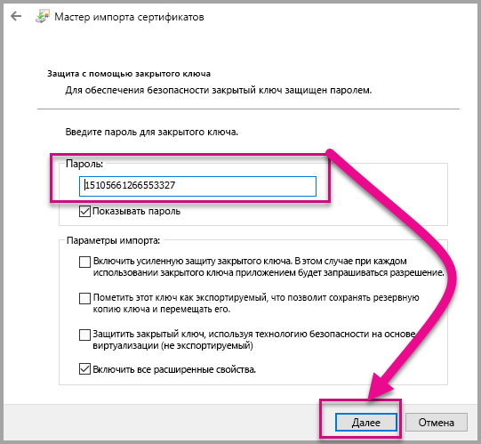

5. На этапе **Хранилище сертификатов** выберите вариант **Поместить все сертификаты в следующее хранилище**. Затем нажмите кнопку *Обзор*.

      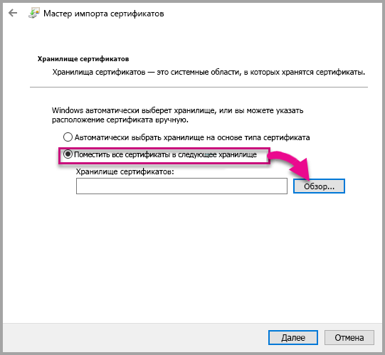

6. В окне **Выбор хранилища сертификата** выберите вариант **Доверенные корневые центры сертификации** и щелкните *ОК*. Затем на экране **Хранилище сертификатов** нажмите кнопку *Далее*.

      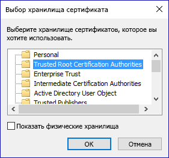

7. Чтобы завершить импорт, щелкните **Готово**.

8. Если появится предупреждение системы безопасности, выберите **Да**.

    

9. Получив уведомление об успешном выполнении импорта, щелкните **ОК**.

    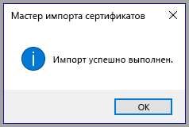

> [!Important]
> Не закрывайте сеанс Windows PowerShell.

#### <a name="osx"></a>OSX

1. Если в верхнем левом углу установлена блокировка, снимите ее. Найдите *localhost* и дважды щелкните сертификат.

    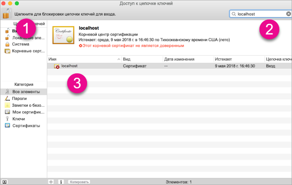

2. Выберите пункт **Always Trust** (Всегда доверять) и закройте окно.

    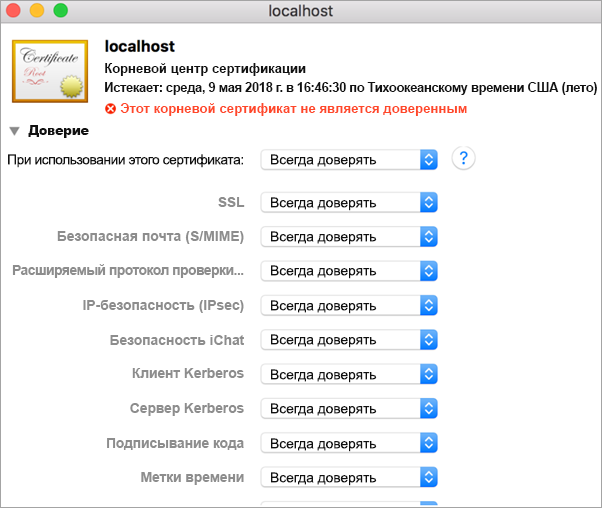

3. Введите имя пользователя и пароль. Нажмите кнопку **Обновить параметры**.

    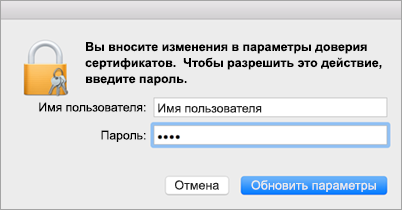

4. Закройте все открытые браузеры.

> [!NOTE]
> Если сертификат не удается распознать, может потребоваться перезагрузить компьютер.

## <a name="creating-a-custom-visual"></a>Создание пользовательского визуального элемента

Итак, мы настроили среду и теперь можем приступать к созданию пользовательского визуального элемента.

Полный исходный код для этого руководства доступен для [скачивания](https://github.com/Microsoft/PowerBI-visuals-circlecard).

1. Проверьте, что установлен пакет визуальных средств Power BI.

    ```powershell
    pbiviz
    ```
    Будут выведены данные справки.

    <pre><code>
        +syyso+/
    oms/+osyhdhyso/
    ym/       /+oshddhys+/
    ym/              /+oyhddhyo+/
    ym/                     /osyhdho
    ym/                           sm+
    ym/               yddy        om+
    ym/         shho /mmmm/       om+
        /    oys/ +mmmm /mmmm/       om+
    oso  ommmh +mmmm /mmmm/       om+
    ymmmy smmmh +mmmm /mmmm/       om+
    ymmmy smmmh +mmmm /mmmm/       om+
    ymmmy smmmh +mmmm /mmmm/       om+
    +dmd+ smmmh +mmmm /mmmm/       om+
            /hmdo +mmmm /mmmm/ /so+//ym/
                /dmmh /mmmm/ /osyhhy/
                    //   dmmd
                        ++

        PowerBI Custom Visual Tool

    Usage: pbiviz [options] [command]

    Commands:

    new [name]        Create a new visual
    info              Display info about the current visual
    start             Start the current visual
    package           Package the current visual into a pbiviz file
    update [version]  Updates the api definitions and schemas in the current visual. Changes the version if specified
    help [cmd]        display help for [cmd]

    Options:

    -h, --help      output usage information
    -V, --version   output the version number
    --install-cert  Install localhost certificate
    </code></pre>

    <a name="ssl-setup"></a>

2. Просмотрите выходные данные, включая список поддерживаемых команд.

    

3. Чтобы создать проект пользовательского визуального элемента, введите следующую команду. Этот проект имеет имя **CircleCard**.

    ```PowerShell
    pbiviz new CircleCard
    ```
    

    > [!Note]
    > Вы создаете проект в текущем расположении, указанном в запросе.

4. Перейдите в папку проекта.

    ```powershell
    cd CircleCard
    ```
5. Запустите пользовательский визуальный элемент. Теперь визуальный элемент CircleCard запущен. Он размещен на локальном компьютере.

    ```powershell
    pbiviz start
    ```

    

> [!Important]
> Не закрывайте сеанс Windows PowerShell.

### <a name="testing-the-custom-visual"></a>Тестирование пользовательского визуального элемента

В этом разделе мы будем тестировать пользовательский визуальный элемент CircleCard, отправив отчет в Power BI Desktop и добавив в него наш пользовательский визуальный элемент.

1. Войдите на сайт [PowerBI.com](https://powerbi.microsoft.com/), затем нажмите **значок шестеренки** и выберите элемент **Настройки**.

      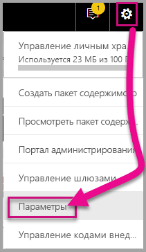

2. Выберите пункт **Разработчик** и установите флажок **Включить тестирование для визуального элемента разработчика**.

    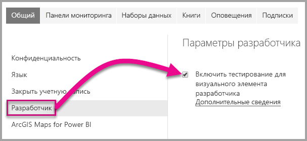

3. Передайте отчет Power BI Desktop.  

    Последовательно щелкните "Получить данные" > "Файлы" > "Локальный файл".

    Если вы еще не создали отчет Power BI Desktop, [скачайте](https://microsoft.github.io/PowerBI-visuals/docs/step-by-step-lab/images/US_Sales_Analysis.pbix) образец.

    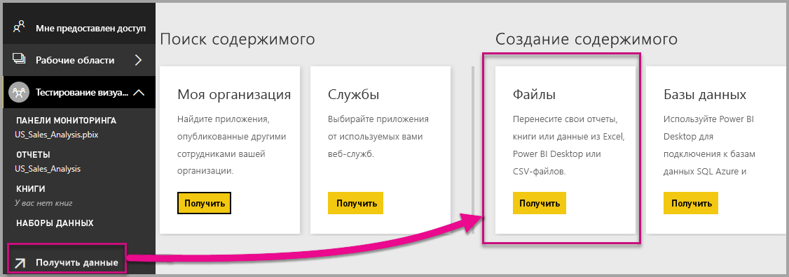 

    Теперь в области навигации слева в разделе **Отчет** выберите **US_Sales_Analysis**, чтобы просмотреть этот отчет.

    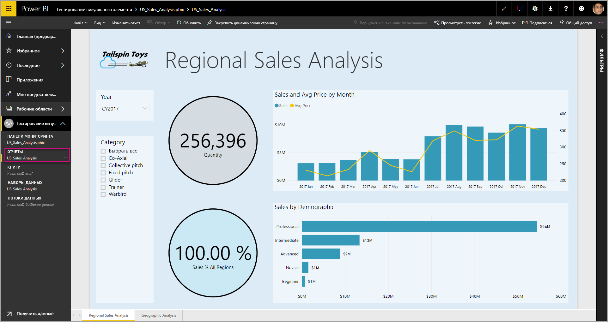

4. Теперь нам нужно изменить отчет в службе Power BI.

    Выберите **Изменить отчет**.

    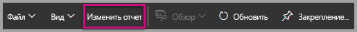

5. На панели **Визуализации** выберите **Визуальный элемент разработчика**.

    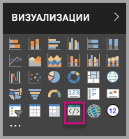

    > [!Note]
    > Этот элемент представляет пользовательский визуальный элемент, который вы ранее запустили на локальном компьютере. Он станет доступен только после активации параметров разработчика.

6. Обратите внимание, что наш визуальный элемент появился на холсте отчета.

    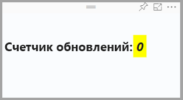

    > [!Note]
    > Это очень простой визуальный элемент, который отображает число вызовов метода update. На этом этапе визуальный элемент еще не может извлекать данные.

7. Выделите в отчете новый визуальный элемент, перейдите на панель "Поля", разверните элемент Sales (Продажи) и выберите Quantity (Количество).

    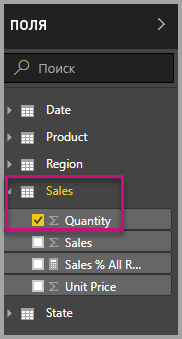

8. Для проверки работы нового визуального элемента измените его размер и убедитесь, что значение update увеличивается.

    

Чтобы остановить работу пользовательского визуального элемента в PowerShell, нажмите клавиши CTRL+C. В ответ на запрос о завершении пакетного задания последовательно нажмите клавиши Y и ВВОД.

## <a name="adding-visual-elements"></a>Добавление визуальных элементов

Теперь вам нужно установить **библиотеку D3 JavaScript**. Библиотека D3 для JavaScript позволяет создавать динамические интерактивные визуализации данных в веб-браузерах. В ней используются широко распространенные стандарты SVG HTML5 и CSS.

Теперь вы можете разработать пользовательский визуальный элемент, отображающий круг с текстом.

> [!Note]
> Многие фрагменты текста для этого руководства можно скопировать [отсюда](https://github.com/Microsoft/powerbi-visuals-circlecard).

1. Чтобы установить **библиотеку D3**, выполните в PowerShell следующую команду:

    ```powershell
    npm i d3@^5.0.0 --save
    ```

    ```powershell
    PS C:\circlecard>npm i d3@^5.0.0 --save
    + d3@5.11.0
    added 179 packages from 169 contributors and audited 306 packages in 33.25s
    found 0 vulnerabilities

    PS C:\circlecard>
    ```

2. Чтобы установить определения типов для **библиотеки D3**, выполните следующую команду:

    ```powershell
    npm i @types/d3@^5.0.0 --save
    ```

    ```powershell
    PS C:\circlecard>npm i @types/d3@^5.0.0 --save
    + @types/d3@5.7.2
    updated 1 package and audited 306 packages in 2.217s
    found 0 vulnerabilities

    PS C:\circlecard>
    ```

    Эта команда устанавливает определения TypeScript, основанные на файлах JavaScript, что позволяет разрабатывать пользовательские визуальные элементы на TypeScript (супермножество JavaScript). Для разработки приложений TypeScript идеально подходит интегрированная среда разработки Visual Studio Code.

3. Чтобы установить **core-js**, выполните в PowerShell следующую команду:

    ```powershell
    npm i core-js@3.2.1 --save
    ```

    ```powershell
    PS C:\circlecard> npm i core-js@3.2.1 --save

    > core-js@3.2.1 postinstall F:\circlecard\node_modules\core-js
    > node scripts/postinstall || echo "ignore"

    Thank you for using core-js ( https://github.com/zloirock/core-js ) for polyfilling JavaScript standard library!

    The project needs your help! Please consider supporting of core-js on Open Collective or Patreon:
    > https://opencollective.com/core-js
    > https://www.patreon.com/zloirock

    + core-js@3.2.1
    updated 1 package and audited 306 packages in 6.051s
    found 0 vulnerabilities

    PS C:\circlecard>
    ```

    Эта команда устанавливает стандартную модульную библиотеку для JavaScript. В библиотеке включены полизаполнения для ECMAScript до версии 2019. См. дополнительные сведения о [`core-js`](https://www.npmjs.com/package/core-js).

4. Чтобы установить **powerbi-visual-api**, выполните в PowerShell следующую команду:

    ```powershell
    npm i powerbi-visuals-api --save-dev
    ```

    ```powershell
    PS C:\circlecard>npm i powerbi-visuals-api --save-dev

    + powerbi-visuals-api@2.6.1
    updated 1 package and audited 306 packages in 2.139s
    found 0 vulnerabilities

    PS C:\circlecard>
    ```

    Эта команда устанавливает определения API визуальных элементов Power BI.

5. Запустите [Visual Studio Code](https://code.visualstudio.com/).

    Чтобы запустить **Visual Studio Code** из PowerShell, выполните следующую команду:

    ```powershell
    code .
    ```

6. В **области обозревателя** разверните папку **node_modules** и убедитесь, что **библиотека D3** успешно установлена.

    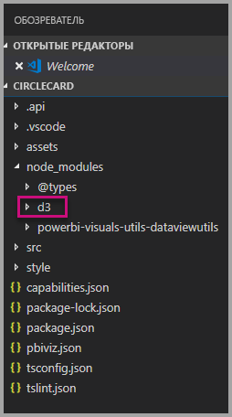

7. Убедитесь, что файл **index.d.ts** добавлен, развернув в **области обозревателя** узлы node_modules > @types > d3.

    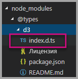

### <a name="developing-the-visual-elements"></a>Разработка визуальных элементов

Теперь мы готовы перейти к разработке пользовательского визуального элемента, который будет отображать круг и текст.

1. В **области обозревателя** разверните папку **src** и выберите файл **settings.ts**.

    > [!Note]
    > Обратите внимание на комментарии в верхней части файла **visual.ts**. Разрешение на использование пакетов пользовательских визуальных элементов Power BI предоставляется бесплатно на условиях лицензии MIT. Это соглашение содержит обязательство добавлять комментарии в верхней части файла.

2. Удалите следующую логику пользовательского визуального элемента из класса Visual:
    * объявление четырех закрытых переменных на уровне класса;
    * все строки кода из конструктора;
    * все строки кода из метода update;
    * все оставшиеся строки в модуле, включая методы parseSettings и enumerateObjectInstances.

    Убедитесь, что код модуля теперь выглядит так:

    ```typescript
    "use strict";
    import "core-js/stable";
    import "../style/visual.less";
    import powerbi from "powerbi-visuals-api";
    import IVisual = powerbi.extensibility.IVisual;
    import VisualConstructorOptions = powerbi.extensibility.visual.VisualConstructorOptions;
    import VisualUpdateOptions = powerbi.extensibility.visual.VisualUpdateOptions;
    import EnumerateVisualObjectInstancesOptions = powerbi.EnumerateVisualObjectInstancesOptions;
    import VisualObjectInstanceEnumeration = powerbi.VisualObjectInstanceEnumeration;
    import IVisualHost = powerbi.extensibility.visual.IVisualHost;

    import * as d3 from "d3";
    type Selection<T extends d3.BaseType> = d3.Selection<T, any,any, any>;

    export class Visual implements IVisual {

        constructor(options: VisualConstructorOptions) {

        }

        public update(options: VisualUpdateOptions) {

        }
    }
    ```

3. Под объявлением класса *Visual* вставьте следующие свойства уровня класса:

    ```typescript
    export class Visual implements IVisual {
        // ...
        private host: IVisualHost;
        private svg: Selection<SVGElement>;
        private container: Selection<SVGElement>;
        private circle: Selection<SVGElement>;
        private textValue: Selection<SVGElement>;
        private textLabel: Selection<SVGElement>;
        // ...
    }
    ```

    

4. Добавьте в *конструктор* следующий код:

    ```typescript
    this.svg = d3.select(options.element)
        .append('svg')
        .classed('circleCard', true);
    this.container = this.svg.append("g")
        .classed('container', true);
    this.circle = this.container.append("circle")
        .classed('circle', true);
    this.textValue = this.container.append("text")
        .classed("textValue", true);
    this.textLabel = this.container.append("text")
        .classed("textLabel", true);
    ```

    Этот код добавляет в визуальный элемент группу SVG и три фигуры: круг и два текстовых элемента.

    Чтобы отформатировать этот код в документе, щелкните правой кнопкой мыши в любом месте **документа Visual Studio Code** и выберите действие **Форматировать документ**.

      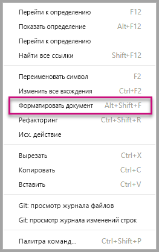

    Чтобы повысить удобочитаемость, документ рекомендуется форматировать каждый раз после добавления фрагментов кода.

5. Добавьте в метод *update* следующий код:

    ```typescript
    let width: number = options.viewport.width;
    let height: number = options.viewport.height;
    this.svg.attr("width", width);
    this.svg.attr("height", height);
    let radius: number = Math.min(width, height) / 2.2;
    this.circle
        .style("fill", "white")
        .style("fill-opacity", 0.5)
        .style("stroke", "black")
        .style("stroke-width", 2)
        .attr("r", radius)
        .attr("cx", width / 2)
        .attr("cy", height / 2);
    let fontSizeValue: number = Math.min(width, height) / 5;
    this.textValue
        .text("Value")
        .attr("x", "50%")
        .attr("y", "50%")
        .attr("dy", "0.35em")
        .attr("text-anchor", "middle")
        .style("font-size", fontSizeValue + "px");
    let fontSizeLabel: number = fontSizeValue / 4;
    this.textLabel
        .text("Label")
        .attr("x", "50%")
        .attr("y", height / 2)
        .attr("dy", fontSizeValue / 1.2)
        .attr("text-anchor", "middle")
        .style("font-size", fontSizeLabel + "px");
    ```

    *Этот код задает ширину и высоту визуального элемента, а затем инициализирует атрибуты и стили для визуальных элементов.*

6. Сохраните файл **visual.ts**.

7. Выберите файл **capabilities.json**.

    Удалите весь элемент объекта, размещенный в строках с 14 по 60.

8. Сохраните файл **capabilities.json**.

9. Запустите пользовательский визуальный элемент в PowerShell.

    ```powershell
    pbiviz start
    ```

### <a name="toggle-auto-reload"></a>Включить автоматическую перезагрузку

1. Перейдите обратно к отчету Power BI.
2. На панели инструментов над визуальным элементом разработчика выберите **Включить автоматическую перезагрузку**.

    

    Этот параметр отвечает за автоматическую перезагрузку визуального элемента после каждого сохранения изменений в проекте.

3. Из области **Поля** перетащите поле **Quantity** (Количество) в визуальный элемент разработчика.

4. Убедитесь, что код визуального элемента теперь выглядит так:

    

5. Измените размер визуального элемента.

    Обратите внимание, что круг и текст в нем масштабируются в соответствии с размером визуального элемента.

    При изменении размера визуального элемента метод update вызывается постоянно, что приводит к плавному масштабированию визуальных элементов.

    Итак, вы разработали визуальный элемент.

6. Оставьте визуальный элемент в работающем состоянии.

## <a name="process-data-in-the-visual-code"></a>Обработка данных в коде визуального элемента

Определите роли данных и сопоставления представлений данных, а затем измените логику пользовательского визуального элемента, чтобы он отображал имя и значение меры.

### <a name="configuring-the-capabilities"></a>Настройка возможностей

В файле **capabilities.json** определите роли данных и сопоставления представлений данных.

1. В Visual Studio Code откройте файл **capabilities.json** и удалите из массива **dataRoles** все его содержимое (строки 3—12).

2. Вставьте в массив **dataRoles** следующий код:

    ```json
    {
        "displayName": "Measure",
        "name": "measure",
        "kind": "Measure"
    }
    ```

    Массив **dataRoles** теперь определяет одну роли данных с типом **measure** и именем **measure**, которая отображает значение **Measure**. Эта роль позволяет передавать значение из поля меры или поля сводных данных.

3. Удалите из массива **dataViewMappings** все его содержимое (строки 10—31).

4. Вставьте в массив **dataViewMappings** следующее содержимое:

    ```json
    {
        "conditions": [
            { "measure": { "max": 1 } }
        ],
        "single": {
            "role": "measure"
        }
    }
    ```

    Теперь массив **dataViewMappings** определяет одно поле, которое можно передавать в роль данных с именем **measure**.

5. Сохраните файл **capabilities.json**.

6. В Power BI вы можете заметить, что для визуального элемента теперь можно настроить элемент **Measure**.

    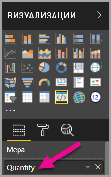

    > [!Note]
    > В нашем проекте визуального элемента пока нет логики привязки данных.

### <a name="exploring-the-dataview"></a>Исследование представления данных

1. На панели инструментов над визуальным элементом выберите **Показать представление данных**.

    

2. Разверните представление вниз до узла **single** и обратите внимание на значение.

    

3. Разверните представление до узла **metadata** (метаданные) и разверните массив **columns** (столбцы). Обратите особое внимание на значения **format** и **displayName**.

    

4. Чтобы вернуться к отображению визуального элемента, на панели инструментов над визуальным элементом выберите **Показать представление данных**.

    

### <a name="consume-data-in-the-visual-code"></a>Использование данных в коде визуального элемента

1. В **Visual Studio Code** импортируйте в файл **visual.ts**

    интерфейс `DataView` из модуля `powerbi`.

    ```typescript
    import DataView = powerbi.DataView;
    ```

    Затем добавьте следующую инструкцию в качестве первой инструкции метода update.

    ```typescript
    let dataView: DataView = options.dataViews[0];
    ```

    

    Эта инструкция сохраняет значение *dataView* в переменной для упрощения доступа и объявляет эту переменную, чтобы она ссылалась на объект *dataView*.

2. В методе **update** замените **.text("Value")** следующим кодом:

    ```typescript
    .text(<string>dataView.single.value)
    ```

    

3. В методе **update** замените **text("Label")** следующим кодом:

    ```typescript
    .text(dataView.metadata.columns[0].displayName)
    ```

    

4. Сохраните файл **visual.ts**.

5. Посмотрите на визуальный элемент в **Power BI** — на нем теперь отображаются значение и имя.

Итак, вы настроили роли данных и привязали визуальный элемент к представлению данных.

В следующем руководстве вы узнаете, как в пользовательский визуальный элемент добавить параметры форматирования.

## <a name="debugging"></a>Отладка

Советы по отладке настраиваемого визуального элемента см. в [руководстве по отладке](./visuals-how-to-debug.md#how-to-debug-power-bi-visuals).

## <a name="next-steps"></a>Дальнейшие действия

> [!div class="nextstepaction"]
> [Добавление параметров форматирования](custom-visual-develop-tutorial-format-options.md)
