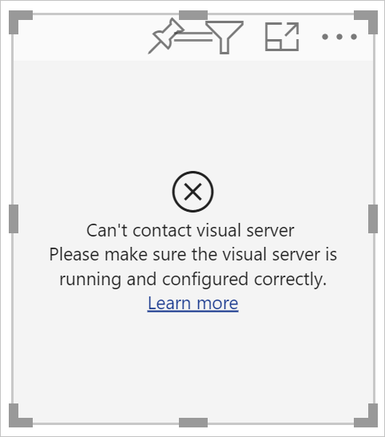

# <a name="tutorial-develop-a-power-bi-circle-card-visual"></a>Руководство. Разработка визуализации "Круговая карточка" в Power BI

Разработчик может создавать собственные визуализации Power BI. Эти визуализации можете использовать вы, ваша организация или сторонние организации.

В этом учебнике показано, как разработать визуализацию Power BI с именем "Круговая карточка", который отображает форматированное значение внутри круга. Визуализация "Круговая карточка" поддерживает настройку цвета заливки и толщины линии круга.

В этом руководстве описано следующее:
> [!div class="checklist"]
> * Создание проекта разработки для визуализации.
> * Разработка пользовательской визуализации на основе визуальных элементов D3.
> * Настройка визуализации для обработки данных.

## <a name="prerequisites"></a>Обязательные условия

Прежде чем приступить к разработке визуализации Power BI, убедитесь в том, что выполнены все предварительные условия, указанные в этом разделе.

* Вам необходима учетная запись **Power BI Pro** . Если у вас его нет, [зарегистрируйтесь, чтобы воспользоваться бесплатной пробной версией](https://powerbi.microsoft.com/pricing/).

* [Visual Studio Code (VS Code)](https://www.visualstudio.com/); VS Code — идеальная интегрированная среда разработки (IDE) для разработки приложений JavaScript и TypeScript.

* [Windows PowerShell](https://docs.microsoft.com/powershell/scripting/install/installing-windows-powershell) версии 4 или более поздней (для Windows). Или [терминал](https://macpaw.com/how-to/use-terminal-on-mac) (для OSX).

* Среда, подготовленная для разработки визуализации Power BI. См. статью [Настройка среды для разработки визуализации Power BI](environment-setup.md)

* В этом учебнике используется отчет **US Sales Analysis** . Вы можете [скачать](https://microsoft.github.io/PowerBI-visuals/docs/step-by-step-lab/images/US_Sales_Analysis.pbix) его и передать его в службу Power BI или использовать собственный отчет. Дополнительные сведения о службе Power BI и передаче файлов см. в учебнике [Руководство. Начало работы со службой Power BI](../../fundamentals/service-get-started.md).

## <a name="create-a-development-project"></a>Создание проекта разработки

В этом разделе вы создадите проект для визуализации "Круговая карточка".

1. Откройте PowerShell и перейдите к папке, в которой вы хотите создать проект.

2. Введите следующую команду:

    ```PowerShell
    pbiviz new CircleCard
    ```

3. Перейдите в папку проекта.

    ```powershell
    cd CircleCard
    ```

4. Запустите визуализацию карточки. Теперь визуализация "Круговая карточка" запущена. Она размещена на локальном компьютере.

    ```powershell
    pbiviz start
    ```
    >[!IMPORTANT]
    >Не закрывайте окно PowerSell до завершения работы с учебником. Чтобы остановить выполнение визуализации, нажмите сочетание клавиш CTRL+C и при появлении запроса на завершение пакетного задания введите Y и нажмите клавишу *ВВОД* .

## <a name="view-the-circle-card-in-power-bi-service"></a>Просмотр круговой карточки в службе Power BI

Чтобы протестировать визуализацию "Круговая карточка" в службе Power BI, мы будем использовать отчет **US Sales Analysis** . Вы можете [скачать](https://microsoft.github.io/PowerBI-visuals/docs/step-by-step-lab/images/US_Sales_Analysis.pbix) этот отчет и передать его в службу Power BI.

Вы также можете использовать собственный отчет для тестирования визуализации карточки.

>[!NOTE]
>Прежде чем продолжить, убедитесь, что вы [включили параметры разработчика визуализаций](environment-setup.md#set-up-power-bi-service-for-developing-a-visual).

1. Войдите на сайт [PowerBI.com](https://powerbi.microsoft.com/) и откройте отчет **US Sales Analysis** .

2. Выберите **Дополнительные параметры** > **Изменить** .

    >[!div class="mx-imgBorder"]
    >

3. Создайте новую страницу для тестирования, нажав кнопку **Создать страницу** в нижней части интерфейса службы Power BI.

    >[!div class="mx-imgBorder"]
    >

4. На панели **Визуализации** выберите **Визуальный элемент разработчика** .

    >[!div class="mx-imgBorder"]
    >

    Эта визуализация представляет собой пользовательскую визуализацию, которую вы ранее запустили на локальном компьютере. Она доступна только при включенном параметре [отладки пользовательских визуализаций](environment-setup.md#set-up-power-bi-service-for-developing-a-visual).

5. Убедитесь, что визуализация добавлена на холст отчета.

    >[!div class="mx-imgBorder"]
    >

    Это очень простая визуализация, которая отображает число вызовов метода update. На этом этапе визуализация еще не может извлекать данные.

    >[!NOTE]
    >Если визуализация отображает сообщение об ошибке подключения, откройте в браузере новую вкладку, перейдите в раздел [https://localhost:8080/assets/status](https://localhost:8080/assets/status) и разрешите браузеру использовать этот адрес.
    >
    >

6. Выбрав новую визуализацию, перейдите в область **Поля** , разверните узел **Продажи** и выберите **Количество** .

    >[!div class="mx-imgBorder"]
    >

7. Чтобы проверить, как работает визуализация, измените ее размер и обратите внимание, что *число обновлений* увеличивается каждый раз при изменении размера.

    >[!div class="mx-imgBorder"]
    >

## <a name="add-visual-elements-and-text"></a>Добавление визуальных элементов и текста

Из этого раздела вы узнаете, как превратить визуализацию в круг и отобразить в ней текст.

>[!NOTE]
>В этом учебнике для разработки визуализации Power BI используется [Visual Studio Code](https://code.visualstudio.com/) (VS Code).

### <a name="modify-the-visuals-file"></a>Изменение файла визуальных элементов

Настройте файл **visual.ts** , удалив и добавив несколько строк кода.

1. Откройте проект в VS Code ( **Файл** > **Открыть папку** ).

2. В **области обозревателя** разверните папку **src** и выберите файл **settings.ts** .

    >[!div class="mx-imgBorder"]
    >

    > [!IMPORTANT]
    > Обратите внимание на комментарии в верхней части файла **visual.ts** . Разрешение на использование пакетов визуальных элементов Power BI предоставляется бесплатно на условиях лицензии MIT. Это соглашение содержит обязательство добавлять комментарии в верхней части файла.

3. Удалите следующие строки кода из файла *visual.ts* .

    * Импорт *VisualSettings* :
        ```typescript
        import { VisualSettings } from "./settings";
        ```

    * объявление четырех закрытых переменных на уровне класса;

    * Все строки кода внутри переменной *constructor* .

    * Все строки кода в методе *update* .

    * Все остальные строки кода, следующие за методом *update* , включая методы *parseSettings* и *enumerateObjectInstances* .

4. Добавьте в конце раздела импорта следующие строки кода:

    * *IVisualHost*  — коллекция свойств и служб, которые можно использовать для взаимодействия с узлом визуализаций (Power BI).

         ```typescript
        import IVisualHost = powerbi.extensibility.IVisualHost;
        ```

    * *Библиотека D3*

        ```typescript
        import * as d3 from "d3";
        type Selection<T extends d3.BaseType> = d3.Selection<T, any,any, any>;
        ```
    
        >[!NOTE]
        >Если вы не устанавливали библиотеку JavaScript D3 в ходе установки, перейдите к [этому разделу](environment-setup.md#d3-javascript-library).

5. Под объявлением класса *Visual* вставьте следующие свойства уровня класса: Необходимо добавить только строки кода, начинающиеся с `private`.

    ```typescript
    export class Visual implements IVisual {
        // ...
        private host: IVisualHost;
        private svg: Selection<SVGElement>;
        private container: Selection<SVGElement>;
        private circle: Selection<SVGElement>;
        private textValue: Selection<SVGElement>;
        private textLabel: Selection<SVGElement>;
        // ...
    }
    ```

6. Сохраните файл **visual.ts** .

### <a name="add-a-circle-and-text-elements"></a>Добавление круга и текстовых элементов

Добавьте масштабируемый векторный рисунок (SVG) D3. Это позволяет создать три фигуры: круг и два текстовых элемента.

1. Откройте **visual.ts** в VS Code.

2. Добавьте в *конструктор* следующий код:

    ```typescript
    this.svg = d3.select(options.element)
        .append('svg')
        .classed('circleCard', true);
    this.container = this.svg.append("g")
        .classed('container', true);
    this.circle = this.container.append("circle")
        .classed('circle', true);
    this.textValue = this.container.append("text")
        .classed("textValue", true);
    this.textLabel = this.container.append("text")
        .classed("textLabel", true);
    ```

    >[!TIP]
    >Чтобы повысить удобочитаемость, документ рекомендуется форматировать каждый раз после добавления фрагментов кода в проект. Щелкните правой кнопкой мыши в любом месте VS Code и выберите *Форматировать документ* (ALT+SHIFT+F).

3. Сохраните файл **visual.ts** .

### <a name="set-the-width-and-height"></a>Установка ширины и высоты

Этот код задает ширину и высоту визуального элемента, а затем инициализирует атрибуты и стили для визуальных элементов.

1. Откройте **visual.ts** в VS Code.

2. Добавьте в метод *update* следующий код:

    ```typescript
    let width: number = options.viewport.width;
    let height: number = options.viewport.height;
    this.svg.attr("width", width);
    this.svg.attr("height", height);
    let radius: number = Math.min(width, height) / 2.2;
    this.circle
        .style("fill", "white")
        .style("fill-opacity", 0.5)
        .style("stroke", "black")
        .style("stroke-width", 2)
        .attr("r", radius)
        .attr("cx", width / 2)
        .attr("cy", height / 2);
    let fontSizeValue: number = Math.min(width, height) / 5;
    this.textValue
        .text("Value")
        .attr("x", "50%")
        .attr("y", "50%")
        .attr("dy", "0.35em")
        .attr("text-anchor", "middle")
        .style("font-size", fontSizeValue + "px");
    let fontSizeLabel: number = fontSizeValue / 4;
    this.textLabel
        .text("Label")
        .attr("x", "50%")
        .attr("y", height / 2)
        .attr("dy", fontSizeValue / 1.2)
        .attr("text-anchor", "middle")
        .style("font-size", fontSizeLabel + "px");
    ```

3. Сохраните файл **visual.ts** .

### <a name="optional-review-the-code-in-the-visuals-file"></a>Проверка кода в файле визуальных элементов (необязательно)

Убедитесь, что код в файле *visuals.ts* выглядит следующим образом:

```typescript
/*
*  Power BI Visual CLI
*
*  Copyright (c) Microsoft Corporation
*  All rights reserved.
*  MIT License
*
*  Permission is hereby granted, free of charge, to any person obtaining a copy
*  of this software and associated documentation files (the ""Software""), to deal
*  in the Software without restriction, including without limitation the rights
*  to use, copy, modify, merge, publish, distribute, sublicense, and/or sell
*  copies of the Software, and to permit persons to whom the Software is
*  furnished to do so, subject to the following conditions:
*
*  The above copyright notice and this permission notice shall be included in
*  all copies or substantial portions of the Software.
*
*  THE SOFTWARE IS PROVIDED *AS IS*, WITHOUT WARRANTY OF ANY KIND, EXPRESS OR
*  IMPLIED, INCLUDING BUT NOT LIMITED TO THE WARRANTIES OF MERCHANTABILITY,
*  FITNESS FOR A PARTICULAR PURPOSE AND NONINFRINGEMENT. IN NO EVENT SHALL THE
*  AUTHORS OR COPYRIGHT HOLDERS BE LIABLE FOR ANY CLAIM, DAMAGES OR OTHER
*  LIABILITY, WHETHER IN AN ACTION OF CONTRACT, TORT OR OTHERWISE, ARISING FROM,
*  OUT OF OR IN CONNECTION WITH THE SOFTWARE OR THE USE OR OTHER DEALINGS IN
*  THE SOFTWARE.
*/
"use strict";

import "core-js/stable";
import "./../style/visual.less";
import powerbi from "powerbi-visuals-api";
import VisualConstructorOptions = powerbi.extensibility.visual.VisualConstructorOptions;
import VisualUpdateOptions = powerbi.extensibility.visual.VisualUpdateOptions;
import IVisual = powerbi.extensibility.visual.IVisual;
import EnumerateVisualObjectInstancesOptions = powerbi.EnumerateVisualObjectInstancesOptions;
import VisualObjectInstance = powerbi.VisualObjectInstance;
import DataView = powerbi.DataView;
import VisualObjectInstanceEnumerationObject = powerbi.VisualObjectInstanceEnumerationObject;
import IVisualHost = powerbi.extensibility.IVisualHost;
import * as d3 from "d3";
type Selection<T extends d3.BaseType> = d3.Selection<T, any, any, any>;

export class Visual implements IVisual {
    private host: IVisualHost;
    private svg: Selection<SVGElement>;
    private container: Selection<SVGElement>;
    private circle: Selection<SVGElement>;
    private textValue: Selection<SVGElement>;
    private textLabel: Selection<SVGElement>;

    constructor(options: VisualConstructorOptions) {
        this.svg = d3.select(options.element)
            .append('svg')
            .classed('circleCard', true);
        this.container = this.svg.append("g")
            .classed('container', true);
        this.circle = this.container.append("circle")
            .classed('circle', true);
        this.textValue = this.container.append("text")
            .classed("textValue", true);
        this.textLabel = this.container.append("text")
            .classed("textLabel", true);
    }

    public update(options: VisualUpdateOptions) {
        let width: number = options.viewport.width;
        let height: number = options.viewport.height;
        this.svg.attr("width", width);
        this.svg.attr("height", height);
        let radius: number = Math.min(width, height) / 2.2;
        this.circle
            .style("fill", "white")
            .style("fill-opacity", 0.5)
            .style("stroke", "black")
            .style("stroke-width", 2)
            .attr("r", radius)
            .attr("cx", width / 2)
            .attr("cy", height / 2);
        let fontSizeValue: number = Math.min(width, height) / 5;
        this.textValue
            .text("Value")
            .attr("x", "50%")
            .attr("y", "50%")
            .attr("dy", "0.35em")
            .attr("text-anchor", "middle")
            .style("font-size", fontSizeValue + "px");
        let fontSizeLabel: number = fontSizeValue / 4;
        this.textLabel
            .text("Label")
            .attr("x", "50%")
            .attr("y", height / 2)
            .attr("dy", fontSizeValue / 1.2)
            .attr("text-anchor", "middle")
            .style("font-size", fontSizeLabel + "px");
    }
}
```

### <a name="modify-the-capabilities-file"></a>Изменение файла возможностей

Удалите ненужные строки кода из файла возможностей.

1. Откройте проект в VS Code ( **Файл** > **Открыть папку** ).

2. Выберите файл **capabilities.json** .

    >[!div class="mx-imgBorder"]
    >

3. Удалите все элементы объектов (строки 14–60).

4. Сохраните файл **capabilities.json** .

### <a name="restart-the-circle-card-visual"></a>Перезапуск визуализации карточки

Остановите выполнение визуализации и перезапустите ее.

1. В окне PowerShell, в котором выполняется визуализация, нажмите сочетание клавиш CTRL+C и при появлении запроса на завершение пакетного задания введите Y и нажмите клавишу *ВВОД* .

2. В PowerShell запустите визуальный элемент.

    ```powershell
    pbiviz start
    ```

### <a name="test-the-visual-with-the-added-elements"></a>Тестирование визуализации с добавленными элементами

Убедитесь, что визуализация отображает только что добавленные элементы.

1. В службе Power BI откройте отчет *Power BI US Sales Analysis* . Если вы используете другой отчет для разработки визуального элемента круговой карточки, перейдите к этому отчету.

2. Убедитесь, что визуальный элемент имеет форму круга.

    >[!div class="mx-imgBorder"]
    >

    >[!NOTE]
    >Если визуализация не отображает ничего, из области **Поля** перетащите поле **Количество** в визуальный элемент разработчика.

3. Измените размер визуального элемента.

    Обратите внимание, что круг и текст в нем масштабируются в соответствии с размером визуального элемента. Метод update вызывается при изменении размера визуального элемента, а также в результате изменения масштаба визуальных элементов.

### <a name="enable-auto-reload"></a>Включение автоматической перезагрузки

Этот параметр отвечает за автоматическую перезагрузку визуального элемента после каждого сохранения изменений в проекте.

1. Перейдите в отчет *Power BI US Sales Analysis* (или в проект с визуальным элементом карточки).

2. Выберите визуальный элемент карточки.

3. На плавающей панели инструментов выберите **Включить автоматическую перезагрузку** .

    >[!div class="mx-imgBorder"]
    >

## <a name="get-the-visual-to-process-data"></a>Получение визуального элемента для обработки данных

В этом разделе вы определите роли и сопоставления представлений данных. Вы также измените визуальный элемент, чтобы отобразить имя значения.

### <a name="configure-the-capabilities-file"></a>Конфигурация файла возможностей

В файле **capabilities.json** определите роли данных и сопоставления представлений данных.

* **Определение роли данных**

    Определите роль для массива *dataRoles* с данными типа *measure* . Эта роль данных называется *measure* и отображается как *Measure* . Эта роль позволяет передавать значение из поля меры или поля сводных данных.

    1. Откройте файл **capabilities.json** в VS Code.

    2. Удалите все содержимое внутри массива **dataRoles** (строки 3–12).

    3. Вставьте в массив **dataRoles** следующий код.

        ```json
        {
            "displayName": "Measure",
            "name": "measure",
            "kind": "Measure"
        }
        ```

    4. Сохраните файл **capabilities.json** .

* **Определение сопоставления представления данных**

    Определите файл с именем *measure* в массиве *dataViewMappings* . Это поле может быть передано в роль данных.

    1. Откройте файл **capabilities.json** в VS Code.

    2. Удалите из массива **dataViewMappings** все его содержимое (строки 10–30).

    3. Вставьте в массив **dataViewMappings** указанный ниже код.

        ```json
        {
            "conditions": [
                { "measure": { "max": 1 } }
            ],
            "single": {
                "role": "measure"
            }
        }
        ```

    4. Сохраните файл **capabilities.json** .

### <a name="optional-review-the-capabilities-file-code-changes"></a>Просмотр изменений кода файла возможностей (необязательно)

Убедитесь, что визуальный элемент круговой карточки отображает поле *measure* , и проверьте изменения, внесенные с помощью параметра *Показать представление данных* . 

1. В службе Power BI откройте отчет *Power BI US Sales Analysis* . Если вы используете другой отчет для разработки визуального элемента круговой карточки, перейдите к этому отчету.

2. Обратите внимание, что теперь визуальный элемент карточки можно настроить с помощью поля, озаглавленного как *Мера* . Вы можете перетаскивать элементы из области **Поля** в поле *Мера* .

    >[!div class="mx-imgBorder"]
    >

    > [!Note]
    > В нашем проекте визуального элемента пока нет логики привязки данных.

3. На плавающей панели инструментов выберите **Показать представление данных** . 

    >[!div class="mx-imgBorder"]
    >

4. Щелкните три точки, чтобы развернуть экран, и выберите **одиночное** значение.

    >[!div class="mx-imgBorder"]
    >

5. Разверните **metadata** , затем массив **columns** и просмотрите значения **format** и **displayName** .

    >[!div class="mx-imgBorder"]
    >

6. Чтобы вернуться к отображению визуального элемента, на панели инструментов над визуальным элементом выберите **Показать представление данных** .

### <a name="configure-the-visual-to-consume-data"></a>Настройка визуального элемента для использования данных

Внесите изменения в файл **visual.ts** , чтобы визуальный элемент круговой карточки мог использовать данные.

1. Откройте файл **visual.ts** в VS Code.

2. Добавьте указанную ниже строку, чтобы импортировать интерфейс `DataView` из модуля `powerbi`.

    ```typescript
    import DataView = powerbi.DataView;
    ```

3. В методе *update* выполните следующие действия:

    * Добавьте в качестве первого оператора приведенную ниже инструкцию. Эта инструкция сохраняет значение *dataView* в переменной для упрощения доступа и объявляет эту переменную, чтобы она ссылалась на объект *dataView* .

        ```typescript
        let dataView: DataView = options.dataViews[0];
        ```

    * Замените значение **.text("Value")** следующей строкой кода:

        ```typescript
        .text(<string>dataView.single.value)
        ```

    * Замените значение **.text("Label")** следующей строкой кода:

        ```typescript
        .text(dataView.metadata.columns[0].displayName)
        ```

4. Сохраните файл **visual.ts** .

5. Проверьте визуальный элемент в службе Power BI. На нем теперь отображаются значение и имя.

## <a name="next-steps"></a>Дальнейшие действия

> [!div class="nextstepaction"]
> [Руководство. Добавление параметров форматирования в визуальные элементы Power BI](custom-visual-develop-tutorial-format-options.md)

> [!div class="nextstepaction"]
> [Создание линейчатой диаграммы](create-bar-chart.md)

> [!div class="nextstepaction"]
> [Отладка визуальных элементов Power BI](visuals-how-to-debug.md)

> [!div class="nextstepaction"]
> [Структура проекта визуальных элементов Power BI](visual-project-structure.md)