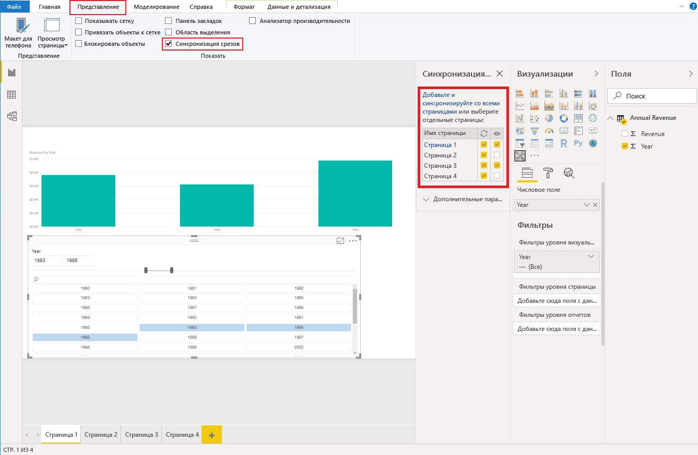

# <a name="sync-slicers-in-power-bi-visuals"></a>Синхронизация срезов для визуальных элементов Power BI

Чтобы реализовать поддержку функции [Синхронизация срезов](../../visuals/power-bi-visualization-slicers.md), ваш настраиваемый визуальный элемент среза должен использовать API версии 1.13.0 или более поздней.

Кроме того, необходимо включить соответствующий параметр в файле *capabilities.json*, как показано в следующем коде:

```json
{
    ...
    "supportsHighlight": true,
    "suppressDefaultTitle": true,
    "supportsSynchronizingFilterState": true,
    "sorting": {
        "default": {}
    }
}
```

После обновления файла *capabilities.json* при выборе настраиваемого визуального элемента среза будет отображаться область параметров **Синхронизация срезов**.

> [!NOTE]
> Функция синхронизации срезов поддерживает не более одного поля. Если срез содержит несколько полей (**Категория** или **Мера**), эта функция будет отключена.



В области **Синхронизация срезов** можно узнать, что параметры видимости и фильтрации срезов могут применяться к нескольким страницам отчета.