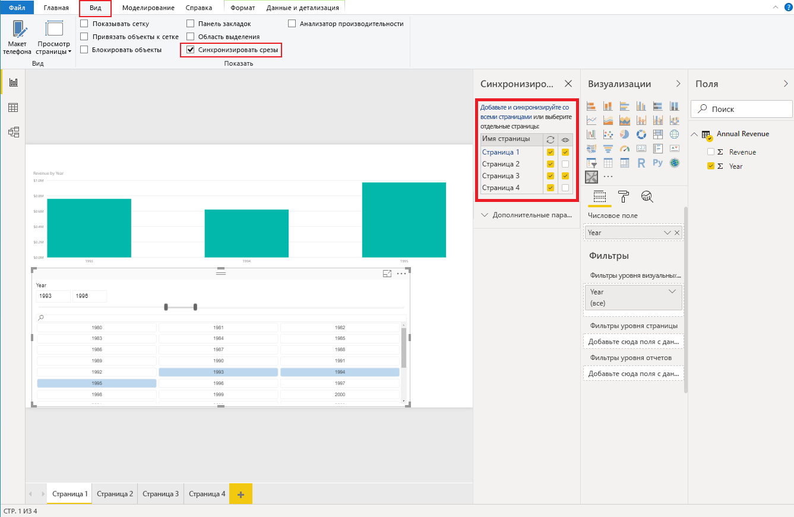

# <a name="sync-slicers"></a>Синхронизация срезов

Для поддержки функции [Синхронизация срезов](https://docs.microsoft.com/power-bi/desktop-slicers) ваш настраиваемый визуальный элемент среза должен использовать API 1.13 или более поздней версии.

Вторым необходимым условием является включение параметра в `capabilities.json` (см. пример ниже).

```json
{
    ...
    "supportsHighlight": true,
    "suppressDefaultTitle": true,
    "supportsSynchronizingFilterState": true,
    "sorting": {
        "default": {}
    }
}
```

После внесения изменений в `capabilities.json` вы сможете просмотреть панель параметров "Синхронизация срезов", щелкнув свой настраиваемый визуальный элемент среза.

> [!NOTE]
> Если срез содержит более одного поля (категория или мера), эта функция будет отключена, так как синхронизация срезов не поддерживает несколько полей.



На этой панели можно узнать, что видимость среза и его фильтрация могут применяться к нескольким страницам отчета.
