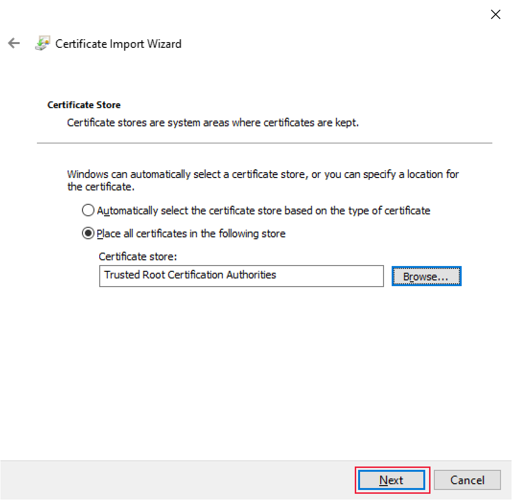
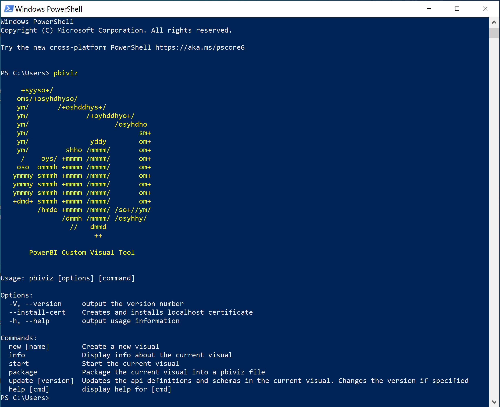
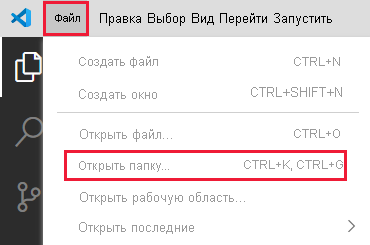

# <a name="set-up-your-environment-for-developing-a-power-bi-visual"></a>Настройка среды для разработки визуального элемента Power BI

В этой статье содержатся сведения о настройке среды для разработки визуального элемента Power BI.

Перед началом разработки установите пакет **node.js** и **pbiviz** . Кроме того, вам нужно будет создать и установить сертификат. После настройки локальной среды вам нужно будет настроить службы Power BI для разработки визуального элемента Power BI.

В этой статье вы узнаете, как выполнять следующие задачи.
> [!div class="checklist"]
> * Установка *nodes.js* .
> * Установка *pbiviz* .
> * Создание и установка сертификата.
> * Настройка службы Power BI для разработки визуального элемента.
> * Установка дополнительных библиотек (необходимых для разработки визуального элемента).

## <a name="install-nodejs"></a>Установка node.js

*Node.js*  — это среда выполнения JavaScript, созданная на основе подсистемы JavaScript Chrome V8. Она позволяет разработчикам запускать любые приложения, созданные на основе JavaScript.

1. Чтобы установить *node.js* , в веб-браузере перейдите на страницу [node.js](https://nodejs.org).

2. Скачайте последнюю версию установщика MSI.

3. Запустите этот установщик и следуйте инструкциям. Примите условия лицензионного соглашения и сохраните все значения по умолчанию.

4. Перезапустите компьютер.

## <a name="install-pbiviz"></a>Установка pbiviz

Инструмент *pbiviz* , написанный с использованием JavaScript, компилирует исходный код визуального элемента пакета *pbiviz* .

Пакет *pbiviz*  — это заархивированный проект визуального элемента Power BI со всеми необходимыми скриптами и ресурсами.

1. Откройте Windows PowerShell и введите приведенную ниже команду.

    ```powershell
    npm i -g powerbi-visuals-tools
    ```

## <a name="create-and-install-a-certificate"></a>Создание и установка сертификата

Для безопасного взаимодействия клиента (вашего компьютера) и сервера (службы Power BI) требуется [сертификат Secure Sockets Layer (SSL)](create-ssl-certificate.md). При отсутствии сертификата в целях обеспечения безопасного взаимодействия они будут заблокированы браузером.

# <a name="windows"></a>[Windows](#tab/windows)

В этом процессе описано выполнение команды PowerShell, запускающей **мастер импорта сертификатов** . Выполните приведенные ниже действия, чтобы настроить сертификат в мастере.

>[!IMPORTANT]
>Не закрывайте окно PowerShell во время этой процедуры.

1. Откройте Windows PowerShell и введите приведенную ниже команду.

    ```powershell
    pbiviz --install-cert
    ```

    Эта команда выполняет два действия:
    * Она возвращает *парольную фразу* . В этом случае *парольная фраза* : 9765328806094.
    * Она также запускает мастер импорта сертификатов.
    
    >[!div class="mx-imgBorder"]
    >

2. В мастере импорта сертификатов убедитесь, что для расположения хранилища задано значение *Текущий пользователь* , и выберите **Далее** .

    >[!div class="mx-imgBorder"]
    >

3. В окне **Файл для импорта** щелкните **Далее** .

4. В окне **Защита с помощью закрытого ключа** вставьте в текстовое поле *Пароль* парольную фразу, полученную при выполнении команды PowerShell (шаг 1), и нажмите кнопку **Далее** . В этом примере парольная фраза — 9765328806094.

    >[!div class="mx-imgBorder"]
    >

5. В окне **Хранилище сертификатов** выберите параметр **Поместить все сертификаты в следующее хранилище** и щелкните **Обзор** .

    >[!div class="mx-imgBorder"]
    >

6. В окне **Выбор хранилища сертификата** выберите вариант **Доверенные корневые центры сертификации** и щелкните **ОК** .

    >[!div class="mx-imgBorder"]
    >

7. Нажмите кнопку *Далее* в окне **Хранилище сертификатов** .

    >[!div class="mx-imgBorder"]
    >

8. В окне **Завершение мастера импорта сертификатов** проверьте свои параметры и щелкните **Готово** .

    >[!NOTE]
    >Если появится предупреждение системы безопасности, выберите **Да** .


# <a name="osx"></a>[OSX](#tab/sdk2osx)

1. Если в верхнем левом углу установлена блокировка, снимите ее. Найдите *localhost* и дважды щелкните сертификат.

    

2. Выберите пункт **Always Trust** (Всегда доверять) и закройте окно.

    

3. Введите имя пользователя и пароль и щелкните **Обновить параметры** .

    

4. Закройте все открытые браузеры.

> [!NOTE]
> Если сертификат не распознается, перезагрузите компьютер.

---

## <a name="optional-verify-that-your-environment-is-set-up"></a>Проверка настройки среды (необязательно)

Убедитесь, что установлен пакет инструмента визуальных элементов Power BI. В PowerShell запустите команду `pbiviz` и просмотрите выходные данные, включая список поддерживаемых команд.

>[!div class="mx-imgBorder"]
>

## <a name="set-up-power-bi-service-for-developing-a-visual"></a>Настройка службы Power BI для разработки визуального элемента

Для разработки визуального элемента Power BI вам необходимо включить отладку пользовательских визуальных элементов в службе Power BI. Выполните инструкции, приведенные в этом разделе, чтобы включить этот параметр.

1. Войдите на сайт [PowerBI.com](https://powerbi.microsoft.com/).

2. Последовательно выберите **Параметры** > **Параметры** > **Параметры** .

    >[!div class="mx-imgBorder"]
    >

3. На вкладке **Общие** выберите **Разработчик** . В разделе **Параметры разработчика** установите флажок **Включить отладку пользовательских визуальных элементов с помощью визуального элемента разработчика** и выберите **Применить** .

    >[!div class="mx-imgBorder"]
    >

## <a name="install-development-libraries"></a>Установка библиотек разработки

Для разработки собственного визуального элемента Power BI необходимо установить дополнительные библиотеки. В этом разделе описана установка этих библиотеки и выполнение проверки успешности установки.

Чтобы установить библиотеки, приведенные в этой статье, откройте PowerShell и введите команду установки для каждого компонента.

>[!NOTE]
>После установки этих библиотек на компьютер вы сможете использовать их для любого проекта визуальных элементов Power BI. Это однократная процедура установки для каждого компьютера.


### <a name="d3-javascript-library"></a>Библиотека JavaScript D3

[D3](https://d3js.org/) — это библиотека JavaScript, позволяющая создавать динамические интерактивные визуализации данных в веб-браузерах. Она создана на основе широко распространенных стандартов масштабируемого векторного рисунка (SVG), HTML5 и CSS.

```powershell
npm i d3@^5.0.0 --save
```

### <a name="typescript-definitions"></a>Определения TypeScript

Установите определения TypeScript для разработки визуальных элементов Power BI в [TypeScript](https://www.typescriptlang.org/), расширенном наборе JavaScript.

```powershell
npm i @types/d3@^5.0.0 --save
```

### <a name="core-js"></a>core-js

[core-js](https://www.npmjs.com/package/core-js) — стандартная модульная библиотека для JavaScript, которая включает полизаполнения для ECMAScript.

```powershell
npm i core-js@3.2.1 --save
```

### <a name="powerbi-visual-api"></a>powerbi-visual-api

Установите определения API визуальных элементов Power BI.

```powershell
npm i powerbi-visuals-api --save-dev
```

### <a name="optional-verify-that-the-d3-library-is-installed"></a>Проверка установки библиотеки D3 (необязательно)

[Visual Studio Code](https://code.visualstudio.com/) (VS Code) — идеальная интегрированная среда разработки (IDE) для разработки приложений TypeScript. В этом разделе мы будем использовать VS Code для проверки надлежащей установки библиотеки D3, необходимой для разработки визуального элемента Power BI.

>[!NOTE]
>Для выполнения процесса проверки, описанного в этом разделе, предполагается наличие проекта визуальных элементов Power BI. Если у вас нет проекта визуальных элементов Power BI, вы можете создать его, выполнив инструкции по [созданию проекта круговой карточки](develop-circle-card.md#create-a-development-project).

1. Откройте VS Code.

    >[!TIP]
    >Вы можете открыть VS Code из PowerShell, выполнив следующую команду:
    >
    >```powershell
    >code .
    >```
2. В VS Code откройте меню **Файл** и выберите **Открыть папку** .

    >[!div class="mx-imgBorder"]
    >

3. В окне **Открыть папку** выберите папку, содержащую ваш проект визуальных элементов Power BI, и щелкните **Выбрать папку** .

    >[!div class="mx-imgBorder"]
    >

4. На панели **Обозреватель** разверните папку **node_modules** и убедитесь, что библиотека **d3** установлена.

    >[!div class="mx-imgBorder"]
    >

5. На панели **Обозреватель** разверните **node_modules > @types > d3** и убедитесь, что файл **index.t.ds** установлен.

    >[!div class="mx-imgBorder"]
    >

## <a name="next-steps"></a>Дальнейшие действия

> [!div class="nextstepaction"]
> [Создание визуального элемента "Круговая карточка" в Power BI](develop-circle-card.md)

> [!div class="nextstepaction"]
> [Создание линейчатой диаграммы](create-bar-chart.md)