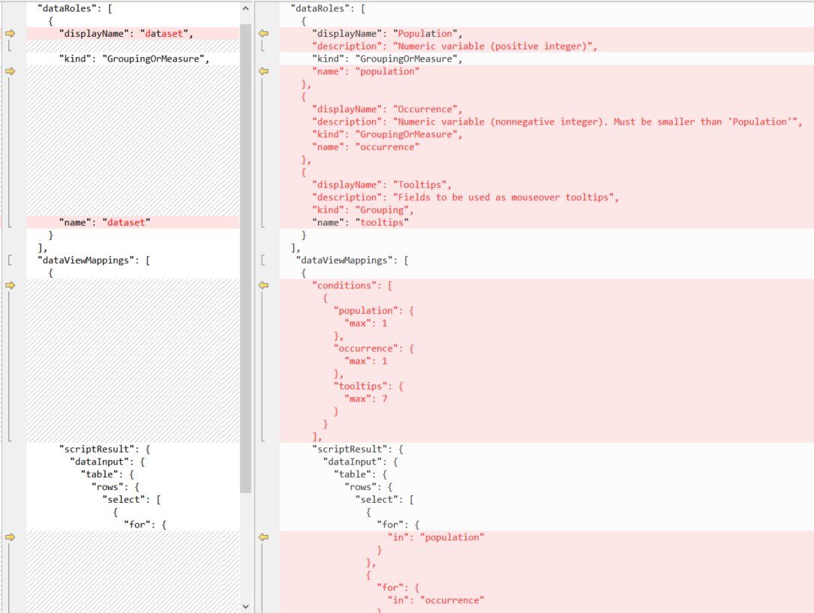
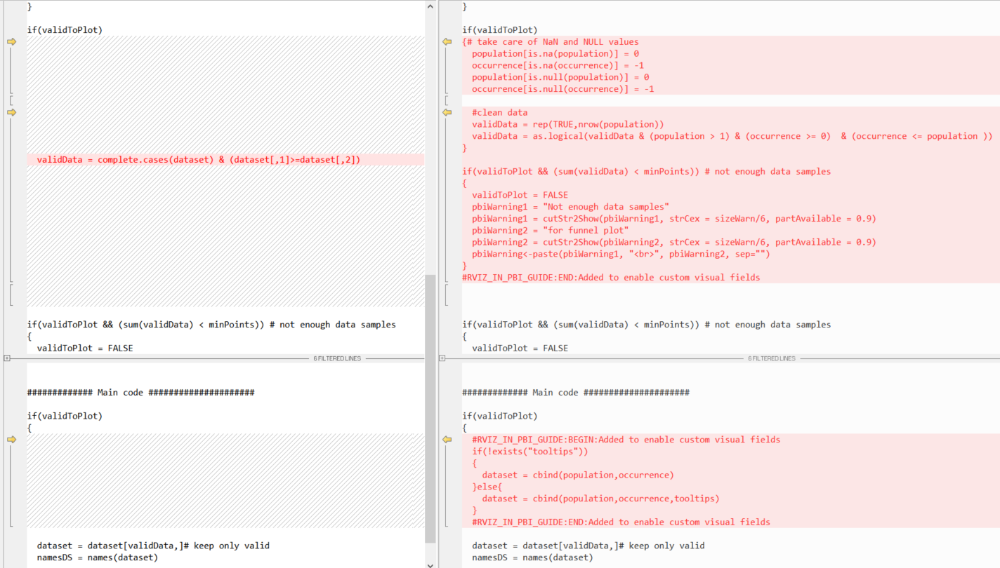

# <a name="tutorial-build-a-funnel-plot-from-r-script-to-r-visual"></a>Руководство по Создание визуального элемента R с воронкообразной диаграммой из скрипта R
В этой статье показано, как пошагово создать воронкообразную диаграмму с помощью скрипта R в визуальном элементе R.

Вы узнаете, как создать:

> [!div class="checklist"]
>
> * скрипт R для RStudio;
> * визуальный элемент R в Power BI;
> * визуальный элемент R *в формате PNG* в Power BI;
> * визуальный элемент R *в формате HTML* в Power BI.

Воронкообразная диаграмма позволяет без усилий использовать, интерпретировать и отображать объем ожидаемых отклонений. **Воронка** формируется с использованием доверительных пределов, а выбросы отображаются в виде точек за пределами воронки.

В этом примере воронкообразная диаграмма используется для сравнения и анализа различных данных наборов.  

> [!NOTE]
> Под каждым набором шагов приведены ссылки на скачивание исходных файлов.

## <a name="build-an-r-script-with-dataset"></a>Создание скрипта R с набором данных

1. Скачайте [минимальный скрипт R](https://github.com/microsoft/PowerBI-visuals/raw/master/RVisualTutorial/TutorialFunnelPlot/chapter1_R/script_R_v1_00.r) и его таблицу данных [dataset.csv](https://github.com/microsoft/PowerBI-visuals/raw/master/RVisualTutorial/TutorialFunnelPlot/chapter1_R/dataset.csv).

1. Затем отредактируйте скрипт, приведя его в соответствие с [этим скриптом](https://github.com/microsoft/PowerBI-visuals/raw/master/RVisualTutorial/TutorialFunnelPlot/chapter1_R/script_R_v1_01.r), чтобы добавить обработку ошибок ввода и пользовательские параметры для управления отображением графика.

## <a name="build-a-report"></a>Создание отчета

Затем отредактируйте скрипт, приведя его в соответствие с [этим скриптом](https://github.com/microsoft/PowerBI-visuals/raw/master/RVisualTutorial/TutorialFunnelPlot/chapter2_Rvisual/script_RV_v2_00.r). Это позволит загрузить файл *dataset.csv* (а не *read.csv*) в рабочую область Power BI и создать таблицу **Cancer Mortality** (Смертность от рака). Результаты см. в следующем [PBIX-файле](https://github.com/microsoft/PowerBI-visuals/raw/master/RVisualTutorial/TutorialFunnelPlot/chapter2_Rvisual/funnelPlot_Rvisual.pbix).

> [!NOTE]
> `dataset` является прописанным в коде именем для входных данных `data.frame` любого визуального элемента R. 

## <a name="create-an-r-powered-visual-and-package-in-r-code"></a>Создание визуального элемента R и пакета в коде R

1. Прежде чем начать, обязательно [установите инструменты PBIVIZ](./custom-visual-develop-tutorial.md#installing-packages).

1. Чтобы создать новый визуальный элемент R, выполните следующую команду:

   ```bash
   pbiviz new funnel-visual -t rvisual
   cd funnel-visual
   npm install 
   pbiviz package
   ```

   Эта команда создает папку *funnel-visual* с исходным визуальным элементом (`-t` для **шаблона**). Инструменты PBIVIZ можно найти в папке *dist*, а код R — в файле *script.r*. Попытайтесь импортировать его в Power BI и посмотрите, что произойдет.

1. Измените файл *script.r* и замените его содержимое содержимым предыдущего скрипта.

1. Измените файл *capabilities.json* и замените строку `Values` на `dataset`. Это позволит изменить название Role (Роль) в шаблоне на название из кода R.

   

1. *(Необязательно)* Измените файл *dependencies.json* и добавьте раздел для каждого пакета R, который требуется скрипту R. Так Power BI сможет автоматически импортировать такие пакеты при первой загрузке визуального элемента.

   

1. Заново упакуйте визуальный элемент с помощью команды `pbiviz package` и попытайтесь импортировать его в Power BI.

> [!NOTE]
> Чтобы скачать нужные файлы, перейдите на страницу [PBIX](https://github.com/microsoft/PowerBI-visuals/blob/master/RVisualTutorial/TutorialFunnelPlot/chapter3_RCustomVisual/funnelPlot_RCustomVisual.pbix) и [исходного кода](https://github.com/Microsoft/PowerBI-visuals/tree/master/RVisualTutorial/TutorialFunnelPlot/chapter3_RCustomVisual/funnelRvisual_v01/).

## <a name="make-r-based-visual-improvements"></a>Улучшение визуальных элементов на основе R

Визуальный элемент еще не очень удобен, так как пользователю нужно знать порядок столбцов во входной таблице.

1. Разделите входное поле `dataset` на три поля (роли): `Population`, `Number` и `Tooltips`.

   

1. Измените файл *capabilities.json* и замените роль `dataset` тремя новыми ролями или скачайте файл [capabilities.json](https://github.com/microsoft/PowerBI-visuals/raw/master/RVisualTutorial/TutorialFunnelPlot/chapter3_RCustomVisual/funnelRvisual_v02/capabilities.json).

   Вам также нужно будет обновить разделы `dataRoles` и `dataViewMappings`, которые определяют имена, типы, подсказки и максимальное число столбцов для каждого входного поля.

   
   
   Дополнительные сведения см. в статье [Возможности и свойства визуальных элементов Power BI](./capabilities.md).

1. Измените файл *script.r*, включив поддержку `Population`, `Number` и `Tooltips` в качестве входных кадров данных (вместо `dataset`), или скачайте файл [script.r](https://github.com/microsoft/PowerBI-visuals/raw/master/RVisualTutorial/TutorialFunnelPlot/chapter3_RCustomVisual/funnelRvisual_v02/script.r).

   

   > [!TIP]
   > Чтобы отследить изменения в скрипте R, выполните поиск блоков комментариев: 
   > 
   > ```r
   > #RVIZ_IN_PBI_GUIDE:BEGIN: Added to enable visual fields
   > ...
   > #RVIZ_IN_PBI_GUIDE:END: Added to enable visual fields
   > 
   > #RVIZ_IN_PBI_GUIDE:BEGIN: Removed to enable visual fields 
   > ...
   > #RVIZ_IN_PBI_GUIDE:BEGIN: Removed to enable visual fields
   > ```

1. Заново упакуйте визуальный элемент с помощью команды `pbiviz package` и попытайтесь импортировать его в Power BI.

> [!NOTE]
> Чтобы скачать нужные файлы, перейдите на страницу [PBIX](https://github.com/microsoft/PowerBI-visuals/raw/master/RVisualTutorial/TutorialFunnelPlot/chapter3_RCustomVisual/funnelPlot_RCustomVisual.pbix) и [исходного кода](https://github.com/Microsoft/PowerBI-visuals/tree/master/RVisualTutorial/TutorialFunnelPlot/chapter3_RCustomVisual/funnelRvisual_v02).

## <a name="add-user-parameters"></a>Добавление пользовательских параметров

1. Добавьте возможность управлять цветами и размером визуальных элементов, в том числе внутренними параметрами, из пользовательского интерфейса.

   

1. Измените файл *capabilities.json* и обновите раздел `objects`. Здесь мы определим имена, подсказки и типы каждого параметра, а также зададим разбиение параметров на группы (три группы в этом случае).

   Скачайте файл [capabilities.json](https://github.com/Microsoft/PowerBI-visuals/tree/master/RVisualTutorial/TutorialFunnelPlot/chapter3_RCustomVisual/funnelRvisual_v03/capabilities.json) и прочитайте статью [Объекты и свойства визуальных элементов Power BI](./objects-properties.md), чтобы узнать больше.

   

1. Измените файл *src/settings.ts*, приведя его в соответствие с [этим файлом settings.ts](https://github.com/Microsoft/PowerBI-visuals/tree/master/RVisualTutorial/TutorialFunnelPlot/chapter3_RCustomVisual/funnelRvisual_v03/src/settings.ts). Этот файл написан на TypeScript.  

   Здесь вы найдете два блока кода, добавленные для выполнения следующих задач:
   - объявление нового интерфейса для сохранения значения свойства;
   - определение свойства элемента и значений по умолчанию.

   

1. Измените файл *script.r*, приведя его в соответствие с [этим файлом script.r](https://github.com/Microsoft/PowerBI-visuals/tree/master/RVisualTutorial/TutorialFunnelPlot/chapter3_RCustomVisual/funnelRvisual_v03/script.r). Так вы включите поддержку параметров в пользовательском интерфейсе путем добавления вызовов `if.exists` для каждого пользовательского параметра.

   > [!TIP]
   > Чтобы отследить изменения в скрипте R, выполните поиск комментариев:
   >
   > ```r
   > #RVIZ_IN_PBI_GUIDE:BEGIN:Added to enable user parameters
   >  ...
   > #RVIZ_IN_PBI_GUIDE:END:Added to enable user parameters
   >
   > #RVIZ_IN_PBI_GUIDE:BEGIN:Removed to enable user parameters 
   >  ...
   > #RVIZ_IN_PBI_GUIDE:END:Removed to enable user parameters
   > ```

   

   Вы можете не отображать параметры в пользовательском интерфейсе.  

1. Заново упакуйте визуальный элемент с помощью команды `pbiviz package` и попытайтесь импортировать его в Power BI.

> [!NOTE]
> Чтобы скачать нужные файлы, перейдите на страницу [PBIX](https://github.com/Microsoft/PowerBI-visuals/tree/master/RVisualTutorial/TutorialFunnelPlot/chapter3_RCustomVisual/funnelPlot_RCustomVisual.pbix) и [исходного кода](https://github.com/Microsoft/PowerBI-visuals/tree/master/RVisualTutorial/TutorialFunnelPlot/chapter3_RCustomVisual/funnelRvisual_v03/).

> [!TIP]
> Здесь мы одновременно добавили параметры нескольких типов (логические, числовые, строковые и цвет). См. [этот пример](https://github.com/Microsoft/PowerBI-visuals/blob/master/RVisualTutorial/PropertiesPane.md), чтобы узнать, как добавить простой параметр. 

## <a name="convert-visual-to-rhtml-based-visual"></a>Преобразование визуального элемента в визуальный элемент в формате RHTML

Так как для итогового визуального элемента используется формат PNG, он не реагирует на наведение курсора, не может быть увеличен и т. д., поэтому его нужно преобразовать в формат HTML. Мы создадим пустой шаблон визуального элемента R в формате HTML, а затем скопируем некоторые скрипты из проекта с использованием PNG.

1. Выполните приведенную ниже команду.

   ```bash
   pbiviz new funnel-visual-HTML -t rhtml
   cd funnel-visual-HTML
   npm install 
   pbiviz package
   ```

1. Откройте файл *capabilities.json* и запишите строку `"scriptOutputType":"html"`.

1. Откройте файл *dependencies.json* и запишите имена указанных пакетов R.

1. Откройте файл *script.r* и запишите структуру. Вы можете открыть и выполнить его в RStudio, так как он не требует внешнего ввода. 

   При этом будет создан и сохранен файл *out.html*. Этот файл является автономным (не имеет внешних зависимостей) и определяет графические элементы в мини-приложении HTML. 

   > [!IMPORTANT]
   > Для пользователей `htmlWidgets` служебные программы R предоставляются в [папке r_files](https://github.com/Microsoft/PowerBI-visuals/tree/master/RVisualTutorial/TutorialFunnelPlot/chapter4_RHTMLCustomVisual/funnelRHTMLvisual_v01/r_files), что помогает преобразовывать объекты `plotly` или `widget` в полный формат HTML. 
   > 
   > Эта версия визуального элемента R также поддерживает команду `source` (в отличие от предыдущих типов визуальных элементов), что делает код более удобочитаемым.   
 
1. Замените файл *capabilities.json* файлом *capabilities.json* с предыдущего шага или скачайте файл [capabilities.json](https://github.com/Microsoft/PowerBI-visuals/tree/master/RVisualTutorial/TutorialFunnelPlot/chapter4_RHTMLCustomVisual/funnelRHTMLvisual_v01/capabilities.json).

   Обязательно сохраните файл:

   `"scriptOutputType": "html"`

1. Объедините последнюю версию файла *script.r* с файлом *script.r* из шаблона или скачайте файл [script.r](https://github.com/Microsoft/PowerBI-visuals/tree/master/RVisualTutorial/TutorialFunnelPlot/chapter4_RHTMLCustomVisual/funnelRHTMLvisual_v01/script.r).

   Новый скрипт использует пакет `plotly` для преобразования объекта **ggplot** в объект **plotly**, а затем — в пакет `htmlWidgets` для его сохранения в HTML-файле. 

   Значительная часть функций служебных программ теперь доступна в файле [_r_files/utils.r_](https://github.com/Microsoft/PowerBI-visuals/tree/master/RVisualTutorial/TutorialFunnelPlot/chapter4_RHTMLCustomVisual/funnelRHTMLvisual_v01/r_files/utils.r). Кроме того, добавлена функция `generateNiceTooltips` для отображения объекта **plotly**.

   
   
   

   > [!TIP]
   > Чтобы отследить изменения в скрипте R, выполните поиск комментариев:
   > 
   > ```r
   > #RVIZ_IN_PBI_GUIDE:BEGIN:Added to create HTML-based 
   >  ...
   > #RVIZ_IN_PBI_GUIDE:BEGIN:Added to create HTML-based
   >
   > #RVIZ_IN_PBI_GUIDE:BEGIN:Removed to create HTML-based  
   > ...
   > #RVIZ_IN_PBI_GUIDE:BEGIN:Removed to create HTML-based
   > ```

1. Объедините последнюю версию файла *dependencies.json* с файлом *dependencies.json* из шаблона, чтобы включить новые зависимости пакета R, или скачайте файл [dependencies.json](https://github.com/Microsoft/PowerBI-visuals/tree/master/RVisualTutorial/TutorialFunnelPlot/chapter4_RHTMLCustomVisual/funnelRHTMLvisual_v01/dependencies.json).

1. Измените файл *src/settings.ts* так, как это описано выше.

1. Заново упакуйте визуальный элемент с помощью команды `pbiviz package` и попытайтесь импортировать его в Power BI.

> [!NOTE]
> Чтобы скачать нужные файлы, перейдите на страницу [PBIX и исходного кода](https://github.com/Microsoft/PowerBI-visuals/tree/master/RVisualTutorial/TutorialFunnelPlot/chapter4_RHTMLCustomVisual/funnelRHTMLvisual_v01).

## <a name="build-additional-examples"></a>Создание дополнительных примеров

1. Выполните следующую команду, чтобы создать пустой проект: 

   ```bash
   pbiviz new example -t rhtml
   cd example
   npm install 
   pbiviz package
   ```

1. Воспользуйтесь кодом из этой [демонстрации](http://www.htmlwidgets.org/showcase_networkD3.html) и внесите указанные изменения:

   

1. Замените файл *script.r* шаблона и повторно выполните `pbiviz package`. Теперь визуальный элемент включен в отчет Power BI!

## <a name="tips-and-tricks"></a>Советы и рекомендации

* Мы рекомендуем разработчикам изменить файл *pbiviz.json* для хранения правильных метаданных, например **версии**, **адреса электронной почты**, **имени**, **типа лицензии** и т. д.

   > [!IMPORTANT]
   > Поле **guid** является уникальным идентификатором визуального элемента. Идентификатор GUID каждого нового проекта визуального элемента будет другим. Он будет таким же, только если вы будете использовать старый проект, скопированный в новый визуальный элемент, но это не рекомендуется делать.

* Измените файл [*assets/icon.png*](https://github.com/Microsoft/PowerBI-visuals/tree/master/RVisualTutorial/TutorialFunnelPlot/chapter4_RHTMLCustomVisual/funnelRHTMLvisual_v01/assets/icon.png), чтобы создать уникальные значки для визуального элемента. 

* Чтобы выполнить отладку кода R в RStudio с помощью данных из отчета Power BI, добавьте следующий код в начало скрипта R (измените переменную `fileRda`):

   ```r
   #DEBUG in RStudio
   fileRda = "C:/Users/yourUserName/Temp/tempData.Rda"
   if(file.exists(dirname(fileRda)))
   {
     if(Sys.getenv("RSTUDIO")!="")
       load(file= fileRda)
     else
       save(list = ls(all.names = TRUE), file=fileRda)
   }
   ```

   Это позволяет сохранить среду из отчета Power BI и загрузить ее в RStudio. 

* Вам не обязательно разрабатывать визуальные элементы R с нуля, так как вы можете использовать код с [GitHub](https://github.com/Microsoft?utf8=%E2%9C%93&q=PowerBI&type=&language=R). Вы можете выбрать визуальный элемент для использования в качестве шаблона и скопировать код в новый проект.

   Например, попробуйте использовать [настраиваемый визуальный элемент сплайна](https://github.com/Microsoft/PowerBI-visuals-spline).

* Каждый визуальный элемент R применяет оператор `unique` к своей входной таблице. Чтобы избежать удаления одинаковых строк, попробуйте добавить дополнительное поле ввода с уникальным идентификатором и проигнорировать его в коде R.   

* Если у вас есть учетная запись Power BI, используйте службу Power BI для разработки визуального элемента [на лету](./custom-visual-develop-tutorial.md), без повторной упаковки с помощью команды `pbiviz package`.

### <a name="html-widgets-gallery"></a>Коллекция мини-приложений HTML
Изучите визуальные элементы в [коллекции мини-приложений HTML](http://gallery.htmlwidgets.org/) для использования в следующем визуальном элементе. Чтобы упростить процесс, мы создали [репозиторий проектов](https://github.com/Microsoft/PowerBI-visuals/tree/master/RVisualTutorial/TutorialFunnelPlot/chapter4_RHTMLCustomVisual/multipleRHTML) с более чем 20 интерактивными визуальным и элементами HTML.

> [!TIP]
> Для переключения между мини-приложениями HTML выберите **Формат** > **Параметры** > **Тип**. Попробуйте сделать это с [этим PBIX-файлом](https://github.com/Microsoft/PowerBI-visuals/tree/master/RVisualTutorial/TutorialFunnelPlot/chapter4_RHTMLCustomVisual/multipleRHTML/assets/sample.pbix). 

#### <a name="to-use-a-sample-for-your-visual"></a>Чтобы использовать пример для своего визуального элемента:

1. Скачайте всю папку.
1. Измените файлы *script.r* и *dependencies.json*, чтобы сохранить только одно мини-приложение.
1. Измените файлы *capabilities.json* и *settings.ts*, чтобы удалить селектор `Type`.
1. Измените строку `const updateHTMLHead: boolean = true;` на `false` в файле *visual.ts*. *(для улучшенной производительности)*
1. Измените метаданные в файле *pbiviz.json* и, что самое важное, поле `guid`.
1. Заново создайте пакет и продолжите изменение визуального элемента. 


> [!NOTE]
> Служба поддерживает не все мини-приложения в этом проекте.

## <a name="next-steps"></a>Дальнейшие действия

Ознакомьтесь с дополнительными руководствами по [визуальным элементам Power BI](./custom-visual-develop-tutorial.md) и [визуальным элементам R](../../visuals/service-r-visuals.md).

Узнайте, как [разрабатывать и размещать визуальные элементы](https://powerbi.microsoft.com/documentation/powerbi-developer-office-store/) в [Магазине Office (коллекция)](https://store.office.com/appshome.aspx?ui=en-US&rs=en-US&ad=US&clickedfilter=OfficeProductFilter%3aPowerBI&productgroup=PowerBI), или воспользуйтесь примерами из [демонстрации скрипта R](https://community.powerbi.com/t5/R-Script-Showcase/bd-p/RVisuals).