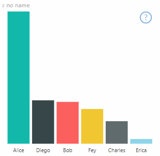

# <a name="high-contrast-mode-support"></a>Поддержка режима высокой контрастности

Параметр *Высокая контрастность* Windows упрощает чтение текста и приложений за счет использования более резко выраженных цветов.
Дополнительные сведения о [поддержке высокой контрастности в Power BI](https://powerbi.microsoft.com/blog/power-bi-desktop-june-2018-feature-summary/#highContrast).

Чтобы добавить поддержку высокой контрастности для визуального элемента, нужно сделать следующее:

1. При инициализации: определите, находится ли Power BI в режиме высокой контрастности, и если это так, получите текущие цвета высокой контрастности.
2. При каждом обновлении: измените способ отрисовки визуального элемента, чтобы упростить его восприятие.

Визуальный элемент PowerBI-visuals-sampleBarChart имеет реализацию поддержки высокой контрастности.

Дополнительные сведения см. в [репозитории визуальных элементов PowerBI-visuals-sampleBarChart](https://github.com/Microsoft/PowerBI-visuals-sampleBarChart/commit/61011c82b66ca0d3321868f1d089c65101ca42e6).

## <a name="on-init"></a>При инициализации

Член colorPalette объекта `options.host` имеет несколько свойств для режима высокой контрастности. Используйте их, чтобы определить, активен ли режим высокой контрастности, и если активен, то какие следует использовать цвета.

### <a name="detect-that-power-bi-is-in-high-contrast-mode"></a>Определение того, что Power BI работает в режиме высокой контрастности

Если параметр `host.colorPalette.isHighContrast` имеет значение `true`, то активен режим высокой контрастности и визуальный элемент должен отрисовываться соответствующим образом.

### <a name="get-high-contrast-colors"></a>Получение цветов режима высокой контрастности

В режиме высокой контрастности визуальный элемент должен ограничивать используемые цвета следующими:

* **Передний план** — этот цвет используется для рисования всех линий, значков, текста, а также контуров или заливки фигур.
* **Фон** — этот цвет используется для фона, а также для заливки выделенных по контуру фигур.
* **Foreground - selected** (Передний план — выбранный) — этот цвет используется для обозначения выбранного или активного элемента.
* **Гиперссылка** — этот цвет используется только для текста гиперссылки.

> [!NOTE]
> Если требуется дополнительный цвет, можно использовать цвет переднего плана с некоторой степенью непрозрачности (в собственных визуальных элементах Power BI используется непрозрачность 40 %). Используйте эту функцию аккуратно, чтобы обеспечить читаемость сведений визуальных элементов.

Эти значения можно сохранить во время инициализации:

```typescript
private isHighContrast: boolean;

private foregroundColor: string;
private backgroundColor: string;
private foregroundSelectedColor: string;
private hyperlinkColor: string;
//...

constructor(options: VisualConstructorOptions) {
    this.host = options.host;
    let colorPalette: ISandboxExtendedColorPalette = host.colorPalette;
    //...
    this.isHighContrast = colorPalette.isHighContrast;
    if (this.isHighContrast) {
        this.foregroundColor = colorPalette.foreground.value;
        this.backgroundColor = colorPalette.background.value;
        this.foregroundSelectedColor = colorPalette.foregroundSelected.value;
        this.hyperlinkColor = colorPalette.hyperlink.value;
    }
```

Можно также сохранить объект `host` во время инициализации и получить доступ к соответствующим свойствам `colorPalette` во время обновления.

## <a name="on-update"></a>При обновлении

Конкретные реализации поддержки высокой контрастности отличаются у разных визуальных элементов и зависят от особенностей графического дизайна. Как правило, для режима высокой контрастности требуется немного иной дизайн, чем для режима по умолчанию, чтобы было легче различить нужные, представленные ограниченными цветами.

Ниже приведены некоторые рекомендации, применяемые для собственных визуальных элементов Power BI:

* Все точки данных используют один и тот же цвет (передний план).
* Все оси, стрелки, линии, текст и т. п. используют цвет переднего плана.
* Толстые фигуры рисуются в виде контуров с толстыми линиями (по меньшей мере два пикселя) и заливкой цвета фона.
* Если это уместно, точки данных дифференцируются с помощью маркеров различных форм, а линии данных — с помощью различных штрихов.
* При выделении элемента данных для всех остальных элементов устанавливается непрозрачность 40 %.
* Для срезов в активных элементах фильтра используется цвет, выбранный для переднего плана.

Например, на образце линейчатой диаграммы все линии рисуются толщиной в два пикселя с контуром цвета переднего плана и заливкой цвета фона. Сравните цвета по умолчанию с парой тем высокой контрастности:




Ниже приведено одно место в функции `visualTransform`, которое было изменено для поддержки высокой контрастности, оно вызывается в рамках отрисовки во время `update`:

### <a name="before"></a>До

```typescript
for (let i = 0, len = Math.max(category.values.length, dataValue.values.length); i < len; i++) {
    let defaultColor: Fill = {
        solid: {
            color: colorPalette.getColor(category.values[i] + '').value
        }
    };

    barChartDataPoints.push({
        category: category.values[i] + '',
        value: dataValue.values[i],
        color: getCategoricalObjectValue<Fill>(category, i, 'colorSelector', 'fill', defaultColor).solid.color,
        selectionId: host.createSelectionIdBuilder()
            .withCategory(category, i)
            .createSelectionId()
    });
}
```

### <a name="after"></a>После

```typescript
for (let i = 0, len = Math.max(category.values.length, dataValue.values.length); i < len; i++) {
    const color: string = getColumnColorByIndex(category, i, colorPalette);

    const selectionId: ISelectionId = host.createSelectionIdBuilder()
        .withCategory(category, i)
        .createSelectionId();

    barChartDataPoints.push({
        color,
        strokeColor,
        strokeWidth,
        selectionId,
        value: dataValue.values[i],
        category: `${category.values[i]}`,
    });
}

//...

function getColumnColorByIndex(
    category: DataViewCategoryColumn,
    index: number,
    colorPalette: ISandboxExtendedColorPalette,
): string {
    if (colorPalette.isHighContrast) {
        return colorPalette.background.value;
    }

    const defaultColor: Fill = {
        solid: {
            color: colorPalette.getColor(`${category.values[index]}`).value,
        }
    };

    return getCategoricalObjectValue<Fill>(category, index, 'colorSelector', 'fill', defaultColor).solid.color;
}
```
