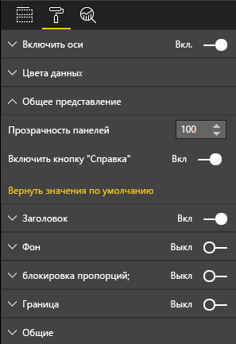

# <a name="create-a-launch-url"></a>Создание URL-адреса запуска

URL-адрес запуска позволяет открыть новую вкладку браузера (или окно), делегировав фактическую работу Power BI.

## <a name="sample"></a>Пример

```typescript
   this.host.launchUrl('https://powerbi.microsoft.com');
```

## <a name="usage"></a>Usage

Используйте вызов `host.launchUrl()` API, передав URL-адрес назначения в виде строкового аргумента:

```typescript
this.host.launchUrl('https://some.link.net');
```

## <a name="restrictions"></a>Ограничения

* Используйте только абсолютные пути, а не относительные. Например, используйте абсолютный путь, такой как `https://some.link.net/subfolder/page.html`. Относительный путь `/page.html` не будет открыт.

* На данный момент поддерживаются только протоколы *HTTP* и *HTTPS*. Не используйте протоколы *FTP*, *MAILTO* и другие.

## <a name="best-practices"></a>Советы и рекомендации

* В большинстве случаев лучше всего открывать ссылку только в ответ на явные действия пользователя. Четко дайте пользователю понять, что выбор ссылки или нажатие кнопки приведут к открытию новой вкладки. Активация вызова `launchUrl()` без действия со стороны пользователя либо в качестве побочного эффекта от другого действия может привести к путанице или раздражать пользователя.

* Если ссылка не является критически важной для правильной работы визуального элемента, рекомендуется предоставить автору отчета способ отключить и скрыть ее. Эта рекомендация особенно актуальна для специальных вариантов использования Power BI, таких как внедрение отчета в стороннее приложение или его публикация в Интернете.

* Избегайте активации вызова `launchUrl()` изнутри цикла, функции `update` визуального элемента или другого часто повторяющегося кода.

## <a name="a-step-by-step-example"></a>Пошаговый пример

### <a name="add-a-link-launching-element"></a>Добавление элемента для открытия ссылки

В функцию `constructor` визуального элемента были добавлены следующие строки:

```typescript
    this.helpLinkElement = this.createHelpLinkElement();
    options.element.appendChild(this.helpLinkElement);
```

Кроме того, была добавлена закрытая функция, создающая и подключающая элемент привязки:

```typescript
private createHelpLinkElement(): Element {
    let linkElement = document.createElement("a");
    linkElement.textContent = "?";
    linkElement.setAttribute("title", "Open documentation");
    linkElement.setAttribute("class", "helpLink");
    linkElement.addEventListener("click", () => {
        this.host.launchUrl("https://docs.microsoft.com/power-bi/developer/visuals/custom-visual-develop-tutorial");
    });
    return linkElement;
};
```

Наконец, запись в файле *visual.less* определяет стиль для элемента ссылки:

```less
.helpLink {
    position: absolute;
    top: 0px;
    right: 12px;
    display: block;
    width: 20px;
    height: 20px;
    border: 2px solid #80B0E0;
    border-radius: 20px;
    color: #80B0E0;
    text-align: center;
    font-size: 16px;
    line-height: 20px;
    background-color: #FFFFFF;
    transition: all 900ms ease;

    &:hover {
        background-color: #DDEEFF;
        color: #5080B0;
        border-color: #5080B0;
        transition: all 250ms ease;
    }

    &.hidden {
        display: none;
    }
}
```

### <a name="add-a-toggling-mechanism"></a>Добавление механизма переключения

Чтобы добавить механизм переключения, необходимо добавить статический объект, с помощью которого автор отчета сможет переключать видимость элемента ссылки. (По умолчанию используется значение *hidden*.) Дополнительные сведения см. в [руководстве по работе со статическими объектами](https://microsoft.github.io/PowerBI-visuals/docs/concepts/objects-and-properties).

Был добавлен статический объект логического типа `showHelpLink` в запись объектов в файле *capabilities.json*, как показано в следующем коде:

```typescript
"objects": {
    "generalView": {
            "displayName": "General View",
            "properties":
                "showHelpLink": {
                    "displayName": "Show Help Button",
                    "type": {
                        "bool": true
                    }
                }
            }
        }
    }
```



В функцию `update` визуального элемента были добавлены следующие строки:

```typescript
if (settings.generalView.showHelpLink) {
    this.helpLinkElement.classList.remove("hidden");
} else {
    this.helpLinkElement.classList.add("hidden");
}
```

В файле *visual.less* определен класс *hidden*, который контролирует отображение элемента.
