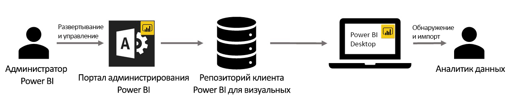

# Визуальные элементы организации в Power BI

В Power BI визуальные элементы Power BI используются для создания уникальной визуализации, соответствующей вашим требованиям. Эти визуальные элементы создаются разработчиками, когда другие визуальные элементы в Power BI не соответствуют их требованиям.

Для некоторых организаций пользовательские элементы Power BI имеют еще большее значение. Они могут пригодиться для передачи данных или аналитических сведений, уникальных для организации. Организации могут иметь особые требования к данным или уделять большое внимание методам частного бизнеса. Таким организациям нужна разработка визуальных элементов Power BI, их распространение по всей организации и правильное обслуживание. Все эти задачи в организации можно выполнять с помощью визуализаций Power BI.

На следующем рисунке показан поток прохождения визуальных элементов в Power BI: передача от администратора на разработку и обслуживание, а затем к специалисту по анализу данных.

Визуальные элементы организации развертываются и управляются администратором Power BI на портале администрирования. После того как визуальные элементы Power BI организации развернуты в репозиторий организации, пользователи в организации могут легко находить и импортировать их непосредственно из Power BI Desktop в свои отчеты.

Дополнительные сведения об использовании визуальных элементов Power BI организации в созданных вами отчетах см. в статье об [импорте визуальных элементов организации в отчеты](power-bi-custom-visuals.md).

## Администрирование визуальных элементов Power BI организации

Дополнительные сведения об администрировании, развертывании визуальных элементов Power BI организации и управлении ими см. в статье о [развертывании и администрировании визуальных элементов Power BI организации](../../admin/organizational-visuals.md).

> [!WARNING]
> Полученный из файла визуальный элемент Power BI может содержать код, подвергающий риску безопасность или конфиденциальность. Прежде чем помещать такой файл в репозиторий организации, убедитесь в надежности его автора и источника.

## Рекомендации и ограничения

Есть некоторые рекомендации и ограничения, которые нужно учитывать.

Администратор

* Если визуальный элемент Power BI удален из источника или файла, все отчеты, в которых использовался этот элемент, перестанут отображаться. Удаление из репозитория является необратимой операцией. Чтобы временно отключить визуальный элемент Power BI от источника или файла, используйте функцию "Отключить".

* Визуальные элементы Power BI для организации не поддерживаются на сервере отчетов Power BI.

Пользователь

* Визуальные элементы Power BI организации закрыты для внешних пользователей. Они импортируются из репозитория организации. Как и любой другой закрытый элемент, их нельзя [экспортировать в PowerPoint](../../consumer/end-user-powerpoint.md) или отображать в сообщениях электронной почты по [подписке на страницы отчетов](../../consumer/end-user-subscribe.md). Эти возможности поддерживаются только для [сертифицированных визуальных элементов Power BI](power-bi-custom-visuals-certified.md), импортируемых напрямую из Marketplace.

* Визуальные элементы Visio, PowerApps и GlobeMap из магазина AppSource не будут отображаться, если они развернуты в репозитории организации.

## Устранение неполадок

Сведения об устранении неполадок: [Устранение неполадок с визуализациями Power BI](power-bi-custom-visuals-troubleshoot.md).

## Часто задаваемые вопросы

Дополнительные сведения и ответы на вопросы: [Часто задаваемые вопросы о визуализациях Power BI](power-bi-custom-visuals-faq.md#organizational-power-bi-visuals).

Появились дополнительные вопросы? [Ответы на них см. в сообществе Power BI](https://community.powerbi.com/).