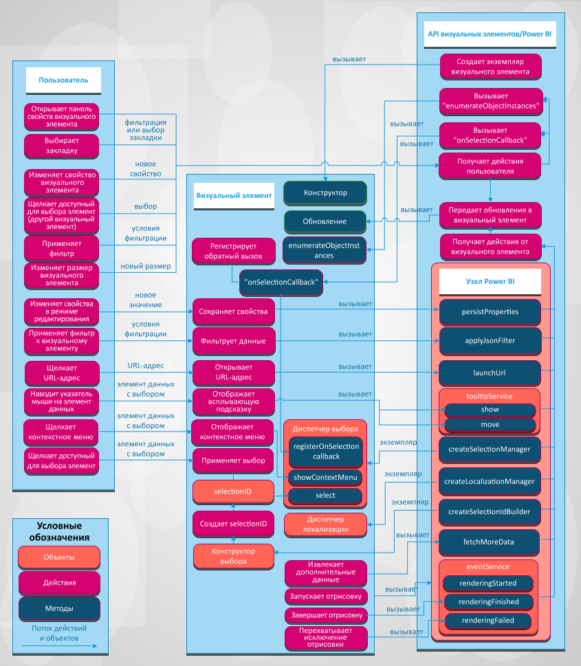

# Визуальные элементы в Power BI

В этой статье описано, как визуальные элементы интегрируются с Power BI и как пользователь может работать с этими элементами в Power BI. 

На рисунке ниже показано, как в Power BI обрабатываются распространенные действия пользователя с визуальными элементами, например выбор закладки.

## Визуальные элементы получают обновления из Power BI

Визуальный элемент вызывает метод `update` для получения обновлений из Power BI. Метод `update` обычно содержит основную логику визуального элемента и отвечает за отрисовку диаграммы или визуализацию данных.

Обновления активируются, когда визуальный элемент вызывает метод `update`.

## Шаблоны действий и обновления

Действия с визуальными элементами и последующие обновления таких элементов в Power BI происходят по одному из шаблонов ниже:

* взаимодействие пользователя с визуальным элементом через Power BI;
* взаимодействие пользователя с визуальным элементом напрямую;
* взаимодействие визуального элемента с Power BI;

### Взаимодействие пользователя с визуальным элементом через Power BI

* Пользователь открывает панель свойств визуального элемента.

    После этого Power BI получает поддерживаемые объекты и свойства из файла визуального элемента *capabilities.json*. Чтобы получить фактические значения свойств, Power BI вызывает метод `enumerateObjectInstances` визуального элемента. Визуальный элемент должен вернуть фактические значения свойств.

    Дополнительные сведения см. в статье [Возможности и свойства визуальных элементов Power BI](capabilities.md).

* Пользователь [изменяет свойство визуального элемента](../../visuals/power-bi-visualization-customize-title-background-and-legend.md) на панели форматирования.

    Когда пользователь изменяет значение свойства на панели форматирования, Power BI вызывает метод `update` визуального элемента. Power BI передает новый объект `options` методу `update`. Теперь объекты содержат новые значения.

    Дополнительные сведения см. в статье [Объекты и свойства в визуальных элементах Power BI](objects-properties.md).

* Пользователь изменяет размер визуального элемента.

    После этого действия Power BI вызывает метод `update` с новым объектом `options`. В объектах `options` есть вложенные объекты `viewport`, которые содержат новые данные ширины и высоты визуального элемента.

* Пользователь применяет фильтр на уровне отчета, страницы или визуального элемента.

    Power BI фильтрует данные на основе условий фильтра. Power BI вызывает метод `update` визуального элемента, чтобы обновить его новыми данными.

    Визуальный элемент получает обновленные объекты `options`, если в одном из вложенных объектов есть новые данные. Способ обновления зависит от того, как настроено сопоставление представления данных для визуального элемента.

    Дополнительные сведения см. в статье [Общие сведения о сопоставлениях представлений данных в визуальных элементах Power BI](dataview-mappings.md).

* Пользователь выбирает точку данных в другом визуальном элементе отчета.

    В таком случае Power BI фильтрует или выделяет выбранные точки данных и вызывает метод `update` визуального элемента. Визуальный элемент получает новые отфильтрованные данные или те же данные с массивом выделенного.

    Дополнительные сведения см. в статье [Выделение точек данных в визуальных элементах Power BI](highlight.md).

* Пользователь выбирает закладку на панели закладок отчета.

    После этого может произойти одно из двух действий:

    * Power BI вызовет функцию, которую передает и регистрирует метод `registerOnSelectionCallback`. Функция обратного вызова получает массивы выбранных данных для соответствующей закладки.

    * Power BI вызовет метод `update` с соответствующим объектом `filter` внутри объекта `options`.

    В любом случае визуальный элемент должен изменить свое состояние в соответствии с полученными выбранными данными или объектом `filter`.

    Дополнительные сведения о закладках и фильтрах см. в разделе [API фильтров визуальных элементов в визуальных элементах Power BI](filter-api.md).

### Взаимодействие пользователя с визуальным элементом напрямую

* Пользователь наводит указатель мыши на элемент данных.

    Визуальный элемент может показывать дополнительные сведения о точках данных с использованием API подсказок Power BI. Когда пользователь наводит указатель мыши на визуальный элемент, он может обработать событие и показать данные связанного элемента подсказки. Визуальный элемент может выводить стандартную подсказку или подсказку страницы отчета.

    Дополнительные сведения см. в статье [Подсказки в визуальных элементах Power BI](add-tooltips.md).

* Пользователь изменяет свойства визуального элемента (например, развертывает дерево, после чего визуальный элемент сохраняет состояние в свойствах).

    Визуальный элемент может сохранять значения свойств с использованием API Power BI. Например, когда пользователь взаимодействует с визуальным объектом и визуальный элемент должен сохранить или обновить значения свойств, визуальный элемент может вызвать метод `presistProperties`.

* Пользователь выбирает URL-адрес.

    По умолчанию визуальный элемент не может открывать URL-адреса напрямую. Вместо этого, чтобы открыть URL-адрес в новой вкладке, визуальный элемент может вызвать метод `launchUrl` и передать URL-адрес в качестве параметра.

    Дополнительные сведения см. в разделе [Создание URL-адреса запуска](launch-url.md).

* Пользователь применяет фильтр через визуальный элемент.

    Визуальный элемент может вызывать метод `applyJsonFilter` и передавать условия для фильтрации данных в других визуальных элементах. Доступны фильтры нескольких типов, среди которых основные, расширенные и кортежные фильтры.

    Дополнительные сведения см. в статье [API фильтров визуальных элементов в визуальных элементах Power BI](filter-api.md).

* Пользователь выбирает элементы в визуальном элементе.

    Дополнительные сведения см. в разделе [Добавление интерактивности в визуальные элементы путем выбора визуальных элементов Power BI](selection-api.md).

### Взаимодействие визуального элемента с Power BI

* Визуальный элемент запрашивает дополнительные данные в Power BI.

    Визуальный элемент обрабатывает данные по частям. Метод API `fetchMoreData` запрашивает следующий фрагмент набора данных.

    Дополнительные сведения см. в статье [Получение дополнительных данных из Power BI](fetch-more-data.md).

* Активируется служба событий.

    Power BI может экспортировать отчет в формате PDF или отправить его по электронной почте (применяется только к сертифицированным визуальным элементам). Чтобы уведомить Power BI о завершении отрисовки и готовности записи визуального элемента в формате PDF или электронного письма, визуальный элемент должен вызвать API событий отрисовки.

    Дополнительные сведения см. в статье [Экспорт отчетов из Power BI в формат PDF](../../consumer/end-user-pdf.md).

    Дополнительные сведения о службе событий см. в разделе [События отрисовки в визуальных элементах Power BI](event-service.md).

## Дальнейшие действия

Вы заинтересованы в том, чтобы создавать собственные визуальные элементы и добавлять их в Microsoft AppSource? См. следующие статьи:

* [Руководство. Разработка визуального элемента Power BI](./custom-visual-develop-tutorial.md)
* [Публикация визуализаций Power BI в Центре партнеров](office-store.md)
