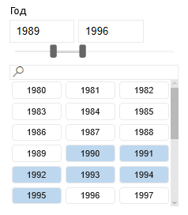
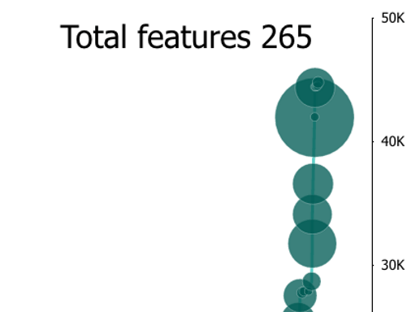
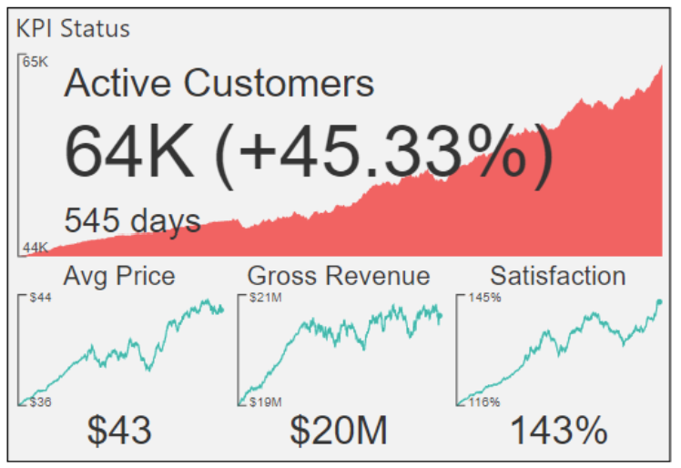
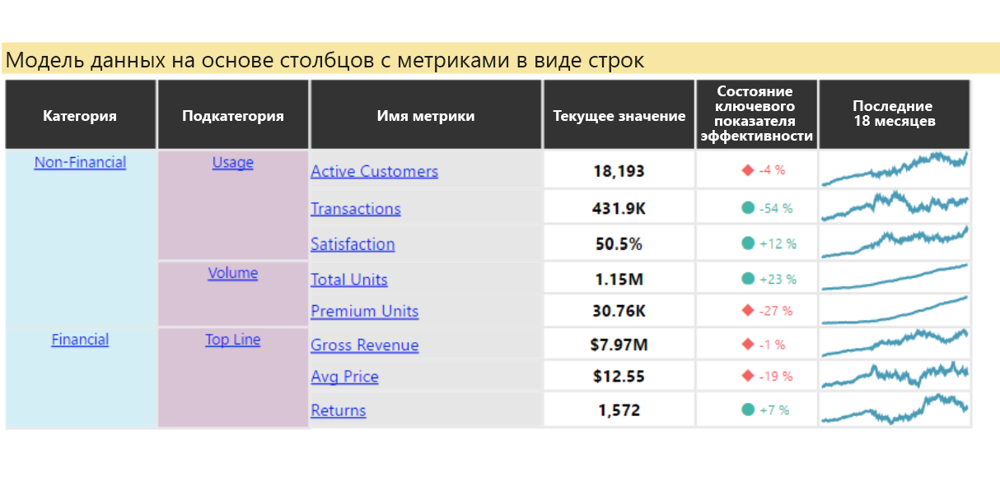
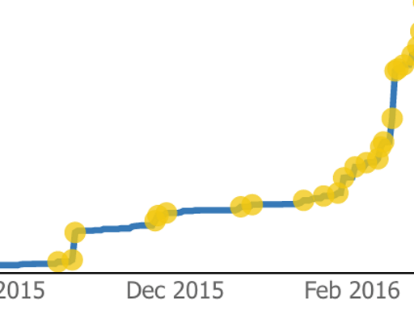
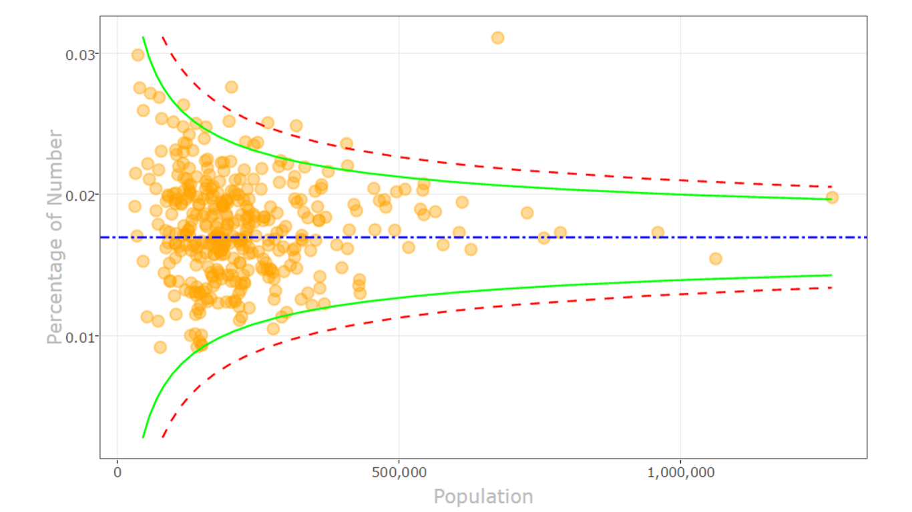
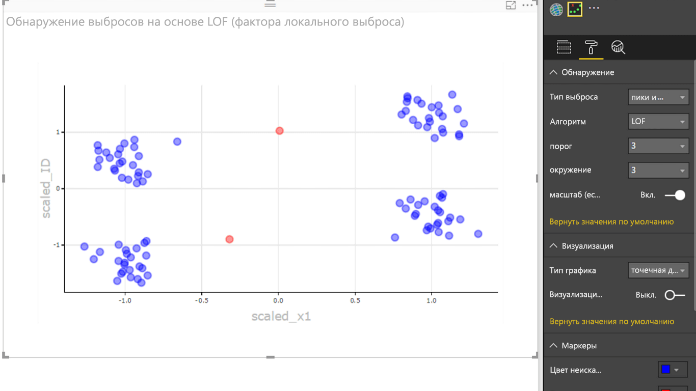

# Примеры визуальных элементов Power BI

Вы можете скачать, использовать и изменить эти визуальные элементы Power BI на сайте GitHub. В этих примерах показано, как обрабатываются распространенные ситуации при разработке с помощью Power BI.

## Срезы

Срез сужает часть данных, отображаемую в других визуализациях в отчете. Срезы — это один из нескольких способов фильтрации данных в Power BI.

|   |  | |
| ------------- | ------------- | -------------|
| [Срез Chiclet](https://github.com/Microsoft/powerbi-visuals-chicletslicer/)   Кнопки с изображениями и текстом, которые служат фильтром на холсте в других визуальных элементах | [Timeline slicer](https://github.com/Microsoft/powerbi-visuals-timeline/)  Графический селектор диапазонов дат, с помощью которого выполняется фильтрация по датам. | [Пример среза](https://github.com/Microsoft/powerbi-visuals-sampleslicer/)  Демонстрирует использование API расширенной фильтрации.

## Диаграммы

Используйте преимущества нашей коллекции, в том числе линейчатых диаграмм, круговых диаграмм, облака слов и др.

|   |  | |
| ------------- | ------------- | -------------|
| [Круговая диаграмма с индивидуальным радиусом срезов](https://github.com/Microsoft/powerbi-visuals-asterplot/)   Изгиб на стандартной кольцевой диаграмме, где второе значение используется для указания угла поворота | [Диаграмма-шкала](https://github.com/Microsoft/powerbi-visuals-bulletchart/)  Линейчатая диаграмма с дополнительными визуальными элементами, предоставляющими контекст для отслеживания целей | [Хордовая диаграмма](https://github.com/Microsoft/powerbi-visuals-chord/)  Графический метод отображения взаимосвязей данных в матрице
|  | |  
| [Точечная диаграмма](https://github.com/Microsoft/powerbi-visuals-dotplot/)  Показывает распределение частот в виде удобной диаграммы. | [Dual KPI](https://github.com/Microsoft/powerbi-visuals-dualkpi/)  Эффективная визуализация двух мер с течением времени, отображающая их тенденцию на объединенной временной шкале | [Расширенная точечная диаграмма](https://github.com/Microsoft/powerbi-visuals-enhancedscatter/)  Улучшения на имеющейся точечной диаграмме
| | | 
| [Force Graph](https://github.com/Microsoft/powerbi-visuals-forcegraph/)  Принудительно структурированная диаграмма с изогнутыми траекториями. Полезна для отображения связей между сущностями | [Диаграмма Ганта](https://github.com/Microsoft/powerbi-visuals-gantt/)  Линейчатая диаграмма, которая иллюстрирует временную шкалу или расписание проекта вместе с ресурсами | [Диаграмма "Тепловая карта"](https://github.com/Microsoft/powerbi-visuals-heatmap/)  Простое и интуитивно понятное сравнение данных в таблице с использованием цветов
|  |  |  
| [Гистограмма](https://github.com/Microsoft/powerbi-visuals-histogram/)  Визуализация распределения данных за непрерывный интервал или определенный период времени | [Линейно-точечная диаграмма](https://github.com/Microsoft/powerbi-visuals-linedotchart/)  График с анимированными точками, который помогает привлечь внимание аудитории к данным | [Диаграмма Mekko](https://github.com/Microsoft/powerbi-visuals-mekkochart/)  Сочетание нормированной гистограммы и нормированной линейчатой диаграммы в одном представлении
|  |  |  
| [Несколько КПЭ](https://github.com/microsoft/PowerBI-visuals-MultiKPI/)   Эффективная визуализация с несколькими КПЭ, содержащая ключевой показатель КПЭ и несколько спарклайнов для поддержки данных | [Ключевой показатель эффективности производительности](https://github.com/microsoft/PowerBI-visuals-PowerKPI/)  Эффективный индикатор КПЭ с многострочным графиком и метками для текущей даты, значения и расхождений. | [Матрица КПЭ производительности](https://github.com/microsoft/PowerBI-visuals-PowerKPIMatrix/)  Мониторинг сбалансированных систем показателей и неограниченного количества метрик и ключевых показателей эффективности в форме компактного, удобного для чтения списка
| |  |  
| [Диаграмма "Пульс"](https://github.com/Microsoft/powerbi-visuals-pulsechart/)  Этот график с примечаниями в виде ключевых событий идеально подходит для описания ситуаций с использованием данных| [Лепестковая диаграмма](https://github.com/Microsoft/powerbi-visuals-radarchart/)  Диаграмма с несколькими мерами, нанесенными на ось категорий для сравнения атрибутов | [Диаграмма Sankey](https://github.com/Microsoft/powerbi-visuals-sankey/)  Диаграмма потока, в которой ширина ряда пропорциональна объему потока
|  | | 
| [График потока](https://github.com/Microsoft/powerbi-visuals-streamgraph/)  Диаграмма с областями и накоплением с плавной интерполяцией, которая часто используется для отображения значений за период времени | [Диаграмма "солнечные лучи"](https://github.com/Microsoft/powerbi-visuals-sunburst/)  Многоуровневая кольцевая диаграмма для визуализации иерархических данных| [Диаграмма-торнадо](https://github.com/Microsoft/powerbi-visuals-tornado/)  Сравнение относительной важности переменных между двумя группами
 | 
 | [Облако Word](https://github.com/Microsoft/powerbi-visuals-wordcloud/)  Интересный визуальный элемент, показывающий частоту использования слов в тексте

## WebGL

WebGL позволяет веб-содержимому использовать API на основе OpenGL ES 2.0 для двумерной и трехмерной отрисовки на холсте HTML.

| |
| ------------- |
| [Схема земного шара](https://github.com/Microsoft/powerbi-visuals-globemap/)  График расположений на интерактивной трехмерной карте

## Визуальные элементы R

В этих примерах показано, как использовать аналитические и визуальные возможности визуальных элементов и скриптов на основе R.

| | | |
|------------- |------------- |------------- |------------- |
| [Правила взаимосвязей](https://github.com/Microsoft/powerbi-visuals-assorules/)  Обнаружение связей между на первый взгляд несвязанными данными с помощью операторов if-then | [Кластеризация](https://github.com/Microsoft/powerbi-visuals-clustering-kmeans/)  Поиск групп сходства в данных с помощью алгоритма K-средних | [Кластеризация с использованием выбросов](https://github.com/microsoft/PowerBI-visuals-dbscan/)  Поиск групп сходства и выбросов в данных
|  |  |  
| [Диаграмма корреляции](https://github.com/Microsoft/powerbi-visuals-corrplot/)  Выделение наиболее коррелированных переменных в таблице данных | [Схема дерева решений](https://github.com/Microsoft/powerbi-visuals-decision-tree/)  Схематическая диаграмма в виде дерева для определения статистической вероятности с использованием рекурсивного секционирования | [Диаграмма прогнозирования TBATS](https://github.com/Microsoft/powerbi-visuals-forcasting-tbats/)  Прогнозирование временных рядов с несколькими сезонностями с использованием модели TBATS
|  |  |  
| [Прогнозирование с помощью ARIMA](https://github.com/Microsoft/powerbi-visuals-forcastingarima/)  Прогнозирование будущих значений на основе исторических данных с использованием авторегрессионного интегрированного скользящего среднего (ARIMA) | [Воронкообразная диаграмма](https://github.com/Microsoft/powerbi-visuals-funnel/)  Поиск выбросов в данных с помощью воронкообразного графика | [Обнаружение выбросов](https://github.com/Microsoft/powerbi-visuals-outliers-det/)  Поиск выбросов в данных с помощью наиболее подходящего метода и графика
|  |  | 
| [Сплайн-диаграмма](https://github.com/Microsoft/powerbi-visuals-spline/)  Визуализация и понимание искаженных данных | [Диаграмма декомпозиции временных рядов](https://github.com/Microsoft/powerbi-visuals-timeseriesdecomposition/)  Общие сведения о компонентах временных рядов с использованием "сезонных и трендовых декомпозиций с помощью Loess" | [Диаграмма прогнозирования временных рядов](https://github.com/Microsoft/powerbi-visuals-forcasting-exp/)  Использование модели экспоненциального сглаживания для прогнозирования будущих значений на основе ранее отслеживаемых значений

## Дальнейшие действия

Попробуйте создать визуализации Power BI, выполнив инструкции, приведенные в руководстве [Разработка визуализации "Круговая карточка" в Power BI](develop-circle-card.md).
