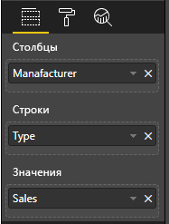

# <a name="add-interactivity-into-visual-by-power-bi-visuals-selections"></a>Добавление интерактивности в визуальные элементы путем выбора визуальных элементов Power BI

Power BI предоставляет два способа взаимодействия между визуальными элементами — выбор и фильтрация. В примере ниже показано, как выбрать любые элементы в одном визуальном элементе и уведомлять другие визуальные элементы отчета о новом состоянии выбора.

Объект `Selection` соответствует интерфейсу:

```typescript
export interface ISelectionId {
    equals(other: ISelectionId): boolean;
    includes(other: ISelectionId, ignoreHighlight?: boolean): boolean;
    getKey(): string;
    getSelector(): Selector;
    getSelectorsByColumn(): SelectorsByColumn;
    hasIdentity(): boolean;
}
```

## <a name="how-to-use-selectionmanager-to-select-data-points"></a>Использование SelectionManager для выбора точек данных

Узловой объект визуального элемента предоставляет метод для создания экземпляра диспетчера выбора. Диспетчер выбора отвечает за выбор, отмену выбора, отображение контекстного меню, сохранение текущего выбора и проверку состояния выбора. Диспетчер выбора также содержит соответствующие методы для этих действий.

### <a name="create-an-instance-of-the-selection-manager"></a>Создание экземпляра диспетчера выбора

Для использования диспетчера выбора необходимо создать его экземпляр. Обычно визуальные элементы создают экземпляр диспетчера выбора в `constructor` объекта визуального элемента.

```typescript
export class Visual implements IVisual {
    private target: HTMLElement;
    private host: IVisualHost;
    private selectionManager: ISelectionManager;
    // ...
    constructor(options: VisualConstructorOptions) {
        this.host = options.host;
        // ...
        this.selectionManager = this.host.createSelectionManager();
    }
    // ...
}
```

### <a name="create-an-instance-of-the-selection-builder"></a>Создание экземпляра конструктора выбора

При создании экземпляра диспетчера выбора необходимо создать `selections` для каждой точки данных визуального элемента. Узловой объект визуального элемента предоставляет метод `createSelectionIdBuilder` для создания выбора для каждой точки данных. Этот метод возвращает экземпляр объекта с интерфейсом `powerbi.visuals.ISelectionIdBuilder`:

```typescript
export interface ISelectionIdBuilder {
    withCategory(categoryColumn: DataViewCategoryColumn, index: number): this;
    withSeries(seriesColumn: DataViewValueColumns, valueColumn: DataViewValueColumn | DataViewValueColumnGroup): this;
    withMeasure(measureId: string): this;
    withMatrixNode(matrixNode: DataViewMatrixNode, levels: DataViewHierarchyLevel[]): this;
    withTable(table: DataViewTable, rowIndex: number): this;
    createSelectionId(): ISelectionId;
}
```

Этот объект содержит соответствующие методы для создания `selections` для различных типов сопоставлений представлений данных.

> [!NOTE]
> Методы `withTable` и `withMatrixNode` появились в API 2.5.0 визуальных элементов Power BI.
> Если необходимо использовать выделения для сопоставления табличных или матричных представлений данных, следует обновить API до версии 2.5.0 или более поздней.

### <a name="create-selections-for-categorical-data-view-mapping"></a>Создание выбора для сопоставления представления данных о категориях

Давайте посмотрим, как выбор представлен в сопоставлении представления категориальных данных для образца набора данных:

| Изготовитель | Тип | Значение |
| - | - | - |
| Chrysler | Отечественные автомобили | 28883 |
| Chrysler | Отечественные грузовики | 117131 |
| Chrysler | Импортные автомобили | 0 |
| Chrysler | Импортные грузовики | 6362 |
| Ford | Отечественные автомобили | 50032 |
| Ford | Отечественные грузовики | 122446 |
| Ford | Импортные автомобили | 0 |
| Ford | Импортные грузовики | 0 |
| GM | Отечественные автомобили | 65426 |
| GM | Отечественные грузовики | 138122 |
| GM | Импортные автомобили | 197 |
| GM | Импортные грузовики | 0 |
| Honda | Отечественные автомобили | 51450 |
| Honda | Отечественные грузовики | 46115 |
| Honda | Импортные автомобили | 2932 |
| Honda | Импортные грузовики | 0 |
| Nissan | Отечественные автомобили | 51476 |
| Nissan | Отечественные грузовики | 47343 |
| Nissan | Импортные автомобили | 5485 |
| Nissan | Импортные грузовики | 1430 |
| Toyota | Отечественные автомобили | 55643 |
| Toyota | Отечественные грузовики | 61227 |
| Toyota | Импортные автомобили | 20799 |
| Toyota | Импортные грузовики | 23614 |

Визуальный элемент использует следующее сопоставление представления данных:

```json
{
    "dataRoles": [
        {
            "displayName": "Columns",
            "name": "columns",
            "kind": "Grouping"
        },
        {
            "displayName": "Rows",
            "name": "rows",
            "kind": "Grouping"
        },
        {
            "displayName": "Values",
            "name": "values",
            "kind": "Measure"
        }
    ],
    "dataViewMappings": [
        {
            "categorical": {
                "categories": {
                    "for": {
                        "in": "columns"
                    }
                },
                "values": {
                    "group": {
                        "by": "rows",
                        "select": [
                            {
                                "for": {
                                    "in": "values"
                                }
                            }
                        ]
                    }
                }
            }
        }
    ]
}
```

В этом примере `Manufacturer` — это `columns`, а `Type` — `rows`. Ряд создается путем группировки значений по `rows` (`Type`).

При этом визуальный элемент должен делить данные по `Manufacturer` и `Type`.

Например, если пользователь выбирает `Chrysler` с помощью `Manufacturer`, другие визуальные элементы должны показывать следующие данные:

| Изготовитель | Тип | Значение |
| - | - | - |
| **Chrysler** | Отечественные автомобили | 28883 |
| **Chrysler** | Отечественные грузовики | 117131 |
| **Chrysler** | Импортные автомобили | 0 |
| **Chrysler** | Импортные грузовики | 6362 |

Если пользователь выбирает `Import Car` по `Type` (выбирает данные по рядам), другие визуальные элементы должны показывать следующие данные:

| Изготовитель | Тип | Значение |
| - | - | - |
| Chrysler | **Импортные автомобили** | 0 |
| Ford | **Импортные автомобили** | 0 |
| GM | **Импортные автомобили** | 197 |
| Honda | **Импортные автомобили** | 2932 |
| Nissan | **Импортные автомобили** | 5485 |
| Toyota | **Импортные автомобили** | 20799 |


Корзины данных визуального элемента необходимо заполнить.



`Manufacturer` — это категория (столбцы), `Type` — это ряд (строки), а `Value` — это `Values` для ряда.

> [!NOTE]
> Значения `Values` требуются для ряда, так как, в соответствии с сопоставлением представления данных, визуальный элемент ожидает, что `Values` будет сгруппирован по данным `Rows`.

#### <a name="create-selections-for-categories"></a>Создание выделенных элементов для категорий

```typescript
// categories
const categories = dataView.categorical.categories;

// create label for 'Manufacturer' column
const p = document.createElement("p") as HTMLParagraphElement;
p.innerText = categories[0].source.displayName.toString();
this.target.appendChild(p);

// get count of category elements
const categoriesCount = categories[0].values.length;

// iterate all categories to generate selection and create button elements to use selections
for (let categoryIndex = 0; categoryIndex < categoriesCount; categoryIndex++) {
    const categoryValue: powerbi.PrimitiveValue = categories[0].values[categoryIndex];

    const categorySelectionId = this.host.createSelectionIdBuilder()
        .withCategory(categories[0], categoryIndex) // we have only one category (only one `Manufacturer` column)
        .createSelectionId();
    this.dataPoints.push({
        value: categoryValue,
        selection: categorySelectionId
    });
    console.log(categorySelectionId);

    // create button element to apply selection on click
    const button = document.createElement("button") as HTMLButtonElement;
    button.value = categoryValue.toString();
    button.innerText = categoryValue.toString();
    button.addEventListener("click", () => {
        // handle click event to apply correspond selection
        this.selectionManager.select(categorySelectionId);
    });
    this.target.appendChild(button);
}
```

В примере кода можно увидеть, что мы перебираем все категории. В каждой итерации мы вызываем `createSelectionIdBuilder`, чтобы создать следующий элемент выбора для каждой категории, вызвав метод `withCategory` конструктора выбора. Метод `createSelectionId` используется в качестве завершающего метода для возврата созданного объекта `selection`.

В методе `withCategory` передается столбец `category`. В этом примере это `Manufacturer` и индекс элемента категории.

#### <a name="create-selections-for-series"></a>Создание элементов выбора для ряда

```typescript
// get groupped values for series
const series: powerbi.DataViewValueColumnGroup[] = dataView.categorical.values.grouped();

// create label for 'Type' column
const p2 = document.createElement("p") as HTMLParagraphElement;
p2.innerText = dataView.categorical.values.source.displayName;
this.target.appendChild(p2);

// iterate all series to generate selection and create button elements to use selections
series.forEach( (ser: powerbi.DataViewValueColumnGroup) => {
    // create selection id for series
    const seriesSelectionId = this.host.createSelectionIdBuilder()
        .withSeries(dataView.categorical.values, ser)
        .createSelectionId();

    this.dataPoints.push({
        value: ser.name,
        selection: seriesSelectionId
    });

    // create button element to apply selection on click
    const button = document.createElement("button") as HTMLButtonElement;
    button.value =ser.name.toString();
    button.innerText = ser.name.toString();
    button.addEventListener("click", () => {
        // handle click event to apply correspond selection
        this.selectionManager.select(seriesSelectionId);
    });
    this.target.appendChild(button);
});
```

### <a name="create-selections-for-table-data-view-mapping"></a>Создание элементов выбора для сопоставления представления табличных данных

Пример сопоставления представлений табличных данных

```json
{
    "dataRoles": [
        {
            "displayName": "Values",
            "name": "values",
            "kind": "GroupingOrMeasure"
        }
    ],
    "dataViewMappings": [
        {
            "table": {
                "rows": {
                    "for": {
                        "in": "values"
                    }
                }
            }
        }
    ]
}
```

Чтобы создать элемент выбора для каждой строки сопоставления представления табличных данных, необходимо вызвать метод `withTable` конструктора выбора.

```typescript
public update(options: VisualUpdateOptions) {
    const dataView = options.dataViews[0];
    dataView.table.rows.forEach((row: DataViewTableRow, rowIndex: number) => {
        this.target.appendChild(rowDiv);
        const selection: ISelectionId = this.host.createSelectionIdBuilder()
            .withTable(dataView.table, rowIndex)
            .createSelectionId();
    }
}
```

Код визуального элемента выполняет перебор строк таблицы, и каждая строка вызывает метод `withTable` таблицы. Параметры метода `withTable` — это объект `table` и индекс строки таблицы.

### <a name="create-selections-for-matrix-data-view-mapping"></a>Создание элементов выбора для сопоставления представления матричных данных

```typescript
public update(options: VisualUpdateOptions) {
    const host = this.host;
    const rowLevels: powerbi.DataViewHierarchyLevel[] = dataView.matrix.rows.levels;
    const columnLevels: powerbi.DataViewHierarchyLevel[] = dataView.matrix.rows.levels;

    // iterate rows hierarchy
    nodeWalker(dataView.matrix.rows.root, rowLevels);
    // iterate columns hierarchy
    nodeWalker(dataView.matrix.columns.root, columnLevels);

    function nodeWalker(node: powerbi.DataViewMatrixNode, levels: powerbi.DataViewHierarchyLevel[]) {
        const nodeSelection = host.createSelectionIdBuilder().withMatrixNode(node, levels);

        if (node.children && node.children.length) {
            node.children.forEach(child => {
                nodeWalker(child, levels);
            });
        }
    }
}
```

В этом примере `nodeWalker` рекурсивно вызывается для каждого узла и дочерних узлов.

`nodeWalker` создает объект `nodeSelection` при каждом вызове. Каждый `nodeSelection` представляет `selection` соответствующих узлов.

## <a name="select-datapoints-to-slice-other-visuals"></a>Выбор точек данных для сегментации других визуальных элементов

В образцах кода для сопоставления представления категориальных данных вы видели, что мы создали обработчик щелчков мышью для элементов button. Обработчик вызывает метод `select` диспетчера выбора и передает объект выбора.

```typescript
button.addEventListener("click", () => {
    // handle click event to apply correspond selection
    this.selectionManager.select(categorySelectionId);
});
```

Интерфейс метода `select`

```typescript
interface ISelectionManager {
    // ...
    select(selectionId: ISelectionId | ISelectionId[], multiSelect?: boolean): IPromise<ISelectionId[]>;
    // ...
}
```

Как видите, `select` может принимать массив элементов выбора. Это означает, что визуальный элемент может выбрать несколько точек данных. Второй параметр `multiSelect` отвечает за множественный выбор. Если значение равно true, Power BI не очищает предыдущее состояние выбора и применяет текущий выбор. В противном случае предыдущий выбор сбрасывается.

Типичный сценарий использования `multiSelect` предполагает обработку состояния нажатия клавиши CTRL в событии щелчка мышью.

```typescript
button.addEventListener("click", (mouseEvent) => {
    const multiSelect = (mouseEvent as MouseEvent).ctrlKey;
    this.selectionManager.select(seriesSelectionId, multiSelect);
});
```

## <a name="next-steps"></a>Дальнейшие действия

* [Как использовать выбор для привязки свойств визуальных элементов к точкам данных](objects-properties.md#objects-selector)

* [Как управлять элементами выбора при переключении закладок](bookmarks-support.md#visuals-with-selection)

* [Сведения о добавлении контекстного меню для точек данных визуальных элементов](context-menu.md)

* [Как использовать InteractivityUtils для добавления элементов выбора в визуальные элементы Power BI](utils-interactivity-selections.md)
