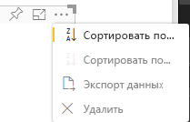

# <a name="sorting-options-for-power-bi-visuals"></a>Параметры сортировки для визуальных элементов Power BI

В этой статье описывается, каким образом можно настроить поведение сортировки для визуальных элементов в Power BI с помощью *параметров сортировки*. 

Функция сортировки использует один из следующих параметров.

## <a name="default-sorting"></a>Сортировка по умолчанию

Параметр `default` является простейшей формой. Он позволяет сортировать данные, представленные в разделе "DataMappings". Этот параметр обеспечивает сортировку сопоставлений данных пользователем и позволяет задать ее направление.

```json
    "sorting": {
        "default": {   }
    }
```



## <a name="implicit-sorting"></a>Неявная сортировка

Неявная сортировка использует параметр массива `clauses`, который описывает сортировку для каждой роли данных. `implicit` означает, что пользователь визуального элемента не может изменить порядок сортировки. Power BI не отображает параметры сортировки в меню визуального элемента. Однако Power BI сортирует данные в соответствии с указанными параметрами.

Параметры `clauses` могут содержать несколько объектов с двумя параметрами:

- `role` — определяет `DataMapping` для сортировки
- `direction` — определяет направление сортировки (1 — по возрастанию, 2 — по убыванию)

```json
    "sorting": {
        "implicit": {
            "clauses": [
                {
                    "role": "category",
                    "direction": 1
                },
                {
                    "role": "measure",
                    "direction": 2
                }
            ]
        }
    }
```

## <a name="custom-sorting"></a>Пользовательская сортировка

Пользовательская сортировка управляется разработчиком в коде визуального элемента.
