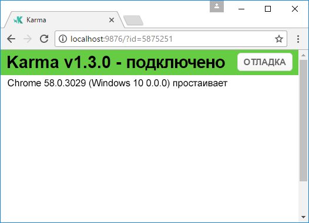
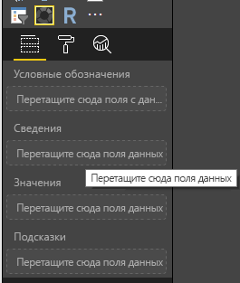
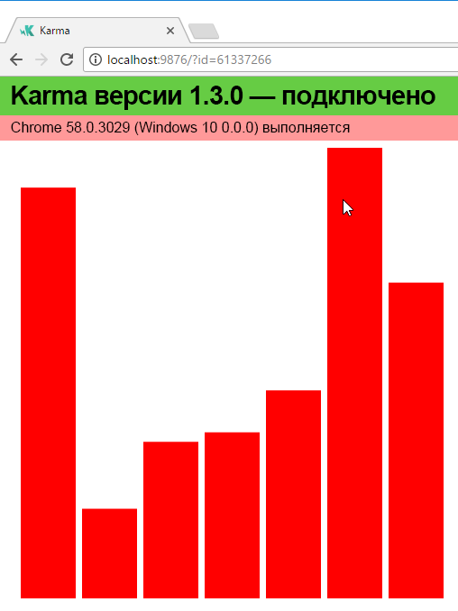
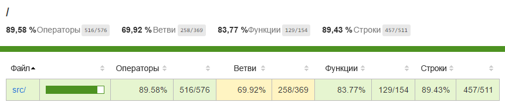
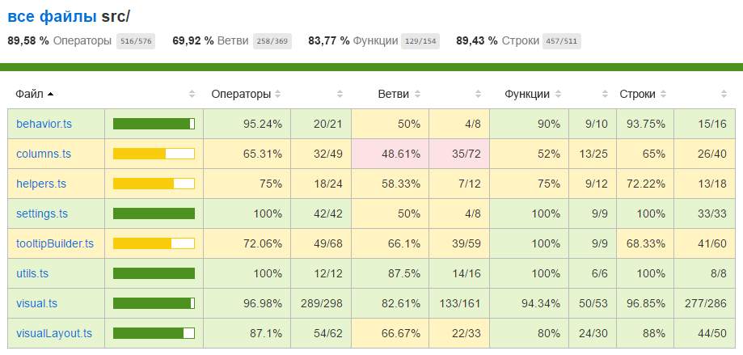

# <a name="tutorial-add-unit-tests-for-power-bi-visual-projects"></a>Руководство. Добавление модульных тестов для проектов визуальных элементов Power BI

В этой статье рассматриваются основы написания модульных тестов для визуальных элементов Power BI, в том числе следующие сведения:

* Настройка платформы тестирования JavaScript Karma — Jasmine.
* Использование пакета powerbi-visuals-utils-testutils.
* Применение макетов и заполнителей для упрощения модульного тестирования визуальных элементов Power BI.

## <a name="prerequisites"></a>Предварительные требования

* Установленный проект визуальных элементов Power BI
* Настроенная среда Node.js

## <a name="install-and-configure-the-karma-javascript-test-runner-and-jasmine"></a>Установленные и настроенные средство выполнения тестов JavaScript Karma и платформа Jasmine

Добавьте необходимые библиотеки в файл *package.json* в разделе `devDependencies`:

```json
"@babel/polyfill": "^7.2.5",
"@types/d3": "5.5.0",
"@types/jasmine": "2.5.37",
"@types/jasmine-jquery": "1.5.28",
"@types/jquery": "2.0.41",
"@types/karma": "3.0.0",
"@types/lodash-es": "4.17.1",
"coveralls": "3.0.2",
"istanbul-instrumenter-loader": "^3.0.1",
"jasmine": "2.5.2",
"jasmine-core": "2.5.2",
"jasmine-jquery": "2.1.1",
"jquery": "3.1.1",
"karma": "3.1.1",
"karma-chrome-launcher": "2.2.0",
"karma-coverage": "1.1.2",
"karma-coverage-istanbul-reporter": "^2.0.4",
"karma-jasmine": "2.0.1",
"karma-junit-reporter": "^1.2.0",
"karma-sourcemap-loader": "^0.3.7",
"karma-typescript": "^3.0.13",
"karma-typescript-preprocessor": "0.4.0",
"karma-webpack": "3.0.5",
"puppeteer": "1.17.0",
"style-loader": "0.23.1",
"ts-loader": "5.3.0",
"ts-node": "7.0.1",
"tslint": "^5.12.0",
"webpack": "4.26.0"
```

Чтобы узнать больше о пакете *package.json*, ознакомьтесь с описанием на странице [npm-package.json](https://docs.npmjs.com/files/package.json).

Сохраните файл *package.json*, а затем выполните следующую команду в расположении `package.json`:

```cmd
npm install
```

Диспетчер пакетов устанавливает все новые пакеты, которые добавляются в файл *package.json*.

Чтобы выполнить модульные тесты, настройте средство выполнения тестов и конфигурацию `webpack`.

В следующем коде показан пример файла *test.webpack.config.js*:

```typescript
const path = require('path');
const webpack = require("webpack");

module.exports = {
    devtool: 'source-map',
    mode: 'development',
    optimization : {
        concatenateModules: false,
        minimize: false
    },
    module: {
        rules: [
            {
                test: /\.tsx?$/,
                use: 'ts-loader',
                exclude: /node_modules/
            },
            {
                test: /\.json$/,
                loader: 'json-loader'
            },
            {
                test: /\.tsx?$/i,
                enforce: 'post',
                include: /(src)/,
                exclude: /(node_modules|resources\/js\/vendor)/,
                loader: 'istanbul-instrumenter-loader',
                options: { esModules: true }
            },
            {
                test: /\.less$/,
                use: [
                    {
                        loader: 'style-loader'
                    },
                    {
                        loader: 'css-loader'
                    },
                    {
                        loader: 'less-loader',
                        options: {
                            paths: [path.resolve(__dirname, 'node_modules')]
                        }
                    }
                ]
            }
        ]
    },
    externals: {
        "powerbi-visuals-api": '{}'
    },
    resolve: {
        extensions: ['.tsx', '.ts', '.js', '.css']
    },
    output: {
        path: path.resolve(__dirname, ".tmp/test")
    },
    plugins: [
        new webpack.ProvidePlugin({
            'powerbi-visuals-api': null
        })
    ]
};
```

В следующем коде показан пример файла *karma.conf.ts*:

```typescript
"use strict";

const webpackConfig = require("./test.webpack.config.js");
const tsconfig = require("./test.tsconfig.json");
const path = require("path");

const testRecursivePath = "test/visualTest.ts";
const srcOriginalRecursivePath = "src/**/*.ts";
const coverageFolder = "coverage";

process.env.CHROME_BIN = require("puppeteer").executablePath();

import { Config, ConfigOptions } from "karma";

module.exports = (config: Config) => {
    config.set(<ConfigOptions>{
        mode: "development",
        browserNoActivityTimeout: 100000,
        browsers: ["ChromeHeadless"], // or Chrome to use locally installed Chrome browser
        colors: true,
        frameworks: ["jasmine"],
        reporters: [
            "progress",
            "junit",
            "coverage-istanbul"
        ],
        junitReporter: {
            outputDir: path.join(__dirname, coverageFolder),
            outputFile: "TESTS-report.xml",
            useBrowserName: false
        },
        singleRun: true,
        plugins: [
            "karma-coverage",
            "karma-typescript",
            "karma-webpack",
            "karma-jasmine",
            "karma-sourcemap-loader",
            "karma-chrome-launcher",
            "karma-junit-reporter",
            "karma-coverage-istanbul-reporter"
        ],
        files: [
            "node_modules/jquery/dist/jquery.min.js",
            "node_modules/jasmine-jquery/lib/jasmine-jquery.js",
            {
                pattern: './capabilities.json',
                watched: false,
                served: true,
                included: false
            },
            testRecursivePath,
            {
                pattern: srcOriginalRecursivePath,
                included: false,
                served: true
            }
        ],
        preprocessors: {
            [testRecursivePath]: ["webpack", "coverage"]
        },
        typescriptPreprocessor: {
            options: tsconfig.compilerOptions
        },
        coverageIstanbulReporter: {
            reports: ["html", "lcovonly", "text-summary", "cobertura"],
            dir: path.join(__dirname, coverageFolder),
            'report-config': {
                html: {
                    subdir: 'html-report'
                }
            },
            combineBrowserReports: true,
            fixWebpackSourcePaths: true,
            verbose: false
        },
        coverageReporter: {
            dir: path.join(__dirname, coverageFolder),
            reporters: [
                // reporters not supporting the `file` property
                { type: 'html', subdir: 'html-report' },
                { type: 'lcov', subdir: 'lcov' },
                // reporters supporting the `file` property, use `subdir` to directly
                // output them in the `dir` directory
                { type: 'cobertura', subdir: '.', file: 'cobertura-coverage.xml' },
                { type: 'lcovonly', subdir: '.', file: 'report-lcovonly.txt' },
                { type: 'text-summary', subdir: '.', file: 'text-summary.txt' },
            ]
        },
        mime: {
            "text/x-typescript": ["ts", "tsx"]
        },
        webpack: webpackConfig,
        webpackMiddleware: {
            stats: "errors-only"
        }
    });
};
```

При необходимости эту конфигурацию можно изменить.

Код в файле *karma.conf.js* содержит следующую переменную:

* `recursivePathToTests` — местоположение кода теста.

* `srcRecursivePath` — местоположение выходного кода JavaScript после компиляции.

* `srcCssRecursivePath` — местоположение выходной CSS после компиляции файла less с использованием стилей.

* `srcOriginalRecursivePath` — местоположение исходного кода визуального элемента.

* `coverageFolder` — местоположение создаваемого отчета об объеме протестированного кода.

Файл конфигурации содержит следующие свойства:

* `singleRun: true` — тесты выполняются в системе непрерывной интеграции или однократно. Для отладки тестов можно изменить значение этого параметра на *false*. Средство Karma поддерживает браузер в рабочем состоянии, чтобы вы могли использовать консоль для отладки.

* `files: [...]` — в этом массиве можно указать файлы для загрузки в браузер. Обычно используются исходные файлы, тестовые случаи, библиотеки (Jasmine, тестовые служебные программы). При необходимости в список можно добавить дополнительные файлы.

* `preprocessors` — в этом разделе вы настраиваете действия, которые выполняются перед запуском модульных тестов. С их помощью осуществляется предварительная компиляция TypeScript в JavaScript и подготовка сопоставителей с исходным кодом, а также создание отчета об объеме протестированного кода. При отладке тестов `coverage` можно отключить. Объем протестированного кода создает дополнительный код для кода проверки на предмет объема протестированного кода, что усложнит отладку тестов.

Описание всех конфигураций Karma можно найти на странице с [файлом конфигурации Karma](https://karma-runner.github.io/1.0/config/configuration-file.html).

Для удобства можно добавить тестовую команду в `scripts`:

```json
{
    "scripts": {
        "pbiviz": "pbiviz",
        "start": "pbiviz start",
        "typings":"node node_modules/typings/dist/bin.js i",
        "lint": "tslint -r \"node_modules/tslint-microsoft-contrib\"  \"+(src|test)/**/*.ts\"",
        "pretest": "pbiviz package --resources --no-minify --no-pbiviz --no-plugin",
        "test": "karma start"
    }
    ...
}
```

Итак, вы готовы к тому, чтобы начать писать модульные тесты.

## <a name="check-the-dom-element-of-the-visual"></a>Проверка элемента DOM визуального элемента

Для тестирования визуального элемента сначала нужно создать его экземпляр.

### <a name="create-a-visual-instance-builder"></a>Создание конструктора экземпляров визуальных элементов

Добавьте файл *visualBuilder.ts* в папку *test* с помощью следующего кода:

```typescript
import {
    VisualBuilderBase
} from "powerbi-visuals-utils-testutils";

import {
    BarChart as VisualClass
} from "../src/visual";

import  powerbi from "powerbi-visuals-api";
import VisualConstructorOptions = powerbi.extensibility.visual.VisualConstructorOptions;

export class BarChartBuilder extends VisualBuilderBase<VisualClass> {
    constructor(width: number, height: number) {
        super(width, height);
    }

    protected build(options: VisualConstructorOptions) {
        return new VisualClass(options);
    }

    public get mainElement() {
        return this.element.children("svg.barChart");
    }
}
```

Имеется метод `build` для создания экземпляра визуального элемента. `mainElement` является методом Get, который возвращает экземпляр "корневого" элемента объектной модели документа (DOM) в визуальном элементе. Этот метод получения необязателен, но он упрощает написание модульного теста.

Итак, вы создали экземпляр своего визуального элемента. Давайте напишем тестовый случай. Этот тестовый случай проверяет элементы SVG, которые создаются при отображении вашего визуального элемента.

### <a name="create-a-typescript-file-to-write-test-cases"></a>Создание файла TypeScript для записи тестовых случаев

Добавьте файл *visualTest.ts* для тестовых случаев с помощью следующего кода:

```typescript
import powerbi from "powerbi-visuals-api";

import { BarChartBuilder } from "./VisualBuilder";

import {
    BarChart as VisualClass
} from "../src/visual";

import VisualBuilder = powerbi.extensibility.visual.test.BarChartBuilder;

describe("BarChart", () => {
    let visualBuilder: VisualBuilder;
    let dataView: DataView;

    beforeEach(() => {
        visualBuilder = new VisualBuilder(500, 500);
    });

    it("root DOM element is created", () => {
        expect(visualBuilder.mainElement).toBeInDOM();
    });
});
```

Вызывается несколько методов:

* [`describe`](https://jasmine.github.io/api/2.6/global.html#describe) — описывает тестовый случай. В контексте платформы Jasmine он часто описывает набор или группу спецификаций.

* `beforeEach` — вызывается перед каждым вызовом метода `it`, который определяется в методе [`describe`](https://jasmine.github.io/api/2.6/global.html#beforeEach).

* [`it`](https://jasmine.github.io/api/2.6/global.html#it) — определяет отдельную спецификацию. метод `it` должен содержать одно или несколько ожиданий `expectations`.

* [`expect`](https://jasmine.github.io/api/2.6/global.html#expect) — создает ожидание для спецификации. Спецификация будет успешной, если все ожидания выполняются без каких-либо ошибок.

* `toBeInDOM` — это один из методов *сопоставителей*. Дополнительные сведения о сопоставителях см. в статье [Пространство имен Jasmine Namespace: сопоставители](https://jasmine.github.io/api/2.6/matchers.html).

Дополнительные сведения о платформе Jasmine см. на странице с [документацией по платформе Jasmine](https://jasmine.github.io/).

### <a name="launch-unit-tests"></a>Запуск модульных тестов

Этот тест проверяет, создан ли корневой элемент SVG визуальных элементов. Чтобы запустить модульный тест, введите следующую команду в программе командной строки:

```cmd
npm run test
```

`karma.js` запускает тестовый случай в браузере Chrome.



> [!NOTE]
> Вам потребуется локальная установка браузера Google Chrome.

В окне командной строки вы получите следующие выходные данные:

```cmd
> karma start

23 05 2017 12:24:26.842:WARN [watcher]: Pattern "E:/WORKSPACE/PowerBI/PowerBI-visuals-sampleBarChart/data/*.csv" does not match any file.
23 05 2017 12:24:30.836:WARN [karma]: No captured browser, open http://localhost:9876/
23 05 2017 12:24:30.849:INFO [karma]: Karma v1.3.0 server started at http://localhost:9876/
23 05 2017 12:24:30.850:INFO [launcher]: Launching browser Chrome with unlimited concurrency
23 05 2017 12:24:31.059:INFO [launcher]: Starting browser Chrome
23 05 2017 12:24:33.160:INFO [Chrome 58.0.3029 (Windows 10 0.0.0)]: Connected on socket /#2meR6hjXFmsE_fjiAAAA with id 5875251
Chrome 58.0.3029 (Windows 10 0.0.0): Executed 1 of 1 SUCCESS (0.194 secs / 0.011 secs)

=============================== Coverage summary ===============================
Statements   : 27.43% ( 65/237 )
Branches     : 19.84% ( 25/126 )
Functions    : 43.86% ( 25/57 )
Lines        : 20.85% ( 44/211 )
================================================================================
```

### <a name="how-to-add-static-data-for-unit-tests"></a>Добавление статических данных для модульных тестов

Создайте файл *visualData.ts* в папке *test* с помощью следующего кода:

```typescript
import powerbi from "powerbi-visuals-api";
import DataView = powerbi.DataView;

import {
    testDataViewBuilder,
    getRandomNumbers
} from "powerbi-visuals-utils-testutils";

export class SampleBarChartDataBuilder extends TestDataViewBuilder {
    public static CategoryColumn: string = "category";
    public static MeasureColumn: string = "measure";

    public constructor() {
        super();
        ...
    }

    public getDataView(columnNames?: string[]): DataView {
        let dateView: any = this.createCategoricalDataViewBuilder([
            ...
        ],
        [
            ...
        ], columnNames).build();

        // there's client side computed maxValue
        let maxLocal = 0;
        this.valuesMeasure.forEach((item) => {
                if (item > maxLocal) {
                    maxLocal = item;
                }
        });
        (<any>dataView).categorical.values[0].maxLocal = maxLocal;
    }
}
```

Класс `SampleBarChartDataBuilder` расширяет `TestDataViewBuilder` и реализует абстрактный метод `getDataView`.

При помещении данных в контейнеры полей данных Power BI создает категориальный объект `dataview` на основе данных.



В модульных тестах у вас нет основных функций Power BI для воспроизведения данных. Однако вам нужно сопоставить статические данные с категориальным `dataview`. Класс `TestDataViewBuilder` можно использовать для его сопоставления.

Дополнительные сведения о сопоставлении представлений данных см. в статье [Сопоставления представлений данных](https://github.com/Microsoft/PowerBI-visuals/blob/master/Capabilities/DataViewMappings.md).

В методе `getDataView` вы вызываете метод `createCategoricalDataViewBuilder` с данными.

В файле [capabilities.json](https://github.com/Microsoft/PowerBI-visuals-sampleBarChart/blob/master/capabilities.json#L2) визуального элемента `sampleBarChart` присутствуют объекты dataRoles и dataViewMapping:

```json
"dataRoles": [
    {
        "displayName": "Category Data",
        "name": "category",
        "kind": "Grouping"
    },
    {
        "displayName": "Measure Data",
        "name": "measure",
        "kind": "Measure"
    }
],
"dataViewMappings": [
    {
        "conditions": [
            {
                "category": {
                    "max": 1
                },
                "measure": {
                    "max": 1
                }
            }
        ],
        "categorical": {
            "categories": {
                "for": {
                    "in": "category"
                }
            },
            "values": {
                "select": [
                    {
                        "bind": {
                            "to": "measure"
                        }
                    }
                ]
            }
        }
    }
],
```

Чтобы создать такое же сопоставление, нужно присвоить методу `createCategoricalDataViewBuilder` следующие параметры:

```typescript
([
    {
        source: {
            displayName: "Category",
            queryName: SampleBarChartData.ColumnCategory,
            type: ValueType.fromDescriptor({ text: true }),
            roles: {
                Category: true
            },
        },
        values: this.valuesCategory
    }
],
[
    {
        source: {
            displayName: "Measure",
            isMeasure: true,
            queryName: SampleBarChartData.MeasureColumn,
            type: ValueType.fromDescriptor({ numeric: true }),
            roles: {
                Measure: true
            },
        },
        values: this.valuesMeasure
    },
], columnNames)
```

Здесь `this.valuesCategory` — это массив категорий:

```ts
public valuesCategory: string[] = ["Monday", "Tuesday", "Wednesday", "Thursday", "Friday", "Saturday", "Sunday"];
```

`this.valuesMeasure` — массив мер для каждой категории:

```ts
public valuesMeasure: number[] = [742731.43, 162066.43, 283085.78, 300263.49, 376074.57, 814724.34, 570921.34];
```

Теперь можно использовать класс `SampleBarChartDataBuilder` в модульном тесте.

Класс `ValueType` определен в пакете powerbi-visuals-utils-testutils. Для метода `createCategoricalDataViewBuilder` требуется библиотека `lodash`.

Добавьте эти пакеты в зависимости.

В `package.json` в разделе `devDependencies`:

```json
"lodash-es": "4.17.1",
"powerbi-visuals-utils-testutils": "2.2.0"
```

Вызовите

```cmd
npm install
```

для установки библиотеки `lodash-es`.

Теперь можно запустить модульный тест еще раз. Вы должны получить следующие выходные данные:

```cmd
> karma start

23 05 2017 16:19:54.318:WARN [watcher]: Pattern "E:/WORKSPACE/PowerBI/PowerBI-visuals-sampleBarChart/data/*.csv" does not match any file.
23 05 2017 16:19:58.333:WARN [karma]: No captured browser, open http://localhost:9876/
23 05 2017 16:19:58.346:INFO [karma]: Karma v1.3.0 server started at http://localhost:9876/
23 05 2017 16:19:58.346:INFO [launcher]: Launching browser Chrome with unlimited concurrency
23 05 2017 16:19:58.394:INFO [launcher]: Starting browser Chrome
23 05 2017 16:19:59.873:INFO [Chrome 58.0.3029 (Windows 10 0.0.0)]: Connected on socket /#NcNTAGH9hWfGMCuEAAAA with id 3551106
Chrome 58.0.3029 (Windows 10 0.0.0): Executed 1 of 1 SUCCESS (1.266 secs / 1.052 secs)

=============================== Coverage summary ===============================
Statements   : 56.72% ( 135/238 )
Branches     : 32.54% ( 41/126 )
Functions    : 66.67% ( 38/57 )
Lines        : 52.83% ( 112/212 )
================================================================================
```

Визуальный элемент откроется в браузере Chrome, как показано ниже:



В сводке показано, что объем протестированного кода увеличился. Откройте `coverage\index.html`, чтобы узнать больше о текущем объеме протестированного кода.



Также можно просмотреть область папки `src`:



В области действия файла можно просмотреть исходный код. Служебные программы `Coverage` будут выделять красным цветом те строки кода, которые не были выполнены во время модульного тестирования.


> [!IMPORTANT]
> Объем протестированного кода не означает, что обеспечивается хороший охват функциональных возможностей визуальных элементов. Один простой модульный тест обеспечил более 96 % протестированного кода в `src\visual.ts`.

## <a name="next-steps"></a>Дальнейшие действия

Когда ваш визуальный элемент готов, вы можете отправить его для публикации. Дополнительные сведения см. в статье о [публикации визуальных элементов Power BI в AppSource](../office-store.md).
