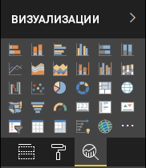

# <a name="power-bi-visual-project-structure"></a>Структура проекта визуального элемента Power BI

Лучший способ начать создание нового визуального элемента Power BI — использовать средство визуальных элементов Power BI [pbiviz](https://www.npmjs.com/package/powerbi-visuals-tools).

Чтобы создать новый визуальный элемент, перейдите в каталог, в котором должен располагаться визуальный элемент Power BI, и выполните команду:

`pbiviz new <visual project name>`

При выполнении этой команды создается папка визуальных элементов Power BI, которая содержит следующие файлы:

```markdown
project
├───.vscode
│   ├───launch.json
│   └───settings.json
├───assets
│   └───icon.png
├───node_modules
├───src
│   ├───settings.ts
│   └───visual.ts
├───style
│   └───visual.less
├───capabilities.json
├───package-lock.json
├───package.json
├───pbiviz.json
├───tsconfig.json
└───tslint.json
```

## <a name="folder-and-file-description"></a>Описание папки и файла

В этом разделе содержатся сведения о каждой папке и файле в каталоге, который создает средство визуальных элементов Power BI **pbiciz**.  

### <a name="vscode"></a>.vscode

Эта папка содержит параметры проекта VS Code.

Чтобы настроить рабочую область, измените файл `.vscode/settings.json`.

Дополнительные сведения см. в разделе [User and Workspace Settings](https://code.visualstudio.com/docs/getstarted/settings) (Параметры пользователя и рабочей области)

### <a name="assets"></a>ресурсы

Эта папка содержит файл `icon.png`.

Средство визуальных элементов Power BI использует этот файл в качестве значка нового визуального элемента Power BI на панели визуализации Power BI.

<!---  --->

### <a name="src"></a>src

Эта папка содержит исходный код визуального элемента.

В этой папке средство визуальных элементов Power BI создает следующие файлы:
* `visual.ts` — основной исходный код визуального элемента;
* `settings.ts` — код параметров визуального элемента. Классы в файле предоставляют интерфейс для определения [свойств визуального элемента](./objects-properties.md#properties).

### <a name="style"></a>Стиль

Эта папка содержит файл `visual.less`, в котором содержатся стили визуального элемента.

### <a name="capabilitiesjson"></a>capabilities.json

Этот файл содержит основные свойства и параметры (или [возможности](./capabilities.md)) визуального элемента. Он позволяет объявлять поддерживаемые функции, объекты, свойства и [сопоставление представлений данных](./dataview-mappings.md) для визуального элемента.

### <a name="package-lockjson"></a>package-lock.json

Этот файл создается автоматически для любой операции, где *npm* изменяет либо дерево `node_modules`, либо файл `package.json`.

Дополнительные сведения об этом файле см. в официальной документации [npm-package-lock.json](https://docs.npmjs.com/files/package-lock.json).

### <a name="packagejson"></a>package.json

Этот файл описывает пакет проекта. Он содержит сведения о проекте, его авторах, описание и зависимости проекта.

Дополнительные сведения об этом файле см. в официальной документации [npm-package.json](https://docs.npmjs.com/files/package.json.html).

### <a name="pbivizjson"></a>pbiviz.json

Этот файл содержит метаданные визуального элемента.

Пример файла `pbiviz.json` с комментариями, описывающими записи метаданных, см. в разделе [Записи метаданных](#metadata-entries).

### <a name="tsconfigjson"></a>tsconfig.json

Файл конфигурации для [TypeScript](https://www.typescriptlang.org/docs/handbook/tsconfig-json.html).

Этот файл должен содержать путь к **\*TS-файлу**, в котором находится основной класс визуального элемента, как указано в свойстве `visualClassName` в файле `pbiviz.json`.

### <a name="tslintjson"></a>tslint.json

Этот файл содержит [конфигурацию TSLint](https://palantir.github.io/tslint/usage/configuration/).

## <a name="metadata-entries"></a>Записи метаданных

Комментарии в следующем заголовке кода из файла `pbiviz.json` описывают записи метаданных.

> [!NOTE]
> * В версии 3.x.x средство **pbiciz**, `externalJS` не поддерживается.
> * Для поддержки локализации следует выполнить [добавление языкового стандарта в Power BI для пользовательских визуальных элементов](./localization.md).

```json
{
  "visual": {
     // The visual's internal name.
    "name": "<visual project name>",

    // The visual's display name.
    "displayName": "<visual project name>",

    // The visual's unique ID.
    "guid": "<visual project name>23D8B823CF134D3AA7CC0A5D63B20B7F",

    // The name of the visual's main class. Power BI creates the instance of this class to start using the visual in a Power BI report.
    "visualClassName": "Visual",

    // The visual's version number.
    "version": "1.0.0",
    
    // The visual's description (optional)
    "description": "",

    // A URL linking to the visual's support page (optional).
    "supportUrl": "",

    // A link to the source code available from GitHub (optional).
    "gitHubUrl": ""
  },
  // The version of the Power BI API the visual is using.
  "apiVersion": "2.6.0",

  // The name of the visual's author and email.
  "author": { "name": "", "email": "" },

  // 'icon' holds the path to the icon file in the assets folder; the visual's display icon.
  "assets": { "icon": "assets/icon.png" },

  // Contains the paths for JS libraries used in the visual.
  // Note: externalJS' isn't used in the Power BI visuals tool version 3.x.x or higher.
  "externalJS": null,

  // The path to the 'visual.less' style file.
  "style": "style/visual.less",

  // The path to the `capabilities.json` file.
  "capabilities": "capabilities.json",

  // The path to the `dependencies.json` file which contains information about R packages used in R based visuals.
  "dependencies": null,

  // An array of paths to files with localizations.
  "stringResources": []
}
```

## <a name="next-steps"></a>Дальнейшие действия

* Сведения о взаимодействии между визуальным элементом, пользователем и Power BI см. [Концепция визуального элемента в Power BI](./power-bi-visuals-concept.md).

* Приступите к разработке собственных визуальных элементов Power BI с нуля с помощью статьи [Руководство. Разработка визуального элемента Power BI](./custom-visual-develop-tutorial.md).