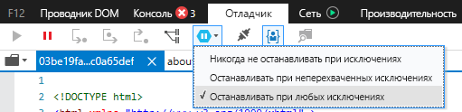
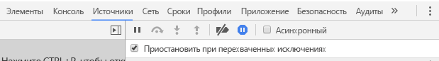

# <a name="how-to-debug-power-bi-visuals"></a>Отладка визуальных элементов Power BI

На этой странице показаны некоторые советы по отладке в процессе создания визуального элемента. Он включает в себя основные шаги и показывает различия между стандартными интерфейсными приложениями и отладкой визуального элемента Power BI.
После прочтения статьи вы сможете выполнять отладку визуальных элементов Power BI с помощью точек останова, исключений журнала и перехвата исключений в Chrome и Edge.

## <a name="using-breakpoints"></a>Использование точек останова

Так как JavaScript визуального элемента перегружается при каждом обновлении визуального элемента, при обновлении визуального элемента отладки будут потеряны любые добавленные точки останова. В качестве обходного решения используйте инструкции `debugger` в коде. Рекомендуется отключить автоматическую перезагрузку при использовании `debugger` в коде.

```typescript
public update(options: VisualUpdateOptions) {
    console.log('Visual update', options);
    debugger;
    this.target.innerHTML = `<p>Update count: <em>${(this.updateCount</em></p>`;
}
```


## <a name="showing-exceptions"></a>Отображение исключений

При работе с визуальными элементами вы заметите, что все ошибки "поглощаются" службой Power BI. Это преднамеренная функция Power BI, предотвращающая нестабильную работу всех приложений.

В качестве обходного решения добавьте код для перехвата и регистрации исключений или задайте для отладчика прерывание на перехваченных исключениях.


## <a name="log-exceptions"></a>Журнал исключений

Чтобы вести журнал исключений в визуальном элементе Power BI, добавьте следующий код в визуальный элемент, чтобы определить декоратор для ведения журнала исключений.

```typescript
export function logExceptions(): MethodDecorator {
    return function (target: Object, propertyKey: string, descriptor: TypedPropertyDescriptor<any>): TypedPropertyDescriptor<any> {
        return {
            value: function () {
                try {
                    return descriptor.value.apply(this, arguments);
                } catch (e) {
                    console.error(e);
                    throw e;
                }
            }
        }
    }
}
```
Затем этот декоратор можно использовать для любой функции, чтобы просмотреть журнал ошибок.

```typescript
@logExceptions()
public update(options: VisualUpdateOptions) {
```

## <a name="break-on-exceptions"></a>Остановка на исключениях

Браузер можно также настроить на остановку на перехваченных исключениях. Это останавливает выполнение кода везде, где происходит ошибка, и позволяет выполнять отладку отсюда.

### <a name="edge"></a>Microsoft Edge

1. Откройте средства разработчика (F12).
2. Перейдите на вкладку **Отладчик**.
3. Щелкните значок **останавливать на исключениях** (шестиугольник со значком паузы).
4. Выберите **Останавливать при любых исключениях**.



## <a name="chrome"></a>Chrome

1. Откройте средства разработчика (F12).
2. Перейдите на вкладку **Источники**.
3. Щелкните значок **останавливать на исключениях** (шестиугольник со значком останова).
4. Установите флажок **Pause On Caught Exceptions** (Приостановить на перехваченных исключениях).



## <a name="next-steps"></a>Дальнейшие действия
* [Устранение неполадок с визуальными элементами Power BI](power-bi-custom-visuals-troubleshoot.md)
* Дополнительные сведения см. в статье [Визуальные элементы Power BI: вопросы и ответы](power-bi-custom-visuals-faq.md#organizational-power-bi-visuals)
