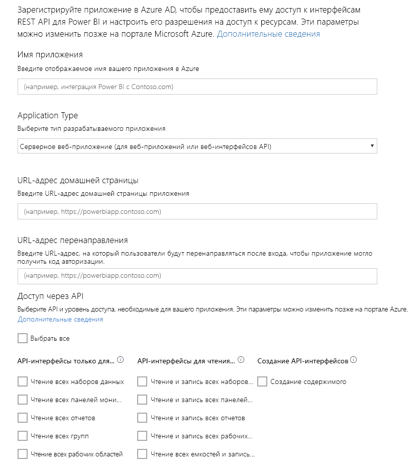

# Шаг 1. Регистрация приложения в Azure AD
Эта статья является частью пошагового руководства по [принудительной отправке данных в набор данных](walkthrough-push-data.md).

Первым шагом процесса принудительной отправки данных в набор данных Power BI является регистрация приложения в Azure AD. Эта процедура необходима для последующего получения **идентификатора клиента** , определяющего ваше приложение в Azure AD. Без **идентификатора клиента**Azure AD не сможет проверить подлинность приложения.

> **ПРИМЕЧАНИЕ**. Прежде чем регистрировать приложение для Power BI, нужно пройти процедуру [Регистрация в Power BI](create-an-azure-active-directory-tenant.md).
> 
> 

Ниже приведены действия по регистрации приложения в Azure AD.

## Регистрация приложения в Azure AD
1. Перейдите по адресу dev.powerbi.com/apps.
2. Выберите команду **Войти с использованием существующей учетной записи**и войдите в учетную запись Power BI.
3. В поле **Имя приложения** введите имя (например, "Пример приложения по отправке данных").
4. В поле **Тип приложения**выберите **Собственное приложение**.
5. Введите **URL-адрес перенаправления**, такой как **https://login.live.com/oauth20_desktop.srf**. В случае **собственного клиентского приложения**URI перенаправления позволяет **Azure AD** получить дополнительную информацию о конкретном приложении, для которого будет выполнена проверка подлинности. Стандартным URI для клиентского приложения является https://login.live.com/oauth20_desktop.srf.
6. Для параметра **Choose APIs to access** (Выбор API для доступа) выберите значение **Read and Write All Datasets** (Чтение и запись всех наборов данных). Перечень всех разрешений для приложений Power BI см. в статье [Разрешения Power BI](power-bi-permissions.md).
7. Щелкните **Зарегистрировать приложение**и сохраните созданный **идентификатор клиента** . **Идентификатор клиента** определяет приложение в Azure AD.

Страница **Регистрация приложения Power BI** должна выглядеть следующим образом.

Следующим шагом является получение [токена доступа для проверки подлинности](walkthrough-push-data-get-token.md).

[Дальнейшие действия >](walkthrough-push-data-get-token.md)

## Дальнейшие действия
[Регистрация бесплатной учетной записи Power BI с пользовательским клиентом каталога Azure Active Directory](create-an-azure-active-directory-tenant.md)  
[Получение токена доступа для проверки подлинности](walkthrough-push-data-get-token.md)  
[Принудительная отправка данных в панель мониторинга Power BI](walkthrough-push-data.md)  
[Регистрация приложения для внедрения содержимого Power BI](register-app.md)  
[Обзор интерфейса REST API Power BI](overview-of-power-bi-rest-api.md)  

Появились дополнительные вопросы? [Попробуйте задать вопрос в сообществе Power BI.](http://community.powerbi.com/)

