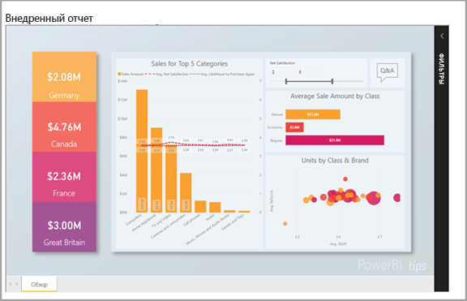
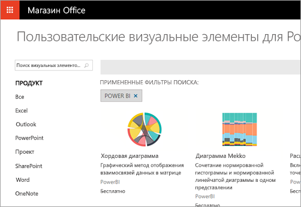

# Что могут разработчики сделать с помощью Power BI

Разработчики могут включить содержимое Power BI в приложения разными способами. Разработчики могут использовать эти способы, включая **внедрение с помощью Power BI**, **пользовательские визуальные элементы** и **принудительную отправку данных в Power BI**.

## Внедрение содержимого Power BI

Возможности службы Power BI (SaaS) и Power BI Embedded в Azure (PaaS) предоставляют единый API для внедрения информационных панелей и отчетов. Это означает, что у вас есть доступ к последним функциям Power BI, таким как панели мониторинга, шлюзы и рабочие области, которые можно использовать при внедрении содержимого.

Воспользуйтесь [средством установки внедрения](https://aka.ms/embedsetup), чтобы быстро скачать образец приложения и приступить к работе.

Выберите подходящее решение:

* [Внедрение для клиентов](embedding.md#embedding-for-your-customers) позволяет внедрять панели мониторинга и отчеты для пользователей, у которых нет учетной записи Power BI. Запустите решение [Внедрение для клиентов](https://aka.ms/embedsetup/AppOwnsData).

* [Внедрение для организации](embedding.md#embedding-for-your-organization) позволяет расширить возможности службы Power BI. Запустите решение [Внедрение для организации](https://aka.ms/embedsetup/UserOwnsData).

Дополнительные сведения о внедрении с помощью Power BI см. в разделе [Внедрение в Power BI](embedding.md).

## Разработка пользовательских визуальных элементов

В Power BI пользовательские визуальные элементы используются для создания уникальной визуализации, соответствующей вашим требованиям или требованиям вашей компании. Часто эти пользовательские визуальные элементы создаются разработчиками. Они создаются, когда все многообразие визуальных элементов, включенных в Power BI, не соответствует вашим потребностям.

Пользовательские визуальные элементы позволяют создавать собственные визуализации, которые можно использовать в отчетах Power BI. Пользовательские визуальные элементы написаны на языке TypeScript, который является надмножеством JavaScript. TypeScript поддерживает некоторые дополнительные возможности и ранний доступ к функциям ES6 и ES7. Стили визуальных элементов обрабатываются с помощью каскадных таблиц стилей (CSS). Для вашего удобства мы используем предварительный компилятор Less, поддерживающий некоторые дополнительные функции, такие как вложения, переменные, условия, циклы и т. д. Если вы не хотите использовать эти функции, можно просто создать обычные CSS в файле Less.

Дополнительные сведения: [Разработка пользовательского визуального элемента Power BI](visuals/custom-visual-develop-tutorial.md).

## Использование автоматизации API

Power BI отображает интерактивные панели мониторинга, которые можно создать и обновлять посредством множества различных источников данных в режиме реального времени. С помощью любого языка программирования, поддерживающего вызовы REST, можно создавать приложения, которые интегрируются в панель мониторинга Power BI в режиме реального времени. В приложения также можно интегрировать плитки и отчеты Power BI.

Разработчики также могут создавать собственные визуализации данных, которые можно использовать в интерактивных отчетах и на панелях мониторинга.

Примеры задач, которые можно выполнять с помощью программных интерфейсов Power BI, см. в разделе [Какие возможности API Power BI предоставляет разработчикам](overview-of-power-bi-rest-api.md)?

## Дальнейшие действия

[Внедрение в Power BI](embedding.md)  

[Разработка пользовательского визуального элемента Power BI](https://microsoft.github.io/PowerBI-visuals/docs/step-by-step-lab/developing-a-power-bi-custom-visual/)

[Какие возможности API Power BI предоставляет разработчикам?](overview-of-power-bi-rest-api.md)

[Центр Power BI для разработчиков](https://powerbi.microsoft.com/developers/)