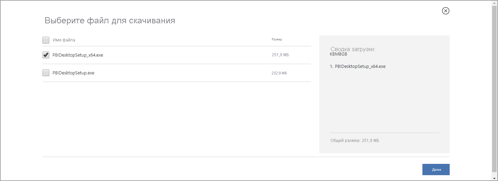

# <a name="get-power-bi-desktop"></a>Получение Power BI Desktop
Power BI Desktop дает возможность создавать расширенные запросы, модели и отчеты, визуализирующие данные. С помощью Power BI Desktop можно создавать модели данных, отчеты и совместно использовать данные, публикуя их в службе Power BI. Power BI Desktop можно скачать бесплатно.

Получить Power BI Desktop можно двумя способами, каждый из которых описан в следующих разделах:

* [установить в виде приложения из Microsoft Store](#install-as-an-app-from-the-microsoft-store);
* [скачать напрямую в виде исполняемого файла, устанавливаемого на компьютере](#download-power-bi-desktop-directly).

Какой бы способ вы ни выбрали, вы получаете на своем компьютере последнюю версию Power BI Desktop. Тем не менее существуют некоторые различия, которые описаны в следующих разделах.


> [!IMPORTANT]
> Обновление и выпуск Power BI Desktop осуществляется на ежемесячной основе, включая отзывы клиентов и новые функции. Поддерживается только самая последняя версия Power BI Desktop; клиентам, которые обращаются в службу поддержки Power BI Desktop, будет предложено выполнить обновление до последней версии. Вы можете получить последнюю версию Power BI Desktop из [Магазина Windows](https://aka.ms/pbidesktopstore) или в виде одного исполняемого файла, содержащего все поддерживаемые языки для [загрузки](https://www.microsoft.com/download/details.aspx?id=58494) и установки на компьютер.


## <a name="install-as-an-app-from-the-microsoft-store"></a>Установка в виде приложения из Microsoft Store
Доступ к последней версии Power BI Desktop в Microsoft Store можно получить несколькими способами. 

1. Откройте страницу **Power BI Desktop** в Microsoft Store одним из указанных ниже способов.

   - Откройте браузер и перейдите непосредственно на [страницу Power BI Desktop](https://aka.ms/pbidesktopstore) в Microsoft Store.

    - В [службе Power BI](https://docs.microsoft.com/power-bi/service-get-started) щелкните значок **Скачать** в правом верхнем углу и выберите **Power BI Desktop**.

      

   - Перейдите на [страницу продукта Power BI Desktop](https://powerbi.microsoft.com/desktop/) и нажмите кнопку **Скачать бесплатно**.
  
2. Когда вы окажетесь на странице **Power BI Desktop** в Microsoft Store, нажмите кнопку **Установить**.

     

У приложения Power BI Desktop из Microsoft Store есть ряд преимуществ:

* **Автоматические обновления**. Windows автоматически скачивает последнюю версию в фоновом режиме, как только она становится доступной. Поэтому ваша версия всегда будет актуальной.
* **Меньше скачиваемых файлов**. При каждом обновлении из Microsoft Store на компьютер скачиваются только те компоненты, которые были изменены. Таким образом, скачивается меньше файлов.
* **Права администратора не требуются**. Для установки скачанного пакета у вас должны быть права администратора. Если вы получили Power BI Desktop из Microsoft Store, права администратора *не* требуются.
* **Возможность развертывания сотрудниками ИТ-отдела**. Microsoft Store для бизнеса упрощает *развертывание* приложения Power BI Desktop для всех сотрудников организации.

* **Определение языка**. Версия из Microsoft Store включает в себя все поддерживаемые языки. При каждом запуске она проверяет, какой язык используется на компьютере. Это также влияет на локализацию моделей, созданных в Power BI Desktop. Например, встроенные иерархии дат соответствуют языку, который использовался в приложении Power BI Desktop при создании PBIX-файла.

При установке Power BI Desktop из Microsoft Store необходимо учитывать ряд особенностей и ограничений.

* Если вы используете соединитель SAP, вам, возможно, потребуется переместить файлы драйвера SAP в папку *Windows\System32*.
* Если Power BI Desktop устанавливается из Microsoft Store, пользовательские настройки не копируются из версии, установленной с помощью файла EXE. Возможно, потребуется повторно подключиться к последним источникам данных и заново ввести учетные данные для источника данных. 

> [!NOTE]
> Версия Сервера отчетов Power BI для Power BI Desktop отличается от версий, описанных в этой статье, и устанавливается отдельно от них. Сведения о версии Сервера отчетов для Power BI Desktop см. в [руководстве по созданию отчета Power BI для Сервера отчетов Power BI](../report-server/quickstart-create-powerbi-report.md).
> 
> 

## <a name="download-power-bi-desktop-directly"></a>Скачивание Power BI Desktop напрямую
  
  Чтобы скачать исполняемый файл Power BI Desktop из Центра загрузки, на [странице Центра загрузки](https://www.microsoft.com/download/details.aspx?id=58494) нажмите кнопку **Скачать**. Затем выберите 32- или 64-разрядный файл установки для скачивания.

  

### <a name="install-power-bi-desktop-after-downloading-it"></a>Установка Power BI Desktop после скачивания
После скачивания файла установки появится запрос на его запуск.

Начиная с выпуска за июль 2019 г. Power BI Desktop поставляется в виде отдельного исполняемого пакета установки со всеми поддерживаемыми языками. Для 32- и 64-разрядной версии используются отдельные исполняемые файлы. Поддержка пакетов MSI прекращена с выпуска за сентябрь 2019 г., требующего исполняемого EXE-файла для установки. Такой подход делает распространение, обновления и установку гораздо проще и удобнее (особенно для администраторов). Для настройки процесса установки можно также использовать параметры командной строки, как описано в разделе [Использование параметров командной строки во время установки](#using-command-line-options-during-installation).

После запуска пакета установки Power BI Desktop устанавливается как приложение и запускается на компьютере.


> [!NOTE]
> Установка скачанной версии Power BI Desktop (пакет MSI, не рекомендуется) и версии из Microsoft Store на одном и том же компьютере (так называемая *параллельная* установка) не поддерживается. Вручную удалите приложение Power BI Desktop, прежде чем скачивать его из Microsoft Store.
> 

## <a name="using-power-bi-desktop"></a>Использование Power BI Desktop
При запуске Power BI Desktop отобразится экран приветствия.


Если вы используете Power BI Desktop впервые (то есть выполняете установку, а не обновление), вам будет предложено заполнить форму либо войти в службу Power BI для продолжения работы.

В этом приложении можно создавать модели данных и отчеты, а затем делиться ими с другими пользователями в службе Power BI. Ссылки на руководства, которые помогут вам приступить к работе с Power BI Desktop, см. в разделе [Дальнейшие действия](#next-steps).

## <a name="minimum-requirements"></a>Минимальные требования
Минимальные требования для запуска Power BI Desktop:

> [!IMPORTANT]
> Power BI Desktop больше не будет поддерживаться в Windows 7 после 31 января 2021 г. После этой даты Power BI Desktop будет поддерживаться в Windows 8 или более поздних версиях Windows, (только для последнего выпуска Power BI Desktop). 

* Windows 7, Windows Server 2008 R2 или более поздние версии
* .NET 4.5
* Internet Explorer 10 или более поздней версии
* Память (ОЗУ): не менее 1 ГБ (рекомендуется 1,5 ГБ или больше).
* Отображение. рекомендуемое разрешение — не меньше 1440 x 900 или 1600 x 900 (16:9). Использовать дисплеи с более низким разрешением, например 1024 x 768 или 1280 x 800, не рекомендуется, так как некоторые элементы управления (такие как кнопка для закрытия экрана запуска) могут выходить за границы видимой области.
* Параметры отображения Windows. Если в параметрах отображения для размера текста, приложений и других элементов задано изменение более чем на 100 %, могут быть не видны некоторые диалоговые окна, с которыми нужно выполнить определенные действия, чтобы продолжить работу в Power BI Desktop. Если возникла эта проблема, откройте параметры отображения, последовательно выбрав в Windows **Параметры** > **Система** > **Отображение**, и с помощью ползунка установите для параметров отображения значение 100 %.
* Процессор: рекомендуется 32- или 64-разрядный процессор с тактовой частотой 1 гигагерц (ГГц) или выше.

## <a name="considerations-and-limitations"></a>Рекомендации и ограничения

Мы стараемся обеспечить лучшие возможности работы с Power BI Desktop. Но иногда вы можете столкнуться с проблемой в Power BI Desktop. Поэтому в этом разделе содержатся решения и рекомендации по устранению неполадок. 

### <a name="using-command-line-options-during-installation"></a>Использование параметров командной строки во время установки 

При установке Power BI Desktop можно задать свойства и параметры с помощью параметров командной строки. Это особенно удобно для администраторов, сопровождающих установку Power BI Desktop в организациях или управляющих ею. Эти параметры применяются к установкам на базе MSI и EXE. 


|Параметр командной строки  |Поведение  |
|---------|---------|
|-q, -quiet, -s, -silent     |Автоматическая установка         |
|-passive     |Отображение индикатора выполнения только во время установки         |
|-norestart     |Отключение обязательной перезагрузки компьютера         |
|-forcerestart     |Перезапуск компьютера после установки без запроса         |
|-promptrestart     |Вывод пользователю запроса о том, требуется ли перезагрузка компьютера (по умолчанию)         |
|-l<>, -log<>     |Запись журнала установки в определенный файл, указанный в <>         |
|-uninstall     |Удаление Power BI Desktop         |
|-repair     |Восстановление установки (или выполнение установки, если продукт еще не установлен)         |
|-package, -update     |Установка Power BI Desktop (используется по умолчанию, если не указан параметр -uninstall или -repair).         |

Кроме того, вы можете использовать следующие параметры с применением синтаксиса *свойство = значение*:

|Параметр  |Значение  |
|---------|---------|
|ACCEPT_EULA     |Для автоматического принятия условий лицензии требуется значение 1         |
|ENABLECXP     |Значение 1 регистрируется в программе обслуживания клиентов, которая фиксирует данные телеметрии при использовании продукта         |
|INSTALLDESKTOPSHORTCUT     |Значение 1 добавляет ярлык на рабочий стол         |
|INSTALLLOCATION     |Путь к файлу, куда он должен быть установлен         |
|ЯЗЫК     |Код языкового стандарта (например, en-US, de-DE, pr-BR) для принудительного применения языка по умолчанию для приложения. Если язык не указан, в Power BI Desktop используется язык ОС Windows. Этот параметр можно изменить в диалоговом окне **Параметры**.         |
|REG_SHOWLEADGENDIALOG     |Значение 0 отключает отображение диалогового окна, которое появляется перед входом в Power BI Desktop.         |
|DISABLE_UPDATE_NOTIFICATION     |Установите значение 1, чтобы отключить уведомления об обновлениях.         |


Например, вы можете запустить Power BI Desktop со следующими параметрами для установки без пользовательского интерфейса, используя немецкий язык: 

```-quiet LANG=de-DE ACCEPT_EULA=1```

### <a name="installing-power-bi-desktop-on-remote-machines"></a>Установка Power BI Desktop на удаленных компьютерах

Если вы развертываете Power BI Desktop для своих пользователей с помощью средства, требующего файл установщика Windows (MSI-файл), вы можете извлечь MSI-файл из EXE-файла установщика Power BI Desktop. Используйте средство стороннего поставщика, например набор средств WiX.

> [!NOTE]
> В качестве продукта стороннего производителя, параметры набора средств WiX могут измениться без предварительного уведомления. Ознакомьтесь с документацией, чтобы получить наиболее актуальные сведения, и обратитесь за помощью по адресу списка рассылки пользователей.

1. На компьютере, где был скачан установщик Power BI Desktop, установите последнюю версию [набора средств WiX](https://wixtoolset.org/).
2. Откройте окно командной строки от имени администратора и перейдите в папку, где установлен набор средств WiX.
3. Выполните следующую команду. 
    
    ```Dark.exe <path to Power BI Desktop installer> -x <output folder>```

    Например:

    ``` Dark.exe C:\PBIDesktop_x64.exe -x C:\output```

    Выходная папка содержит папку с именем *AttachedContainer*, содержащую MSI-файлы.

Обновление экземпляра, установленного с помощью EXE-файла, посредством MSI-файла, извлеченного из EXE-файла, не поддерживается.   Чтобы выполнить это обновление, сначала необходимо удалить старую версию Power BI Desktop.

### <a name="issues-when-using-previous-releases-of-power-bi-desktop"></a>Проблемы при использовании предыдущих версий Power BI Desktop

При работе с устаревшей версией Power BI Desktop некоторые пользователи могут сталкиваться с ошибкой наподобие следующей: 

*Не удалось восстановить сохраненную базу данных в модели.* 

Обновление до текущей версии Power BI Desktop обычно решает эту проблему.

### <a name="disabling-notifications"></a>Отключение уведомлений
Мы рекомендуем обновить Power BI Desktop до последней версии, чтобы воспользоваться улучшенными функциями, оптимизированными показателями производительности и стабильности, а также другими усовершенствованиями. В некоторых организациях может быть нежелательно, чтобы пользователи обновляли программу до каждой новой версии. Вы можете отключить уведомления, внеся изменения в реестр следующим образом:

1. В редакторе реестра перейдите к разделу **HKEY_LOCAL_MACHINE\SOFTWARE\Microsoft\Microsoft Power BI Desktop**.
2. Создайте в нем параметр **REG_DWORD** со следующим именем: **DisableUpdateNotification**.
3. Задайте для новой записи значение **1**.
4. Чтобы изменение вступило в силу, перезапустите компьютер.

### <a name="power-bi-desktop-loads-with-a-partial-screen"></a>В Power BI Desktop содержимое экрана загружается частично

При определенных условиях, в том числе и определенных конфигурациях разрешения экрана, для некоторых пользователей в Power BI Desktop содержимое может отображаться с большими черными участками. Обычно эта проблема возникает из-за последних обновлений операционной системы, которые влияют на способ отображения элементов, а не из-за того, как Power BI Desktop отображает содержимое. Проблему можно устранить указанным ниже способом.

1. Нажмите кнопку **Пуск** и в появившемся поле поиска введите слово *размыто*.
2. В появившемся диалоговом окне выберите параметр **Разрешить Windows исправлять размытость в приложениях**.
3. Перезапустите Power BI Desktop.

Возможно, эта проблема будет решена при выпуске следующих обновлений Windows. 
 

## <a name="next-steps"></a>Дальнейшие действия
После установки Power BI Desktop ознакомьтесь со следующими ресурсами, которые помогут вам быстро приступить к работе:

* [Что такое Power BI Desktop?](desktop-what-is-desktop.md)
* [Общие сведения о запросах в Power BI Desktop](../transform-model/desktop-query-overview.md)
* [Источники данных в Power BI Desktop](../connect-data/desktop-data-sources.md)
* [Подключение к данным в Power BI Desktop](../connect-data/desktop-connect-to-data.md)
* [Формирование и объединение данных в Power BI Desktop](../connect-data/desktop-shape-and-combine-data.md)
* [Общие задачи с запросами в Power BI Desktop](../transform-model/desktop-common-query-tasks.md)   
