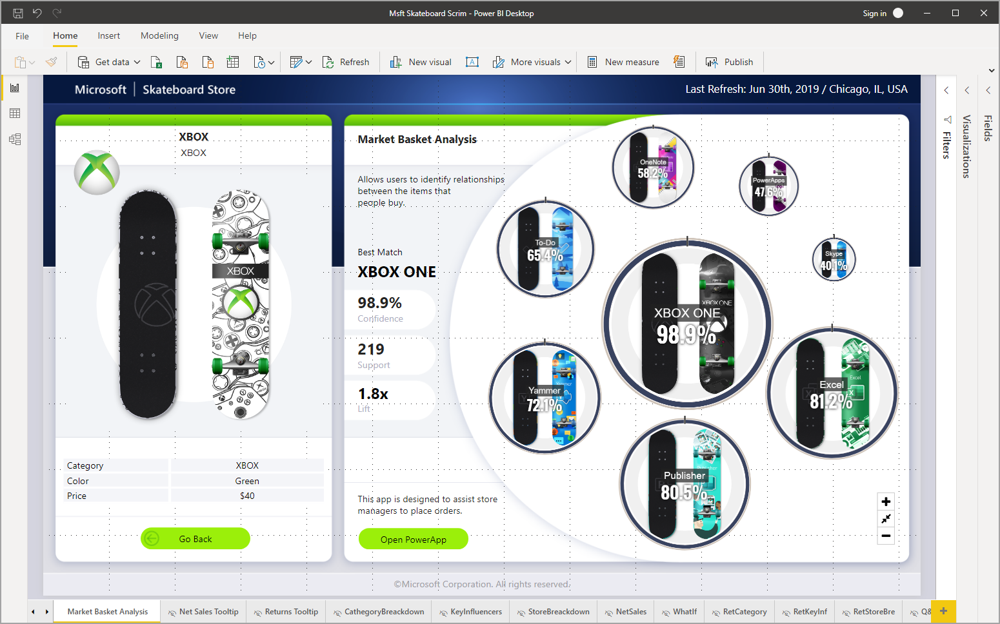
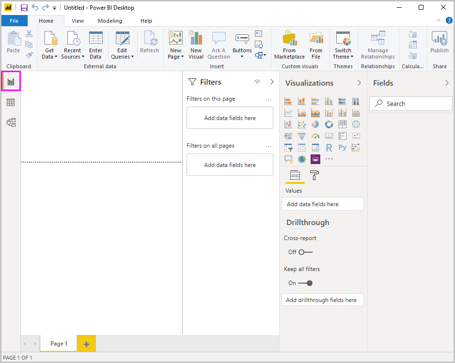
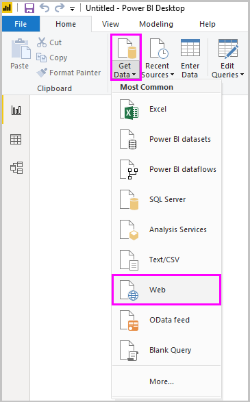
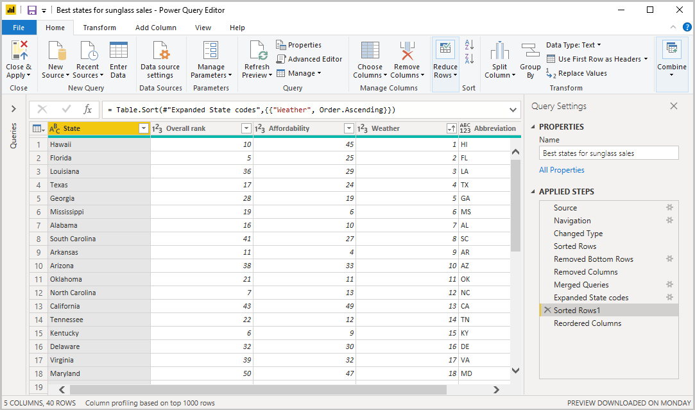
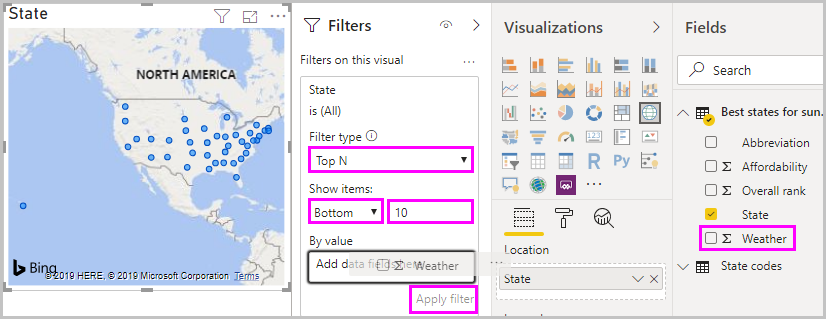
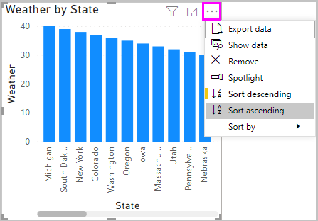

# Начало работы с Power BI Desktop
Добро пожаловать в руководство по началу работы с Power BI Desktop. Этот обзор знакомит вас с принципами работы и возможностями Power BI Desktop. В нем также показано, как создавать надежные модели данных и потрясающие отчеты, чтобы повысить эффективность бизнес-аналитики.

Чтобы быстро получить представление о том, как работает Power BI Desktop, просмотрите снимки экрана в этом руководстве. Это займет всего несколько минут. Для более глубокого понимания прочтите каждый раздел, выполните приведенные в нем инструкции и создайте свой собственный файл Power BI Desktop для публикации в [службе Power BI](https://app.powerbi.com/) и совместного использования с другими пользователями.

Вы также можете просмотреть видео по [началу работы с Power BI Desktop](https://www.youtube.com/watch?v=Qgam9M8I0xA) и скачать книгу Excel с [образцом финансовых данных](https://go.microsoft.com/fwlink/?LinkID=521962), на которую можно опираться в процессе просмотра видео.

## Принципы работы Power BI Desktop
С Power BI Desktop доступны следующие возможности.
1. подключение к данным, в том числе ко множеству источников данных;
1. формирование данных с помощью запросов, которые создают привлекательные и полезные модели данных;
1. создание визуализаций и отчетов с помощью моделей данных; 
1. предоставление общего доступа к файлам отчетов другим пользователям, которые могут работать с этими файлами, дополнять их и делиться ими далее. Файлы Power BI Desktop в формате *PBIX* могут совместно использоваться, как любые другие файлы, но наиболее эффективный способ заключается в их отправке в [службу Power BI](https://preview.powerbi.com/). 

В Power BI Desktop интегрированы проверенная подсистема обработки запросов, система моделирования данных и технологии визуализации. Специалисты по анализу данных и другие пользователи могут создавать коллекции запросов, подключений к данным, моделей и отчетов, которые легко могут использоваться совместно с другими пользователями. Благодаря сочетанию приложения Power BI Desktop и службы Power BI становится гораздо проще моделировать, строить, совместно использовать и расширять новые идеи из мира данных.

Power BI Desktop централизует, упрощает и ускоряет то, что в противном случае могло бы представлять собой разрозненный, неупорядоченный и достаточно сложный процесс проектирования и создания репозиториев и отчетов бизнес-аналитики.
Готовы попробовать? Давайте приступим.

> [!NOTE]
> Для данных и отчетов, которые должны оставаться в локальной среде, существует отдельная специализированная версия Power BI, которая называется [Сервер отчетов Power BI](../report-server/get-started.md). Сервер отчетов Power BI использует отдельную специализированную версию Power BI Desktop, которая называется Power BI Desktop для Сервера отчетов Power BI. Она работает только с версией "Сервер отчетов Power BI". В этой статьей описывается стандартная версия Power BI Desktop.

## Установка и запуск Power BI Desktop
Чтобы скачать Power BI Desktop, перейдите на [страницу скачивания Power BI Desktop](https://powerbi.microsoft.com/desktop) и нажмите кнопку **Скачать бесплатно**. Чтобы просмотреть варианты скачивания, выберите [Просмотреть варианты языковых версий или варианты скачивания](https://www.microsoft.com/download/details.aspx?id=58494). 

Power BI Desktop можно также скачать из службы Power BI. Щелкните значок **скачивания** в верхней строке меню, а затем выберите пункт **Power BI Desktop**.

На странице Microsoft Store нажмите **Получить** и следуйте указаниям, чтобы установить Power BI Desktop на компьютере. Запустите Power BI Desktop из меню **Пуск** или с помощью значка на панели задач Windows.

При первом запуске Power BI Desktop отображается экран **приветствия**.

На экране **приветствия** можно **получить данные**, просмотреть **последние источники**, открыть последние отчеты, **открыть другие отчеты** или выбрать другие ссылки. Вы также можете указать, следует ли показывать экран **приветствия** при каждом запуске. Чтобы закрыть экран **приветствия**, щелкните значок закрытия.

По левому краю окна Power BI Desktop находятся значки для выбора одного из трех представлений Power BI Desktop: **Отчет**, **Данные** и **Связи** (сверху вниз). Текущее представление обозначается желтой полосой слева от значка. Чтобы сменить представление, щелкните другой значок. 

По умолчанию выбрано представление **Отчет**. 

В Power BI Desktop есть также **Редактор Power Query**, который открывается в отдельном окне. В **Редакторе Power Query** можно создавать запросы и преобразовывать данные, а затем загружать уточненные модели данных в Power BI Desktop для создания отчетов.

## Подключение к данным
После установки Power BI Desktop вы готовы подключаться к непрерывно расширяющейся среде данных. Чтобы просмотреть доступные типы источников данных, на вкладке **Главная страница** в Power BI Desktop выберите **Получить данные** > **Дополнительно**, а затем в окне **Получить данные** прокрутите список **Все**. В этом кратком обзоре вы будете подключаться к нескольким разным источникам данных в **Интернете**.

Представьте, что вы работаете специалистом по анализу данных в компании, занимающейся розничной продажей солнцезащитных очков. Вы хотите помочь компании организовать адресную реализацию там, где солнце больше светит. На сайте Bankrate.com на странице [Best and worst states for retirement](https://www.bankrate.com/retirement/best-and-worst-states-for-retirement/) (Лучшие и худшие штаты для пенсионеров) есть интересные данные по этой теме.

В Power BI Desktop на вкладке **Главная страница** выберите **Получить данные** > **Интернет**, чтобы подключиться к источнику данных в Интернете. 

В диалоговом окне **Из Интернета** вставьте адрес *https:\//www.bankrate.com/retirement/best-and-worst-states-for-retirement/* в поле **URL-адрес** и нажмите кнопку **ОК**. 

При появлении запроса на экране **Доступ к веб-содержимому** нажмите кнопку **Подключение**, чтобы использовать анонимный доступ. 

Функция запроса Power BI Desktop активируется и обратится к веб-ресурсу. В окне **Навигатор** отображается найденное на веб-странице. В данном случае это таблица **Ranking of best and worst states for retirement** (Рейтинг лучших и худших штатов для пенсионеров) и документ. Вас интересует таблица, поэтому выберите ее, чтобы выполнить предварительный просмотр.

На данном этапе можно нажать кнопку **Загрузить**, чтобы загрузить таблицу, или кнопку **Преобразовать данные**, чтобы внести изменения в таблицу перед ее загрузкой.

Если нажать кнопку **Преобразовать данные**, запустится Редактор Power Query с представлением таблицы. Справа находится область **Параметры запроса**. Чтобы она отображалась постоянно, в Редакторе Power Query на вкладке **Просмотр** нажмите кнопку **Параметры запроса**. 

Дополнительные сведения о подключении к данным см. в статье [Подключение к данным в Power BI Desktop](../connect-data/desktop-connect-to-data.md).

## Формирование данных
Теперь, когда вы подключились к источнику данных, можно настроить данные нужным образом. Для *формирования* данных в Редакторе Power Query указываются пошаговые инструкции для настройки данных по мере их загрузки и отображения в редакторе. Это влияет не на исходный источник данных, а только на данное конкретное представление. 

> [!NOTE]
> Табличные данные, используемые в этом руководстве, могут со временем изменяться. Поэтому действия, которые необходимо выполнить, могут отличаться, и вам потребуется творчески подойти к настройке шагов или результатов. Дерзайте, ведь это делает процесс обучения увлекательным. 

Формирование может означать *преобразование* данных, например переименование столбцов или таблиц, удаление строк или столбцов либо изменение типов данных. В Редакторе Power Query эти действия регистрируются по очереди в разделе **Примененные шаги** области **Параметры запроса**. Эти действия выполняются каждый раз, когда запрос подключается к источнику данных, чтобы данные всегда были заданы указанным вами способом. Это происходит, когда вы используете запрос в Power BI Desktop или когда кто-либо другой использует ваш открытый для общего доступа запрос, например в службе Power BI. 

Обратите внимание, что в разделе **Примененные шаги** области **Параметры запроса** уже есть несколько действий. Вы можете выбрать каждое из них и посмотреть, как это отразится на Редакторе Power Query. Сначала вы указали веб-источник, а затем просмотрели таблицу в окне **Навигатор**. На третьем шаге (**Измененный тип**) приложение Power BI распознало импортируемые данные как целочисленные и автоматически изменило исходный *тип данных* **Текст** на **Целое число**. 

Если необходимо изменить тип данных, выберите нужный столбец или столбцы. Чтобы выбрать несколько смежных столбцов, удерживайте нажатой клавишу **SHIFT**. Чтобы выбрать несмежные столбцы, удерживайте нажатой клавишу **CTRL**. Щелкните заголовок столбца правой кнопкой мыши, выберите пункт **Тип изменения** и выберите новый тип данных в меню либо откройте раскрывающийся список **Тип данных** в группе **Преобразование** на вкладке **Главная страница** и выберите новый тип данных.

> [!NOTE]
> Доступные задачи в Редакторе Power Query в Power BI Desktop выбираются на ленте или в контекстных меню. Почти все действия, которые можно выбрать на вкладках **Главная страница** и **Преобразование**, также доступны в контекстном меню, которое появляется, если щелкнуть элемент правой кнопкой мыши.

Теперь вы можете применить собственные изменения и преобразования к данным и увидеть их в разделе **Примененные шаги**. 

Например, для продаж солнцезащитных очков наиболее важен рейтинг погоды, поэтому вы решаете отсортировать таблицу по столбцу **Weather** (Погода), а не **Overall rank** (Общий рейтинг). Щелкните стрелку раскрывающегося списка рядом с заголовком **Weather** и выберите пункт **Сортировка по возрастанию**. Теперь данные будут отсортированы по рейтингу погоды, а в разделе **Примененные шаги** появится действие **Сортированные строки**. 

Продавать солнцезащитные очки в штатах с самым плохим климатом особого смысла нет, поэтому вы решаете удалить их из таблицы. На вкладке **Главная страница** в группе **Сократить строки** выберите **Удалить строки** > **Удалить нижние строки**. В диалоговом окне **Удалить нижние строки** введите число *10* и нажмите кнопку **ОК**. 

Из таблицы удалятся 10 нижних строк, соответствующих штатам с наихудшим климатом, а в разделе **Примененные шаги** появится действие **Удаленные нижние строки**.

Вы считаете, что в таблице много лишней информации, поэтому вы решаете удалить столбцы **Affordability** (Уровень цен), **Crime** (Преступность), **Culture** (Культура) и **Wellness** (Здоровье). Выберите заголовок каждого столбца, который необходимо удалить. Чтобы выбрать несколько смежных столбцов, удерживайте нажатой клавишу **SHIFT**. Чтобы выбрать несмежные столбцы, удерживайте нажатой клавишу **CTRL**. 

Затем на вкладке **Главная страница** в группе **Управление столбцами** нажмите кнопку **Удалить столбцы**. Можно также щелкнуть правой кнопкой мыши один из выбранных заголовков столбцов и выбрать в меню пункт **Удалить столбцы**. Выбранные столбцы удалятся, а в разделе **Примененные шаги** появится действие **Удаленные столбцы**.

Спустя некоторое время вам приходит в голову мысль, что столбец **Affordability** (Уровень цен) может иметь значение для торговли солнечными очками. Вы хотите вернуть его. Последнее действие в разделе **Примененные шаги** можно легко отменить, щелкнув рядом с ним значок удаления **X**. Теперь повторите действие, выбрав только те столбцы, которые не нужны. Для большей гибкости каждый столбец можно удалить по отдельности. 

Любое действие в разделе **Примененные шаги** можно щелкнуть правой кнопкой мыши, чтобы удалить его, переименовать, переместить вверх или вниз в списке либо добавить или удалить шаги после него. В случае с промежуточными действиями в Power BI Desktop появится предупреждение о том, что изменение может повлиять на последующие действия и нарушить работу запроса.  

Например, если таблицу больше не нужно сортировать по столбцу **Weather**, можно попытаться удалить действие **Сортированные строки**. Power BI Desktop выдаст предупреждение о том, что удаление этого действия может привести к сбою запроса. Вы удалили 10 нижних строк после сортировки по столбцу Weather, поэтому при отмене сортировки удаленными окажутся разные строки. Предупреждение также появится, если выбрать действие **Сортированные строки** и попытаться добавить вместо него промежуточное действие.  

Наконец, необходимо изменить заголовок таблицы так, чтобы в нем говорилось о продажах солнцезащитных очков, а не об условиях для пенсионеров. В области **Параметры запроса** в разделе **Свойства** замените заголовок на *Лучшие штаты для продаж солнцезащитных очков*.

Готовый запрос будет выглядеть так:

Дополнительные сведения об оформлении данных см. в статье [Формирование и объединение данных в Power BI Desktop](../connect-data/desktop-shape-and-combine-data.md).

## Объединение данных
Эти данные о различных штатах представляют интерес и будут использоваться для создания дополнительных аналитических исследований и запросов. Однако есть одна проблема: в большей части данных здесь используется не полное название штата, а его двухбуквенный код. Для использования этих данных вам нужно каким-либо способом связать названия штатов с их кодами.

К счастью, имеется другой общедоступный источник данных, который делает именно это, но данные потребуют изрядного формирования, прежде чем можно будет *объединить* их с таблицей.

Чтобы импортировать коды штатов в Редактор Power Query, на вкладке **Главная страница** ленты в группе **Новый запрос** выберите **Создать источник** > **Интернет**. 

В диалоговом окне **Из Интернета** введите URL-адрес сайта с кодами штатов: *https:\//en.wikipedia.org/wiki/List_of_U.S._state_abbreviations*.

В окне **Навигатор** выберите таблицу **Codes and abbreviations for U.S. states, federal district, territories, and other regions** (Коды и сокращения для названий штатов США, федеральных округов, территорий и других регионов) и нажмите кнопку **ОК**. Таблица откроется в Редакторе Power Query.

Удалите все столбцы, кроме **Name and status of region** (Название и статус региона), **Name and status of region2** (Название и статус региона2) и **ANSI**. Чтобы оставить только эти столбцы, выделите их, удерживая нажатой клавишу **CTRL**. Затем щелкните правой кнопкой мыши заголовок одного из столбцов и выберите пункт **Удалить другие столбцы** либо на вкладке **Главная страница** в группе **Управление столбцами** выберите команду **Удалить другие столбцы**. 

Щелкните стрелку раскрывающегося списка рядом с заголовком **Name and status of region2** и выберите **Фильтры** > **Равно**. В диалоговом окне **Фильтрация строк** откройте раскрывающийся список **Введите или выберите значение** рядом с полем **равно** и выберите пункт **State** (Штат). 

Выберите вариант **Или**, а затем рядом со вторым полем **равно** выберите **State ("Commonwealth")** (Штат ("Содружество")). Выберите **ОК**. 

После удаления лишних значений, таких как **Federal district** (Федеральный округ) и **island** (остров), вы получите список 50 штатов с их официальными сокращениями из двух букв. Чтобы сделать заголовки столбцов понятнее, можно переименовать их, например **Название штата**, **Статус** и **Сокращение**. Для этого щелкните заголовок правой кнопкой мыши и выберите команду **Переименовать**.

Обратите внимание, что все эти действия записываются в разделе **Примененные шаги** области **Параметры запроса**.

Сформированная таблица теперь выглядит так:

Переименуйте таблицу в *Коды штатов* в поле **Свойства** области **Параметры запроса**. 

Теперь, когда вы сформировали таблицу **Коды штатов**, можно *объединить* две таблицы в одну. Так как полученные таблицы являются результатом выполнения запросов к данным, они также называются *запросами*. Существует два основных способа объединения запросов: *слияние* и *дополнение*. 

Когда имеется один или несколько столбцов, которые вы хотите добавить в другой запрос, вы *сливаете* запросы. При наличии дополнительных строк данных, которые нужно добавить в существующий запрос, выполняется *дополнение* запроса.

В данном случае необходимо выполнить *слияние* запроса **Коды штатов** с запросом **Лучшие штаты для продаж солнцезащитных очков**. Для этого перейдите к запросу **Лучшие штаты для продаж солнцезащитных очков**, выбрав его в области **Запросы** в левой части Редактора Power Query. Затем на вкладке **Главная страница** ленты в группе **Объединить** выберите команду **Объединить запросы**.

В окне **Слияние** в поле с раскрывающимся списком выберите запрос **Коды штатов**. Выберите столбцы, которые необходимо сопоставить между таблицами. В данном случае это столбец **State** (Штат) из запроса **Лучшие штаты для продаж солнцезащитных очков** и столбец **Название штата** из запроса **Коды штатов**. 

Если появится диалоговое окно **Уровни конфиденциальности**, установите флажок **Пропустить проверки уровней конфиденциальности для этого файла** и нажмите кнопку **Сохранить**. Выберите **ОК**. 

В правой части таблицы **Лучшие штаты для продаж солнцезащитных очков** появится новый столбец **Коды штатов**. Он содержит запрос "Коды штатов", который был объединен слиянием с запросом "Лучшие штаты для продаж солнцезащитных очков". Все столбцы из объединенного запроса собраны в столбец **Коды штатов**. Вы можете *развернуть* объединенную таблицу и включить только нужные столбцы. 

Чтобы развернуть объединенную таблицу и выбрать столбцы для включения, щелкните значок **развертывания** в заголовке столбца. В диалоговом окне **развертывания** выберите только столбец **Сокращение**. Снимите флажок **Использовать исходное имя столбца как префикс**, а затем нажмите кнопку **ОК**. 

> [!NOTE]
> Вы можете опробовать разные способы добавления таблицы **Коды штатов**. Немного поэкспериментируйте, а если вас не устроит результат, просто удалите соответствующий шаг из списка **Примененные шаги** в области **Параметры запроса**. Это можно повторять сколько угодно, пока процесс развертывания не будет происходить так, как нужно.

Подробное описание действий по формированию и объединению данных см. в статье [Формирование и объединение данных в Power BI Desktop](../connect-data/desktop-shape-and-combine-data.md).

Теперь у вас есть один запрос (таблица), объединяющий два источника данных, каждый из которых сформирован так, как вам нужно. Этот запрос может служить основой для большого количества дополнительных подключений к представляющим интерес данным, таким как демографические данные, уровень благосостояния или рекреационные возможности в разных штатах.

Теперь у вас достаточно данных для создания интересного отчета в Power BI Desktop. Так как вы начинаете совершенно новую процедуру, примените изменения в **Редакторе Power Query** и загрузите их в Power BI Desktop, нажав на вкладке **Главная страница** ленты кнопку **Закрыть и применить**. Вы также можете выбрать команду **Применить**, чтобы оставить запрос открытым в Редакторе Power Query во время работы в Power BI Desktop. 

После загрузки таблицы в Power BI Desktop можно внести дополнительные изменения и перезагрузить модель, чтобы применить их. Чтобы снова открыть **Редактор Power Query** из Power BI Desktop, на вкладке **Главная страница** ленты Power BI Desktop нажмите кнопку **Изменить запросы**. 

## Создание отчетов
В представлении **Отчет** в Power BI Desktop можно создавать визуализации и отчеты. Представление **Отчет** содержит шесть основных областей.

1. Лента вверху окна, на которой отображаются общие задачи, связанные с отчетами и визуализациями.
2. Область холста в середине окна, где создаются и организовываются визуализации.
3. Область вкладок страниц в нижней части, где можно выбирать или добавлять страницы отчета.
4. Область **Фильтры**, в которой можно фильтровать визуализации данных.
5. Область **Визуализации** , где можно добавлять, изменять или настраивать визуализации, а также применять детализацию.
6. Область **Поля**, в которой представлены имеющиеся в запросах поля. Эти поля можно перетаскивать на холст, в область **Фильтры** или область **Визуализации**, чтобы создавать или изменять визуализации.

Области **Фильтры**, **Визуализации** и **Поля** можно развертывать и свертывать с помощью стрелки вверху каждой области. Свернув панель, можно получить больше места на холсте для разработки визуализаций. 

Чтобы создать простую визуализацию, просто выберите любое поле в списке полей или перетащите поле из списка **Поля** на холст. Например, перетащите поле **State** (Штат) из запроса **Best states for sunglass sales** (Лучшие штаты для продаж солнцезащитных очков) и посмотрите, что произойдет.

Как видите, приложение Power BI Desktop распознало, что поле **State** содержит данные о географическом положении, и автоматически создало визуализацию на основе карты. На ней показаны точки данных для 40 штатов из модели данных. 

В области **Визуализации** представлены сведения о визуализации, и можно изменять ее. 

1. Значок указывает на тип созданной визуализации. Вы можете изменить тип визуализации, выбрав другой значок, или создать новую визуализацию, щелкнув значок, когда визуализация не выбрана. 
2. Вкладка **Поля** в области **Визуализации** позволяет перетаскивать поля с данными в **условные обозначения** и другие контейнеры полей в области. 
3. Вкладка **Формат** позволяет применять форматирование и другие элементы управления к визуализациям. 

Элементы, доступные на вкладках **Поля** и **Формат**, зависят от типа визуализации и данных.

Вы хотите, чтобы на карте отображались только первые 10 штатов по рейтингу климата. Чтобы отобразить только первые 10 штатов, в области **Фильтры** наведите указатель мыши на поле **State (все)** и щелкните появившуюся стрелку. В раскрывающемся списке **Тип фильтра** выберите пункт **Ведущие N**. В разделе **Показать элементы** выберите пункт **Снизу**, так как нужно показывать элементы с наименьшим числовым рейтингом, а затем в следующем поле введите число *10*.

Перетащите поле **Weather** из области **Поля** в поле **По значению** и щелкните **Применить фильтр**. 

Теперь на карте видны только первые 10 штатов по рейтингу климата. 

Измените название визуализации, щелкнув значок **Формат** в области **Визуализации**, выбрав элемент **Название** и введя в поле **Текст названия** текст *Лучшие 10 штатов по климату*. 

Чтобы добавить визуализацию, в которой отображаются названия первых 10 штатов по рейтингу климата и их рейтинг от 1 до 10, выберите пустое место на холсте, а затем в области **Визуализации** щелкните значок **Гистограмма**. В области **Поля** выберите поля **State** и **Weather**. На гистограмме отображаются 40 штатов из запроса, упорядоченные по числовому рейтингу в порядке убывания, то есть от худшего климата к лучшему. 

Чтобы изменить очередность штатов так, чтобы штат с рейтингом 1 был первым, щелкните значок **Дополнительные параметры** в виде многоточия в правом верхнем углу визуализации, а затем выберите в меню пункт **Сортировка по возрастанию**. 

Чтобы оставить на гистограмме только первые 10 штатов, примените тот же фильтр, что и к карте. 

Переименуйте гистограмму так же, как карту. Кроме того, на вкладке **Формат** области **Визуализации** измените значение параметра **Ось Y** > **Заголовок оси** с **Weather** на более понятное: *Рейтинг климата*. Затем переведите переключатель **Ось Y** в положение **Откл.** , а переключатель **Метки данных** — в положение **Вкл**. 

Теперь первые 10 штатов с лучшим климатом отображаются по порядку вместе с числовыми рейтингами. 

Вы можете создать аналогичные или другие визуализации для полей **Affordability** и **Overall ranking** или объединить несколько полей в одну визуализацию. Присутствуют все виды интересных отчетов и визуализаций, которые вы можете создать. На этих визуализациях типа **Таблица** и **График и гистограмма с группировкой** показаны первые 10 штатов по рейтингу климата вместе с уровнем цен и общим рейтингом:

На разных страницах отчета можно использовать разные визуализации. Чтобы добавить страницу, щелкните символ **+** рядом с имеющимися страницами в строке страниц или выберите команду **Вставка** > **Создать страницу** на вкладке **Главная страница** ленты. Чтобы переименовать страницу, дважды щелкните ее имя в строке страниц или щелкните имя правой кнопкой мыши и выберите команду **Переименовать страницу**, а затем введите новое имя. Чтобы перейти на другую страницу отчета, выберите ее в строке страниц. 

Из группы **Вставка** на вкладке **Главная страница** на страницы отчета можно добавлять текстовые поля, изображения и кнопки. Чтобы задать параметры форматирования для визуализации, выберите ее, а затем в области **Визуализации** щелкните значок **Формат**. Чтобы настроить размер, фон и другие параметры страницы, щелкните значок **Формат**, когда визуализация не выбрана.

Завершив создание страниц и визуализаций, выберите **Файл** > **Сохранить** и сохраните отчет. 

Дополнительные сведения об отчетах см. в статье [Представление отчетов в Power BI Desktop](../create-reports/desktop-report-view.md).

## Совместное использование работы
Теперь, когда у вас есть отчет Power BI Desktop, вы можете поделиться им с другими пользователями. Сделать это можно несколькими способами. Вы можете распространить файл *PBIX* отчета как любой другой файл, отправить файл *PBIX* из службы Power BI или опубликовать отчет непосредственно из Power BI Desktop в службе Power BI. Для публикации отчетов в службе Power BI или отправки отчетов в нее необходима учетная запись Power BI. 

Чтобы выполнить публикацию в службе **Power BI** из Power BI Desktop, на вкладке **Главная страница** ленты нажмите кнопку **Опубликовать**.

Вам может быть предложено выполнить вход в Power BI или выбрать место назначения.

Когда процесс публикации завершится, отобразится следующее диалоговое окно:

После перехода по ссылке для открытия отчета в Power BI он откроется на вашем сайте Power BI в разделе **Моя рабочая область** > **Отчеты**. 

Кроме того, для предоставления общего доступа к своей работе можно загрузить ее из службы **Power BI** . Чтобы открыть Power BI в браузере, перейдите на сайт *https:\//app.powerbi.com*. На странице **Главная** Power BI нажмите **Получить данные** в левом нижнем углу, чтобы запустить процесс загрузки отчета Power BI Desktop.

На следующей странице выберите **Получить** в разделе **Файлы**.

На следующей странице выберите **Локальный файл**. Выберите файл *PBIX* Power BI Desktop и нажмите **Открыть**. 

Когда файл импортируется, он появится в разделе **Моя рабочая область** > **Отчеты** в левой области службы Power BI.

Если выбрать файл, появится первая страница отчета. Выбрать другие страницы можно с помощью вкладок в левой части отчета. 

Чтобы внести изменения в отчет в службе **Power BI**, в верхней части холста отчета выберите **Дополнительные параметры** > **Изменить**. Чтобы сохранить изменения, нажмите **Сохранить копию**.

В отчете в службе **Power BI** можно создавать любые визуальные элементы, а затем закреплять их на *панели мониторинга*. Дополнительные сведения о панелях мониторинга в службе **Power BI** см. в [рекомендациях по проектированию идеальной панели мониторинга](../create-reports/service-dashboards-design-tips.md). Дополнительные сведения о создании, изменении панелей мониторинга и предоставлении общего доступа к ним см. в разделе [Совместное использование панели мониторинга](../collaborate-share/service-share-dashboards.md).

Чтобы предоставить общий доступ к отчету или панели мониторинга, нажмите **Общий доступ** в верхней части открытой страницы отчета или панели мониторинга либо щелкните значок **общего доступа** рядом с именем отчета или панели мониторинга в списке **Моя рабочая область** > **Отчеты** или **Моя рабочая область** > **Панели мониторинга**.

Выполните необходимые действия на экране **Общий доступ к отчету** или **Общий доступ к панели мониторинга**, чтобы отправить сообщение электронной почты или получить ссылку, позволяющую предоставить доступ к отчету или панели мониторинга другим пользователям. 

С помощью Power BI Desktop и службы Power BI можно создавать множество впечатляющих гибридных веб-приложений и визуализаций на основе данных. 

## Дальнейшие действия
Power BI Desktop поддерживает подключение к порту диагностики. Этот порт обеспечивает подключение других средств для выполнения трассировки в целях диагностики. При использовании порта диагностики *внесение в модель изменений не поддерживается. Изменения модели могут привести к повреждению и потере данных.*

Дополнительные сведения о многочисленных возможностях Power BI Desktop см. в следующих ресурсах:

* [Общие сведения о запросах в Power BI Desktop](../transform-model/desktop-query-overview.md)
* [Источники данных в Power BI Desktop](../connect-data/desktop-data-sources.md)
* [Подключение к данным в Power BI Desktop](../connect-data/desktop-connect-to-data.md)
* [Руководство. Формирование и объединение данных в Power BI Desktop](../connect-data/desktop-shape-and-combine-data.md)
* [Общие задачи с запросами в Power BI Desktop](../transform-model/desktop-common-query-tasks.md)   
