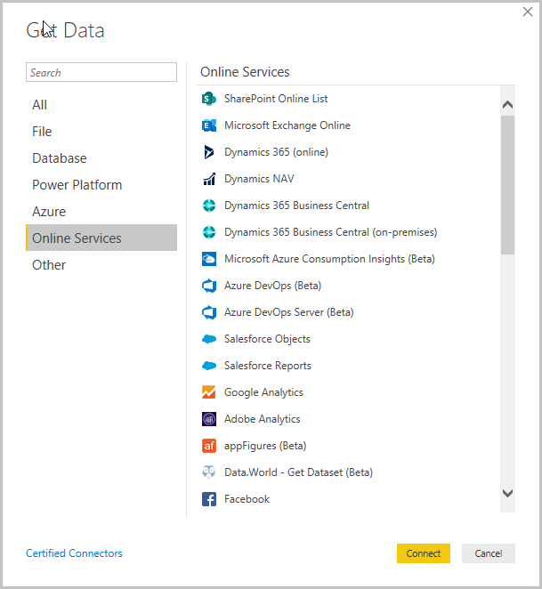
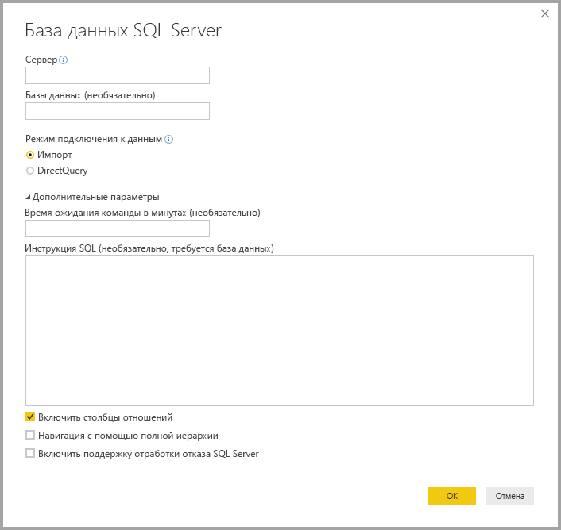
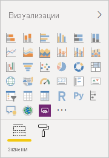

# Что такое Power BI Desktop?

*Power BI Desktop* — это бесплатное приложение, которое устанавливается на локальном компьютере и позволяет подключаться к источникам данных, преобразовывать и визуализировать данные. С помощью Power BI Desktop можно подключаться к нескольким различным источникам данных, а также объединять их в модели данных (этот процесс называется *моделированием*). Эта модель данных позволяет создавать визуальные элементы и коллекции визуальных элементов, которыми можно делится с другими людьми в организации в виде отчетов. Большинство пользователей, работающих над проектами бизнес-аналитики, применяют Power BI Desktop для создания отчетов, а *службу Power BI* — для предоставления к отчетам общего доступа другим пользователям.

Ниже представлены самые распространенные варианты применения Power BI Desktop:

* Подключение к данным
* преобразование и очистка данных для создания модели данных;
* создание визуальных элементов, таких как диаграммы и графики, которые наглядно отображают данные;
* создание отчетов, которые представляют собой коллекции визуальных элементов на одной или нескольких страницах отчета;
* совместное использование с помощью службы Power BI.

Сотрудники, обычно выполняющие такие задачи, чаще всего называются *специалистами по анализу данных* (или *аналитиками*) или специалистами по бизнес-аналитике (иногда их еще называют *создателями отчетов*). Но многие пользователи, которые не считают себя аналитиками или создателями отчетов, с успехом применяют Power BI Desktop для создания привлекательных отчетов или извлечения данных из разных источников и построения моделей данных, которые можно совместно использовать с другими сотрудниками и организациями.

> [!IMPORTANT]
> Обновление и выпуск Power BI Desktop осуществляется на ежемесячной основе, включая отзывы клиентов и новые функции. Поддерживается только самая последняя версия Power BI Desktop; клиентам, которые обращаются в службу поддержки Power BI Desktop, будет предложено выполнить обновление до последней версии. Вы можете получить последнюю версию Power BI Desktop из [Магазина Windows](https://aka.ms/pbidesktopstore) или в виде одного исполняемого файла, содержащего все поддерживаемые языки для [загрузки](https://www.microsoft.com/download/details.aspx?id=58494) и установки на компьютер.

В Power BI Desktop имеется три представления, которые отображаются слева на холсте. Это следующие представления (в порядке их отображения).
* **Отчет**: служит для создания отчетов и визуальных элементов, а также для выполнения большей части действий по созданию.
* **Данные**: здесь можно просмотреть таблицы, меры и другие данные, используемые в модели данных, связанной с отчетом, а также преобразовывать данные для оптимального использования в модели отчета.
* **Модель**: в этом представлении можно просмотреть связи между таблицами в модели данных и управлять ими.

На следующем рисунке показаны три представления, отображаемые вдоль левой стороны холста.

 

## Подключение к данным
Чтобы приступить к работе с Power BI Desktop, нужно прежде всего подключиться к данным. Power BI Desktop поддерживает подключение к источникам данных самых разных видов. 

Порядок подключения к данным

1. На вкладке **Главная** ленты выберите **Получить данные**  >  **Еще**. 

   Появится окно **Получение данных**, где представлен полный список категорий, к которым можно подключаться с помощью Power BI Desktop.

   

2. Когда вы выберете тип данных, система предложит вам ввести такие сведения, как URL-адрес и учетные данные, необходимые Power BI Desktop для подключения к источнику данных от вашего имени.

   

3. После подключения к одному или нескольким источникам данных может потребоваться преобразовать данные в удобный формат.

## Преобразование и очистка данных, создание модели

В Power BI Desktop данные можно очищать и преобразовывать с помощью встроенного [редактора Power Query](../transform-model/desktop-query-overview.md). С помощью редактора Power Query в данные можно вносить различные изменения, например изменять тип данных, удалять столбцы или объединять данные из нескольких источников. Это похоже на работу скульптора — вы берете большой кусок глины (или данных) и понемногу отсекаете от него ненужные кусочки или добавляете новые, пока не добьетесь нужной формы. 

Порядок запуска редактора Power Query

- На вкладке **Главная** выберите **Изменить запросы**  >  **Редактировать запросы**.

   Появится окно **редактора Power Query**.

   

Каждый шаг, выполняемый при преобразовании данных (например, переименование таблицы, преобразование типа данных или удаление столбца), записывается редактором Power Query. Эти действия выполняются каждый раз, когда запрос подключается к источнику данных, чтобы данные всегда были заданы указанным вами способом.

На следующем рисунке представлено окно **редактора Power Query** с примером сформированного запроса, который был преобразован в модель.

 

Придав данным нужный вид, переходите к созданию визуальных элементов. 

## Создание визуальных элементов 

Завершив подготовку модели данных, перетащите ее *поля* на холст отчета для создания *визуальных элементов*. Визуальный элемент — это графическое представление данных модели. В Power BI Desktop предоставляется широкий выбор типов визуальных элементов. Ниже представлен пример визуального элемента, представляющего собой простую гистограмму. 

Порядок создания или изменения визуального элемента 

- На панели **Визуализации** выберите значок визуального элемента. 

   

   При этом, если на холсте отчета уже выбран визуальный элемент, его тип изменится на выбранный тип. 

   Если на холсте не выбран ни один визуальный элемент, будет создан новый визуальный элемент выбранного типа.

## Создавать отчеты

Чаще всего создаются коллекции визуальных элементов, отображающих разные аспекты данных, на основе которых создавалась модель в Power BI Desktop. Коллекция визуальных элементов, сохраненная в одном файле Power BI Desktop, называется *отчетом*. Отчет может состоять из одной или нескольких страниц, так же как файл Excel включает один или несколько листов.

Power BI Desktop позволяет создавать сложные и визуально эффектные отчеты, объединяя данные из нескольких источников в один отчет, к которому можно предоставить доступ многим пользователям в организации.

На следующем рисунке вы видите первую страницу отчета Power BI Desktop с именем **Обзор**, которое отображается на вкладке в нижней части изображения. 

## Публикация отчетов

Когда отчет будет готов для предоставления другим пользователям, вы можете *опубликовать* его в службе Power BI, чтобы сделать его доступным для любого сотрудника вашей организации, имеющего лицензию Power BI. 

Порядок публикации отчета Power BI Desktop 

1. На ленте **Главная** выберите **Опубликовать**.

   

   Power BI Desktop подключится к службе Power BI с помощью учетной записи Power BI. 

2. Power BI предложит выбрать место в службе Power BI, где требуется предоставить общий доступ к отчету, например в рабочей области, в рабочей области команды или в другом месте в службе Power BI. 

   Для публикации отчетов в службе Power BI необходима лицензия Power BI.

## Дальнейшие действия

Чтобы начать работу с Power BI Desktop, вам прежде всего нужно скачать и установить это приложение. Есть два способа получить Power BI Desktop:

* [установить Power BI Desktop из Магазина Windows](https://aka.ms/pbidesktopstore).
* [скачать Power BI Desktop с веб-сайта](https://www.microsoft.com/download/details.aspx?id=58494);