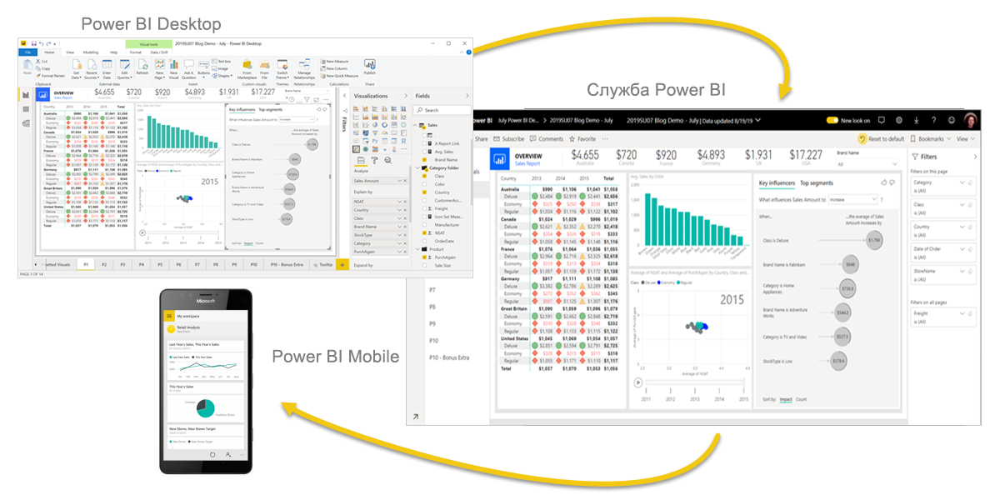
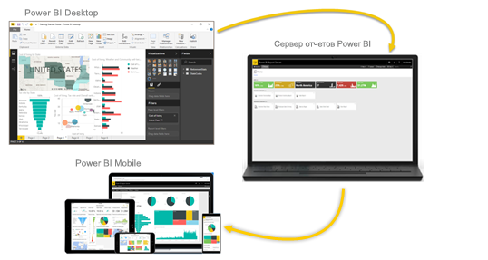

# Что такое Power BI?
**Power BI** — это коллекция программных служб, приложений и соединителей, которые взаимодействуют друг с другом, чтобы превратить разрозненные источники данных в согласованные, визуально иммерсивные и интерактивные аналитические данные. Ваши данные могут быть представлены в виде таблицы Excel или коллекции облачных и локальных гибридных хранилищ данных. Power BI позволяет легко подключаться к источникам данных, визуализировать и выделять наиболее важную информацию и делиться ею с отдельными или всеми пользователями.

## Компоненты Power BI
Power BI состоит из следующих компонентов: 
- Классическое приложение Windows — **Power BI Desktop**.
- Веб-служба SaaS (*программное обеспечение как услуга*) — **служба Power BI**. 
- **Мобильные приложения** Power BI для Windows, iOS и Android.

Три этих элемента &mdash; Power BI Desktop, служба и мобильные приложения &mdash; позволяют вам создавать и использовать бизнес-аналитику, а также обмениваться этими сведениями наиболее эффективно в контексте личных или служебных задач.

Четвертый элемент — **Сервер отчетов Power BI** — позволяет публиковать отчеты Power BI, созданные в Power BI Desktop, на локальным сервере отчетов. См. дополнительные сведения о [сервере отчетов Power BI](#on-premises-reporting-with-power-bi-report-server).

## Как Power BI соотносится с вашей ролью или должностью
Подход к использованию Power BI может зависеть от вашей роли в проекте или в рабочей группе. Другие люди, занимающие другие должности, могут использовать Power BI иначе.

Например, вы можете использовать преимущественно **службу Power BI** для просмотра отчетов и панелей мониторинга. Ваш коллега, занимающийся обработкой числовых данных и составлением бизнес-отчетов, может активно использовать **Power BI Desktop** для создания и публикации таких отчетов в службу Power BI, чтобы вы могли их просматривать. Еще один ваш коллега из отдела продаж может отдавать предпочтение **приложению Power BI для телефонов**, отслеживая квоты продаж и изучая данные о новых потенциальных клиентах.

Разработчики могут применять API-интерфейсы Power BI для отправки данных в наборы данных и для внедрения панелей мониторинга и отчетов в пользовательские приложения. Вы придумали новый визуальный элемент? Создайте его для себя и поделитесь с другими.  

Вы также можете использовать каждый из элементов Power BI в разное время в зависимости от поставленных целей и вашей роли в проекте.

Вы можете выбрать подходящий вариант использования Power BI в зависимости от того, какой компонент или служба Power BI лучше подходит для решения конкретной задачи. Например, вы можете создавать в Power BI Desktop статистические отчеты о взаимодействии с клиентами для своей группы и просматривать сведения о запасах и ходе производства с помощью панели мониторинга реального времени в службе Power BI. Вы получаете доступ сразу ко всем возможностям Power BI, что и делает этот инструмент таким универсальным и привлекательным.

Изучите документы, которые относятся к вашей роли:
- Power BI Desktop для [*разработчиков*](../desktop-what-is-desktop.md)
- Power BI для [*потребителей*](../consumer/end-user-consumer.md)
- Power BI для [*разработчиков*](../developer/what-can-you-do.md)
- Power BI для [*администраторов*](../service-admin-administering-power-bi-in-your-organization.md)

## Поток работы в Power BI
Общий поток работы с Power BI начинается с подключения к источникам данных и создания отчета в Power BI Desktop. Затем отчет публикуется из Power BI Desktop в службу Power BI, и пользователям предоставляется доступ к нему, чтобы они могли просматривать этот отчет и работать с ним с помощью службы Power BI или мобильных устройств.
Это стандартный рабочий процесс, который демонстрирует то, как три основных компонента Power BI дополняют друг друга.

В этой статье приведено подробное [сравнение Power BI Desktop и службы Power BI](../designer/service-service-vs-desktop.md).

## Локальная работа с отчетами с использованием сервера Power BI Report Server

Что делать, если вы еще не готовы перейти в облако, но вам необходимо оставить отчеты под защитой корпоративного брандмауэра?  Читайте дальше.

Вы можете создавать и развертывать отчеты Power BI, мобильные отчеты и отчеты с разбивкой на страницы, а также управлять ими в локальной среде с помощью готовых средств и служб, которые предоставляет Сервер отчетов Power BI.

Сервер отчетов Power BI развертывается под защитой брандмауэра и предоставляет пользователям доступ к отчетам разными способами, например для просмотра в веб-браузере, в приложении на мобильном устройстве или для получения по электронной почте. Так как решение "Сервер отчетов Power BI" совместимо с Power BI в облаке, вы можете легко перейти в облако в любой удобный момент. 

См. дополнительные сведения о [сервере отчетов Power BI](../report-server/get-started.md).

## Дальнейшие действия
- [Краткое руководство. Обзор службы Power BI](../service-the-new-power-bi-experience.md)   
- [Руководство. Приступая к работе со службой Power BI](../service-get-started.md)
- [Краткое руководство. Подключение к данным в Power BI Desktop](../desktop-quickstart-connect-to-data.md)
