# Основные понятия для разработчиков в службе Power BI

Цель этой статьи — дать вам общее представление о службе Power BI. Здесь описаны разные компоненты, особенности их взаимодействия друг с другом, а также способы их использования. Чтобы более эффективно работать с этой статьей, [зарегистрируйтесь для использования службы Power BI](service-self-service-signup-for-power-bi.md) и [добавьте некоторые данные](../connect-data/service-get-data.md). Для разработчика рабочий процесс начинается с создания отчетов в Power BI Desktop. Затем эти отчеты публикуются в службу Power BI, где можно продолжить их редактировать. На основе этих отчетов в службе Power BI вы можете также создавать панели мониторинга. 

Если вы работаете с этой статьей, но у вас еще нет собственных отчетов, попробуйте установить [образец данных для Power BI](../create-reports/sample-datasets.md).

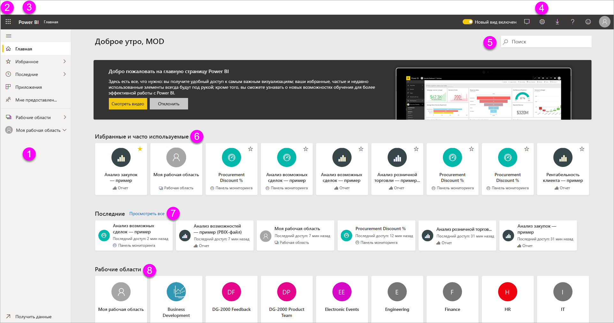

При переходе на страницу службы Power BI в браузере сначала открывается начальный экран. Отображаемые элементы приведены ниже:

1. Панель навигации
2. средство запуска приложений Microsoft 365;
3. кнопка домашней страницы Power BI;
4. кнопки со значками, включая кнопки параметров, справки и обратной связи;
5. поле поиска;
6. избранные и часто используемые панели мониторинга, отчеты и рабочие области;
7. последние использованные панели мониторинга, отчеты и рабочие области;
8. ваши рабочие области.

Для вас и пользователей ваших отчетов и панелей мониторинга в браузере отображаются одинаковые элементы службы Power BI.

Мы рассмотрим эти элементы ниже, а сейчас рассмотрим некоторые основные понятия Power BI. Или посмотрите сначала это видео.  В этом видео Уилл рассматривает основные понятия, связанные со службой Power BI.

<iframe width="560" height="315" src="https://www.youtube.com/embed/B2vd4MQrz4M" frameborder="0" allowfullscreen></iframe>

## Основные понятия Power BI
Пять основных компонентов Power BI — это: *панели мониторинга*, *отчеты*, *книги*, *наборы данных* и *потоки данных*. Все они организованы в *рабочие области* и создаются в *емкостях*.  Прежде чем мы рассмотрим эти пять компонентов, нужно разобраться с тем, что представляют собой емкости и рабочие области. Поэтому с них мы и начнем.

## Производительность
Емкости — это основная концепция Power BI, представляющая собой набор ресурсов (хранилище, процессор и память), используемых для размещения и доставки содержимого Power BI. Емкости могут быть _общими_ или _выделенными_. Общая емкость используется всеми пользователями Майкрософт, а выделенная емкость предназначена только для одного клиента. Для выделенных емкостей требуются [подписки](../admin/service-premium-what-is.md), и они подробно описаны в статье [Управление емкостями Premium](../admin/service-premium-capacity-manage.md).

По умолчанию рабочие области создаются в общей емкости. В общей емкости рабочие нагрузки выполняются на вычислительных ресурсах, совместно используемых другими пользователями. Так как емкость должна предоставлять общий доступ к ресурсам, для обеспечения "честной игры" установлены определенные ограничения, например максимальный размер модели (1 ГБ) и максимальная частота ежедневного обновления (восемь раз в день).

## Рабочие области
Рабочие области создаются в емкостях. Рабочие области — это контейнеры для панелей мониторинга, отчетов, книг, наборов данных и потоков данных в Power BI.

Есть два типа рабочих областей: *Моя рабочая область* и *рабочие области*.

- *Моя рабочая область* — это личная рабочая область любого пользователя Power BI, предназначенная для работы с собственным содержимым. Только у вас есть доступ к своему разделу "Моя рабочая область". Из этой области можно предоставлять доступ к панелям мониторинга и отчетам другим пользователям. Если нужно совместно работать над панелями мониторинга и отчетами или создать приложение, потребуется использовать рабочую область.      
-  *Рабочие области* применяются для совместной работы с коллегами и совместного использования содержимого. В эти рабочие области можно добавить коллег для совместной работы над панелями мониторинга, отчетами, книгами и наборами данных. За одним исключением все участники рабочей области должны иметь лицензии Power BI Pro. Узнайте больше о [новых рабочих областях](../collaborate-share/service-create-the-new-workspaces.md). 

    Именно в них вы создаете, публикуете и администрируете *приложения* для организации. Рассматривайте рабочие области как промежуточные области и контейнеры для содержимого, с использованием которого будет создано приложение Power BI. Что такое *приложение*? Это коллекция панелей мониторинга и отчетов, которые предоставляют пользователям Power BI ключевые метрики. Приложения являются интерактивными, но пользователи не могут изменять их. Пользователям приложения (коллегам, которым предоставлен доступ к приложениям) эти лицензии не требуются.  

Чтобы узнать больше об общем доступе, сначала прочитайте статью о [предоставлении общего доступа к панелям мониторинга](../collaborate-share/service-how-to-collaborate-distribute-dashboards-reports.md).

Теперь перейдем к пяти основным компонентам Power BI.

## Потоки данных
*Потоки данных* помогают организациям унифицировать данные из разнородных источников. Они необязательны и часто используются в сложных или крупных проектах. Они представляют данные, подготовленные и промежуточно сохраненные для использования в наборах данных. Однако они не могут использоваться напрямую в качестве источника для создания отчетов. Они используют обширную коллекцию соединителей данных Майкрософт, позволяя принимать данные из локальных и облачных источников данных.

Создавать потоки данных и управлять ими можно лишь в рабочих областях приложений (но не в области *Моя рабочая область*). Эти потоки данных хранятся в качестве сущностей в модели Common Data Model (CDM) в Azure Data Lake Storage 2-го поколения. Как правило, для них запланировано регулярное обновление, обеспечивающее хранение актуальных данных. Они отлично подходят для подготовки данных к использованию, а также для их многократного использования наборами данных. Дополнительные сведения см. в статье [Самостоятельная подготовка данных в Power BI](../transform-model/service-dataflows-overview.md).

Панели мониторинга и отчеты не могут не содержать данных (они могут быть пустыми, но это не имеет смысла, пока в них не появятся данные), поэтому начнем со знакомства с **наборами данных**.

## Наборы данных
*Набор данных* — это коллекция данных, которые вы *импортируете* или к которым *подключаетесь*. С помощью Power BI можно импортировать наборы данных различных типов, подключиться к ним и просматривать информацию по всем наборам данных в одном месте. Наборы данных также могут использовать в качестве источника данные из потоков данных.

Наборы данных связаны с *рабочими областями*, и один набор данных может быть частью нескольких рабочих областей. При открытии рабочей области связанные наборы данных отображаются на вкладке **Наборы данных**. Каждый указанный набор данных представляет один источник данных, например книгу Excel на OneDrive, локальный набор табличных данных службы SSAS или набор данных Salesforce. Уже поддерживается множество различных источников данных, и мы постоянно добавляем новые. См. список [типов наборов данных, которые могут использоваться с Power BI](../connect-data/service-get-data.md).

В следующем примере выбрана рабочая область "Продажи и маркетинг" и открыта вкладка **Наборы данных**.

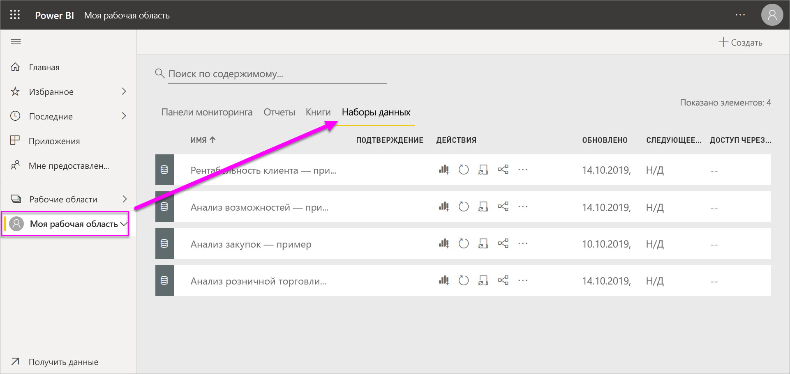

**ОДИН** набор данных...

* можно использовать многократно в одной или нескольких рабочих областях;
* можно использовать в различных отчетах;
* визуализации из этого одного набора данных можно отображать на нескольких разных панелях мониторинга.

  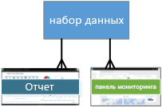

Чтобы [подключить или импортировать набор данных](../connect-data/service-get-data.md), щелкните **Получить данные** внизу области навигации. Следуйте инструкциям, чтобы подключиться к определенному источнику или импортировать его и добавить набор данных в активную рабочую область. Новые наборы данных отмечены желтой звездочкой. Те изменения, которые вы вносите в Power BI, не влияют на базовый набор данных.

Наборы данных, добавляемые одним участником рабочей области, доступны всем ее участникам с ролями *Администратор*, *Член* или *Участник*.

Наборы данных можно обновлять, переименовывать, изучать и удалять. Используйте набор данных, чтобы создать отчет с нуля или путем запуска [быстрой аналитики](../create-reports/service-insights.md).  Чтобы просмотреть, в каких отчетах и панелях мониторинга уже используется набор данных, выберите **Просмотреть похожие**. Для просмотра набора данных выберите его. При этом он откроется в редакторе отчетов, где вы сможете приступить к изучению данных путем создания визуализаций.

Сейчас мы перейдем к следующей теме: отчетам.

### Дополнительные сведения
* [Наборы данных в службе Power BI](../connect-data/service-datasets-understand.md)
* [Режимы наборов данных в службе Power BI](../connect-data/service-dataset-modes-understand.md)
* [Что такое Power BI Premium?](../admin/service-premium-what-is.md)
* [Получение данных для Power BI](../connect-data/service-get-data.md)
* [Примеры наборов данных для Power BI](../create-reports/sample-datasets.md)

## Отчеты
Отчет Power BI — это одна или несколько страниц визуализаций, например графиков, карт и диаграмм "дерево". Визуализации также называют **_визуальными элементами_**. Все визуализации отчета связаны с одним набором данных. Вы можете создавать отчеты с нуля в Power BI, импортировать их с помощью панелей мониторинга, которыми поделились ваши коллеги, или Power BI может создавать их автоматически при подключении к наборам данных из Excel, Power BI Desktop, баз данных и приложений SaaS.  Например, при подключении к книге Excel, содержащий листы Power View, Power BI создает отчет, основанный на этих таблицах. Когда вы подключаетесь к приложению SaaS, Power BI импортирует готовый отчет.

Просматривать отчеты и взаимодействовать с ними можно в *режиме чтения* и *режиме правки*. При инициировании открытия отчет открывается в режиме чтения. Если у вас есть разрешения на редактирование, вы увидите параметр **Изменить отчет** в верхнем левом углу и сможете просмотреть отчет в режиме правки.  Если отчет находится в рабочей области, любой пользователь с ролью *Администратор*, *Член* или *Участник* сможет изменить его. У них есть доступ ко всем функциям просмотра, проектирования, создания и публикации этого отчета в режиме правки. Пользователи, которым предоставлен доступ к отчету, могут просматривать его и взаимодействовать с ним в режиме чтения.   

При открытии рабочей области связанные отчеты отображаются на вкладке **Отчеты**. Каждый из перечисленных отчетов содержит одну или несколько страниц визуализаций на основе только одного базового набора данных. Чтобы открыть отчет, выберите его.

При открытии приложения отображается панель мониторинга.  Чтобы открыть базовый отчет, выберите плитку панели мониторинга (см. ниже), закрепленную из отчета. Имейте в виду, что не все плитки можно закрепить из отчетов, поэтому, возможно, потребуется щелкнуть несколько плиток, чтобы найти отчет.

По умолчанию отчет открывается в режиме чтения.  Чтобы открыть отчет в режиме редактирования (при наличии необходимых разрешений), просто выберите **Изменить отчет**.

В следующем примере выбрана рабочая область "Продажи и маркетинг" и открыта вкладка **Отчеты**.

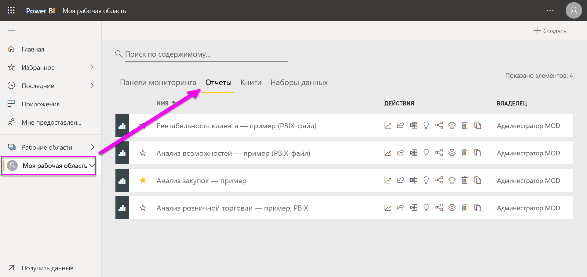

**ОДИН** отчет...

* содержится в одной рабочей области;
* может быть связан с несколькими панелями мониторинга в этой рабочей области. Плитки из одного отчета могут отображаться на нескольких панелях.
* может быть создан с использованием данных из одного набора Приложение Power BI Desktop позволяет объединить в один набор данных в отчете несколько источников данных, и этот отчет можно импортировать в Power BI.

  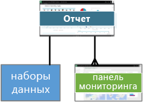

### Дополнительные сведения
- [Создание отчета в службе Power BI путем импорта набора данных](../create-reports/service-report-create-new.md)
- [Оптимизация отчетов для мобильных приложений Power BI](../create-reports/desktop-create-phone-report.md)

## Панели мониторинга
*Панель мониторинга* — это то, что вы сами создали в **службе Power BI** или ваши коллеги создали в **службе Power BI** и предоставили вам для совместного использования. Это один холст, содержащий ноль или больше плиток и мини-приложений. На каждой плитке, закрепленной из отчета или компонента [Вопросы и ответы](../consumer/end-user-q-and-a.md), отображается одна [визуализация](../visuals/power-bi-report-visualizations.md), созданная на основе набора и закрепленная на панели мониторинга. Все страницы отчета можно закрепить на панели мониторинга в качестве отдельных плиток. Добавить плитку на панель мониторинга можно различными способами, которые невозможно рассмотреть подробно в этой обзорной статье. Дополнительные сведения см. в статье [Плитки панели мониторинга в Power BI](../create-reports/service-dashboard-tiles.md).

Зачем люди создают панели мониторинга?  Вот лишь некоторые причины:

* чтобы сразу просмотреть все сведения, необходимые для принятия решений;
* чтобы отслеживать наиболее важные сведения о бизнес-процессах;
* чтобы убедиться в том, что все коллеги просматривают и используют в работе одни и те же сведения;
* для наблюдения за состоянием предприятия, продукта, подразделения, маркетинговой кампании и т. д.;
* чтобы создавать индивидуальные представления большой панели мониторинга со всеми важными метриками.

При открытии рабочей области связанные панели мониторинга отображаются на вкладке **Панели мониторинга**. Чтобы открыть панель мониторинга, выберите ее. При открытии приложения отобразится панель мониторинга.  Каждая панель мониторинга содержит настроенное представление определенной группы базовых наборов данных.  Если вы являетесь владельцем панели мониторинга, у вас также есть доступ на изменение всех базовых наборов данных и отчетов.  Если же вам предоставлен общий доступ к панели мониторинга, вы сможете взаимодействовать с панелью мониторинга и всеми базовыми отчетами, но не сможете сохранять изменения.

Вы или ваши коллеги можете [предоставлять общий доступ к панели мониторинга](../collaborate-share/service-share-dashboards.md) разными способами. Для совместного использования панели мониторинга и просмотра общей панели мониторинга требуется Power BI Pro.

**ОДНА** панель мониторинга...

* связана с одной рабочей областью;
* может отображать визуализации из многих разных наборов данных;
* может отображать визуализации из многих разных отчетов;
* может отображать визуализации, закрепленные с помощью других средств (например, Excel).

  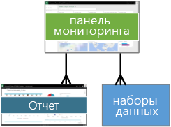

### Дополнительные сведения
* [Создание пустой панели мониторинга и получение некоторых данных](../create-reports/service-dashboard-create.md)
* [Дублирование панели мониторинга](../create-reports/service-dashboard-copy.md)
* [Создание представления панели мониторинга для телефонов](../create-reports/service-create-dashboard-mobile-phone-view.md)

## Книги
Книги — это особый тип набора данных. Если вы ознакомились с предыдущим разделом о **наборе данных**, вы знаете о книгах почти все, что необходимо. Но у вас может возникнуть вопрос, почему в одних случаях Power BI определяет книги Excel как **набор данных**, а в других — как **книги**.

При использовании действия **Получить данные** с файлами Excel вы можете выбрать *импорт* или *подключение* к файлу. Если выбрать подключение, ваша книга отобразится в Power BI так же, как в Excel Online. При этом в вашем распоряжении будет несколько удобных функций, недоступных в Excel Online, которые помогут вам закрепить элементы из листов прямо на информационных панелях.

Книгу нельзя редактировать в Power BI. Но если необходимо внести какие-либо изменения, нажмите кнопку "Изменить" и отредактируйте книгу в Excel Online или откройте ее в Excel на своем компьютере. Любые внесенные изменения сохраняются в книге в OneDrive.

### Дополнительные сведения
* [Получение данных из файлов книг Excel](../connect-data/service-excel-workbook-files.md)
* [Публикация в Power BI из Excel](../connect-data/service-publish-from-excel.md)

## Панель мониторинга в разделе "Моя рабочая область"
Мы рассмотрели рабочие области и стандартные блоки. Теперь давайте соберем их вместе и рассмотрим элементы интерфейса для работы с панелями мониторинга в службе Power BI.

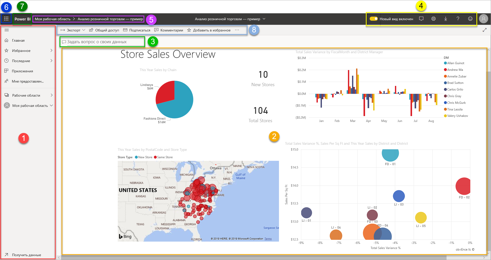

### 1. **Область навигации**
Используйте область навигации для просмотра и выбора рабочих областей и основных компонентов Power BI: панелей мониторинга, отчетов, книг и наборов данных.  

  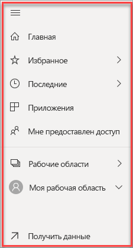

* Щелкните **Получить данные**, чтобы [добавить наборы данных, отчеты и панели мониторинга в Power BI](../connect-data/service-get-data.md).
* Чтобы развернуть или свернуть область навигации, используйте следующий значок: 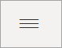.
* Открывайте избранное содержимое и управляйте им, выбрав **Избранное**.
* Просматривайте и открывайте недавно просмотренное содержимое, выбрав **Недавние**.
* Просматривайте, открывайте или удаляйте приложения, выбрав **Приложения**.
* Коллеги предоставили вам общий доступ к содержимому? Выберите **Мне предоставлен доступ** для поиска и сортировки содержимого, чтобы найти нужную информацию.
* Чтобы отобразить и открыть рабочие области, выберите **Рабочие области**.

Щелкните следующие элементы один раз:

* значок или заголовок, чтобы открыть в представлении содержимого;
* стрелку "вправо" (>), чтобы открыть всплывающее меню с элементами "Избранное", "Недавние" и "Рабочие области".
* значок шеврона, чтобы отобразился прокручиваемый список панелей мониторинга, отчетов, книг и наборов данных **Моя рабочая область**.

### 2. **Полотно**
Так как мы открыли панель мониторинга, в области полотна отображаются плитки визуализаций. Если, например, открыт редактор отчетов, в области полотна будет отображаться страница отчета.

Панели мониторинга состоят из [плиток](../create-reports/service-dashboard-tiles.md).  Плитки можно создать в представлении редактирования отчетов с помощью компонента "Вопросы и ответы" или других панелей мониторинга, либо закрепить из Excel, SSRS и других источников. Плитка особого типа, называемая [мини-приложением](../create-reports/service-dashboard-add-widget.md), добавляется непосредственно на панель мониторинга. Плитки, которые отображаются на панели мониторинга, были специально помещены туда создателем или владельцем отчета.  Добавление плитки на панель мониторинга называется *закреплением*.

Дополнительные сведения см. выше в разделе [Панели мониторинга](#dashboards).

### 3. **Окно вопросов и ответов**
Один из способов исследования данных заключается в том, чтобы задать вопрос и позволить вопросам и ответам Power BI дать ответ в форме визуализации. Окно вопросов и ответов можно использовать для добавления содержимого на панель мониторинга или в отчет.

Вопросы и ответы ищут ответ в наборах данных, подключенных к панели мониторинга.  Подключенный набор данных должен иметь по крайней мере одну плитку, закрепленную на этой панели мониторинга.

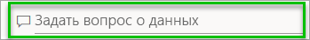

Как только вы начинаете вводить свой вопрос, вы попадаете на страницу вопросов и ответов. По мере ввода вопросы и ответы помогают вам задать правильный вопрос и найти лучший ответ, используя перефразирование, автозаполнение, предложенные варианты и многое другое. Получив нужную визуализацию (ответ), закрепите ее на панели мониторинга. Дополнительные сведения см. в статье [Вопросы и ответы в Power BI](../consumer/end-user-q-and-a.md).

### 4. **Значки в черной строке заголовка**
Значки в верхнем правом углу представляют ресурсы для параметров, уведомлений, скачиваний, получения справки, включения и отключения функции **Новый вид**, а также отправки отзывов команде Power BI.  

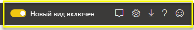

### 5. **Заголовок панели мониторинга** (путь или строки навигации)
Не всегда легко понять, какая рабочая область или панель мониторинга активна, поэтому в Power BI отображается путь навигации.  В этом примере показана рабочая область ("Моя рабочая область") и заголовок панели мониторинга ("Анализ розничной торговли — пример").  Если открыт отчет, в конец пути навигации будет добавлено имя этого отчета.  Каждая часть пути — это активная гиперссылка.  

Обратите внимание на символ "C" после заголовка панели мониторинга. Эта панель мониторинга содержит [тег классификации данных](../create-reports/service-data-classification.md) — "Конфиденциально" (Сonfidential). Тег указывает на уровень конфиденциальности и безопасности данных. Если администратор включил классификацию данных, по умолчанию этот тег будет указан для каждой панели мониторинга. Владельцы панелей мониторинга должны изменить тег для соответствия уровню безопасности своей панели мониторинга.

### 6. **Средство запуска приложений Microsoft 365**
С помощью средства запуска приложений вы можете легко получить доступ ко всем приложениям Microsoft 365 одним щелчком мыши. В этом средстве можно быстро запустить электронную почту, документы, календарь и многое другое.

### 7. **Главная страница Power BI**
Выбрав **Power BI**, вы вернетесь на главную страницу Power BI.

   

### 8. **Значки с метками в серой строке меню**
Эта область экрана содержит дополнительные параметры для взаимодействия с содержимым (в этом случае с панелью мониторинга).  Рядом с отображенными значками с метками есть меню **Дополнительные параметры (…)** . Если щелкнуть его, появятся команды для дублирования, печати, обновления панели мониторинга и выполнения других действий.

   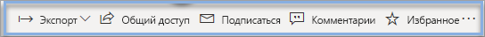

## Дальнейшие действия
- [Что такое Power BI?](power-bi-overview.md)  
- [Видео о службе Power BI](videos.md)  
- [Знакомство с редактором отчетов](../create-reports/service-the-report-editor-take-a-tour.md)
- Появились дополнительные вопросы? [Попробуйте задать вопрос в сообществе Power BI.](https://community.powerbi.com/)
