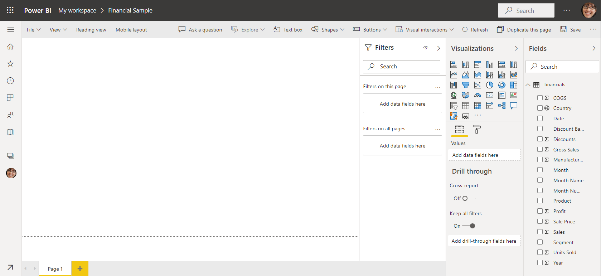
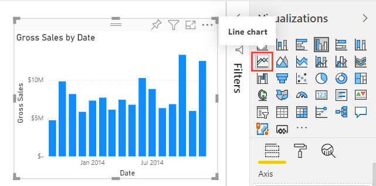
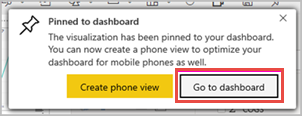
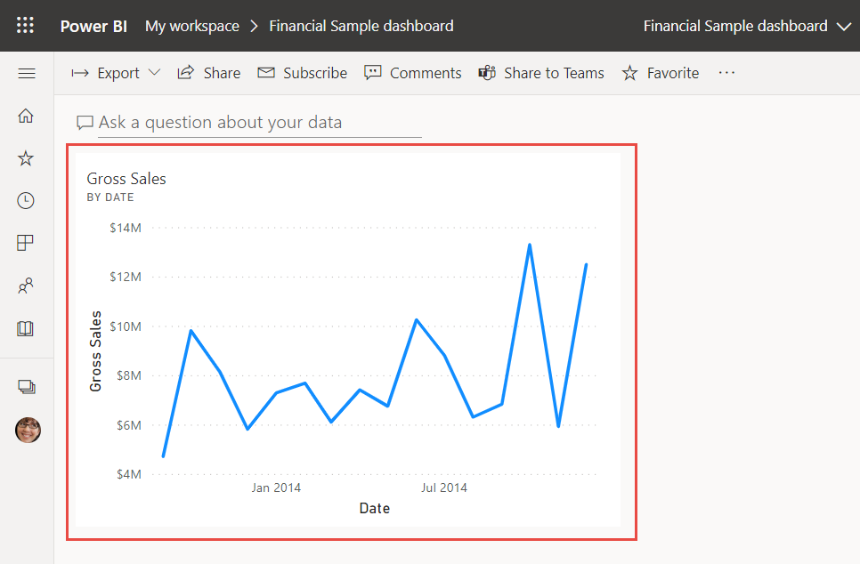
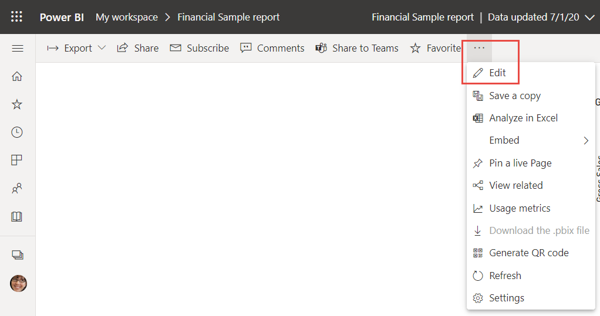
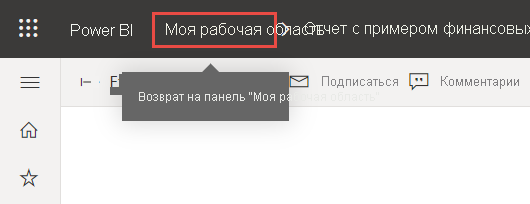
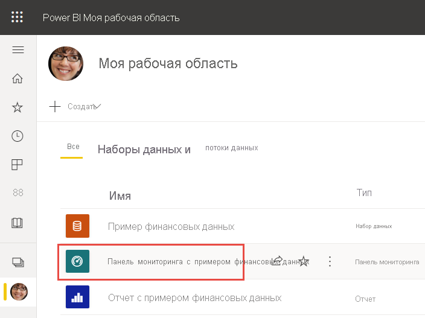
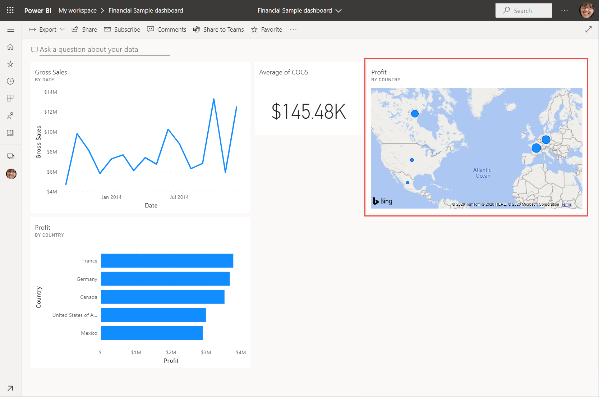
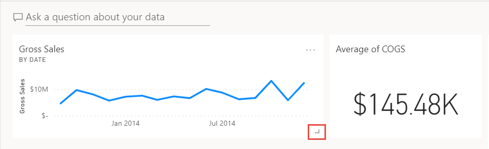
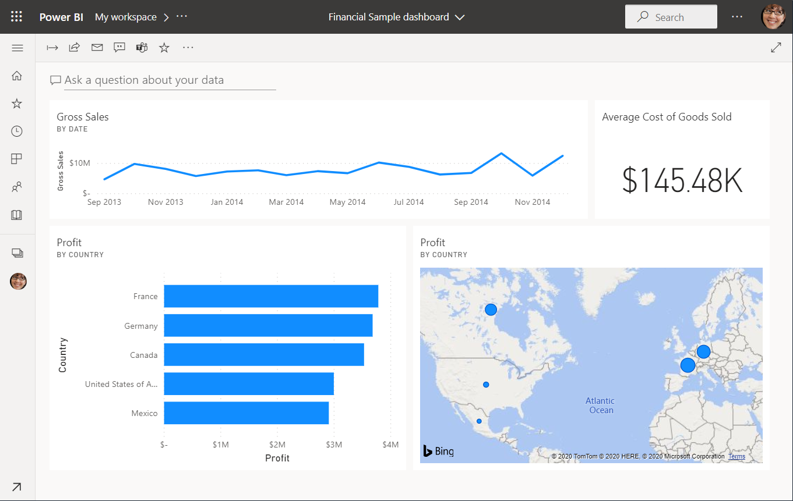

# Руководство. Приступая к работе со службой Power BI
В этом руководстве содержатся вводные сведения о некоторых функциях *службы Power BI*. Здесь вы выполните такие действия, как подключение к данным, создание отчета и панели мониторинга, а также зададите вопросы к данным. Служба Power BI позволяет выполнять гораздо больше задач. Это руководство предназначено только для того, чтобы привлечь ваш интерес. Чтобы получить представление о том, как служба Power BI связана с другими предложениями Power BI, рекомендуется ознакомиться со статьей [Что такое Power BI](power-bi-overview.md).

В этом учебнике вы выполните следующие действия:

> [!div class="checklist"]
> * войдете в учетную запись интернет-служб Power BI или зарегистрируете ее, если у вас ее еще нет;
> * откроете службу Power BI;
> * получите некоторые данные и откроете их в представлении отчетов;
> * используете эти данные для создания визуализаций и сохранения в виде отчета;
> * создадите панель мониторинга, закрепляя плитки из отчета;
> * добавите другие визуализации на панель мониторинга с помощью средства вопросов и ответов на естественном языке;
> * измените размер и порядок плиток, а также будете работать с ними на панели мониторинга;
> * выполните очистку ресурсов, удалив набор данных, отчет и панель мониторинга.

> [!TIP]
> Предпочитаете бесплатные курсы для самостоятельного обучения? [Запишитесь на наш курс по анализу и визуализации данных на сайте EdX](https://aka.ms/edxpbi).

## Регистрация в службе Power BI
Если у вас нет учетной записи Power BI, перед началом работы [пройдите регистрацию для получения бесплатной пробной версии Power BI Pro](https://app.powerbi.com/signupredirect?pbi_source=web).

После получения учетной записи введите *app.powerbi.com* в браузере, чтобы открыть службу Power BI. 

## Шаг 1. Получить данные

Часто, когда требуется создать отчет Power BI, вы начинаете работу в Power BI Desktop. На этот раз мы приступим к созданию отчета с нуля в службе Power BI.

В этом руководстве мы получаем данные из CSV-файла. Хотите попробовать? [Скачайте CSV-файл с примером финансовых данных](https://go.microsoft.com/fwlink/?LinkID=521962).

1. [Войдите в Power BI](https://www.powerbi.com/). Нет учетной записи? Не волнуйтесь, вы можете зарегистрироваться в бесплатной пробной версии.
2. Power BI откроется в браузере. В нижней части области навигации выберите **Получить данные**.

    Открывается страница **Получить данные**.   

3. В разделе **Создать новый контент** выберите **Файлы**. 
   
   
4.  Выберите **Локальный файл**.
   
    

5. Перейдите к файлу на компьютере и выберите **Открыть**.

5. В этом руководстве мы выбираем пункт меню **Импорт**, чтобы добавить набор данных из файла Excel. Этот набор данных затем будет использоваться для создания отчетов и панелей мониторинга. Если выбрать **Загрузить**, то в Power BI будет загружена вся рабочая книга Excel, которую можно открыть и редактировать в Excel в интерактивном режиме.
   
   
6. Когда набор данных будет готов, выберите **Наборы данных**, а затем щелкните **Создать отчет** рядом с набором данных **Пример финансовых данных**, чтобы открыть редактор отчетов. 

    

    Холст отчетов пуст. Справа находятся панели **Фильтры**, **Визуализации** и **Поля**.

    

7. Обратите внимание, что области навигации сверху доступен **Режим чтения**. Если этот параметр отображается, значит, вы сейчас находитесь в режиме правки. Чтобы лучше ознакомиться с редактором отчетов, см. [эту статью](../create-reports/service-the-report-editor-take-a-tour.md).

    

    В режиме правки вы можете создавать и изменять отчеты, так как вы являетесь *владельцем* отчета, то есть его *автором*. При совместном использовании отчета с коллегами они могут взаимодействовать с отчетом только в режиме чтения, то есть являются *пользователями*. Дополнительные сведения о режимах чтения и правки см. [здесь](../consumer/end-user-reading-view.md).

## Шаг 2. Создание диаграммы в отчете
Теперь, когда вы подключились к данным, начните изучать их.  Если вы нашли интересные сведения, можно создать панель мониторинга, чтобы отслеживать эти данные и наблюдать за их изменением с течением времени. Давайте посмотрим, как это работает.
    
1. В редакторе отчетов мы начнем использовать панель **Поля** в правой части страницы для создания визуализации. Установите флажки **Валовые продажи** и **Дата**.
   
   

    Power BI анализирует эти данные и создает визуализацию. Если вы сначала выбрали элемент **Дата**, отображается таблица. Если вы сначала выбрали элемент **Валовая выручка**, отобразится гистограмма. 

2. Переключитесь в другой режим отображения данных. Давайте посмотрим на эти данные в виде графика. Выберите значок графика на панели **Визуализации**.
   
   

3. Эта диаграмма кажется интересной, поэтому давайте *закрепим* ее на панели мониторинга. Наведите указатель мыши на визуализацию и выберите значок закрепления. Закрепленная визуализация будет храниться на панели мониторинга и постоянно обновляться, поэтому вы сможете быстро отслеживать последние значения.
   
   

4. Так как этот отчет новый, вам будет предложено сохранить его, прежде чем закрепить визуализацию на панели мониторинга. Укажите название отчета (например, *Продажи за период времени*), а затем щелкните **Сохранить**. 

5. Выберите вариант **Новая панель мониторинга** и присвойте ей имя *Пример финансовых данных для руководства*. 
   
   
   
6. Выберите **Закрепить**.
   
    Сообщение об успешном выполнении (рядом с правым верхним углом экрана) означает, что визуализация была добавлена на панель мониторинга в качестве плитки.
   
    

7. Выберите **Перейти к панели мониторинга**, чтобы увидеть новую панель мониторинга с графиком, закрепленным в виде плитки. 
   
   
   
8. Чтобы вернуться к отчету, выберите новую плитку на панели мониторинга. Power BI вернет вас к отчету в режиме чтения. 

1. Чтобы переключиться обратно в режим правки, в области навигации сверху выберите **Дополнительно** (…) > **Правка**. В режиме правки вы можете продолжать изучение и закрепление плиток.

    

## Шаг 3. Исследование с помощью функции "Вопросы и ответы"

Для быстрого исследования данных попробуйте задать вопрос в поле "Вопросы и ответы". Функция "Вопросы и ответы" создает запросы о данных на естественном языке. Поле вопросов и ответов находится в верхней части панели мониторинга (**Задать вопрос о своих данных**). В отчете оно находится в области навигации сверху (**Задать вопрос**).

1. Чтобы вернуться на панель мониторинга, выберите **Моя рабочая область** в черной строке **Power BI**.

    

1. На вкладке **Панели мониторинга** выберите свою панель мониторинга.

    

1. Выберите **Задать вопрос о данных**. Функция "Вопросы и ответы" автоматически предлагает ряд предложений.

    

    > [!NOTE]
    > Если вы не видите эти предложения, перейдите на **новый интерфейс функции "Вопросы и ответы"** .

2. Некоторые предложения возвращают одно значение. Например, выберите **maximum sale** (максимальная сумма продаж).

    Функция выполнит поиск ответа и представит его в виде *карточки*.

    

3. Нажмите значок закрепления,  чтобы отображать эту визуализацию на панели мониторинга "Пример финансовых данных для руководства".

1. В списке **Вопросы для начала работы** выберите пункт **average cog for each month** (средняя себестоимость продукции за каждый месяц). 

    

1. Закрепите линейчатую диаграмму на панели мониторинга **Пример финансовых данных для руководства**.

1. Поместите курсор после слов *by month* (по месяцу) в поле вопросов и ответов и введите *as line* (в виде строки). Выберите **строка (тип визуализации)** . 

    

4. Выберите **Exit Q&A** (Выйти из раздела "Вопросы и ответы"), чтобы вернуться к панели мониторинга, где вы увидите созданные плитки. 

   

   Несмотря на то, что диаграмма была изменена на график, на плитке осталась линейчатая диаграмма, так как она была закреплена именно в таком виде. 

## Шаг 4. Изменение расположения плиток

Сама по себе панель мониторинга является широкой. Для эффективного использования ее пространства можно изменить расположение плиток.

1. Перетащите правый нижний угол плитки графика *Валовые продажи* вверх, пока он не будет прикреплен на той же высоте, что и плитка "Продажи", а затем отпустите его.

    

    Теперь две плитки имеют одинаковую высоту.

    

1. Перетаскивайте плитку *Average of COGS* (Средняя себестоимость продукции) линейчатой диаграммы, пока она не будет размещена под диаграммой *Валовые продажи*.

    Так все выглядит гораздо лучше.

    

## Шаг 5. Работа с плитками

Прежде чем приступить к созданию собственных панелей мониторинга и отчетов, необходимо уделить внимание последнему моменту. Выбор разных плиток приводит к различным результатам. 

1. Сначала выберите плитку *Валовые продажи* графика, закрепленную из отчета. 

    Отчет откроется в Power BI в режиме чтения. 

2. Нажмите кнопку "Назад". 

1. Теперь выберите плитку *Average of COGS* (Средняя себестоимость продукции) линейчатой диаграммы, созданную в разделе вопросов и ответов. 

    Отчет в Power BI не откроется. Вместо этого откроется раздел "Вопросы и ответы", так как вы создали эту диаграмму именно там.

## Очистка ресурсов
Завершив работу с учебником, вы можете удалить набор данных, отчет и панель мониторинга. 

1. В области навигации должна быть открыта **Моя рабочая область**.
2. Перейдите на вкладку **Наборы данных** и найдите набор данных, который вы импортировали в рамках этого руководства.  
3. Выберите **Дополнительные параметры** (...) > **Удалить**.

    

    При удалении набора данных появится предупреждение **Все плитки отчетов и информационных панелей, содержащие данные из этого набора данных, будут также удалены**.

4. Выберите **Удалить**.

## Дальнейшие действия

Сделать панель мониторинга еще лучше можно, если добавить еще больше плиток визуализаций, а также [переименовать и связать плитки или изменить их размер и положение](../create-reports/service-dashboard-edit-tile.md).
