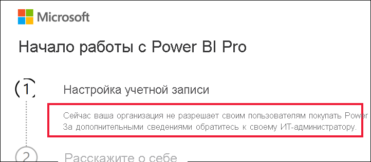

# Что делать, если приобретение Power BI Pro отключено

Вы попытались приобрести Power BI Pro и получили сообщение о том, что ваша организация не разрешает своим пользователям делать это. По различным причинам некоторые организации блокируют самостоятельное приобретение Power BI Pro.  Например, в организации может действовать политика, согласно которой все лицензии и подписки управляются центральным ИТ-отелом или службой поддержки. 

## Решение
Чтобы завершить покупку, обратитесь в ИТ-отдел или службу поддержки и попросите [выполнить эти инструкции для предоставления вам лицензии](../admin/service-admin-manage-licenses.md).

## Дальнейшие действия
[Функции Power BI по типам лицензий](service-features-license-type.md)