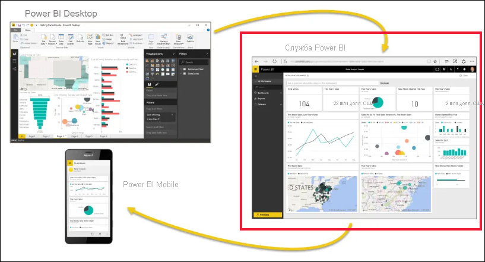
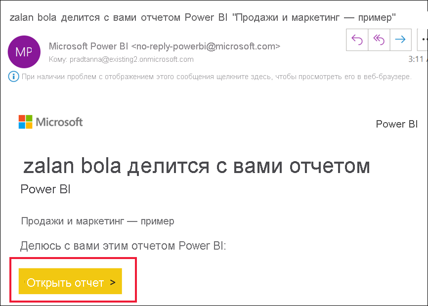
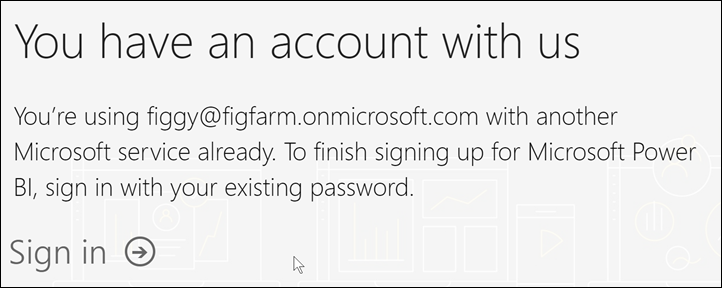
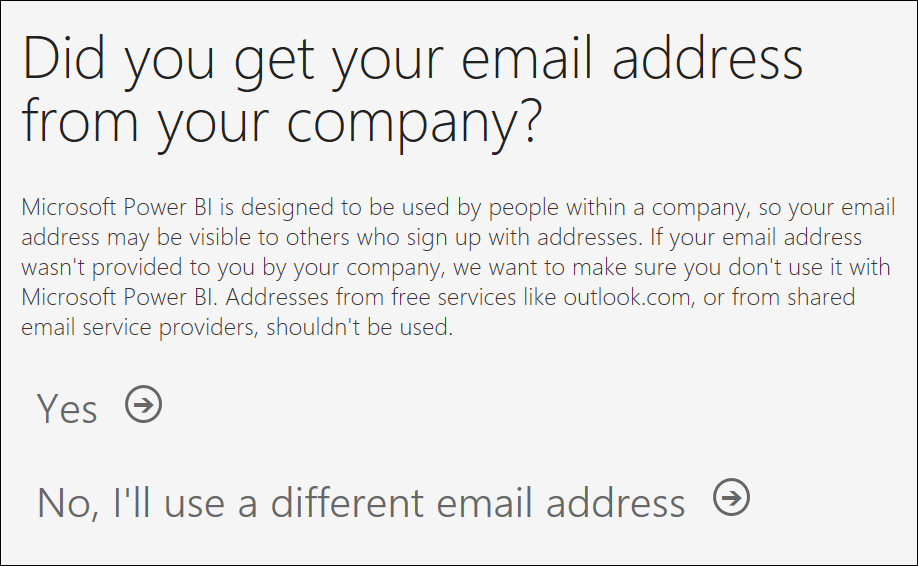
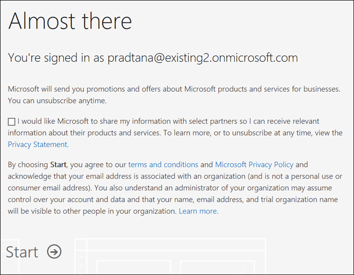

# Регистрация отдельного пользователя в службе Power BI

Power BI может выступать в качестве вашего личного инструмента анализа и визуализации данных, а также служить механизмом анализа и принятия решений для групповых проектов, подразделений или целых корпораций. В этой статье объясняется, как зарегистрировать личную учетную запись в Power BI. Если вы являетесь глобальным администратором или администратором выставления счетов, ознакомьтесь со статьей о [лицензировании Power BI для организации](../admin/service-admin-licensing-organization.md).

## Что такое Power BI?
Power BI — это унифицированная, самостоятельная и корпоративная платформа бизнес-аналитики, которая сочетает интуитивно понятный пользовательский интерфейс с интеллектуальными визуализациями данных для обеспечения более подробного анализа данных. Отчеты можно совместно использовать в таких средствах Майкрософт, как Teams, SharePoint, PowerPoint или в других эффективных продуктах. Услуга предлагается как веб-служба SaaS (программное обеспечение как услуга) с двумя вспомогательными приложениями: классическим приложением Microsoft Windows, именуемым Power BI Desktop, для создания отчетов и собственными мобильными приложениями бизнес-аналитики для использования отчетов на устройствах iOS и Android. 

Три этих элемента — Power BI Desktop, служба и мобильные приложения — позволяют пользователям создавать и использовать бизнес-аналитику, а также обмениваться этими сведениями наиболее эффективно в контексте личных или служебных задач.

## Регистрация в службе Power BI
В этой статье описан процесс регистрации отдельного пользователя **в службе Power BI**. Если вы ищете информацию о скачивании Power BI Desktop или установке мобильных приложений, ознакомьтесь со следующими статьями:
- [Power BI Desktop (можно скачать бесплатно)](desktop-get-the-desktop.md).    
- [Мобильные приложения Power BI (также можно скачать бесплатно)](../consumer/mobile/mobile-apps-for-mobile-devices.md).

## Поддерживаемые адреса электронной почты

Прежде чем приступать к процедуре регистрации, важно разобраться в типах адресов электронной почты, которые можно использовать для регистрации в Power BI.

* Для регистрации в Power BI необходим рабочий или учебный адрес электронной почты. Вы не сможете зарегистрироваться с помощью адреса, предоставленного общедоступной службой электронной почты или поставщиком телекоммуникационных услуг. К их числу относятся платформы outlook.com, hotmail.com, gmail.com и т. д. Если у вас нет рабочей или учебной учетной записи, [узнайте о других способах регистрации](../admin/service-admin-signing-up-for-power-bi-with-a-new-office-365-trial.md).

* Вы можете зарегистрироваться в Power BI с адресами .gov или .mil, однако процедура отличается. Дополнительные сведения см. в статье [Регистрация государственных организаций США в службе Power BI](../admin/service-govus-signup.md).

## Регистрация в службе Power BI

Выполните следующие действия, чтобы зарегистрировать учетную запись Power BI. После завершения этого процесса вы получите лицензию на Power BI (бесплатная версия), которую можно использовать для самостоятельной работы со службой Power BI с помощью раздела "Моя рабочая область", использования содержимого из рабочей области Power BI, назначенной емкости Power BI Premium или запуска личной пробной версии Power BI Pro. Дополнительные сведения см. в разделе [Функции Power BI по типам лицензий](service-features-license-type.md). 

Конкретные действия для регистрации могут зависеть от вашей организации и того, что вы выбрали для запуска процесса. По этой причине вы, возможно, не увидите все экраны, показанные ниже. Существует множество способов регистрации отдельного пользователя в службе Power BI, и действия, описанные в этой статье, относятся к двум наиболее распространенным.
- Нажмите кнопку **Попробовать бесплатно** или **Начать бесплатно**1.     
- Вы получаете сообщение по электронной почте со ссылкой на панель мониторинга Power BI, отчет или приложение. (Если вы еще не входили в учетную запись Power BI.)

    1 Вы найдете кнопки **Попробовать бесплатно** в соответствующих продуктах Майкрософт на сайте powerbi.microsoft.com, а также в документации и маркетинговых статьях.

### Step 1

- Выберите **Начать бесплатно** или **Попробовать бесплатно** на сайте [powerbi.microsoft.com](https://powerbi.com). Может потребоваться дважды нажать кнопку.

        

- Или щелкните в электронном письме ссылку на панель мониторинга Power BI, отчет или приложение.

    

1. Microsoft 365 распознает вас, а также содержит информацию о том, что у вас уже установлена служба Майкрософт. Выберите **Войти**.

    

1. Может появиться одно из этих диалоговых окон. 
    - Если отобразится запрос, войдите с помощью своей учетной записи в организации.

        

    - Если вы получите подобное сообщение, убедитесь, что вы используете рабочий или учебный электронный адрес, а не адрес потребителя, например Hotmail, Gmail или Outlook. Ознакомьтесь с [поддерживаемыми адресами электронной почты выше](#supported-email-addresses).

       

    - Если вы получили подобное сообщение, просмотрите условия. Если вы принимаете их, нажмите кнопку **Начать**. 

        

1. При необходимости пригласите коллег присоединиться к вам.

       

1. На этом этапе, возможно, придется подождать, пока Майкрософт [настроит новый клиент](../admin/service-admin-signing-up-for-power-bi-with-a-new-office-365-trial.md). В противном случае Power BI откроется в браузере.

        

## Регистрация для получения бесплатной пробной версии Power BI Pro для отдельного пользователя
Поздравляем с первым входом в учетную запись Power BI! Теперь у вас есть бесплатная лицензия2. Когда вы начнете изучать службу Power BI, вы увидите всплывающие окна с вопросом, хотите ли вы выполнить обновление до бесплатной пробной версии Power BI Pro для отдельного пользователя. [Для некоторых функций службы Power BI требуется лицензия Pro](../consumer/end-user-license.md). Если вы хотите работать с бесплатной пробной версией Power BI Pro для отдельного пользователя в течение 60 дней, выберите **Начать бесплатно**.  

2 В некоторых организациях ваша учетная запись Power BI по умолчанию может иметь лицензию Power BI **Pro**. Например, некоторые версии Microsoft 365 включают лицензию Power BI Pro. Дополнительные сведения о поиске пользовательской лицензии см. в статье [Какая у меня лицензия Power BI?](../consumer/end-user-license.md)

## Срок действия пробной версии

После истечения срока действия бесплатной пробной версии Power BI Pro ваша лицензия меняется обратно на лицензию Power BI (бесплатная версия). Пробная версия не может быть продлена. Вы теряете доступ к функциям, для работы с которыми требуется лицензия Power BI Pro. Дополнительные сведения см. в разделе [Функции по типам лицензий](service-features-license-type.md).

Если вам достаточно лицензии на Power BI (бесплатная версия), вам не нужно предпринимать никаких других действий. Чтобы воспользоваться преимуществами Power BI Pro, приобретите лицензию Pro, выбрав **Купить сейчас** или посетив страницу [цен на Power BI](https://powerbi.microsoft.com/pricing).

Если самостоятельное приобретение не доступно, обратитесь к администратору по поводу приобретения лицензии Power BI Pro.

## Устранение неполадок в процессе регистрации

Как правило, вы можете зарегистрироваться в Power BI, следуя описанной выше процедуре. Некоторые проблемы, которые могут помешать регистрации, описаны в таблице ниже с возможными обходными решениями.

**Личные адреса электронной почты**. Вы пытаетесь зарегистрироваться с использованием личных адресов электронной почты (например, nancy@gmail.com) и получаете примерно такое сообщение. 

*Вы указали личный адрес электронной почты. Введите рабочий адрес электронной почты, чтобы мы могли обеспечить безопасное хранение данных вашей компании.*

или

*Возможно, это личный адрес электронной почты. Введите свой рабочий адрес для подключения к другим пользователям в организации. Не беспокойтесь. Мы никому не сообщим ваш адрес.*

**Решение** Power BI не поддерживает адреса электронной почты, предоставляемые службами потребительской электронной почты или поставщиками телекоммуникационных услуг. Чтобы завершить регистрацию, повторите попытку, используя адрес электронной почты, назначенный вам на работе или в школе. 

Если вам по-прежнему не удается зарегистрироваться и вы хотите выполнить более сложную процедуру установки, вы можете [зарегистрироваться для получения новой пробной подписки Microsoft 365 и использовать для регистрации полученный адрес электронной почты](../admin/service-admin-signing-up-for-power-bi-with-a-new-office-365-trial.md). 

Кроме того, вы можете попросить существующего пользователя [пригласить вас в качестве гостя](../admin/service-admin-azure-ad-b2b.md). 

[!INCLUDE[self-service-signup](../includes/self-service-signup-help.md)]

**Адрес электронной почты не является идентификатором Microsoft 365**. Во время регистрации вы получаете примерно следующее сообщение об ошибке.

*Не удается найти вас в contoso.com.  Вы используете другой идентификатор на работе или в школе?  Попробуйте войти в систему, используя этот идентификатор. Если это не поможет, обратитесь в ИТ-отдел.*

**Решение**. Ваша организация использует для входа в Microsoft 365 и другие службы Майкрософт идентификаторы, которые отличаются от адреса электронной почты.  Например, у вас может быть адрес электронной почты zalan.bola@contoso.com, а идентификатор — zalanb@contoso.com.

Чтобы завершить регистрацию, используйте идентификатор, назначенный вам организацией, для входа в Microsoft 365 или другие службы Майкрософт.  Если вы его не знаете, обратитесь к глобальному администратору.  

Если вам по-прежнему не удается зарегистрироваться и вы хотите выполнить более сложную процедуру установки, вы можете [зарегистрироваться для получения новой пробной подписки Microsoft 365 и использовать для регистрации полученный адрес электронной почты](../admin/service-admin-signing-up-for-power-bi-with-a-new-office-365-trial.md).

**При входе в Power BI пароль не распознается**

**Решение**. Иногда нужно сделать несколько попыток. Если вы ввели пароль несколько раз и по-прежнему не можете войти в систему, попробуйте запустить браузер в режиме инкогнито (Chrome) или InPrivate (Edge).

## Дальнейшие действия

[Функции Power BI по типам лицензий](../consumer/end-user-features.md)    
[Советы по получению помощи](../fundamentals/service-tips-for-finding-help.md)    

Появились дополнительные вопросы? [Попробуйте задать вопрос в сообществе Power BI.](https://community.powerbi.com/)
