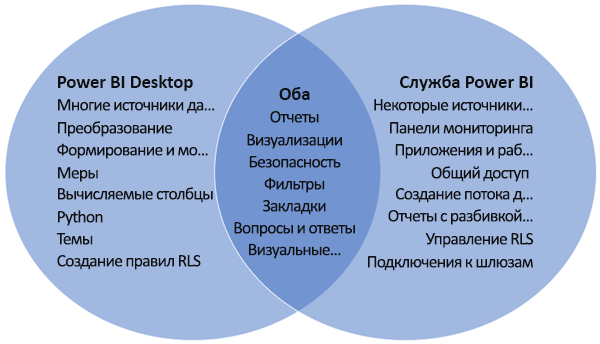

# Сравнение Power BI Desktop и службы Power BI

На представленной ниже диаграмме Венна область в середине показывает, в чем пересекаются возможности Power BI Desktop и службы Power BI. Некоторые задачи можно выполнять как в Power BI Desktop, так и в службе. На непересекающихся частях диаграммы представлены уникальные возможности приложения и службы.  

**Power BI Desktop** — это полнофункциональное средство для анализа данных и создания отчетов, которое можно установить бесплатно на локальном компьютере. Оно включает в себя редактор запросов, который позволяет подключаться к разным источникам данных, а также объединять их в модели данных (этот процесс называется моделированием). На основе этих моделей данных затем разрабатываются отчеты. В [руководстве по началу работы с Power BI Desktop](desktop-getting-started.md) приводятся пошаговые инструкции.

**Служба Power BI** — это облачная служба. Она предоставляет базовые возможности редактирования отчетов и совместной работы для рабочих групп и организаций. В службе Power BI также можно подключаться к источникам данных, но возможности моделирования ограничены.

Большинство разработчиков отчетов Power BI, работающих над проектами бизнес-аналитики, применяют **Power BI Desktop** для создания отчетов Power BI, а **службу Power BI** — для их распространения и совместной работы.

Служба Power BI также размещает *отчеты с разбивкой на страницы* в рабочих областях, развернутых в емкости Premium Power BI. Отчеты с разбивкой на страницы можно создавать с помощью построителя отчетов Power BI. Дополнительные сведения о том, как Power BI поддерживает отчеты с разбивкой на страницы, см. в разделе [Сравнение отчетов Power BI и отчетов с разбивкой на страницы](../paginated-reports/paginated-reports-report-builder-power-bi.md#compare-power-bi-reports-and-paginated-reports). для получения дополнительных сведений.

## Изменение отчетов Power BI

Как в приложении, так и в службе можно создавать и редактировать *отчеты Power BI*. Отчет может иметь одну или несколько страниц с визуальными элементами и их коллекциями. Добавляйте закладки, кнопки, фильтры и детализации, чтобы упростить навигацию по отчетам.

Редакторы в Power BI Desktop и в службе аналогичны. Они состоят из трех разделов:  

1. верхних областей навигации сверху, которые отличаются в службе Power BI и Power BI Desktop;    
2. Холст отчетов     
3. областей **Поля**, **Визуализации** и **Фильтры**.

В этом видео демонстрируется редактор отчетов в Power BI Desktop. 

<iframe width="560" height="315" src="https://www.youtube.com/embed/IkJda4O7oGs" frameborder="0" allowfullscreen></iframe>

## Работа в службе Power BI

### Совместная работа

Создав отчеты, вы можете сохранить их в *рабочей области* в **службе Power BI**, где вы ведете совместную работу с коллегами. На основе отчетов создаются *панели мониторинга*. Затем вы предоставляете доступ к панелям мониторинга и отчетам пользователям в вашей организации и за ее пределами. Пользователи отчетов просматривают их в службе Power BI в *представлении чтения*, но не в представлении редактирования. Они имеют доступ не ко всем функциям, имеющимся у создателей отчетов.  Вы также можете предоставлять общий доступ к наборам данных, чтобы другие пользователи могли создавать собственные отчеты на их основе. Изучите дополнительные сведения о [совместной работе в службе Power BI](../collaborate-share/service-new-workspaces.md).

### Самостоятельная подготовка данных с помощью потоков данных

Потоки данных помогают организациям объединять данные из разнородных источников и готовить их к моделированию. Аналитики смогут легко создавать потоки данных с помощью уже знакомых инструментов для самостоятельной работы. Аналитики используют потоки данных, чтобы принимать, преобразовывать, интегрировать и дополнять большие данные, определяя подключения к с источникам данных, логику извлечения, преобразования и загрузки, расписания обновления и многое другое. Изучите дополнительные сведения о [самостоятельной подготовке данных с помощью потоков данных](../transform-model/service-dataflows-overview.md).

## Дальнейшие действия

[Что такое Power BI Desktop?](desktop-what-is-desktop.md)

[Создание отчета](../create-reports/service-report-create-new.md) в службе Power BI

[Основные понятия для разработчиков отчетов](service-basic-concepts.md)

Появились дополнительные вопросы? [Ответы на них см. в сообществе Power BI.](https://community.powerbi.com/)
