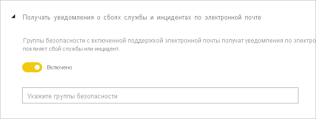
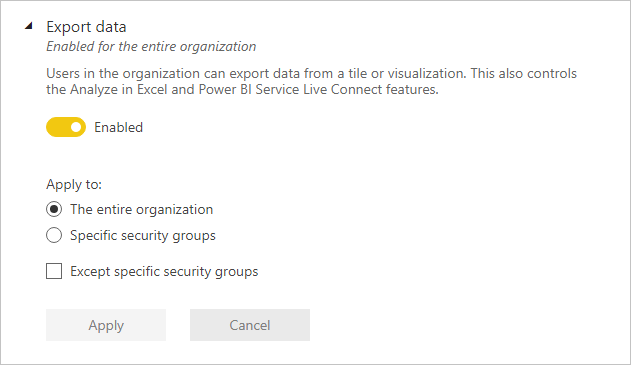
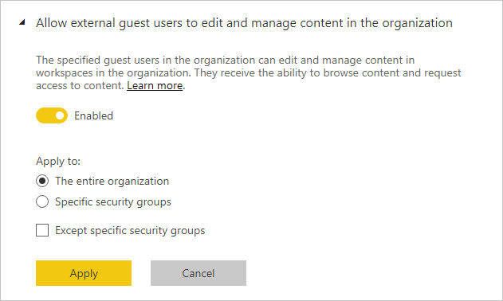

# Руководство по параметрам администрирования клиента

Эта статья предназначена для администраторов Power BI, которые отвечают за настройку среды Power BI в своих организациях.

Мы предоставляем указания по параметрам клиента, которые помогают улучшить работу с Power BI или могут подвергнуть организацию риску. Мы рекомендуем всегда настраивать клиент в соответствии с политиками и процессами организации.

Управление [параметрами клиента](../admin/service-admin-portal.md#tenant-settings) осуществляется на [портале администрирования](https://app.powerbi.com/admin-portal/tenantSettings). Настраивать их может [администратор службы Power BI](../admin/service-admin-administering-power-bi-in-your-organization.md#administrator-roles-related-to-power-bi). Многие параметры клиента ограничивают доступ к возможностям и функциям, разрешая его лишь узкому кругу пользователей. Поэтому мы рекомендуем сначала ознакомиться с этими параметрами, прежде чем планировать необходимые группы безопасности. Может оказаться, что одну и ту же группу можно использовать для нескольких параметров.

## Улучшение работы с Power BI

### Публикация сведений раздела справки

Мы рекомендуем настроить внутренние сайты, связанные с Power BI, с помощью [Microsoft Teams](/microsoftteams) или другой платформы совместной работы. На них можно хранить обучающую документацию, проводить обсуждения, запрашивать лицензии или оказывать помощь.

В этом случае мы рекомендуем включить параметр **Публикация сведений раздела справки** _для всей организации_. Он находится в группе **Параметры справки и поддержки**. Вы можете настроить URL-адреса для следующих целей:

- обучающая документация;
- форум обсуждения;
- запросы лицензирования;
- служба технической поддержки.

Эти URL-адреса будут доступны как ссылки в меню справки Power BI.

> [!NOTE]
> Наличие URL-адреса для **отправки запросов на лицензирование** позволяет предотвратить покупку лицензии Power BI Pro отдельными пользователями. Вместо этого они будут направляться на внутренний сайт со сведениями о получении лицензии. Параметр **Разрешить пользователям опробовать Power BI Pro** включен по умолчанию и разделяет возможности приобретения лицензии и использования пробной версии. Дополнительные сведения о взаимодействии этих параметров см. в разделе [Предоставление пользователям разрешения на пробное использование Power BI Pro](../admin/service-admin-portal.md#allow-users-to-try-power-bi-pro).
>
>

Подробные сведения см. в разделе [Параметры справки и поддержки](../admin/service-admin-portal.md#help-and-support-settings).

## Управление рисками.
С помощью параметров управления рисками можно задавать политики управления в клиенте Power BI. Однако следует иметь в виду, что параметры управления не являются средством защиты. Например, при отключении параметра **Экспорт данных** из пользовательского интерфейса Power BI удаляется соответствующая функция и пользователи Power BI могут работать в соответствии с политиками управления организации, но при этом определенные пользователи могут экспортировать данные другими способами. С точки зрения безопасности пользователь Power BI с доступом на чтение к набору данных может отправлять запросы к этому набору данных и сохранять результаты независимо от функций, доступных в пользовательском интерфейсе Power BI.
### Получать уведомления о сбоях службы и инцидентах по электронной почте

Вы можете получать по электронной почте уведомления, если на ваш клиент влияет сбой службы или инцидент. Таким образом можно своевременно реагировать на инциденты.

Мы рекомендуем включить параметр **Получать уведомления о сбоях службы и инцидентах по электронной почте**. Он находится в группе **Параметры справки и поддержки**. Назначьте одну или несколько групп безопасности _с поддержкой электронной почты_.

### Защита информации

Защита информации позволяет применять параметры защиты, такие как шифрование или водяные знаки, при экспорте данных из службы Power BI.

Имеются два параметра клиента, связанные с защитой информации. По умолчанию оба они отключены для всей организации.

Мы рекомендуем включить эти параметры, если требуется обрабатывать и защищать конфиденциальные данные. Дополнительные сведения см. в статье [Защита данных в Power BI](../admin/service-security-data-protection-overview.md).

### Создание рабочих областей

Вы можете ограничить возможности пользователей по созданию рабочих областей. Таким образом можно управлять тем, что пользователи создают в вашей организации.

> [!NOTE]
> В настоящее время происходит переход на новый интерфейс рабочих областей. Этот параметр клиента относится только к новому интерфейсу.

По умолчанию параметр **Создание рабочих областей** включен для всей организации. Он находится в группе **Параметры рабочей области**.

Мы рекомендуем назначить одну или несколько групп безопасности. Им можно предоставить разрешение на создание рабочих областей или _запретить_ создавать их.

Обязательно включите в документацию инструкции по запросу новой области для пользователей, у которых нет прав на создание рабочих областей.

### Предоставление внешним пользователям общего доступа к содержимому

Пользователи могут предоставлять доступ к отчетам и панелям мониторинга людям за пределами вашей организации.

По умолчанию параметр **Предоставление внешним пользователям общего доступа к содержимому** включен для всей организации. Он находится в группе **Параметры экспорта и совместного доступа**.

Мы рекомендуем назначить одну или несколько групп безопасности. Им можно разрешить _или запретить_ предоставление доступа к содержимому внешним пользователям.

### Опубликовать в Интернете

Функция [публикации в Интернете](../collaborate-share/service-publish-to-web.md) позволяет публиковать общедоступные отчеты в Интернете. В случае ненадлежащего использования есть риск раскрытия конфиденциальной информации в Интернете.

По умолчанию параметр **Опубликовать в Интернете** включен для всей организации, но возможность создавать коды внедрения для пользователей без прав администратора ограничена. Он находится в группе **Параметры экспорта и совместного доступа**.

Если этот параметр включен, мы рекомендуем назначить одну или несколько групп безопасности. Им можно предоставить разрешение на публикацию отчетов или _запретить_ публиковать их.

Кроме того, можно выбрать способ работы кодов внедрения. По умолчанию выбран вариант **Разрешить только существующие коды**. Это означает, что пользователям будет необходимо обращаться к администратору Power BI за созданием кода внедрения.

Мы также рекомендуем регулярно проверять [коды внедрения для публикации в Интернете](https://app.powerbi.com/admin-portal/embedCodes). Удаляйте коды, если они приводят к публикации личной или конфиденциальной информации.

### Экспорт данных

Вы можете ограничить возможности пользователей по экспорту данных с плиток панелей мониторинга и из визуальных элементов отчетов.

По умолчанию параметр **Экспорт данных** включен для всей организации. Он находится в группе **Параметры экспорта и совместного доступа**.

Мы рекомендуем назначить одну или несколько групп безопасности. Им можно предоставить разрешение на публикацию отчетов или _запретить_ публиковать их.

> [!IMPORTANT]
> Отключение этого параметра также запрещает использовать функцию [анализа в Excel](../collaborate-share/service-analyze-in-excel.md) и функцию [динамического подключения](../connect-data/desktop-report-lifecycle-datasets.md#using-a-power-bi-service-live-connection-for-report-lifecycle-management) к службе Power BI.

> [!NOTE]
> Если пользователям разрешен экспорт данных, вы можете усилить безопасность, применив [защиту данных](../admin/service-security-data-protection-overview.md). Когда она настроена, неавторизованные пользователи не могут экспортировать содержимое с метками конфиденциальности.

### Разрешение внешним гостям отслеживать и изменять содержимое в организации

Внешним пользователям-гостям можно разрешить изменять содержимое Power BI и управлять им. Дополнительные сведения см. в статье [Предоставление содержимого Power BI внешним гостевым пользователям с помощью Azure AD B2B](../admin/service-admin-azure-ad-b2b.md).

По умолчанию параметр **Разрешение внешним гостям отслеживать и изменять содержимое в организации** отключен для всей организации. Он находится в группе **Параметры экспорта и совместного доступа**.

Если нужно разрешить внешним пользователям изменять содержимое и управлять им, мы рекомендуем назначить одну или несколько групп безопасности. Им можно предоставить разрешение на публикацию отчетов или _запретить_ публиковать их.

### Параметры разработчика

Имеются два параметра клиента, связанные с [внедрением содержимого Power BI](../developer/embedded/embedding.md). К ним относятся:

- Встроенное содержимое в приложениях (по умолчанию включен)
- Разрешение субъектам-службам использовать API-интерфейсы Power BI (по умолчанию отключен)

Если вы не планируете использовать API-интерфейсы разработчика для внедрения содержимого, рекомендуется отключить их. В противном случае желательно настроить группы безопасности, которым будет разрешено использовать их.

## Дальнейшие действия

Дополнительные сведения, связанные с темой этой статьи, см. в следующих ресурсах.

- [Что такое администрирование Power BI?](../admin/service-admin-administering-power-bi-in-your-organization.md)
- [Администрирование Power BI на портале администрирования](../admin/service-admin-portal.md)
- У вас появились вопросы? [Попробуйте задать вопрос в сообществе Power BI.](https://community.powerbi.com/)
- У вас есть предложения? [Идеи по улучшению Power BI](https://ideas.powerbi.com)