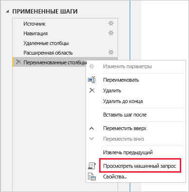
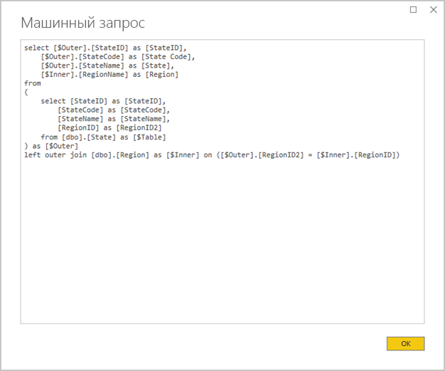
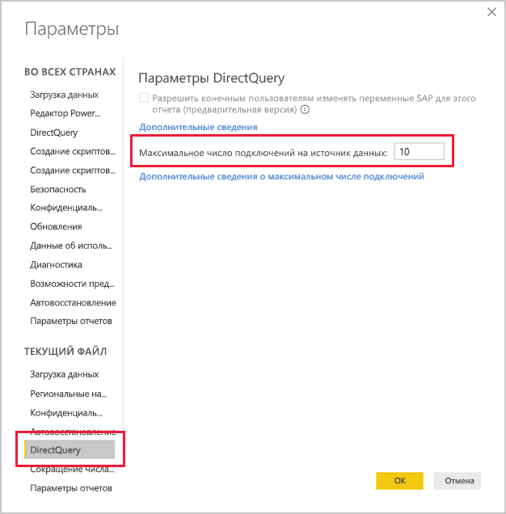
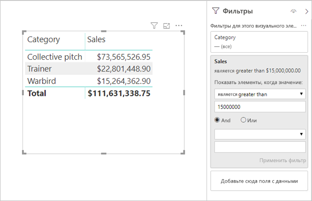

# <a name="directquery-model-guidance-in-power-bi-desktop"></a>Руководство по использованию модели DirectQuery в Power BI Desktop

Эта статья ориентирована на разработчиков моделей данных DirectQuery для Power BI, использующих Power BI Desktop или службу Power BI. В ней описываются варианты использования DirectQuery, а также существующие ограничения и рекомендации по применению этого режима. В частности, это руководство поможет вам определить, подходит ли режим DirectQuery для вашей модели, а также повысить производительность отчетов, основанных на моделях DirectQuery. Эта статья посвящена моделям DirectQuery, размещаемым в службе Power BI или на сервере отчетов Power BI.

Исчерпывающее описание проектирования с использованием схемы модели DirectQuery выходит за рамки данной статьи. Общую информацию см. в статье [Модели DirectQuery в Power BI Desktop](../connect-data/desktop-directquery-about.md). Более подробное обсуждение приводится в документе [DirectQuery в службах SQL Server 2016 Analysis Services](https://download.microsoft.com/download/F/6/F/F6FBC1FC-F956-49A1-80CD-2941C3B6E417/DirectQuery%20in%20Analysis%20Services%20-%20Whitepaper.pdf). Обратите внимание, что в этом документе описывается применение DirectQuery в SQL Server Analysis Services. Тем не менее по большей части это содержимое применимо и к моделям DirectQuery в Power BI.

В этой статье составные модели не рассматриваются напрямую. Такие модели могут содержать один или более источников DirectQuery. Таким образом, приведенные в этой статье рекомендации как минимум частично применимы к схеме составной модели. Тем не менее проблемы, связанные с объединением таблиц импорта и таблиц DirectQuery, выходят за рамки этой статьи. Дополнительные сведения см. в статье [Использование составных моделей в Power BI Desktop](../transform-model/desktop-composite-models.md).

Важно понимать, что применением моделей DirectQuery сопряжено с особой рабочей нагрузкой на среду Power BI (служба Power BI или Сервер отчетов Power BI) и базовые источники данных. Если вы выбрали схему DirectQuery, рекомендуется привлечь к участию в проекте специалистов в этой предметной области. Успешное развертывание модели DirectQuery зачастую требует сплоченной совместной работы целой группы ИТ-профессионалов. Как правило, в состав такой группы входят разработчики моделей и администраторы баз данных-источников. Помимо них, к участию в проекте могут привлекаться разработчики архитектуры и хранилища данных, а также разработчики функций извлечения, преобразования и загрузки. Кроме того, для достижения высокой производительности часто требуется провести оптимизацию непосредственно в самом источнике данных.

## <a name="design-in-power-bi-desktop"></a>Проектирование в Power BI Desktop

Подключения к источникам хранилища данных SQL Azure и Azure HDInsight Spark могут устанавливаться напрямую без применения Power BI Desktop. Такая схема реализуется в службе Power BI путем получения данных и выбора плитки "Базы данных". Дополнительные сведения см. в статье [Хранилище данных SQL Azure с DirectQuery](../connect-data/service-azure-sql-data-warehouse-with-direct-connect.md).

Тем не менее, несмотря на удобство, применять такой подход не рекомендуется. Основная причина заключается в том, что в таком случае будет невозможно обновить структуру модели в соответствии с изменением схемы базового источника данных.

Таким образом, для создания всех моделей DirectQuery и управления ими мы рекомендуем использовать Power BI Desktop. Такой подход обеспечивает полный контроль над определением необходимой модели, включая применение таких поддерживаемых функций, как иерархии, вычисляемые столбцы, меры и другие. Кроме того, в этом случае вы сможете при необходимости пересматривать модель в соответствии с изменением схемы базового источника данных.

## <a name="optimize-data-source-performance"></a>Оптимизация производительности источника данных

Реляционную базу данных-источник можно оптимизировать разными способами, которые описываются в приведенном ниже списке.

> [!NOTE]
> Мы понимаем, что не у всех разработчиков моделей есть разрешения и навыки, необходимые для оптимизации реляционной базы данных. Несмотря на то, что подготовку данных для модели DirectQuery рекомендуется осуществлять именно на этом уровне, в определенной части оптимизировать модель можно и не изменяя базу данных-источник. Тем не менее наиболее эффективными будут результаты оптимизации, проводимой на уровне базы данных-источника.

- **Проверьте целостность данных.** Особенно важно, чтобы таблицы измерений включали столбец уникальных значений (ключ измерения), который сопоставляется с таблицей или таблицами фактов. Кроме того, столбцы измерений фактов должны содержать допустимые значения ключа измерений. Такой подход позволяет реализовать более эффективные связи в рамках модели, которые предполагают наличие сопоставленных значений по обе стороны связи. При проблемах с целостностью источника данных рекомендуется добавить запись "неизвестного" измерения, что позволит эффективно исправить данные. Например, в таблицу **Продукт** можно добавить строку, представляющую неизвестный продукт, и назначить ей выходящий за рамки диапазона ключ, к примеру –1. В таком случае, если в строках таблицы **Продажи** будет отсутствовать ключ продукта, вместо него можно будет использовать значение –1. Благодаря этому каждому значению ключа продукта в таблице **Продажи** будет соответствовать строка в таблице **Продукт**.
- **Добавьте индексы.** Определите для таблиц или представлений соответствующие индексы, что позволит обеспечить эффективное извлечение данных для последующих операций фильтрации или группирования данных в визуальном элементе отчета. Полезные сведения и рекомендации по проектированию индекса для источников SQL Server, баз данных SQL Azure и хранилища данных SQL Azure см. в статье [Руководство по проектированию и архитектуре индекса SQL Server](/sql/relational-databases/sql-server-index-design-guide?view=sql-server-2017). Дополнительные сведения о работе с непостоянными источниками данных SQL Server или базы данных SQL Azure см. в статье [Начало работы с Columnstore для операционной аналитики в реальном времени](/sql/relational-databases/indexes/get-started-with-columnstore-for-real-time-operational-analytics?view=sql-server-2017).
- **Проектируйте распределенные таблицы.** Для источников хранилища данных SQL Azure, которые используют архитектуру вычислений с массовым параллелизмом, рекомендуется настраивать распределение хэша для крупных таблиц фактов, а также реплицировать таблицы измерений на всех вычислительных узлах. Дополнительные сведения см. в статье [Руководство по проектированию распределенных таблиц в хранилище данных SQL Azure](/azure/sql-data-warehouse/sql-data-warehouse-tables-distribute#what-is-a-distributed-table).
- **Обеспечьте материализацию преобразований требуемых данных.** Реляционные базы данных-источники SQL Server (и другие реляционные базы данных-источники) поддерживают добавление вычисляемых столбцов в таблицы. Значения этих столбцов рассчитываются с помощью выражений, например путем умножения **количества** на **цену за единицу товара**. Вычисляемые столбцы могут быть сохранены (материализованы) и, как и обычные столбцы, в некоторых случаях поддерживают индексацию. Дополнительные сведения см. в статье [Индексация вычисляемых столбцов](/sql/relational-databases/indexes/indexes-on-computed-columns?view=sql-server-2017).

    Также можно рассмотреть применение индексированных представлений, с помощью которых реализуется предварительное агрегирование данных на более высоком уровне. Например, если в таблице **Продажи** содержатся данные на уровне строки заказа, можно создать представление, в котором эти данные будут суммированы. Для этого можно использовать инструкцию SELECT, которая сгруппирует данные в таблице **Продажи** по датам (на уровне месяцев), клиентам, продуктам и суммирует значения мер, таких как продажи, количество и т. д. После этого такое представление можно индексировать. Дополнительные сведения, относящиеся к источникам SQL Server и базы данных SQL Azure, см. в статье [Создание индексированных представлений](/sql/relational-databases/views/create-indexed-views?view=sql-server-2017).
- **Обеспечьте материализацию таблицы дат.** При разработке моделей достаточно часто добавляется таблица дат, благодаря которой обеспечивается фильтрация на основе времени. Чтобы обеспечить поддержку временных фильтров, применяемых в вашей организации, создайте в базе данных-источнике таблицу и загрузите в нее диапазон дат, включающий в себя все даты в таблице фактов. Такая таблица должна включать практически применимые периоды времени, такие как год, квартал, месяц, неделя и т. д.

## <a name="optimize-model-design"></a>Оптимизация схемы модели

Модель DirectQuery можно оптимизировать самыми разными способами, представленными в следующем списке.

- **Исключите сложные запросы Power Query.** Чтобы повысить эффективность схемы модели, можно исключить из нее запросы Power Query, применяющие какие-либо преобразования. Это означает, что каждый запрос будет сопоставляться с одной таблицей или одним представлением реляционной базы данных-источника. Если вы хотите просмотреть представление фактического SQL-запроса для примененного шага Power Query, выберите параметр **Просмотреть машинный запрос**.

    
    
    

- **Изучите случаи использования вычисляемых столбцов и изменения типов данных.** Модели DirectQuery поддерживают добавление вычислений и шагов Power Query для преобразования типов данных. Тем не менее, если это возможно, во многих случаях добиться более высокой производительности позволяет материализация результатов преобразования в реляционной базе данных-источнике.
- **Не используйте фильтрацию относительных дат Power Query.** В запросе Power Query можно определить фильтрацию относительных дат. Например, это может потребоваться для извлечения заказов на продажу, созданных за предыдущий (относительно текущей даты) год. Фильтр такого типа преобразуется в неэффективный машинный запрос следующим образом.

    ```SQL
    …
    from [dbo].[Sales] as [_]
    where [_].[OrderDate] >= convert(datetime2, '2018-01-01 00:00:00') and [_].[OrderDate] < convert(datetime2, '2019-01-01 00:00:00'))  
    ```
    
    В таких ситуациях рекомендуется включать в таблицу дат столбцы относительного времени. В таких столбцах хранятся значения смещения относительно текущей даты. Например, в столбце **Относительный год** нулевое значение соответствует текущему году, значение –1 — предшествующему и т. д. Таким образом, предпочтительный подход заключается в материализации столбца **Относительный год** в таблице дат. Менее эффективный, но все же практичный, способ заключается в добавлении вычисляемого столбца модели, основанного на выражении, использующем функции DAX [TODAY](/dax/today-function-dax) и [DATE](/dax/date-function-dax).

- **Используйте простые меры.** По крайней мере поначалу мы рекомендуем ограничить меры, чтобы упростить агрегаты. К агрегатным функциям относятся SUM, COUNT, MIN, MAX и AVERAGE. Затем, если эти меры демонстрируют достаточную эффективность, вы можете поэкспериментировать с более сложными мерами, в каждом случае уделяя особое внимание их производительности. Хотя функцию DAX [CALCULATE](/dax/calculate-function-dax) можно использовать для построения сложных выражений мер, управляющих контекстом фильтра, делать это не рекомендуется, так как они приводят к созданию ресурсоемких машинных запросов, которые имеют невысокую производительность.
- **Избегайте связей в вычисляемых столбцах.** Связи в модели могут определять отношение только между одним столбцом одной таблицы и одним столбцом из другой таблицы. Тем не менее в некоторых случаях требуется связать таблицы по нескольким столбцам. Например, таблицы **Продажи** и **География** связаны по двум столбцам: **Страна** и **Город**. Для создания связи между таблицами требуется один столбец, а в таблице **География** столбец должен содержать уникальные значения. Достичь этого можно путем объединения названий страны и города с использованием дефиса в качестве разделителя.

    Для создания объединенного столбца можно применить как пользовательский столбец Power Query, так и вычисляемый столбец модели. Тем не менее такое решение не рекомендуется, поскольку в этом случае выражение вычисления будет встраиваться в исходные запросы. Это не только неэффективно, но и, как правило, препятствует использованию индексов. Вместо этого рекомендуется добавить в реляционную базу данных-источник материализованные столбцы и выполнить их индексацию. Также можно попробовать добавить столбцы суррогатного ключа в таблицы измерений, что часто применяется в схемах реляционных хранилищ данных.
    
    Единственное исключение из этого правила связано с функцией DAX [COMBINEVALUES](/dax/combinevalues-function-dax). Эта функция предназначена для поддержки связей модели по нескольким столбцам. Вместо создания выражения, которое будет использоваться в связи, эта функция создает предикат соединения SQL с несколькими столбцами.
- **Избегайте связей в столбцах с данными типа "Уникальный идентификатор".** Power BI изначально не поддерживает тип данных уникального идентификатора (GUID). При определении связи между столбцами такого типа Power BI создаст исходный запрос с соединением, который требует приведения типов. Как правило, подобные преобразования данных во время выполнения запроса приводят к снижению производительности. Пока для этого случая не найдется оптимальное решение, единственным выходом остается материализовать столбцы альтернативного типа данных в базовой базе данных.
- **Скройте столбец, находящийся на стороне связи "один".** Столбец, находящийся на стороне связи "один", должен быть скрыт. (Как правило, это столбец первичного ключа в таблицах измерений.) Если вы скроете такой столбец, он не будет представлен в области **Поля** и, соответственно, не может использоваться для настройки визуального элемента. Столбец, находящийся на стороне связи "многие", может оставаться видимым, если это необходимо для группирования или фильтрации отчетов по значениям столбцов. В качестве примера рассмотрим модель, в которой существует связь между таблицами **Продажи** и **Продукт**. Столбец связи содержит номера SKU продукта. Если требуется добавлять номер SKU продукта в визуальные элементы, он должен быть видимым только в таблице **Продажи**. Если этот столбец используется для фильтрации или группирования в визуальном элементе, Power BI создаст запрос, в котором не потребуется объединять таблицы **Продажи** и **Продукт**.
- **Задайте связи для обеспечения целостности.** Свойство **Предполагать целостность данных** связей DirectQuery определяет, будет ли Power BI создавать исходный запрос с использованием внутреннего соединения вместо внешнего. Это улучшит производительность запроса, хотя она и зависит в большей степени от конкретных параметров реляционной базы данных источника. Дополнительные сведения см. в статье [Функция "Предполагать целостность данных" в Power BI Desktop](../connect-data/desktop-assume-referential-integrity.md).
- **Старайтесь избегать двусторонней фильтрации связей.** Использование двусторонней фильтрации связей может привести к неправильному выполнению инструкций запросов. Эту функцию связи следует использовать только при необходимости. Как правило, это требуется при реализации связи "многие ко многим" для сопоставительной таблицы. Дополнительные сведения см. в статье [Связи с кратностью "многие ко многим" в Power BI Desktop](../transform-model/desktop-many-to-many-relationships.md).
- **Ограничьте использование параллельных запросов.** Вы можете задать максимально допустимое количество подключений, которые DirectQuery открывает для каждого базового источника данных. Это ограничение регулирует количество запросов, отправляемых в источник данных одновременно.

    
    
    Этот параметр будет доступен только в том случае, если в модели присутствует хотя бы один источник DirectQuery. Его значение применяется ко всем источникам DirectQuery, включая любые новые источники DirectQuery, добавляемые в эту модель.

    При увеличении значения параметра **Максимальное число подключений на источник данных** увеличивается число запросов (до максимального указанного количества), отправляемых в базовый источник данных, что удобно при наличии нескольких визуальных элементов на одной странице или при одновременном подключении к отчету большого числа пользователей. Как только будет достигнуто максимальное число подключений, дополнительные запросы помещаются в очередь до освобождения подключения. Увеличение этого предела приводит к росту нагрузки на базовый источник данных, соответственно, параметр не гарантирует общего повышения производительности.
    
    При публикации модели в Power BI максимально допустимое число параллельных запросов к базовому источнику данных также зависит от среды. Разные среды (например, Power BI, Power BI Premium или сервер отчетов Power BI) могут налагать разные ограничения на пропускную способность. Дополнительные сведения об ограничениях ресурсов емкости для Power BI Premium см. в статье [Развертывание емкостей Power BI Premium и управление ими](https://docs.microsoft.com/power-bi/whitepaper-powerbi-premium-deployment).

## <a name="optimize-report-designs"></a>Оптимизация схем отчетов

Основанные на наборе данных DirectQuery отчеты можно оптимизировать самыми разными способами, представленными в следующем списке.

- **Используйте методы сокращения числа запросов.** В разделе _Параметры и настройки_ Power BI Desktop представлена страница "Сокращение числа запросов". Она содержит три полезных параметра. Вы можете по умолчанию отключить перекрестное выделение и перекрестную фильтрацию, однако эта настройка может быть переопределена при редактировании взаимодействий. Также можно отображать на срезах и фильтрах кнопку "Применить". В результате параметры среза или фильтра будут применяться только после того, как пользователь нажмет эту кнопку. Если вы хотите включить эти параметры, мы рекомендуем сделать это на этапе создания запроса.

    
    
- **Сначала примените фильтры:** На начальной стадии проектирования отчетов мы рекомендуем применять любые необходимые фильтры на уровне отчета, страницы или визуального элемента, прежде чем сопоставлять поля с полями визуального элемента. Например, вместо того, чтобы перетаскивать меры **Страна** и **Продажи**, а затем выполнять фильтрацию по году, следует сначала применить фильтр к полю **Год**. Это можно объяснить следующим образом: так как на каждом шаге создания визуального элемента отправляется запрос, а также учитывая при этом возможность выполнения других действий (до непосредственного завершения выполнения первого запроса), на базовый источник данных создается ненужная нагрузка. Изначальное применение фильтров делает менее затратными промежуточные запросы и увеличивает скорость их выполнения. Кроме того, в случае применения фильтров только на поздних этапах вполне вероятно превышение ограничения в один миллион строк, как описывается выше.
- **Ограничьте число визуальных элементов на странице:** При открытии страницы отчета, к которой применяются фильтры, обновляются все представленные на ней визуальные элементы. Тем не менее в среде Power BI предусмотрено ограничение на число параллельно отправляемых запросов, которое также может устанавливаться параметром модели **Максимальное число подключений на источник данных**, как описывается выше. Таким образом, с увеличением числа визуальных элементов на странице возрастает вероятность того, что они будут обновляться последовательно. Это, в свою очередь, влечет за собой замедление процесса обновления страницы в целом, а также повышение шансов на то, что визуальные элементы будут отображать несогласованные результаты (для непостоянных источников данных). По этим причинам рекомендуется ограничить количество визуальных элементов на одной странице и вместо этого использовать несколько более простых страниц. Вы можете получить схожие макеты страницы, заменив несколько визуальных элементов карточки одним визуальным элементом многострочной карточки.
- **Отключите взаимодействие между визуальными элементами.** Для выполнения перекрестного выделения и перекрестной фильтрации в базовый источник отправляются запросы. В тех случаях, когда такие взаимодействия не требуются, рекомендуется отключить их, если время реакции на выбор пользователем элементов выходит за рамки приемлемого. Это можно сделать для всего отчета (как описано выше для сокращения числа запросов) или для отдельных случаев. Дополнительные сведения: [Перекрестная фильтрация визуальных элементов в отчете Power BI](../consumer/end-user-interactions.md).

Кроме того, каждая из приведенных ниже функций может вызвать проблемы производительности.

- **Фильтры мер:** Визуальные элементы, содержащие меры (или агрегаты столбцов), могут содержать фильтры, примененные к этим мерам. Например, представленный ниже визуальный элемент отображает столбец **Продажи** в параметре **Категория**, но при этом включает категории с объемом продаж, превышающим 15 млн.

    
    
    
    Это может привести к отправке двух запросов в базовый источник данных.
    
    - Первый запрос извлечет категории, соответствующие условию продаж свыше 15 млн.
    - Второй запрос найдет необходимые данные для визуального элемента, добавляя категории, соответствующие условию предложения WHERE.
    
    Это оптимальное решение для сотен и тысяч категорий, как показано в этом примере. Тем не менее в случае чрезмерно большого числа категорий производительность снизится. (Хотя, по сути, запрос завершится ошибкой, если число категорий, соответствующих условию, превысит один миллион, т. е. установленное ограничение, рассмотренное в этой статье выше.)
- **Фильтры "Ведущие N":** Можно определить дополнительные фильтры для фильтрации по первым (или последним) N значениям с ранжированием по мере. Например, чтобы отобразить только первые пять категорий для приведенного выше визуального элемента, сделайте следующее. Как и в случае с фильтрами мер, это приведет к отправке двух запросов в базовый источник данных. Тем не менее первый запрос вернет из базового источника все категории, после чего из них будут отобраны первые N результатов. В зависимости от количества включенных столбцов это может привести к проблемам с производительностью (или сбоям запросов из-за ограничения строк в один миллион).
- **Медиана:** В общем случае любой агрегат (Sum, Count Distinct и т. д.) передается в базовый источник. Но к медиане это не относится, так как это статистическое выражение не поддерживается базовым источником. В таких случаях подробные данные извлекаются из базового источника, а Power BI вычисляет медиану на основе возвращенных результатов. Это подходит, если медиана будет рассчитываться для относительно небольшого количества результатов, в противном случае производительность будет снижена (или же запросы завершатся сбоем из-за ограничения в один миллион строк). Например, оптимально использовать медиану населения страны, а не цены продажи.
- **Срезы с поддержкой множественного выбора.** Поддержка множественного выбора в срезах и фильтрах может привести к снижению производительности. Это связано с тем, что по мере выбора дополнительных элементов среза пользователем (например, при комплектовании набора из 10 интересующих пользователя продуктов) каждая новая операция выбора приводит к отправке запроса в базовый источник. Хотя пользователь и может выбрать следующий элемент до завершения первого запроса, это вызовет дополнительную нагрузку на базовый источник. Чтобы избежать этого, можно использовать кнопку "Применить", как описывается выше в разделе, посвященном сокращению числа запросов.
- **Визуальные итоги.** по умолчанию в таблицах и матрицах отображаются итоги и промежуточные итоги. Часто для получения таких итогов нужно отправлять дополнительные запросы к базовому источнику. Это верно при работе с агрегатами Count Distinct и Median, а также во всех случаях при использовании DirectQuery через SAP HANA или SAP Business Warehouse. Если такие итоги не требуются, отключите их на панели "Формат".

## <a name="convert-to-a-composite-model"></a>Преобразование в составную модель

Преимущества моделей импорта и DirectQuery можно сочетать в рамках одной модели, настроив режим хранения для таблиц модели. В качестве режима хранения таблиц можно задать "Импорт", DirectQuery или "Двойной". Модель, содержащая таблицы с разными режимами хранения, называется составной. Дополнительные сведения см. в статье [Использование составных моделей в Power BI Desktop](../transform-model/desktop-composite-models.md).

Преобразование модели DirectQuery в составную может дать целый ряд улучшений с точки зрения функциональности и производительности. Составная модель поддерживает интеграцию с несколькими источниками DirectQuery и также может включать агрегаты. Вы можете добавить таблицы агрегирования в таблицы DirectQuery для импорта обобщенного представления таблицы. Это позволяет значительно повысить производительность в тех случаях, когда визуальные элементы запрашивают высокоуровневые агрегаты. Дополнительные сведения см. в статье [Агрегаты в Power BI Desktop](../transform-model/desktop-aggregations.md).

## <a name="educate-users"></a>Обучение пользователей

Важно научить пользователей эффективно работать с отчетами, основанными на наборах данных DirectQuery. Авторам отчетов следует внимательно ознакомиться с разделом [Оптимизация схем отчетов](#optimize-report-designs section).

Также рекомендуется ознакомить пользователей отчетов с принципами работы с отчетами, построенными на основе наборов данных DirectQuery. Им может потребоваться знание общей архитектуры данных, в том числе и соответствующих ограничений, описываемых в этой статье. Они должны понимать, что операции обновления и интерактивной фильтрации в некоторых случаях могут значительно замедляться. Зная причины такого снижения производительности, пользователи будут уверены в том, что даже в случае снижения скорости ответа отчеты и данные по-прежнему обрабатываются с необходимой эффективностью.

Если ваш отчет основывается на непостоянном источнике данных, проинформируйте его пользователей о принципах использования кнопки "Обновить". Также сообщите им о вероятности появления несогласованности результатов на странице отчетов, которая может быть устранена посредством обновления.

## <a name="next-steps"></a>Дальнейшие действия

Дополнительные сведения о DirectQuery см. в следующих статьях:

- [Модели DirectQuery в Power BI Desktop](../connect-data/desktop-directquery-about.md)
- [Использование DirectQuery в Power BI Desktop](../connect-data/desktop-use-directquery.md)
- [Устранение неполадок с моделью DirectQuery в Power BI Desktop](../connect-data/desktop-directquery-troubleshoot.md)
- У вас появились вопросы? [Попробуйте задать вопрос в сообществе Power BI.](https://community.powerbi.com/)
