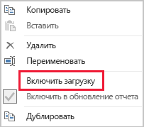

# Методы уменьшения объема данных для моделирования импорта

Эта статья предназначена для разработчиков моделей данных Power BI Desktop, создающих модели импорта. В ней описываются различные методы, которые помогут сократить объем данных, загружаемых в модели импорта.

Данные, загружаемые в модели импорта, сжимаются и оптимизируются, а затем сохраняются на диск с помощью подсистемы хранилища VertiPaq. При загрузке исходных данных в память может выполняться 10-кратное сжатие, поэтому есть все основания ожидать, что 10 ГБ исходных данных могут сжаться до размера около 1 ГБ. Кроме того, при сохранении на диск данные могут сжиматься еще на 20 %.

Несмотря на эффективность работы подсистемы хранилища VertiPaq, следует стараться загружать в модели как можно меньший объем данных. Это особенно справедливо в отношении больших моделей или моделей, размер которых предположительно будет расти со временем. Вот четыре наиболее важные причины:

- Модели больших размеров могут не поддерживаться вашей емкостью. Общая емкость вмещает модели размером до 1 ГБ, тогда как емкости Premium — модели размером до 13 ГБ. Дополнительные сведения см. в статье, посвященной [поддержке больших наборов данных в Power BI Premium](../service-premium-large-datasets.md).
- Чем меньше размер моделей, тем меньше состязаний за ресурсы емкости, особенно память. Это позволяет нескольким моделям одновременно дольше оставаться в памяти, что приводит к снижению частоты вытеснения. Дополнительные сведения см. в статье [Управление емкостями Premium](../service-premium-capacity-manage.md).
- Модели меньшего размера обеспечивают более быстрое обновление данных, что приводит к сокращению задержек при формировании отчетов, увеличению пропускной способности при обновлении набора данных и снижению нагрузки на исходную систему и ресурсы емкости.
- Уменьшение количества строк в таблице может привести к ускорению вычислений, что повышает общую производительность запросов.

В этой статье рассматриваются восемь различных методов уменьшения объема данных. К этим методам относятся следующие:

- [Удаление ненужных столбцов](#remove-unnecessary-columns)
- [Удаление ненужных строк](#remove-unnecessary-rows)
- [Группировка и сведение данных](#group-by-and-summarize)
- [Оптимизация типов данных столбцов](#optimize-column-data-types)
- [Создание пользовательских столбцов](#preference-for-custom-columns)
- [Отключение загрузки запросов Power Query](#disable-power-query-query-load)
- [Отключение параметра "Автоматические дата и время"](#disable-auto-datetime)
- [Переход в смешанный режим](#switch-to-mixed-mode)

## Удаление ненужных столбцов

Столбцы таблицы модели служат двум основным целям:

- **формирование отчетов** для создания макетов отчетов с соответствующими фильтрами, группированием и обобщением данных модели;
- **структурирование модели** за счет связей, вычислений, ролей безопасности и даже цветового форматирования данных.

Столбцы, которые не служат этим целям, скорее всего, можно удалить. Удаление столбцов называется _вертикальной фильтрацией_.

Рекомендуется проектировать модели с точным количеством столбцов в соответствии с известными требованиями к отчетам. Эти требования могут со временем меняться, но следует иметь в виду, что проще будет добавить столбцы позже, чем удалить их. Удаление столбцов может привести к нарушению структуры отчетов или модели.

## Удаление ненужных строк

Таблицы модели должны содержать как можно меньше строк. Для этого можно загружать в таблицы модели отфильтрованные наборы строк, причем фильтрация может производиться по сущности или по времени. Удаление строк называется _горизонтальной фильтрацией_.

**Фильтрация по сущности** предполагает загрузку в модель подмножества исходных данных. Например, вместо загрузки фактов продаж для всех регионов продаж можно загрузить факты только для одного региона. Такой подход к проектированию приводит к созданию большого количества небольших моделей и может также исключить необходимость в определении безопасности на уровне строк (однако потребует предоставления определенных разрешений для набора данных в службе Power BI и создания "дублирующихся" отчетов, подключенных к каждому набору данных). Чтобы упростить управление и публикацию, можно использовать параметры Power Query и файлы шаблонов Power BI. Дополнительные сведения см. в записи блога [Deep Dive into Query Parameters and Power BI Templates](https://powerbi.microsoft.com/blog/deep-dive-into-query-parameters-and-power-bi-templates/) (Подробный обзор параметров запросов и шаблонов Power BI).

**Фильтрация по времени** предполагает ограничение объема _журнала данных_, загружаемого в таблицы типов фактов (и ограничение количества строк дат, загружаемых в таблицы дат модели). Мы рекомендуем не загружать автоматически весь доступный журнал, если только это не требуется явно для создания отчетов. Важно понимать, что временные фильтры Power Query можно параметризировать и даже использовать в них относительные периоды времени (относительно даты обновления, например "данные за последние пять лет"). Также имейте в виду, что ретроспективное изменение фильтров времени не нарушит отчеты. Оно приведет лишь к тому, что в отчетах будут доступны данные за меньший (или больший) период.

## Группировка и сведение данных

Пожалуй, самым эффективным способом уменьшения размера модели является загрузка предварительно сведенных данных. Этот метод позволяет получать более обобщенные таблицы типов фактов. Однако из-за этого может снижаться степень детализации.

Например, в исходной таблице фактов продаж для каждой строки заказа имеется отдельная строка. За счет суммирования всех метрик продаж с группированием по датам, клиентам и продуктам можно достичь значительного сокращения объема данных. Учтите, что еще более значительного уменьшения объема данных можно достичь путем группирования по дате _на уровне месяца_. Это может привести к уменьшению размера модели на 99 %, однако создавать отчеты на уровне отдельных дней или заказов станет невозможно. Решение об обобщении данных фактов всегда сопровождается компромиссами. Последствия этих компромиссов можно уменьшить с помощью смешанной модели, которая рассматривается далее в разделе [Переход в смешанный режим](#switch-to-mixed-mode).

## Оптимизация типов данных столбцов

Подсистема хранилища VertiPaq использует отдельные структуры данных для каждого столбца. Эти структуры данных позволяют добиться максимальной оптимизации для данных числовых столбцов, использующих кодировку значений. Однако текстовые и другие нечисловые данные используют хэш-кодировку. Для этого подсистема хранилища должна присваивать числовой идентификатор каждому уникальному текстовому значению, содержащемуся в столбце. Именно этот идентификатор затем сохраняется в структуре данных, что требует поиска хэша во время хранения и выполнения запросов.

В некоторых случаях исходные текстовые данные можно преобразовывать в числовые значения. Так, номер заказа на продажу может постоянно предваряться текстовым значением (например, SO123456). Префикс можно удалить, а порядковый номер преобразовать в целое число. В случае с большими таблицами это может привести к значительному сокращению объема данных, особенно если столбец содержит уникальные значения или значения высокой кратности.

В этом примере рекомендуется задать для свойства "Способ вычисления итогового значения по умолчанию" значение "Не суммировать". Это позволит свести к минимуму ненужное сведение номеров заказов.

## Создание пользовательских столбцов

Подсистема хранилища VertiPaq хранит вычисляемые столбцы модели (определенные в DAX) так же, как и обычные столбцы, источником которых являются Power Query. Однако структуры данных хранятся немного иначе и обычно обеспечивают менее эффективное сжатие. Кроме того, они создаются после загрузки всех таблиц Power Query, что может привести к увеличению времени обновления данных. Поэтому добавлять столбцы таблицы лучше не как обычные _вычисляемые_ столбцы, а как _вычисляемые столбцы_ Power Query (определенные в M).

Предпочтительнее создавать пользовательские столбцы в Power Query. Если источником является база данных, повысить эффективность загрузки можно двумя способами. Вычисление можно определить в инструкции SQL (с использованием собственного языка запросов поставщика) или реализовать как столбец в источнике данных.

Однако в некоторых случаях вычисляемые столбцы модели могут быть предпочтительнее. Это может быть верно в ситуации, когда формула предполагает вычисление мер или требует определенной функции моделирования, которая поддерживается только в функциях DAX. Один такой пример приведен в статье [Сведения о функциях для иерархий "родители-потомки" в DAX](/dax/understanding-functions-for-parent-child-hierarchies-in-dax).

## Отключение загрузки запросов Power Query

Запросы Power Query, предназначенные для поддержки интеграции данных с другими запросами, не должны загружаться в модель. Чтобы избежать загрузки запроса в модель, отключите загрузку запросов в таких ситуациях.

## Отключение параметра "Автоматические дата и время"

В Power BI Desktop есть параметр _Автоматические дата и время_. Когда этот параметр включен, он создает скрытую автоматическую таблицу даты и времени со столбцами дат, в которой поддерживаются авторы отчетов при настройке фильтров, группировании и детализации для календарных периодов времени. Скрытые таблицы — это по сути вычисляемые таблицы, которые увеличивают размер модели. Дополнительные сведения об использовании параметра "Автоматические дата и время" в Power BI Desktop см. в [этом руководстве](../desktop-auto-date-time.md).

## Переход в смешанный режим

В Power BI Desktop в смешанном режиме создается составная модель. Это позволяет определять режим хранения _для каждой таблицы_. Таким образом, для каждой таблицы свойство "Режим хранения" можно установить в значение "Импорт" или "DirectQuery" (также возможен вариант "Двойной").

Эффективным методом уменьшения размера модели является установка свойства "Режим хранения" для больших таблиц типов фактов в значение "DirectQuery". Учтите, что такой подход к проектированию может хорошо сочетаться с использованием [группирования и сведения данных](#group-by-and-summarize), о которых говорилось ранее. Например, сводные данные по продажам можно использовать для эффективного создания "сводных" отчетов. На странице детализации же могут отображаться подробные данные по продажам для конкретного (узкого) контекста фильтра, то есть приводиться все запросы на продажу, относящиеся к этому контексту. В этом примере страница детализации будет содержать визуальные элементы на основе таблицы DirectQuery, в которые извлекаются данные по заказам на продажу.

Однако использование составных моделей связано с множеством последствий для безопасности и производительности. Дополнительные сведения см. в статье [Использование составных моделей в Power BI Desktop](../desktop-composite-models.md).

## Дальнейшие действия

Дополнительные сведения о проектировании модели импорта в Power BI см. в следующих статьях:

- [Использование составных моделей в Power BI Desktop](../desktop-composite-models.md)
- [Режим хранения в Power BI Desktop](../desktop-storage-mode.md)
- У вас появились вопросы? [Попробуйте задать вопрос в сообществе Power BI.](https://community.powerbi.com/)
