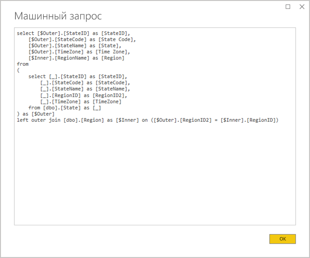
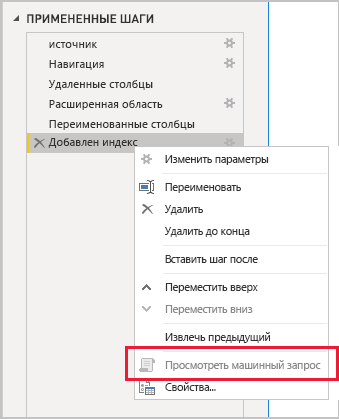

# <a name="the-importance-of-query-folding"></a>Важность свертывания запросов

Эта статья предназначена для разработчиков моделей данных в Power BI Desktop. В ней описываются принципы свертывания запросов и рассказывается о важности этого процесса. Кроме того, здесь рассматриваются источники данных и преобразования, для которых может выполняться свертывание запросов, а также способы определить запросы Power Query, которые могут быть полностью или частично свернуты. Наконец, в этой статье приводятся рекомендации по тому, в каких случаях и каким образом можно добиться свертывания запросов.

## <a name="background"></a>Фон

Под свертыванием запроса Power Query понимается создание одного выражения запроса для извлечения и преобразования данных источника. Подсистема гибридных веб-приложений Power Query пытается обеспечить свертывание запросов во всех возможных случаях, поскольку такой подход позволяет добиться максимальной эффективности при связывании таблицы модели Power BI с базовым источником данных.

Возможность свертывания запросов играет важную роль при разработке моделей данных по целому ряду причин:

- **Таблицы модели импорта.** Оптимизируется загрузка ресурса и продолжительность обновления за счет повышения эффективности обновления данных для таблиц модели импорта.
- **Таблицы с режимом хранения DirectQuery и "Двойной".** Каждая таблица с режимом хранения DirectQuery и "Двойной" должна основываться на запросе Power Query, который может быть свернут.
- **Добавочное обновление.** Оптимизируется загрузка ресурса и продолжительность обновления при добавочном обновлении данных. Фактически, если свертывание запросов для таблицы невозможно, в окне настройки добавочного обновления появится соответствующее уведомление. В таких случаях добавочное обновление будет попросту нецелесообразно. Это связано с тем, что подсистеме гибридных веб-приложений в такой ситуации придется извлечь все строки источника и затем применить фильтры, чтобы определить добавочные изменения.

Свертывание запросов может выполняться как для всего запроса Power Query, так и для части его шагов. Если полное или частичное свертывание невозможно, подсистема гибридных веб-приложений Power Query в Power BI должна будет вместо этого самостоятельно обработать преобразования данных. Для этого может потребоваться извлечь результаты исходного запроса, что при большом размере набора данных приведет к высокой загрузке ресурса и снижению производительности.

В связи с этим для повышения эффективности схем моделей импорта мы рекомендуем разработчикам моделей во всех случаях искать возможности для свертывания запросов.

## <a name="sources-that-support-query-folding"></a>Источники, поддерживающие свертывание запросов

Большинство источников данных, использующих язык запросов, поддерживает свертывание запросов. К ним могут относиться реляционные базы данных, веб-каналы OData (включая списки SharePoint), Exchange и Active Directory. При этом такие источники данных, как неструктурированные файлы, BLOB-объекты и веб-ресурсы, обычно не поддерживают свертывание.

## <a name="transformations-that-can-achieve-query-folding"></a>Преобразования, которые поддерживают свертывание запросов

Свертывание запросов поддерживается для преобразований реляционных источников данных, которые могут быть записаны в виде одной инструкции SELECT. Такая инструкция SELECT может состоять из соответствующих предложений WHERE, GROUP BY и JOIN. Кроме того, она может содержать выражения столбцов (вычисления), которые используют стандартные встроенные функции, поддерживаемые базами данных SQL.

Ниже перечислены основные преобразования, для которых в большинстве случаев поддерживается свертывание запросов.

- Удаление столбцов.
- Переименование столбцов (выбор псевдонимов столбцов с помощью инструкции SELECT).
- Фильтрация строк с использованием статических значений или параметров Power Query (предикаты предложения WHERE).
- Группирование и суммирование (предложение GROUP BY).
- Развертывание столбцов записи (столбцы внешнего ключа источника) для объединения двух таблиц источника (предложение JOIN).
- Не являющееся нечетким слияние свертываемых запросов на основе одного источника (предложение JOIN).
- Добавление свертываемых запросов на основе одного источника (оператор UNION ALL).
- Добавление пользовательских столбцов с _простой логикой_ (выражения столбцов SELECT). Простая логика подразумевает несложные операции, в том числе с использованием функций M, для которых в источнике данных SQL есть эквивалентные функции (математические функции или функции для работы с текстом). Например, следующие выражения возвращают год из значения столбца **Дата заказа** (возврат числового значения).

    ```powerquery-m
    Date.Year([OrderDate])
    ```

- Сведение и отмена сведения (операторы PIVOT и UNPIVOT).

## <a name="transformations-that-prevent-query-folding"></a>Преобразования, которые исключают свертывание запросов

Ниже перечислены основные преобразования, для которых в большинстве случаев невозможно свертывание запросов. Этот список не является исчерпывающим.

- Объединение запросов на основе разных источников.
- Добавление (объединение) запросов на основе разных источников.
- Добавление пользовательских столбцов со _сложной логикой_. Сложная логика подразумевает использование функций M, для которых в источнике данных отсутствуют эквивалентные функции. Например, следующие выражения форматируют значение столбца **Дата заказа** (возврат текстового значения).

    ```powerquery-m
    Date.ToText([OrderDate], "yyyy")
    ```

- Добавление столбцов индекса.
- Изменение типа данных столбца.

Если запрос Power Query охватывает несколько источников данных, свертыванию запросов также может помешать несогласованность в настройках конфиденциальности на уровне источника данных. Дополнительные сведения см. в статье [Уровни конфиденциальности Power BI Desktop](../desktop-privacy-levels.md).

## <a name="determine-when-a-query-can-be-folded"></a>Определение возможности свертывания запроса

Определить возможность свертывания запросов можно в окне редактора Power Query. Если при щелчке правой кнопкой мыши на последнем примененном шаге в области **Параметры запроса** будет доступен (то есть не будет затенен) параметр **Просмотреть машинный запрос**, значит свертывание запроса возможно.


Чтобы просмотреть свернутый запрос, выберите параметр **Просмотреть машинный запрос**. Появится машинный запрос, который Power Query будет использовать для получения данных источника.



Если параметр **Просмотреть машинный запрос** недоступен (затенен), значит свертывание всех шагов запроса невозможно. Тем не менее, при этом по-прежнему может быть доступно свертывание части шагов. Вы можете поочередно вернуться на предыдущие шаги и проверить, доступен ли для них параметр **Просмотреть машинный запрос**. Таким образом, вы сможете определить, на каком этапе последовательности шагов дальнейшее свертывание запросов становится невозможным.



## <a name="best-practice-guidance"></a>Общие рекомендации

В целом, для таблиц с режимом хранения DirectQuery или "Двойной" должно быть достижимо свертывание запросов Power Query. Если таблица импорта основывается на реляционном источнике и возможно построение одной инструкции SELECT, _оптимальная производительность обновления данных_ достигается посредством обеспечения свертывания запросов. Если подсистеме гибридных веб-приложений по-прежнему требуется обрабатывать преобразования, необходимо постараться свести объем этих задач к минимуму, особенно при работе с большими наборами данных.

В следующем списке приводятся общие рекомендации.

- **Делегируйте максимально возможный объем задач обработки источнику данных.** Если свертывание всех шагов запроса Power Query недоступно, необходимо определить шаг, на котором такая возможность пропадает. В таком случае следует по возможности перенести дальнейшие шаги на более ранний этап последовательности, что позволит включить их в процесс свертывания запросов. Обратите внимание, что подсистема гибридных веб-приложений Power Query может автоматически изменять порядок шагов в вашем запросе при создании исходного запроса.

При работе с реляционным источником данных, если шаг, на котором становится невозможным свертывание запросов, может быть выполнен в одной инструкции SELECT или в рамках процедурной логики хранимой процедуры, следует рассмотреть возможность использовать инструкцию машинного запроса.

- **Используйте машинный SQL-запрос.** Если запрос Power Query извлекает данные из реляционного источника, можно использовать машинный SQL-запрос. Фактически в качестве такого запроса может выступать любая допустимая инструкция, в том числе выполнение хранимой процедуры. Если такая инструкция генерирует несколько результирующих наборов, возвращается только первый из них. Параметры можно объявить в инструкции, однако мы рекомендуем использовать функцию M [Value.NativeQuery](/powerquery-m/value-nativequery), которая реализует безопасный и удобный способ передачи значений параметров. Необходимо понимать, что подсистема гибридных веб-приложений Power Query не может выполнять свертывание последующих шагов запроса, поэтому важно включить в инструкцию машинного запроса всю логику преобразования или по возможности большую ее часть.

    При работе с машинными SQL-запросами важно учитывать два момента:

    - Для таблицы модели DirectQuery в качестве запроса необходимо использовать инструкцию SELECT. Обобщенные табличные выражения или хранимые процедуры для этих целей не подходят.
    - Нельзя использовать машинный SQL-запрос в добавочном обновлении, поскольку в этом случае подсистеме гибридных веб-приложений Power Query придется извлечь все строки источника, а затем применить к ним фильтры для определения добавочных изменений.

    > [!IMPORTANT]
    > Машинный запрос позволяет не только извлекать данные. Можно выполнить любую допустимую инструкцию (при необходимости даже несколько раз), в том числе и такую, которая изменяет или удаляет данные. Обратите внимание на важность применения принципа наименьших привилегий, который гарантирует, что учетная запись, используемая для доступа к базе данных, будет иметь разрешения только на чтение необходимых данных.

- **Выполняйте подготовку и преобразование данных на стороне источника.** Если вы определили, что определенные шаги запроса Power Query не могут быть свернуты, можно попробовать применить преобразования в источнике данных. Для этого можно создать представление базы данных, в котором осуществляется логическое преобразование данных источника, либо физически подготовить и материализовать данные до того, как Power BI будет запрашивать их. В качестве примера надлежащей подготовки данных можно привести реляционное хранилище данных, которое обычно состоит из предварительно интегрированных источников данных организации.

## <a name="next-steps"></a>Дальнейшие действия

Дополнительные сведения о свертывании запросов и сопутствующие материалы можно найти в следующих статьях:

- [Использование составных моделей в Power BI Desktop](../desktop-composite-models.md)
- [Добавочное обновление в Power BI Premium](../service-premium-incremental-refresh.md)
- [Реализация свертывания запросов с помощью Table.View](/power-query/handlingqueryfolding)
- У вас появились вопросы? [Попробуйте задать вопрос в сообществе Power BI.](https://community.powerbi.com/)
