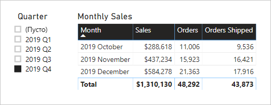

# <a name="active-vs-inactive-relationship-guidance"></a>Руководство по активным и неактивным связям

В этой статье описаны средства моделирования данных, работающие с Power BI Desktop. Здесь предоставлены рекомендации по созданию активных или неактивных связей модели. По умолчанию активные связи распространяют фильтры на другие таблицы. В свою очередь неактивная связь распространяет фильтры, только если выражение DAX активирует (использует) связь.

[!INCLUDE [relationships-prerequisite-reading](includes/relationships-prerequisite-reading.md)]

## <a name="active-relationships"></a>Активные связи

Как правило, мы рекомендуем определять активные отношения во всех возможных ситуациях. Они расширяют область применения и потенциальные возможности использования авторами отчетов и пользователями, работающими с вопросами и ответами.

Рассмотрим пример модели импорта, предназначенной для анализа текущей производительности рейсов авиакомпании. Модель содержит таблицу **Рейс**, которая является таблицей типа факта, в которой содержится одна строка на рейс. В каждой строке записываются дата рейса, номер рейса, аэропорты вылета и прилета, а также время задержки (в минутах). В модели также тесть таблица **Аэропорт**, которая является таблицей типа аналитики, в которой содержится одна строка на каждый аэропорт. Каждая строка описывает код аэропорта, название аэропорта и страну.

Ниже приведена диаграмма частичной модели двух таблиц.


Между таблицами **Рейс** и **Аэропорт** существует две связи модели. В таблице **Рейс** столбцы **DepartureAirport** и **ArrivalAirport** относятся к столбцу **Аэропорт** таблицы **Аэропорт**. В схеме типа "звезда" таблица **Аэропорт** описана как [ролевое измерение](star-schema.md#role-playing-dimensions). В этой модели есть две роли: _аэропорт отправления_ и _аэропорт прибытия_.

Хотя эта схема хорошо работает для реляционной схемы типа "звезда", она не подходит для моделей Power BI. Согласно с тем, что связи модели являются путями для распространения фильтров, эти пути должны быть детерминированными. По этой причине модель не может иметь несколько активных связей между двумя таблицами. Следовательно (как описано в этом примере) одна связь будет активна в то время как другая нет (представляется пунктирной линией). В частности, это связь со столбцом **ArrivalAirport**, которая является активной. Это означает, что фильтры, применяемые к таблице **Аэропорт**, автоматически распространяются в столбец **ArrivalAirport** таблицы **Рейс**.

Такая конструкция модели накладывает жесткие ограничения на представление данных. Например, таблицу **Аэропорт** невозможно отфильтровать для автоматической изоляции сведений о рейсе для аэропорта отправления. Поскольку требования к отчетности предусматривают фильтрацию (или группировку) по аэропортам отправления и прибытия _в одно и то же время_, необходимы две активные связи. Преобразование этого требования в макет модели Power BI означает, что модель должна иметь две таблицы аэропорта.

Вот улучшенный макет модели.


Теперь модель имеет две таблицы аэропорта: **Аэропорт отправления** и **Аэропорт прибытия**. Связи между этими таблицами и таблицей **Рейс** активны. Обратите также внимание, что названия столбцов в таблицах **Аэропорт отправления** и **Аэропорт прибытия** имеют префикс со словом _Отправление_ или _Прибытие_.

Усовершенствованное конструирование модели поддерживает создание следующего дизайна отчета.


Страница отчета фильтрует по Мельбурну как по аэропорту вылета, а визуальный элемент таблицы группируется по аэропортам прибытия.

> [!NOTE]
> Для моделей импорта дополнительная таблица привела к увеличению размера модели и времени обновления. Таким образом, это противоречит рекомендациям, описанным в статье [Методы уменьшения объема данных для моделирования импорта](import-modeling-data-reduction.md). Однако в этом примере требование о наличии только активных связей переопределяет эти рекомендации.
>
> Кроме того, обычно таблицы типа аналитики содержат мало строк по сравнению с количеством строк таблицы типа фактов. Таким образом, увеличение размера модели и времени обновления, вряд ли будет слишком велико.

### <a name="refactoring-methodology"></a>Методология рефакторинга

Ниже приведена методология для рефакторинга модели из одной таблицы типа ролевого измерения в проект с _одной таблицей на роль_.

1. Удалите все неактивные связи.
2. Рекомендуется переименовать ролевую таблицу типа измерения, чтобы лучше описать ее роль. В этом примере таблица **Аэропорт** связана со столбцом **ArrivalAirport** таблицы **Рейс**, поэтому он переименовывается как **Аэропорт прибытия**.
3. Создайте копию ролевой таблицы, указав ее имя, которое отражает ее роль. Если это таблица импорта, рекомендуется определить вычисляемую таблицу. Если это таблица DirectQuery, вы можете дублировать запрос Power Query.

    В этом примере таблица **Аэропорт отправления** создана с помощью следующего определения вычисляемой таблицы.

    ```dax
    Departure Airport = 'Arrival Airport'
    ```

4. Создайте активную связь, чтобы связать новую таблицу.
5. Рассмотрите возможность переименования столбцов в таблицах, чтобы они точно отражали свою роль. В этом примере все столбцы имеют префикс со словом _Отправление_ или _Прибытие_. Эти имена гарантируют, что визуальные элементы отчета по умолчанию будут иметь самоописываемые, недвусмысленные метки. Это также улучшает качество вопросов и ответов, позволяя пользователям легко задавать свои вопросы.
6. Рассмотрите возможность добавления описаний в ролевые таблицы. (В области **Поля** в подсказке появляется описание, когда автор отчета наводит курсор на таблицу.) Таким образом, вы можете передать все дополнительные сведения о распространении фильтра авторам отчетов.

## <a name="inactive-relationships"></a>Неактивные связи

В определенных случаях неактивные связи могут решать особые потребности в формировании отчетов.

Рассмотрим различные требования к модели и отчетности.

- Модель продаж содержит таблицу **Продажи** с двумя столбцами дат: **OrderDate** и **ShipDate**
- Каждая строка в таблице **Продажи** записывает один заказ
- Фильтры дат практически всегда применяются к столбцу **OrderDate**, который всегда содержит допустимую дату.
- Распространения фильтра даты в столбец **ShipDate**, который может содержать пустые значения (до доставки заказа), требует только одна мера.
- В одновременной фильтрации (или группировке) заказов _и_ периодов даты доставки нет необходимости.

Ниже приведена диаграмма частичной модели двух таблиц.


Существует две связи модели между таблицами **Продажи** и **Дата**. В таблице **Продажи** столбцы **OrderDate** и **ShipDate** относятся к столбцу **Дата** таблицы **Дата**. В этой модели для таблицы **Дата** существуют две роли — _дата заказа_ и _дата отгрузки_. Это связь с активным столбцом **OrderDate**.

Все шесть мер (кроме одной) должны фильтроваться по столбцу **OrderDate**. Однако меру **Отправленные заказы** следует фильтровать по столбцу **ShipDate**.

Ниже приведены определения меры **Заказы**. Она просто подсчитывает строки таблицы **Продажи** в контексте фильтра. Все фильтры, применяемые к таблице **Дата**, будут распространены в столбец **OrderDate**.

```dax
Orders = COUNTROWS(Sales)
```

Ниже приведены определения меры **Отправленные заказы**. В нем используется функция DAX [USERELATIONSHIP](/dax/userelationship-function-dax), которая активирует распространение фильтра для определенной связи только во время вычисления выражения. В этом примере используется связь со столбцом **ShipDate**.

```dax
Orders Shipped =
CALCULATE(
    COUNTROWS(Sales)
    ,USERELATIONSHIP('Date'[Date], Sales[ShipDate])
)
```

Это конструирование модели поддерживает создание следующего дизайна отчета.



Страница отчета фильтруется по кварталу 2019 Q4. Визуальный элемент таблицы группирует данные по месяцам и отображает различные статистические данные о продажах. Меры **Заказы** и **Отправленные заказы** дают различные результаты. Каждая из мер использует одну и ту же логику формирования сводных данных (количество строк таблицы **Продажи**), но разное распространение фильтра таблицы **Дата**.

Обратите внимание, что квартальный срез содержит пустой элемент. Этот элемент среза отображается в результате [расширения таблицы](../transform-model/desktop-relationships-understand.md#regular-relationships). Хотя каждая строка таблицы **Продажи** имеет дату заказа, некоторые строки имеют пустое поля для даты отгрузки, это значит, что заказы еще будут отгружены. Расширение таблицы также рассматривает неактивные связи, и поэтому пустые значения могут появляться из-за пустых значений на стороне отношения или из-за проблем с целостностью данных.

## <a name="recommendations"></a>Рекомендации

В целом, мы рекомендуем определять активные отношения во всех возможных ситуациях. Они расширяют область применения и потенциальные возможности использования авторами отчетов и пользователями, работающими с вопросами и ответами. Это означает, что таблицы типа ролевых измерений должны дублироваться в модель.

Однако в определенных обстоятельствах для таблицы типа ролевых измерений можно определить одну или несколько неактивных связей. Использование этого дизайна можно рассматривать в следующих случаях.

- Визуальные элементы отчетов не обязательно должны одновременно выполнять фильтрацию по различным ролям.
- Вы используете функцию DAX USERELATIONSHIP, чтобы активировать определенную связь для соответствующих вычислений модели.

## <a name="next-steps"></a>Дальнейшие действия

Дополнительные сведения, связанные с темой этой статьи, см. в следующих ресурсах.

- [Связи модели в Power BI Desktop](../transform-model/desktop-relationships-understand.md)
- [Общие сведения о схеме типа "звезда" и ее значении в Power BI](star-schema.md)
- [Руководство по устранению неполадок со связями](relationships-troubleshoot.md)
- У вас появились вопросы? [Попробуйте задать вопрос в сообществе Power BI.](https://community.powerbi.com/)
- У вас есть предложения? [Идеи по улучшению Power BI](https://ideas.powerbi.com/)
