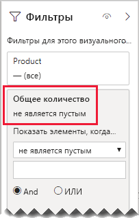

# <a name="bi-directional-relationship-guidance"></a>Руководство по двунаправленным связям

В этой статье описаны средства моделирования данных, работающие с Power BI Desktop. Она предоставляет рекомендации по созданию двунаправленных связей модели. Двунаправленная связь — это связь, которая выполняет фильтрацию в _обоих направлениях_.

[!INCLUDE [relationships-prerequisite-reading](includes/relationships-prerequisite-reading.md)]

Как правило, использование двунаправленных связей рекомендуется свести к минимуму. Они могут негативно повлиять на производительность запросов модели и, возможно, предоставлять непонятные интерфейсы для пользователей отчетов.

Существуют три ситуации, когда двунаправленная фильтрация может решить определенные требования.

- [Особые связи моделей](#special-model-relationships)
- [Элементы среза "с данными"](#slicer-items-with-data)
- [Анализ "измерение к измерению"](#dimension-to-dimension-analysis)

## <a name="special-model-relationships"></a>Особые связи моделей

Двунаправленные связи играют важную роль при создании следующих двух особых типов связи модели.

- **Один к одному**. Все связи "один к одному" должны быть двунаправленными. Настройка другим образом невозможна. Как правило, такие типы связей не рекомендуется создавать. Полное обсуждение и другие варианты оформления см. в статье [Руководство по связям типа "один к одному"](relationships-one-to-one.md).
- **Многие ко многим**. При соотнесении двух таблиц типа измерения требуется таблица с мостовым соединением. Для обеспечения распространения фильтров по таблице с мостовым соединением требуется двунаправленный фильтр. Дополнительные сведения см. в разделе [Связывание измерений "многие ко многим"](relationships-many-to-many.md#relate-many-to-many-dimensions).

## <a name="slicer-items-with-data"></a>Элементы среза "с данными"

Двунаправленные связи могут доставлять срезы, ограничивающие элементы теми, в которых есть данные. (Если вы знакомы со сводными таблицами и срезами Excel, это стандартное поведение при использовании источников данных из набора данных Power BI или модели Analysis Services.) Чтобы объяснить, что это означает, рассмотрим следующую схему модели.


Первая таблица называется **Клиент** и содержит три столбца: **Страна или регион**, **Клиент** и **CustomerCode**. Вторая таблица называется **Продукт** и содержит три столбца: **Цвет**, **Продукт** и **номер SKU**. Третья таблица называется **Продажи** и содержит четыре столбца: **CustomerCode**, **OrderDate**, **Количество**и **номер SKU**. Таблицы **Клиент** и **Продукт** являются таблицами типа измерения, и каждая из них имеет связь "один ко многим" с таблицей **Продажи**. Каждая связь выполняет фильтрацию в одном направлении.

Для демонстрации того, как работает двунаправленная фильтрация, на схеме модели показаны строки таблиц. Все примеры в этой статье основаны на этих данных.

> [!NOTE]
> Строки таблиц невозможно отобразить на схеме модели в Power BI Desktop. В этой статье это было сделано для наглядности.


В приведенном ниже списке описываются строки каждой из трех таблиц.

- В таблице **Клиент** две строки:
  - **CustomerCode** — CUST-01, **Клиент** — Клиент-1, **Страна или регион** — США
  - **CustomerCode** — CUST-02, **Клиент** — Клиент-2, **Страна или регион** — Австралия
- Таблица **Продукт** содержит три строки:
  - **Номер SKU** — CL-01, **Продукт** — футболки, **Цвет** — зеленый
  - **Номер SKU** — CL-02, **Продукт** — джинсы, **Цвет** — голубой
  - **Номер SKU** — AC-01, **Продукт** — шляпа, **Цвет** — голубой
- Таблица **Продажи** содержит три строки:
  - **OrderDate** — 1 января 2019 г. **CustomerCode** — CUST-01, **Номер SKU** — CL-01, **Количество** — 10
  - **OrderDate** — 2 февраля 2019 г. **CustomerCode** — CUST-01, **Номер SKU** — CL-02, **Количество** — 20
  - **OrderDate** — 3 марта 2019 г. **CustomerCode** — CUST-02, **Номер SKU** — CL-01, **Количество** — 30

Теперь рассмотрим следующую страницу отчета.


Страница состоит из двух срезов и визуального элемента карточки. Первый срез предназначен для строки **Страна или регион** и содержит два элемента: Австралия и США. В настоящее время он сегментирован по Австралии. Второй срез предназначен для строки**Продукт** и содержит три элемента: Шляпа, джинсы и футболка. Элементы не выбраны (это означает, что _продукты не отфильтрованы_). Визуальный элемент карточки отображает количество 30 шт.

Когда пользователи отчета сегментируются по Австралии, вам может потребоваться ограничить срез **Продукт**, чтобы отобразить элементы, в которых данные _относятся_ к продажам в Австралии. Именно это предназначено для отображения элементов среза "с данными". Это поведение можно достичь, настроив связь между таблицей **Продукт** и **Продажи** на фильтрацию в обоих направлениях.


В срезе **Продукт** теперь отображается один элемент: футболка. Этот элемент представляет собой единственный продукт, проданный клиентам в Австралии.


Мы рекомендуем тщательно продумать, подходит ли этот проект для пользователей отчетов. Для некоторых пользователей такое взаимодействие может быть непонятным. Они могут не понять, почему элементы среза динамически отображаются или исчезают при взаимодействии с другими срезами.

При отображении элементов среза "с данными" не рекомендуется настраивать двунаправленные связи. Двунаправленным связям нужно обрабатывать дополнительно, поэтому они могут негативно повлиять на производительность запросов, особенно при увеличении числа двунаправленных связей в модели.

Существует лучший способ достижения такого же результата. Вместо использования двунаправленных фильтров вы можете применить фильтр уровня визуальных элементов к самому срезу **Продукт**.

Теперь рассмотрим, почему связь между таблицей **Продукт** и **Продажи** больше не выполняет фильтрацию в обоих направлениях. А в таблицу **Продажи** добавлено следующее определение меры.

```dax
Total Quantity = SUM(Sales[Quantity])
```

Чтобы отобразить элементы среза **Продукт** "с данными", необходимо выполнить фильтрацию по мере **Общее количество**, используя условие "не пусто".



## <a name="dimension-to-dimension-analysis"></a>Анализ "измерение к измерению"

Другой сценарий, включающий двунаправленные связи, рассматривает таблицу типа фактов, например таблицу с мостовым соединением. Таким образом, он поддерживает анализ данных таблицы типа измерения в контексте фильтра другой таблицы типа измерения.

Используя пример модели в этой статье, определите, как можно ответить на следующие вопросы:

- Сколько цветов продано клиентам в Австралии?
- Сколько стран приобрели джинсы?

На оба вопроса можно ответить _без_ суммирования данных в таблице типа фактов с мостовым соединением. Однако они могут требовать, чтобы фильтры распространялись из одной таблицы типа измерения в другую. После распространения фильтров с помощью таблицы типа фактов формирование сводных данных столбцов таблицы типа измерения можно выполнить с помощью функции DAX [DISTINCTCOUNT](/dax/distinctcount-function-dax) и, возможно, функций DAX [MIN](/dax/min-function-dax) и [MAX](/dax/max-function-dax).

Поскольку таблица типа фактов ведет себя как таблица с мостовым соединением, чтобы связать две таблицы типа измерения можно воспользоваться руководством "многие ко многим". Для фильтрации в обоих направлениях потребуется настроить хотя бы одну связь. Дополнительные сведения см. в разделе [Связывание измерений "многие ко многим"](relationships-many-to-many.md#relate-many-to-many-dimensions).

Тем не менее, как уже было сказано в статье, эта схема, скорее всего, приведет к негативному влиянию на производительность, а также к последствиям взаимодействия пользователей, связанным с [элементами среза "с данными"](#slicer-items-with-data). Поэтому мы рекомендуем активировать двунаправленную фильтрацию _в определении меры_, используя вместо нее функцию DAX [CROSSFILTER](/dax/crossfilter-function). Функцию CROSSFILTER можно использовать для изменения направлений фильтрации (или даже для отключения связи) во время вычисления выражения.

Рассмотрим следующее определение меры, добавленное в таблицу **Продажи**. В этом примере связь модели между таблицами **Клиент** и **Продажи** настроена на фильтрацию в _одном направлении_.

```dax
Different Countries Sold =
CALCULATE(
    DISTINCTCOUNT(Customer[Country-Region]),
    CROSSFILTER(
        Customer[CustomerCode],
        Sales[CustomerCode],
        BOTH
    )
)
```

В ходе оценки выражения меры **Different Countries Sold** (Продано в различных странах), связь между таблицами **Клиент** и **Продажи** выполняет фильтрацию в обоих направлениях.

В следующей таблице представлены статистические данные для каждого проданного продукта. Столбец **Количество** — это сумма значений количества. В столбце **Different Countries Sold** (Продано в различных странах) представлены число разных элементов для значений "страна или регион" всех клиентов, которые приобрели этот продукт.


## <a name="next-steps"></a>Дальнейшие действия

Дополнительные сведения, связанные с темой этой статьи, см. в следующих ресурсах.

- [Связи модели в Power BI Desktop](../transform-model/desktop-relationships-understand.md)
- [Общие сведения о схеме типа "звезда" и ее значении в Power BI](star-schema.md)
- [Руководство по связям типа "один к одному"](relationships-one-to-one.md)
- [Руководство по связи "многие ко многим"](relationships-many-to-many.md)
- [Руководство по устранению неполадок со связями](relationships-troubleshoot.md)
- У вас появились вопросы? [Попробуйте задать вопрос в сообществе Power BI.](https://community.powerbi.com/)
- У вас есть предложения? [Идеи по улучшению Power BI](https://ideas.powerbi.com/)

