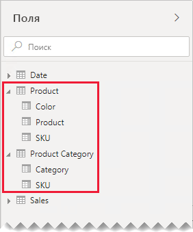
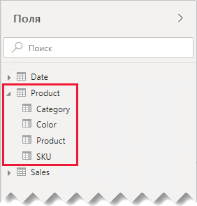
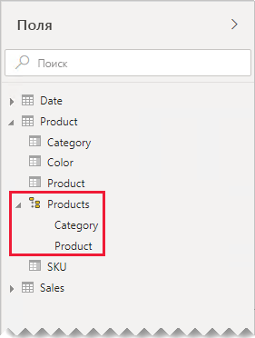
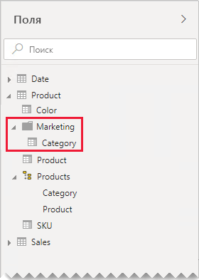

# Руководство по связям типа "один к одному"

В этой статье описаны средства моделирования данных, работающие с Power BI Desktop. Здесь предоставлены рекомендации по работе со связями типа "один к одному". Связь типа "один к одному" можно создать, если обе таблицы содержат столбец общих и уникальных значений.

[!INCLUDE [relationships-prerequisite-reading](includes/relationships-prerequisite-reading.md)]

Существует два сценария, в которых задействованы связи типа "один к одному".

- [Вырожденные измерения](#degenerate-dimensions). [Вырожденное измерение](star-schema.md#degenerate-dimensions) можно извлечь из таблицы типа факта.
- [Диапазоны данных строк в таблицах](#row-data-spans-across-tables). Одна бизнес-сущность или субъект загружаются в виде двух (или более) таблиц модели, возможно, потому, что их данные поступают из различных хранилищ данных. Этот сценарий может быть общим для таблиц типа аналитики. Например, основные сведения о продукте хранятся в операционной системе продаж, а дополнительные — в другом источнике.

    Однако в большинстве случаев вы не связываете две таблицы типа факта связью "один к одному". Это обусловлено тем, что обе таблицы типа факта должны иметь одинаковую размерность и гранулярность. Кроме того, каждая таблица типа факта может потребовать уникальные столбцы, чтобы разрешить создание связи модели.

## Вырожденные измерения

Если столбцы из таблицы типа факта используются для фильтрации или группирования, их можно сделать доступными в отдельной таблице. Таким образом вы отделяете столбцы, используемые для фильтрации или группирования, от столбцов, которые используются для суммирования строк фактов. Это разделение может:

- уменьшить место в хранилище;
- упростить вычисления модели;
- повысить производительность запросов;
- создать более интуитивно понятную область взаимодействия **Поля** для авторов отчетов.

Рассмотрим исходную таблицу продаж, в которой в двух столбцах хранятся сведения о заказах на продажу.

Столбец **OrderNumber** сохраняет номер заказа, а столбец **OrderLineNumber** — последовательность строк в указанном порядке.

Обратите внимание, что на следующей схеме модели столбцы номера заказа и номера строки заказа не были загружены в таблицу **Продажи**. Вместо этого их значения использованы для создания столбца [суррогатного ключа](star-schema.md#surrogate-keys) с именем **SalesOrderLineID**. (Значение ключа вычисляется путем умножения номера заказа на 1000, а затем добавления номера строки заказа.)

Таблица **Заказ на продажу** предоставляет широкие возможности для авторов отчетов и имеет три столбца: **Заказ на продажу**, **Строка заказа на продажу** и **Номер строки** Она также включает в себя иерархию. Эти ресурсы таблиц поддерживают проекты отчетов, которые должны фильтровать, группировать или детализировать сведения по заказам и строкам заказов.

Так как таблица **Заказ на продажу** построена на основе данных о продажах, в каждой таблице должно быть точно одинаковое количество строк. Кроме того, в каждом столбце **SalesOrderLineID** должны содержаться совпадающие значения.

## Диапазоны данных строк в таблицах

Рассмотрим пример, включающий две таблицы типа измерения со связью "один к одному": **Продукт** и **Категория продукта**. Каждая таблица представляет импортированные данные и содержит столбец **SKU** (единица складского хранения), содержащий уникальные значения.

Ниже приведена диаграмма частичной модели двух таблиц.

Первая таблица называется **Продукт** и содержит три столбца: **Цвет**, **Продукт** и **номер SKU**. Первая таблица называется **Категория продукта** и содержит два столбца: **Категория** и **SKU**. Связь типа "один к одному" связывает два столбца **SKU**. Связь выполняет фильтрацию в обоих направлениях, которые всегда относятся к связям типа "один к одному".

Для демонстрации того, как работает распространение фильтра связей, на схеме модели показаны строки таблиц. Все примеры в этой статье основаны на этих данных.

> [!NOTE]
> Строки таблиц невозможно отобразить на схеме модели в Power BI Desktop. В этой статье это было сделано для наглядности.

В приведенном ниже списке описываются строки каждой из двух таблиц.

- Таблица **Продукт** содержит три строки:
  - **Номер SKU** — CL-01, **Продукт** — футболки, **Цвет** — зеленый
  - **Номер SKU** — CL-02, **Продукт** — джинсы, **Цвет** — голубой
  - **Номер SKU** — AC-01, **Продукт** — шляпа, **Цвет** — голубой
- Таблица **Категория продукта** состоит из двух строк:
  - **SKU** — CL-01, **Категория** — одежда
  - **SKU** — AC-01, **Категория** — принадлежности

Обратите внимание, что таблица **Категория продукта** не содержит строку номера SKU продукта — CL-02. Далее в этой статье мы обсудим последствия этой отсутствующей строки.

В области **Поля** авторы отчетов могут найти поля, связанные с продуктом, в двух таблицах: **Продукт** и **Категория продукта**.

Посмотрим, что происходит при добавлении полей из обеих таблиц в визуальный элемент таблицы. В данном примере столбец **SKU** предоставляется из таблицы **Продукт**.

Обратите внимание, что значение **Категория** для продукта с номером SKU CL-02 — ПУСТОЕ. Это обусловлено тем, что в таблице **Категория продукта** нет строки для этого продукта.

### Рекомендации

Если данные строк распределяются между таблицами моделей, мы рекомендуем избегать создания связей типа "один к одному" для одной и той же модели по мере возможности. Это обусловлено тем, что эта схема может:

- внести вклад в перегруженность области **Поля** путем перечисления большего количества таблиц, чем необходимо;
- усложнить поиск связанных полей авторами отчетов, так как эти поля распределяются по нескольким таблицам;
- ограничить возможность создания иерархий, так как их уровни должны основываться на столбцах из _такой же таблицы_;
- производить неожиданные результаты при неполном совпадении строк между таблицами.

Конкретные рекомендации различаются в зависимости от того, является ли связь "один к одному" _внутри таблицы_ или _между ними_. Дополнительные сведения об оценке отношений см. в разделе [Вычисление связей](../desktop-relationships-understand.md#relationship-evaluation).

### Связь "один к одному" внутри таблицы

Если между таблицами существует _внутренняя_ связь "один к одному", рекомендуется объединить данные в одну таблицу модели. Это можно сделать путем слияния запросов Power Query.

Следующие шаги представляют методологию для консолидации и моделирования взаимосвязанных данных "один к одному".

1. **Слияние запросов**. При [объединении двух запросов](../desktop-shape-and-combine-data.md#combine-queries) следует учитывать полноту данных в каждом запросе. Если один запрос содержит полный набор строк (например, основной список), объедините с ним другой запрос. Настройте преобразование слияния на использование _левого внешнего соединения_, которое является типом объединения по умолчанию. Этот тип объединения гарантирует, что все строки первого запроса будут дополняться всеми совпадающими строками второго. Разверните все необходимые столбцы второго запроса в первом запросе.
2. **Отключить загрузку запроса**. Не забудьте [отключить загрузку](import-modeling-data-reduction.md#disable-power-query-query-load) второго запроса. Таким образом, он не будет загружать результат в виде таблицы модели. Такая конфигурация уменьшает размер хранилища модели данных и помогает разгружать область **Поля**.

    В нашем примере авторы отчета теперь находят единственную таблицу с именем **Продукт** в области **Поля**. Она содержит все поля, связанные с продуктом.

    
3. **Замена отсутствующих значений**. Если второй запрос содержит несопоставимые строки, в столбцах, введенных из него, будут отображаться значения NULL. При необходимости рассмотрите возможность замены значений NULL на значение токена. Замена отсутствующих значений особенно важна, когда авторы отчетов фильтруют или группируют по значениям столбцов, так как в визуальных элементах отчета могут отображаться пустые поля.

    Обратите внимание, что в следующем визуальном элементе таблицы категория номера SKU CL-02 продукта теперь имеет значение _[Не определено]_ . В запросе категории со значением NULL заменены на это текстовое значение маркера.

    

4. **Создание иерархий**. Если существуют связи _между столбцами_ консолидированной таблицы, рассмотрите возможность создания иерархий. Таким образом, авторы отчетов быстро определяют возможности для детализации визуального отчета.

    В нашем примере авторы отчетов теперь могут использовать иерархию с двумя уровнями: **Категория** и **Продукт**.

    

Даже если вам нравится как отдельные таблицы помогают организовать поля, мы все же рекомендуем консолидировать их в единую таблицу. Вы по-прежнему сможете упорядочивать поля, однако уже с помощью _папок отображения_.

В нашем примере авторы отчетов могут найти поле **Категория** в папке отображения **Маркетинг**.

Если вы все же решите определить внутренние связи "один к одному" в вашей модели, по возможности убедитесь, что в соответствующих таблицах есть совпадающие строки. Так как внутренняя связь "один к одному" оценивается как [сильная связь](../desktop-relationships-understand.md#strong-relationships), в визуальных элементах ваших отчетов проблемы целостности данных могут отображаться в визуальном виде в вашем отчете как пустые значения. (Пример пустого значения группирования можно увидеть в визуальном элементе первой таблицы, представленной в этой статье.)

### Связь "один к одному" между таблицами

Если между таблицами существует _межэлементная_ связь типа "один к одному", кроме выполнения предварительной консолидации данных в источниках данных нет никакой альтернативной модели. Power BI будет оценивать связь модели "один к одному" как [слабую связь](../desktop-relationships-understand.md#weak-relationships). Поэтому следите за тем, чтобы в связанных таблицах были совпадающие строки, поскольку несовпадающие строки будут исключены из результатов запроса.

Посмотрим, что происходит, когда поля из обеих таблиц добавляются в визуальный элемент таблицы, и между таблицами существует слабая связь.

Таблица отображает только две строки. Номер SKU CL-02 для продукта отсутствует, поскольку в таблице **Категория продукта** нет соответствующей строки.

## Дальнейшие действия

Дополнительные сведения, связанные с темой этой статьи, см. в следующих ресурсах.

- [Связи модели в Power BI Desktop](../desktop-relationships-understand.md)
- [Общие сведения о схеме типа "звезда" и ее значении в Power BI](star-schema.md)
- [Руководство по устранению неполадок со связями](relationships-troubleshoot.md)
- У вас появились вопросы? [Попробуйте задать вопрос в сообществе Power BI.](https://community.powerbi.com/)
- У вас есть предложения? [Идеи по улучшению Power BI](https://ideas.powerbi.com/)
