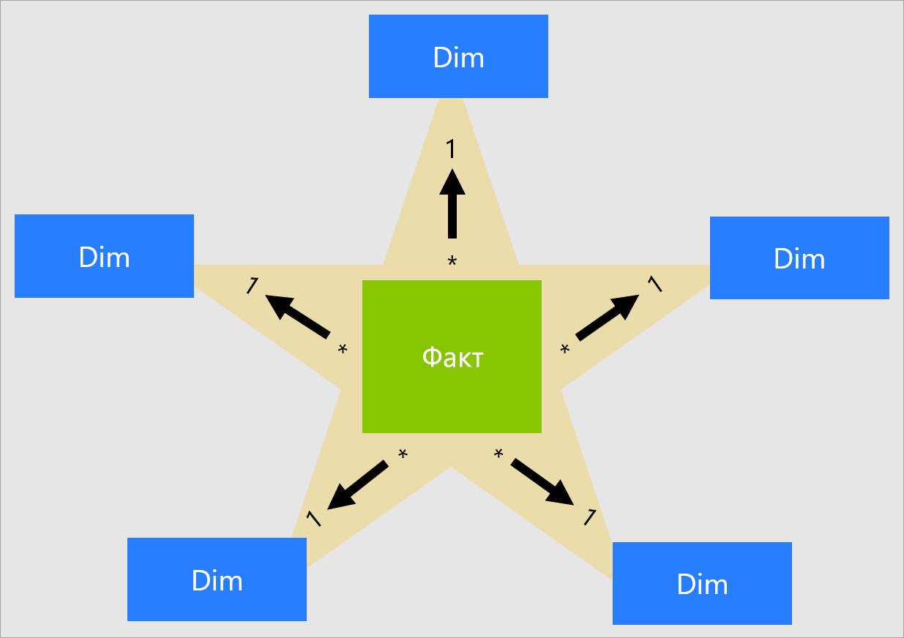
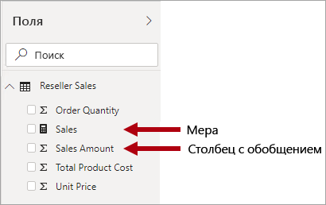
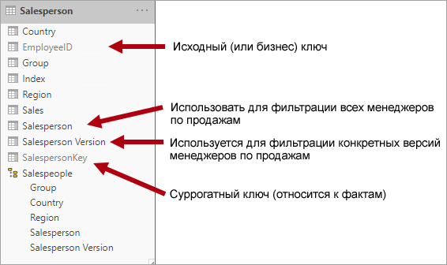
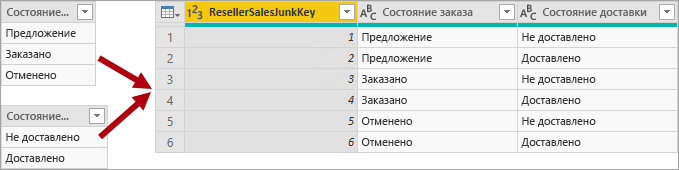
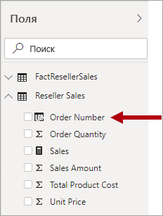

# Общие сведения о схеме типа "звезда" и ее значении в Power BI

Эта статья предназначена для разработчиков моделей данных Power BI Desktop. В ней описывается схема типа "звезда" и ее значение при разработке моделей данных Power BI, оптимизированных для повышения производительности и удобства использования.

Исчерпывающее описание проектирования с использованием схемы типа "звезда" выходит за рамки данной статьи. Дополнительные сведения см. в опубликованных материалах, например книге **The Data Warehouse Toolkit: The Complete Guide to Dimensional Modeling** (2-е издание, 2002 г.) автора Ральфа Кимбалла (Ralph Kimball) и других.

## Обзор схемы типа "звезда"

**Схема типа "звезда"**  — это зрелый подход к моделированию, широко применяемый в реляционных хранилищах данных. Он требует от разработчиков моделей классифицировать таблицы моделей как _измерения_ или _факты_.

**Таблицы измерений** описывают бизнес-сущности — то, что вы моделируете. Сущностями могут быть предметы, люди, места и общие понятия, включая само время. Наиболее постоянной таблицей в схеме типа "звезда" является таблица измерения дат. Таблица измерения содержит ключевой столбец (или столбцы), который выступает в качестве уникального идентификатора, и описательные столбцы.

В **таблицах фактов** хранятся наблюдения или события. Это могут быть заказы на продажу, остатки запасов, обменные курсы, значения температуры и т. д. Таблица фактов содержит ключевые столбцы измерений, связанные с таблицами измерений, и числовые столбцы мер. Ключевые столбцы измерений определяют _размерность_ таблицы фактов, а значения ключей измерений — ее _степень детализации_. Например, рассмотрим таблицу фактов, предназначенную для хранения планов продаж, с двумя ключевыми столбцами измерений: **Дата** и **КлючТовара**. Легко понять, что таблица имеет два измерения. Однако степень детализации нельзя определить без учета значений ключей измерений. В этом примере предположим, что в столбце **Дата** хранятся первые дни каждого месяца. В таком случае степенью детализации является месяц и продукт.

Как правило, таблицы измерений содержат относительно небольшое количество строк. Таблицы фактов, напротив, могут содержать очень много строк и продолжать расти со временем.

## Значение схемы типа "звезда" для моделей Power BI

Схема типа "звезда" и многие связанные с ней понятия, представленные в этой статье, очень важны для разработки моделей Power BI, оптимизированных для повышения производительности и удобства использования.

Каждый визуальный элемент отчета Power BI создает запрос, который отправляется в модель Power BI (называемую в службе Power BI набором данных). Запросы служат для фильтрации, группирования и обобщения данных модели. Поэтому хорошо спроектированная модель должна предоставлять таблицы для фильтрации и группирования, а также таблицы для обобщения. Схема типа "звезда" соответствует таким принципам проектирования:

- таблицы измерений поддерживают _фильтрацию_ и _группирование_;
- таблицы фактов поддерживают _обобщение_.

У таблицы нет свойства, с помощью которого разработчик модели может настроить ее тип (таблица измерений или фактов). Тип определяется связями внутри модели. Связь модели определяет путь применения фильтра между двумя таблицами, а тип таблицы определяется свойством **Кратность** этой связи. Часто связь имеет кратность "один ко многим" или обратный вариант — "многие к одному". Сторона "один" всегда представлена таблицей измерений, а сторона "многие" — таблицей фактов.

Хорошо структурированная модель должна включать либо таблицы измерений, либо таблицы фактов. Использования таблиц смешанного типа следует избегать. Кроме того, старайтесь использовать правильное количество таблиц с надлежащими связями. Важно также, чтобы в таблицы фактов загружались данные с единообразной степенью детализации.

Наконец, следует понимать, что проектирование оптимальной модели — это не только умение, но и искусство. Иногда можно отклоняться от рекомендаций, если это продиктовано условиями.

Со схемой типа "звезда", которую можно применять к моделям Power BI, связано также много других понятий. К ним относятся:

- [Меры](#measures)
- [Суррогатные ключи](#surrogate-keys)
- [Измерения типа "снежинка"](#snowflake-dimensions)
- [Ролевые измерения](#role-playing-dimensions)
- [Медленно изменяющиеся измерения](#slowly-changing-dimensions)
- [Произвольные измерения](#junk-dimensions)
- [Вырожденные измерения](#degenerate-dimensions)
- [Таблицы фактов без метрик](#factless-fact-tables)

## Меры

В схеме типа "звезда" **мера** — это столбец таблицы фактов, в котором хранятся значения для обобщения.

В модели Power BI **мера** имеет другое, но схожее определение. Это формула, написанная на языке [выражений анализа данных (DAX)](https://docs.microsoft.com/dax/data-analysis-expressions-dax-reference), которая служит для обобщения. В выражениях мер часто используются статистические функции DAX, такие как SUM, MIN, MAX, AVERAGE и т. д., для получения скалярного результата во время выполнения запроса (значения никогда не хранятся в модели). Выражением меры может быть как простое агрегирование столбцов, так и более сложная формула, переопределяющая контекст фильтра и распространение связей. Дополнительные сведения см. в статье [Основные сведения о DAX в Power BI Desktop](https://docs.microsoft.com/power-bi/desktop-quickstart-learn-dax-basics). Ссылка на дополнительные сведения

Важно иметь в виду, что модели Power BI поддерживают еще один способ формирования сводных данных. Любой столбец (как правило, это числовые столбцы) можно обобщить с помощью визуального элемента отчета или компонента "Вопросы и ответы". Это повышает удобство работы для разработчиков моделей, так как зачастую позволяет не создавать меры. Например, столбец **Сумма продаж** торгового посредника Adventure Works можно обобщать различными способами (сумма, количество, среднее значение, медиана, минимум, максимум и т. д.), не создавая меру для каждого возможного типа статистической обработки.

Однако есть две веские причины для создания мер даже в случае простого обобщения на уровне столбцов.

- Если известно, что авторы отчетов будут запрашивать модель с помощью [многомерных выражений](https://docs.microsoft.com/sql/analysis-services/multidimensional-models/mdx/mdx-query-the-basic-query?view=sql-server-2017), модель должна содержать меры. Многомерные выражения не позволяют обобщать значения столбцов. Это очень важно, если запросы к набору данных Power BI выполняются с помощью многомерных выражений, например при использовании функции [Анализ в Excel](https://docs.microsoft.com/power-bi/service-analyze-in-excel) (сводные таблицы выдают запросы на основе многомерных выражений).
- Если необходимо, чтобы авторы отчетов могли обобщать столбцы только определенными способами. Например, столбец **Цена за единицу** торгового посредника (который представляет цену единицы товара) можно обобщать, но только с помощью определенных статистических функций. Его нельзя суммировать, но можно обобщать с помощью других статистических функций (минимум, максимум, среднее значение и т. д.). В этом случае разработчик модели может скрыть столбец **Цена за единицу** и создать меры для всех соответствующих статистических функций.

Обратите внимание, что такой подход к проектированию хорошо подходит для отчетов, создаваемых в службе Power BI, и для компонента "Вопросы и ответы". Однако активные подключения в Power BI Desktop позволяют авторам отчетов отображать скрытые поля в области **Поля**, что дает возможность обойти ограничения.

## Суррогатные ключи

**Суррогатный ключ** — это уникальный идентификатор, добавляемый в таблицу для поддержки моделирования на основе схемы типа "звезда". По определению он не задается и не хранится в исходных данных. Как правило, суррогатные ключи добавляются в таблицы измерений реляционного хранилища данных в качестве уникальных идентификаторов для каждой строки в этих таблицах.

Связи внутри модели Power BI основываются на единственном уникальном столбце в одной таблице, из которого фильтр применяется к одному столбцу в другой таблице. Если таблица измерения в модели не содержит единственный уникальный столбец, необходимо добавить уникальный идентификатор, чтобы получить сторону "один" связи. В Power BI Desktop этого легко добиться, создав [столбец индекса Power Query](https://docs.microsoft.com/powerquery-m/table-addindexcolumn).

Этот запрос необходимо объединить с запросом на стороне "многие", чтобы в него также можно было добавить столбец индекса. При загрузке этих запросов в модель можно создать связь "один ко многим" между таблицами модели.

## Измерения типа "снежинка"

**Измерение типа "снежинка"**  — это набор нормализованных таблиц для одной бизнес-сущности. Например, продукты в компании Adventure Works классифицируются по категориям и подкатегориям. Категории назначаются подкатегориям, а продукты, в свою очередь, назначаются подкатегориям. В реляционном хранилище данных Adventure Works измерение продуктов нормализовано и хранится в трех связанных таблицах: **DimProductCategory**, **DimProductSubcategory** и **DimProduct**.

Можно представить, что нормализованные таблицы как бы выступают из таблицы фактов, образуя схему типа "снежинка".

В Power BI Desktop можно имитировать схему типа "снежинка" (например, если исходные данные имеют соответствующую структуру) или включить исходные таблицы в одну таблицу модели (то есть выполнить их денормализацию). Как правило, использовать одну таблицу в модели выгоднее. Оптимальное решение может зависеть от объемов данных и требований к удобству использования модели.

Если вы решили имитировать схему типа "снежинка", имейте в виду следующее:

- Power BI загружает больше таблиц, что менее эффективно с точки зрения использования памяти и производительности. Эти таблицы должны включать в себя столбцы для поддержки связей модели, из-за чего размер модели может увеличиться.
- Более длинные цепочки применения фильтров связей, скорее всего, будут менее эффективными, чем фильтры, применяемые к одной таблице.
- В области **Поля** представлено больше таблиц моделей для авторов отчетов, что может усложнять работу, особенно если таблицы измерений типа "снежинка" содержат всего один или два столбца.
- Невозможно создать иерархию, охватывающую таблицы.

Если вы решили включить исходные таблицы в одну таблицу модели, можно также определить иерархию, охватывающую самый высокий и самый низкий уровни детализации измерения. Хранение избыточных денормализованных данных может привести к увеличению размера хранилища, занимаемого моделью, особенно в случае с очень большими таблицами измерений.

## Медленно изменяющиеся измерения

**Медленно изменяющееся измерение** — это измерение, которое соответствующим образом управляет изменением своих элементов с течением времени. Он применяется, если значения бизнес-сущности изменяются с течением времени произвольным образом. Хорошим примером _медленно_ изменяющегося измерения может служить измерение клиентов, особенно столбцы с контактными данными, такими как адрес электронной почты и номер телефона. Некоторые измерения, напротив, считаются _быстро_ изменяющимися, если какой либо атрибут измерения, например курс акций, меняется часто. Стандартный подход к проектированию в таких случаях заключается в хранении быстро изменяющихся значений атрибутов в мере таблицы фактов.

В теории схемы типа "звезда" выделяются два основных типа медленно изменяющихся измерений: тип 1 и тип 2. Таблица измерения может иметь тип 1 или тип 2 либо поддерживать оба типа одновременно для разных столбцов.

### Медленно изменяющееся измерение типа 1

**Медленно изменяющееся измерение** **типа 1** всегда отражает последние значения. При обнаружении изменений в исходных данных данные в таблице измерения просто перезаписываются. Такой подход является общепринятым для столбцов, в которых хранятся вспомогательные значения, например адрес электронной почты или номер телефона клиента. При изменении адреса электронной почты или номера телефона значение в строке соответствующего клиента обновляется, как если бы оно всегда было таким.

Реализовать медленно изменяющееся измерение типа 1 можно посредством обновления таблицы измерения модели Power BI без дополнения. При таком обновлении таблицы в нее загружаются последние значения.

### Медленно изменяющееся измерение типа 2

**Медленно изменяющееся измерение** **типа 2** поддерживает управление версиями элементов измерения. Если в исходной системе версии не хранятся, то обычно обнаружение изменений и надлежащее управление ими в таблице измерения осуществляются в процессе загрузки в хранилище данных. В этом случае в таблице измерения должен использоваться суррогатный ключ для предоставления уникальной ссылки на _версию_ элемента измерения. Таблица также содержит столбцы, которые определяют срок действия версии (например, **StartDate** и **EndDate**), и, возможно, столбец флага (например, **IsCurrent**), который упрощает фильтрацию текущих элементов измерения.

Например, в Adventure Works продавцы назначаются регионам продаж. Когда продавец переводится в другой регион, необходимо создать новую версию его записи, чтобы исторические факты остались связанными с прежним регионом. Для обеспечения точного исторического анализа продаж по продавцам в таблице измерения должны храниться версии записей продавцов и связанные с ними регионы. В таблице также должны содержаться начальные и конечные даты, которые определяют срок действия. Для текущей версии конечная дата может быть пустой (или иметь значение 31.12.9999). В таблице также должен быть определен суррогатный ключ, так как бизнес-ключ (в данном случае это идентификатор сотрудника) не является уникальным.

Важно понимать, что если в исходной системе версии не хранятся, для обнаружения и хранения изменений необходимо использовать промежуточную систему (например, хранилище данных). При загрузке таблицы должны сохраняться существующие данные и выявляться изменения. При обнаружении изменения текущая версия должна терять актуальность. Для этого обновляется значение **EndDate** и вставляется новая версия, значение **StartDate** которой совпадает со значением **EndDate** предыдущей версии. Кроме того, для связанных фактов необходимо использовать поиск на основе времени, чтобы получить значение ключа измерения, соответствующее дате факта. Модель Power BI на основе Power Query не дает такой возможности. Однако она позволяет загружать данные из предварительно загруженной таблицы медленно изменяющегося измерения типа 2.

Модель Power BI должна поддерживать запрос исторических данных для элемента независимо от наличия изменений, а также для версии элемента, которая представляет определенное состояние элемента во времени. В контексте Adventure Works это позволяет запрашивать данные продавца независимо от назначенного региона продаж или конкретную версию записи продавца.

Для этого таблица измерения модели Power BI должна включать в себя столбец для фильтрации продавцов и еще один столбец для фильтрации версии записи. Столбец версии должен предоставлять однозначное описание, например "Виктор Игнатьев (15.12.2008–26.06.2019)" или "Виктор Игнатьев (текущая)". Кроме того, важно проинформировать авторов и пользователей отчетов об основах работы с медленно изменяющимися измерениями типа 2 и о том, как обеспечить нужную структуру отчета, применяя правильные фильтры.

Рекомендуется также реализовать иерархию, позволяющую детализировать визуальные элементы до уровня версии.

## Ролевые измерения

**Ролевое измерение** — это измерение, которое позволяет фильтровать связанные факты по-разному. Например, в Adventure Works таблица измерения дат имеет три связи с фактами продаж торговых посредников. Одну и ту же таблицу измерения можно использовать для фильтрации фактов по дате заказа, дате отгрузки или дате доставки.

В хранилище данных принятым подходом к проектированию является определение одной таблицы измерения дат. Во время выполнения запроса "роль" измерения дат определяется тем, какой столбец фактов используется для соединения таблиц. Например, при анализе продаж по дате заказа соединение таблицы относится к столбцу "Дата заказа на продажу" торгового посредника.

В модели Power BI такую схему можно имитировать, создав несколько связей между двумя таблицами. В примере Adventure Works таблицы дат и продаж торговых посредников будут иметь три связи. Хотя это и возможно, важно понимать, что между двумя таблицами модели Power BI может быть только одна активная связь. Все остальные связи должны быть неактивными. Наличие одной активной связи означает, что путь применения фильтра по умолчанию ведет от даты к продажам торгового посредника. В этом случае в качестве активной связи устанавливается фильтр, наиболее часто используемый отчетами. В Adventure Works это связь с датой заказа.

Единственный способ использовать неактивную связь — определить выражение DAX, в котором применяется [функция USERELATIONSHIP](https://docs.microsoft.com/dax/userelationship-function-dax). В нашем примере разработчик модели должен создать меры, чтобы обеспечить анализ продаж через торговых посредников по датам отгрузки и доставки. Это может потребовать много усилий, особенно если в таблице торговых посредников определено большое количество мер. Кроме того, из-за большого количества мер в области **Поля** работать может быть неудобно. Есть и другие ограничения.

- Когда авторы отчетов прибегают к обобщению столбцов вместо определения мер, они не могут получить сводные данные для неактивных связей без написания мер на уровне отчета. Меры на уровне отчета можно определять только при создании отчетов в Power BI Desktop.
- При наличии только одного активного пути связи между датами и продажами через торговых посредников невозможно одновременно фильтровать продажи через торговых посредников по различным типам дат. Например, нельзя создать визуальный элемент, в котором продажи представлены по дате заказа и дате отгрузки.

Чтобы преодолеть эти ограничения, в Power BI обычно создается таблица измерения для каждого ролевого экземпляра. Как правило, дополнительные таблицы измерений создаются как [вычисляемые таблицы](https://docs.microsoft.com/dax/calculatetable-function-dax) с помощью DAX. При использовании вычисляемых таблиц модель может содержать таблицу **Дата**, таблицу **Дата отгрузки** и таблицу **Дата доставки**, каждая из которых имеет одну активную связь с соответствующим столбцом таблицы продаж через торговых посредников.

Такой подход к проектированию не требует определения нескольких мер для разных ролей дат и позволяет выполнять одновременную фильтрацию по различным ролям. Издержки этого подхода заключаются в том, что таблица измерения дат дублируется, из-за чего размер хранилища для модели увеличивается. Так как таблицы измерений обычно содержат меньше строк, чем таблицы фактов, это редко вызывает проблемы.

При создании таблиц измерений модели для каждой роли следуйте приведенным ниже рекомендациям по проектированию.

- Назначение столбцов должно быть ясно из их имен. В каждой таблице дат может быть столбец **Год** (имена столбцов уникальны в пределах таблицы), однако в визуальных элементах это будет вызывать путаницу. Переименуйте столбцы в каждой таблице ролевого измерения так, чтобы в таблице **Дата отгрузки**, например, был столбец **Год отгрузки** и т. д.
- Если применимо, с помощью описаний таблиц предоставьте авторам отчетов сведения о том, как настроены пути фильтров (они будут выводиться в виде подсказок в области **Поля**). Это важно, когда модель содержит таблицу с общим именем, например **Дата**, которая используется для фильтрации нескольких таблиц фактов. Если эта таблица имеет активную связь, например, со столбцом "Дата заказа" торгового посредника, рекомендуется предоставить описание таблицы, например "Фильтрация продаж через торгового посредника по дате заказа".

## Произвольные измерения

**Произвольное измерение** полезно при наличии множества измерений, особенно состоящих из небольшого количество атрибутов (возможно, одного), которые имеют мало значений. На эту роль хорошо подходят столбцы с состоянием заказов или демографическими данными клиентов (пол, возрастная группа и т. д.).

Назначением произвольного измерения является объединение множества небольших измерений в одно с целью уменьшить размер хранилища для модели и количество таблиц в области **Поля**.

Таблица произвольного измерения, как правило, представляет собой декартово произведение всех элементов атрибутов измерений со столбцом суррогатного ключа. Суррогатный ключ предоставляет уникальную ссылку на каждую строку в таблице. Можно создать измерение в хранилище данных или с помощью Power Query разработать запрос, выполняющий [полное внешнее соединение](https://docs.microsoft.com/powerquery-m/table-join), а затем добавляющий суррогатный ключ (столбец индекса).

Этот запрос загружается в модель в виде таблицы измерения. Также необходимо выполнить объединение этого запроса с запросом факта, чтобы столбец индекса загружался в модель для обеспечения создания связи модели "один ко многим".

## Вырожденные измерения

Под **вырожденным измерением** понимается атрибут таблицы фактов, который необходим для фильтрации. В Adventure Works хорошим примером может служить номер заказа на продажу торгового посредника. В этом случае не имеет смысла создавать независимую таблицу, состоящую только из одного этого столбца, так как это увеличит размер хранилища для модели и количество элементов в области **Поля**.

В модели Power BI может быть целесообразно добавить столбец с номерами заказов на продажу в таблицу фактов, чтобы обеспечить фильтрацию или группирование по этим номерам. Такая ситуация является исключением из ранее изложенного правила, согласно которому не следует смешивать типы таблиц (т. е. таблицы моделей должны быть либо таблицами измерений, либо таблицами фактов).

## Таблицы фактов без метрик

В **таблице фактов без метрик** нет столбцов мер. Она содержит только ключи измерения.

В таблице фактов без метрик могут храниться наблюдения, определяемые ключами измерения. Например, допустим, в определенную дату и время конкретный клиент выполнил вход на ваш веб-сайт. Вы можете определить меру для подсчета строк таблицы фактов без метрик, чтобы проанализировать количество пользователей, выполнивших вход в систему, и время входа.

Более полезным применением таблицы фактов без метрик является хранение связей между измерениями. Именно такой подход рекомендуется использовать в Power BI для определения связей "многие ко многим" между измерениями. В структуре связей "многие ко многим" между измерениями таблица фактов без метрик называется _сопоставительной таблицей_.

Например, предположим, что продавцы могут назначаться одному _или нескольким_ регионам продаж. Сопоставительная таблица будет разрабатываться как таблица фактов без метрик, состоящая из двух столбцов: ключа продавца и ключа региона. Повторяющиеся значения могут храниться в обоих столбцах.

Такой подход к проектированию с использованием связей "многие ко многим" хорошо описан в документации и может быть реализован без сопоставительной таблицы. Однако сопоставительная таблица считается рекомендуемым решением при связывании двух измерений. Подробные сведения см. в статье [Связи с кратностью "многие ко многим" в Power BI Desktop](https://docs.microsoft.com/power-bi/desktop-many-to-many-relationships).

## Дальнейшие действия

Дополнительные сведения о проектировании схемы типа "звезда" и проектировании моделей Power BI см. в следующих статьях:

- [Статья Википедии, посвященная многомерному моделированию](https://go.microsoft.com/fwlink/p/?linkid=246459)
- [Создание связей и управление ими в Power BI Desktop](https://docs.microsoft.com/power-bi/desktop-create-and-manage-relationships)
- [Связи с кратностью "многие ко многим" в Power BI Desktop](https://docs.microsoft.com/power-bi/desktop-many-to-many-relationships)
- [Пошаговое обучение моделированию](https://docs.microsoft.com/power-bi/guided-learning/modeling)