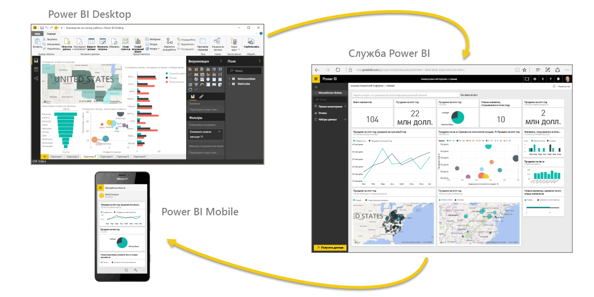

Добро пожаловать в **интерактивное обучение** по Power BI. Данный интернет-курс, рассчитанный на прохождение в произвольном темпе, последовательно описывает продукт Power BI, чтобы вы могли изучить его с самых основ.

Курс разделен на удобные для восприятия блоки и имеет логическую организацию, помогающую усваивать материал, включая понятия, описания и примеры. Кроме того, он содержит большое количество визуальных элементов и видеороликов, что также способствует обучению.

Этот **интерактивный учебный** курс содержит множество **разделов**, каждый из которых содержит несколько **тем**. После нескольких первых тем в разделе **Приступая к работе** почти каждая тема содержит видеоролик с описанием изучаемого материала. Под видеороликом приводится дополнительное описание рассматриваемого понятия.

Если вы **новичок** в Power BI, этот курс поможет вам начать работу, если же вы уже **опытный пользователь** Power BI, этот курс поможет установить взаимосвязи между основными понятиями и устранить имеющиеся пробелы в знаниях. Мы надеемся, что этот курс окажется полезным для вас, и собираемся дополнить его в будущем.

## Что такое Power BI?
**Power BI** — это коллекция программных служб, приложений и соединителей, которые взаимодействуют друг с другом, чтобы превратить разрозненные источники данных в согласованные, визуально иммерсивные и интерактивные аналитические данные. Представлены ли ваши данные простой электронной таблицей Excel или коллекцией облачных и локальных гибридных хранилищ данных, **Power BI** позволяет легко подключаться к источникам данных, визуализировать (или выявлять) важные аспекты и предоставлять общий доступ к результатам всем, кому это необходимо.

**Power BI** может работать просто и быстро, формируя краткие аналитические сведения на базе электронной таблицы Excel или локальной базы данных. Однако **Power BI** также является надежным продуктом корпоративного уровня, который пригоден для масштабного моделирования в режиме реального времени, а также разработки индивидуальных решений. Он может выступать в качестве вашего личного средства визуализации и ведения отчетов, а также служить подсистемой аналитики и принятия решений для групповых проектов, подразделений или целых организаций.

## Компоненты Power BI
Power BI состоит из классического приложения для Windows **Power BI Desktop**, веб-службы SaaS (*программное обеспечение как услуга*), называемой **службой Power BI**, и мобильных **приложений** Power BI, доступных на смартфонах и планшетах Windows, а также на устройствах под управлением iOS и Android.

Три этих элемента — **Desktop**, **служба** и **мобильные** приложения — позволяют людям создавать, использовать бизнес-инсайты и обмениваться ими наиболее эффективно с точки зрения личных или служебных задач.

## Как Power BI соотносится с вашей ролью или должностью
Подход к использованию Power BI может зависеть от вашей роли в проекте или в рабочей группе. Другие люди, занимающие другие должности, могут использовать Power BI иначе, и в этом нет ничего страшного.

Например, вы работать главным образом со **службой Power BI**, а ваш коллега, занимающийся обработкой числовых данных и составлением бизнес-отчетов, может активно использовать **Power BI Desktop** (и публиковать отчеты в службу Power BI, чтобы вы могли их просмотреть). И другой коллеге, продаж, главным образом использовать приложение Power BI для отслеживания хода выполнения на квоты продаж и чтобы просмотреть соответствующие подробные сведения о новом потенциальных покупателей.

Вы также можете использовать каждый из элементов **Power BI** в разное время в зависимости от поставленных целей и вашей роли в проекте или мероприятии.

Например, вы можете просматривать сведения о запасах и ходе производства с помощью панели мониторинга реального времени в службе, а также создавать в **Power BI Desktop** статистические отчеты о взаимодействии с клиентами для своей группы. Подход к использованию Power BI может зависеть от того, какой компонент или какая функция Power BI являются оптимальными в сложившейся ситуации. При этом вам всегда доступны все описанные компоненты Power BI, что и делает этот продукт таким гибким и привлекательным.

Позднее в рамках данного **интерактивного учебного** курса мы рассмотрим каждый из этих компонентов — **Desktop**, **службу** и **мобильные** приложения — подробнее. В последующих статьях мы также создадим отчеты в Power BI Desktop, осуществим общий доступ к ним в службе и проанализируем их на своем мобильном устройстве.

## Поток работы в Power BI
Общий поток работы в Power BI начинается с **Power BI Desktop**, где создается отчет. Затем этот отчет публикуется в **службе** Power BI, после чего с этими данными могут работать пользователи мобильных приложений **Power BI Mobile**.

Хотя это и не всегда происходит описанным образом, мы будем использовать именно такой поток операций, чтобы помочь вам освоить различные компоненты Power BI и понять, как они дополняют друг друга.

Теперь, когда вы получили общее представление о курсе, продукте Power BI и трех его основных элементах, давайте рассмотрим, как именно строится работа с **Power BI**.

