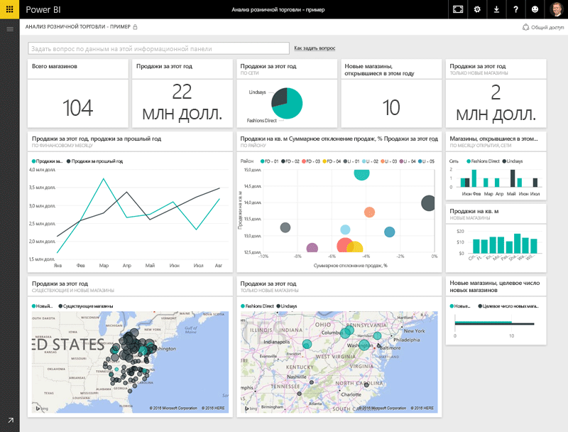
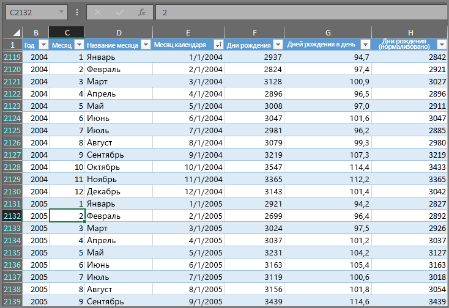
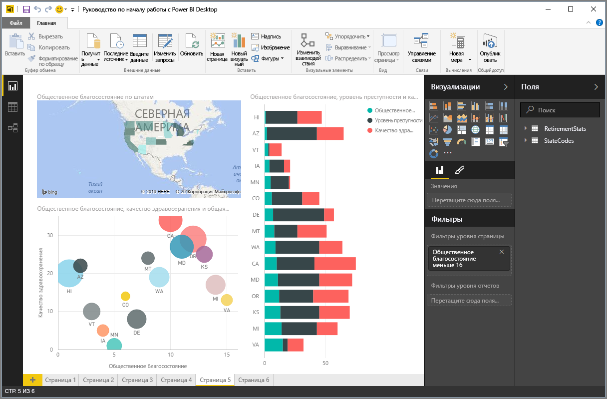
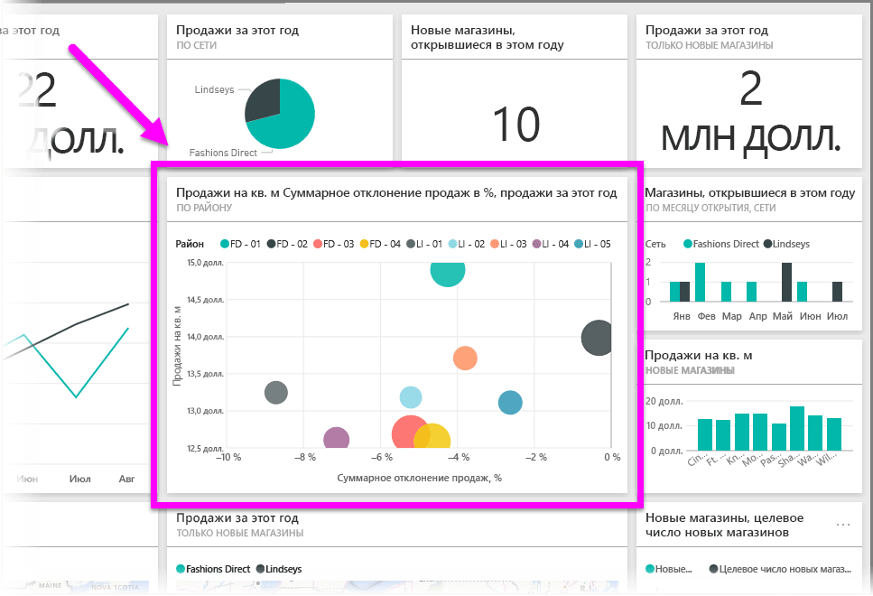

Все операции, выполняемые в Power BI, можно разбить на несколько базовых **стандартных блоков**. Поняв принцип их действия, вы сможете использовать каждый из них для расширения и создания детализированных и сложных отчетов. В конце концов, даже самые сложные элементы состоят из стандартных блоков. Например, здания строятся с использованием дерева, арматуры, цемента и стекла, а автомобили создаются с использованием металла, ткани и резины. Здания и автомобили также могут быть простыми или сложными в зависимости от компоновки этих основных стандартных блоков.

Давайте рассмотрим эти основные стандартные блоки, простые элементы, которые можно создать с их помощью, а также то, как можно создать нечто сложное.

Основные стандартные блоки в Power BI:

* Визуализации
* Наборы данных
* Отчеты
* Панели мониторинга
* Плитки

## Визуализации
**Визуализация** (иногда также называется **визуальным элементом**) — это визуальное представление данных, например диаграмма, граф, карта с цветовой кодировкой или другие интересные элементы, которые можно создать для визуального представления данных. В Power BI доступно множество различных видов визуализации, и с каждым днем их становится все больше. На следующем рисунке показана коллекция различных визуализаций, созданных в службе Power BI.

Визуализации могут быть простыми, например одно число, представляющее собой какой-либо значимый показатель, или сложными, например карта с градиентной заливкой, на которой отображаются мнения голосующих относительно определенной социальной проблемы. Цель визуального элемента заключается в представлении данных таким образом, чтобы можно было увидеть контекст и получить дополнительные сведения, которые, скорее всего, довольно сложно получить из необработанной таблицы с числами или текстом.

## Наборы данных
**Набор данных** — это коллекция данных, которую использует Power BI для создания визуализации.

Можно использовать простой набор данных на основе одной таблицы из книги Excel, подобный тому, который показан на следующем рисунке.

**Наборы данных** также могут содержать данные из множества различных источников, которые можно фильтровать и объединять, чтобы создать уникальные данные коллекции (набор данных) для использования в Power BI.

Например, можно создать набор данных на основе полей трех разных баз данных, одной таблицы на веб-сайте, одной таблицы Excel и онлайн-результатов маркетинговой электронной кампании. Уникальное сочетание по-прежнему считается одним **набором данных**, даже если данные получены из множества различных источников.

Фильтрация данных перед их переносом в Power BI позволит уделить внимание важным данным. Например, можно отфильтровать базу данных контактов таким образом, чтобы в набор данных были добавлены только те клиенты, которые получили электронное сообщение в рамках проведения маркетинговой кампании. Затем на основе подмножества (отфильтрованной группы) клиентов, включенных в кампанию, можно создать визуальные элементы. Фильтрация помогает сосредоточиться на необходимых данных и сконцентрировать усилия.

Важной частью и преимуществом Power BI является наличие множества **соединителей** данных. Power BI содержит встроенные соединители данных, которые позволяют легко подключиться к данным, при необходимости отфильтровать их и использовать в наборе данных независимо от их источника (данные в базе данных Excel или SQL, в среде Azure, Oracle или в службе, например Facebook, Salesforce или MailChimp).

Создав набор данных, вы сможете приступить к созданию визуализации, в которой разные части этого набора данных отображаются по-разному. Такая визуализация позволяет получить дополнительные сведения. Для ее создания требуются отчеты.

## Отчеты
В Power BI **отчет** — это коллекция визуализаций, которые отображаются вместе на одной или нескольких страницах. Как и любой другой отчет, созданный для презентации товаров или в качестве домашнего задания, в Power BI **отчет** — это коллекция взаимосвязанных элементов. На следующем рисунке показан **отчет** в Power BI Desktop. В данном случае это пятая страница отчета на шесть страниц. Отчеты можно также создавать в службе Power BI.

Отчеты позволяют создавать множество визуализаций на нескольких страницах (при необходимости) и упорядочивать их эффективным способом.

Можно создать отчет об объеме продаж за квартал, о развитии продукта в определенном сегменте или о характере миграции полярных медведей. Независимо от темы в отчетах можно собрать и упорядочить визуализации на одной странице (или на нескольких).

## Панели мониторинга
Если вам понадобится предоставить общий доступ к одной странице из отчета или к коллекции визуализаций, создайте **информационную панель**. Как и соответствующая панель в автомобиле, **информационная панель** Power BI — это коллекция визуальных элементов с одной страницы, к которым можно предоставить общий доступ. Зачастую это выбранная группа визуальных элементов, обеспечивающих быстрый анализ представленных данных или сведений.

Информационная панель должна помещаться на одной странице, которую часто называют холстом (холст — это пустой фон в Power BI Desktop, или служба для размещения визуализаций). Ее можно рассматривать в качестве холста, который использует художник, то есть рабочей области, где можно создавать, объединять и дорабатывать интересные и привлекательные визуальные элементы.
К информационным панелям можно предоставить общий доступ другим пользователям или группам, которые затем могут использовать их в службе Power BI или на мобильном устройстве.

## Плитки
В Power BI **плитка** — это одна визуализация в отчете или на информационной панели. Она представляет собой прямоугольник, в котором содержится отдельный визуальный элемент. На следующем рисунке отображается одна плитка (выделенная ярким прямоугольником), вокруг которой также есть другие плитки.

*Создавая* отчет или информационную панель в Power BI, вы можете как-угодно перемещать или упорядочивать плитки для представления сведений. Можно увеличить их, изменить их высоту или ширину, а также разместить вплотную друг к другу.

При *просмотре* или *использовании* информационной панели либо отчета (это означает, что вы не являетесь создателем или владельцем, но вам предоставлен общий доступ) можно выполнять действия с этими компонентами. Однако невозможно изменить размер плиток или порядок их размещения.

## Сводка
Выше перечислены основные сведения о Power BI и стандартных блоках. Давайте подведем итоги.

Power BI — это набор служб, приложений и соединителей, который позволяет подключаться к данным (где бы они ни находились), при необходимости фильтровать их, а затем передавать в Power BI, где можно создавать привлекательные визуализации и делиться ими с другими пользователями.  

Теперь, узнав об основных стандартных блоках Power BI, становится ясно, что можно создавать наборы данных, которые важны *именно для вас*, а также визуально привлекательные отчеты, представляющие ваше видение. Чтобы быть привлекательными, сведения, изложенные с помощью Power BI, не обязательно должны быть сложными или многогранными.

Некоторым людям достаточно просто использовать одну таблицу Excel в наборе данных и предоставить общий доступ к информационной панели своей группе, чтобы воспользоваться всем потенциалом Power BI.

Другим людям нужно использовать таблицы хранилища данных SQL Azure, объединить их с другими базами данных и источниками, применить фильтрацию, создать набор данных, который отслеживает ход выполнения операций (и все это в режиме реального времени), чтобы воспользоваться всем спектром преимуществ Power BI.

И те, и другие выполняют одну и ту же процедуру: создание набора данных, создание привлекательных визуальных элементов и предоставление общего доступа для других пользователей. И результаты для всех (и для каждого по отдельности) будут одинаковыми: использование постоянно растущего мира данных и их преобразование в сведения, имеющие практическую ценность.

Несмотря на то, требуются ли для аналитических сведений простые или сложные наборы данных, Power BI позволит быстро приступить к работе. Это решение адаптируется к уровню сложности вашего мира данных. Так как Power BI входит в серию продуктов корпорации Майкрософт, можно не беспокоиться о надежности, расширяемости, совместимости с продуктами из пакета Office и готовности к использованию в корпоративной среде. Ведь это решение обеспечивает все из вышеперечисленного.

А теперь давайте посмотрим, как это работает. В следующем разделе будут представлены краткие сведения о службе Power BI.

