В этом разделе мы более подробно рассмотрим взаимодействие первых двух действий в Power BI:

* создание отчета в **Power BI Desktop**;
* публикация отчета в **службе Power BI**.

Откройте Power BI Desktop и выберите **Получение данных**. Появится коллекция источников данных, из которой можно выбрать источник данных. На следующем рисунке показан выбор веб-страницы в качестве источника, а в видео выше Уилл выбрал книгу **Excel**.

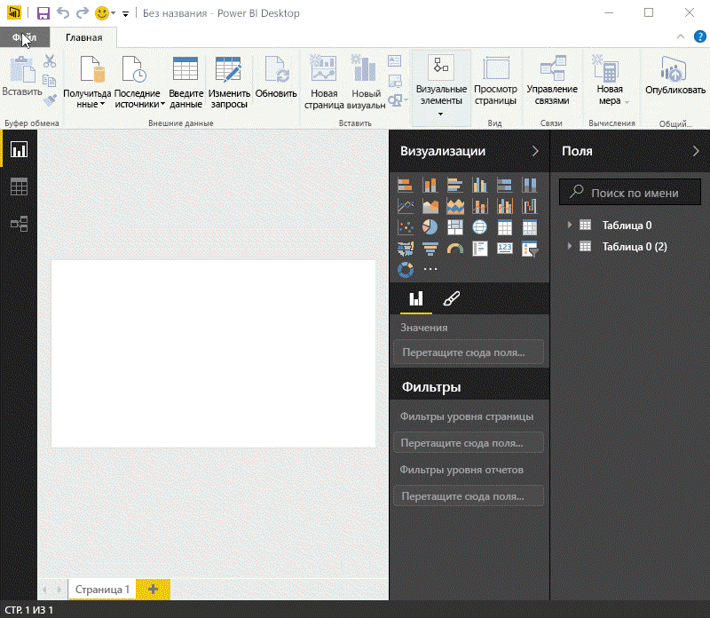

Независимо от того, какой источник данных вы выбрали, Power BI подключается именно к нему и отображает доступные в нем данные. Ниже приведен еще один рисунок с веб-страницей, на которой анализируются различные штаты и интересные статистические данные, касающиеся выхода на пенсию.

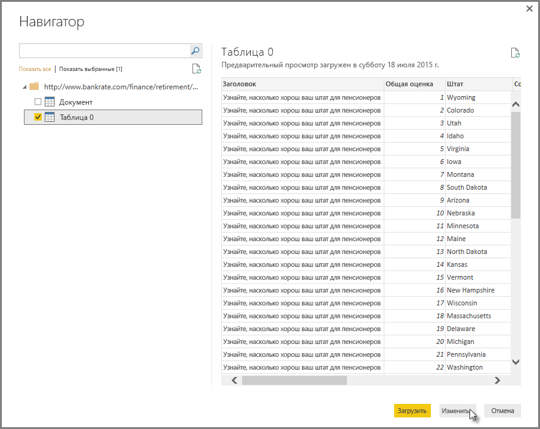

В представлении **Отчет** в Power BI Desktop можно приступить к созданию отчетов.

Представление **Отчет** имеет пять основных областей:

1. лента, на которой отображаются стандартные задачи, связанные с отчетами и визуализациями;
2. представление **Отчет** , где создаются и оформляются визуализации;
3. область вкладок **Страницы** внизу, где можно выбрать и добавить страницу отчета;
4. область **Визуализации** , где можно изменить визуализации, настроить цвета и оси, применить фильтры, перетащить поля и многое другое;
5. область **Поля** , где элементы запросов и фильтры можно перетащить в представление **Отчет** или область **Фильтры** зоны **Визуализации** .

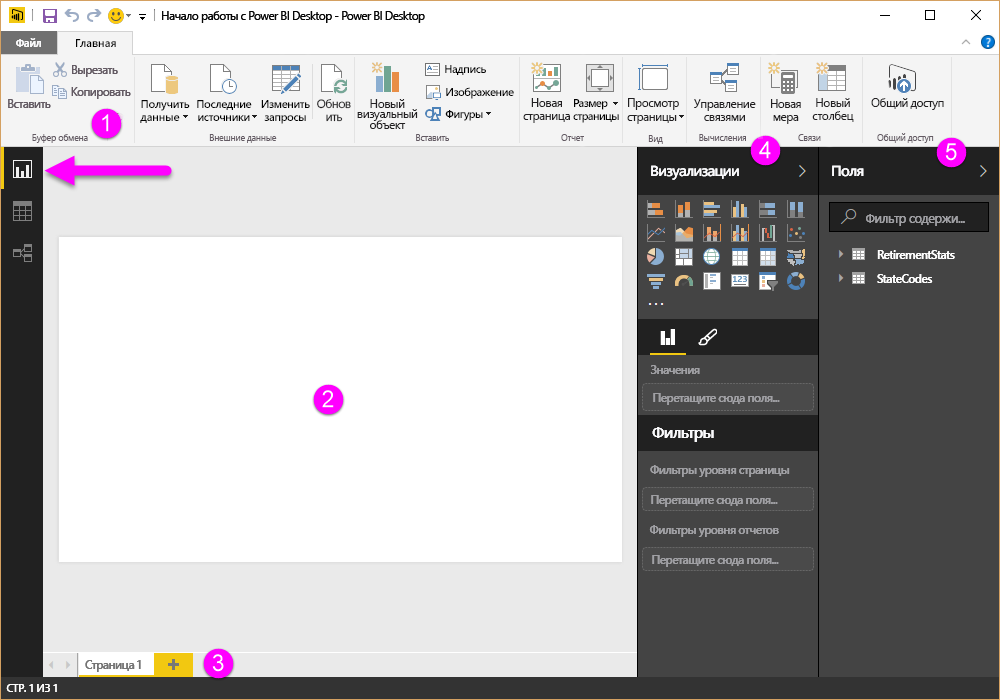

Области **Визуализации** и **Поля** можно свернуть, щелкнув маленькую стрелку сбоку, чтобы освободить больше места в представлении **Отчет** для построения впечатляющих визуализаций. При изменении представлений вы также увидите эти указывающие вверх или вниз стрелки, означающее, что можно развернуть или свернуть этот раздел соответственно.

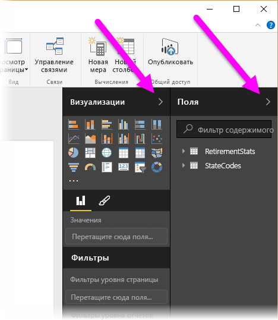

Для создания визуализации просто перетащите поле из списка **Поля** в представление **Отчет** . В данном случае давайте перетащим поле "Штат" из области *RetirementStats* и посмотрим, что произойдет.

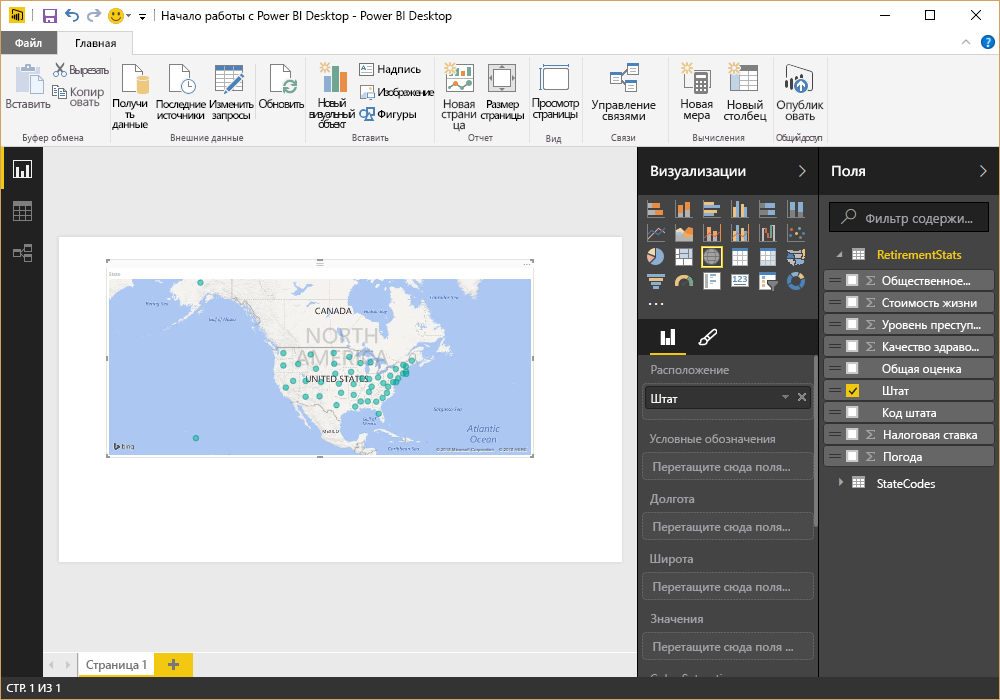

Посмотрите... Power BI Desktop автоматически создал визуализацию на основе карты, так как распознал, что поле "Штат" содержит данные о географическом положении.

Теперь давайте немного перенесемся вперед. После создания отчета с применением визуализаций его можно опубликовать в службе Power BI. В Power BI Desktop на ленте **Главная** выберите **Опубликовать**.

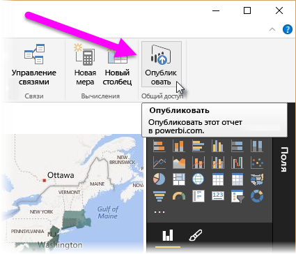

Вам будет предложено выполнить вход в Power BI.

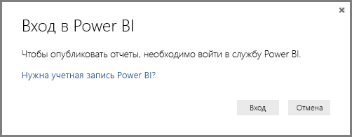

Если вы выполнили вход и завершили процесс публикации, отобразится следующее диалоговое окно. Вы можете выбрать ссылку (под надписью **Успешно выполнено!**), чтобы перейти в службу Power BI, где находится опубликованный отчет.

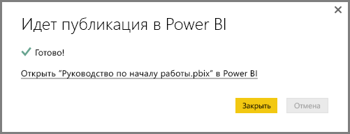

Войдя в Power BI, вы увидите только что опубликованный в службе файл Power BI Desktop. На приведенном ниже изображении отчет, созданный в Power BI Desktop, отображается в разделе **Отчеты**.

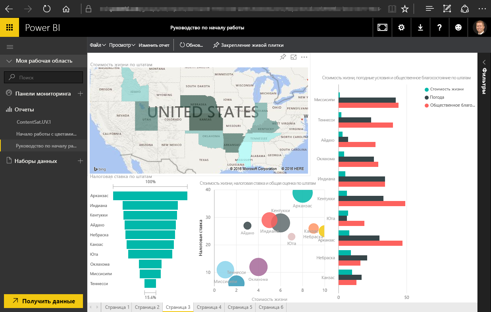

В этом отчете можно выбрать значок **Закрепить**, чтобы закрепить этот визуальный элемент на информационной панели. На следующем изображении значок булавки выделен ярким прямоугольником, на который указывает стрелка.

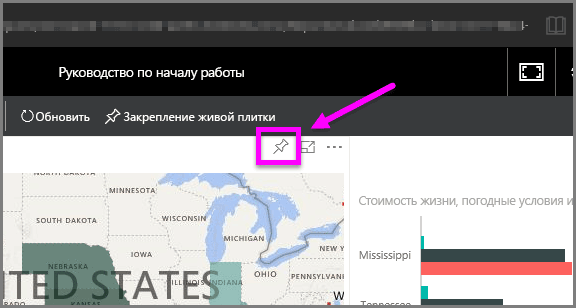

Если выбрать этот значок, появится диалоговое окно, в котором можно закрепить визуальный элемент на имеющейся информационной панели или создать новую информационную панель.

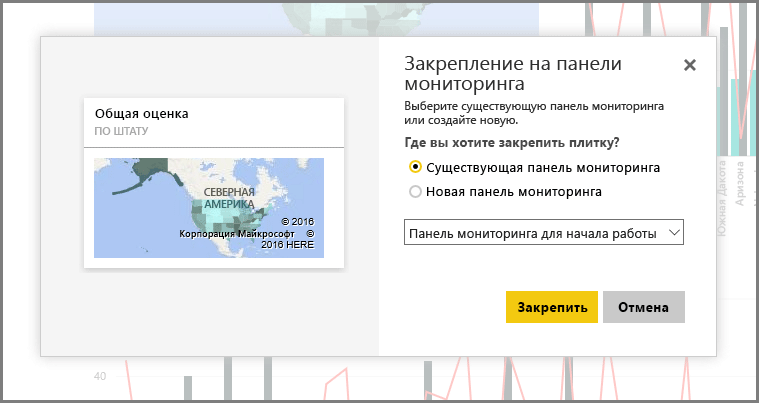

Если закрепить несколько визуальных элементов в отчете, они появятся на информационной панели.

Разумеется, с помощью Power BI можно сделать многое другое, например предоставить общий доступ к созданной информационной панели. Мы обсудим совместное использование позже в этом курсе.

В следующем разделе мы рассмотрим функцию, которая позволяет автоматически создавать информационные панели, просто подключившись к облачной службе, например Facebook, Salesforce и т. д.

