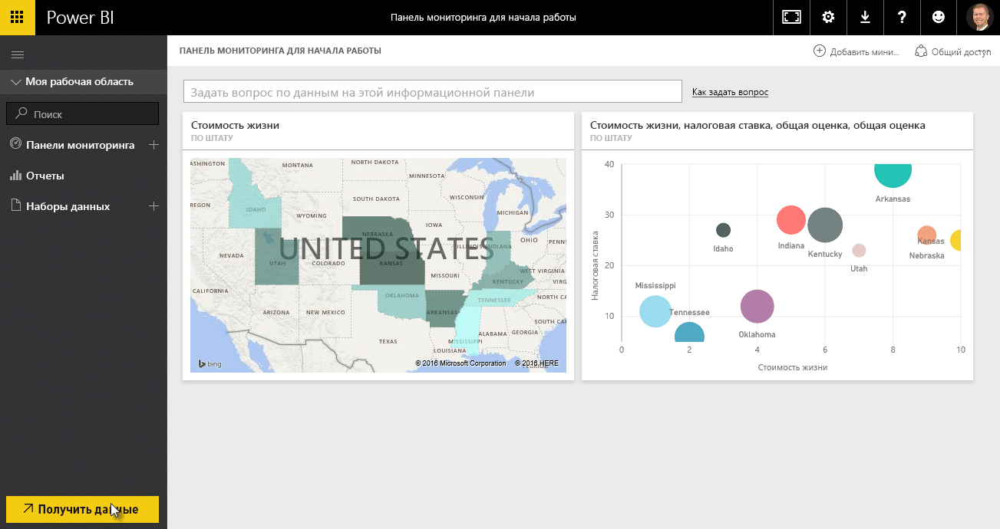
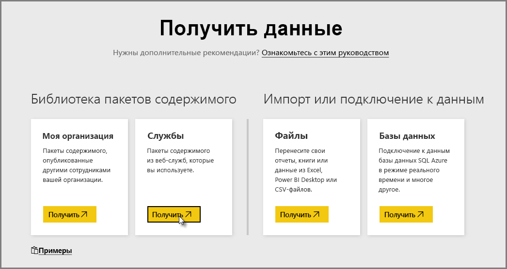
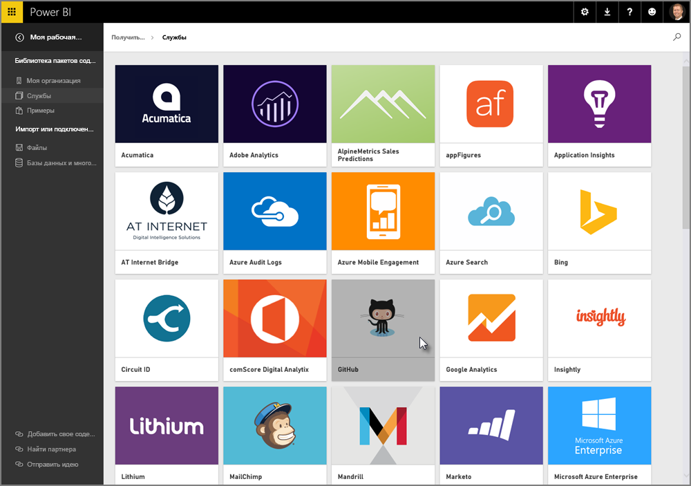
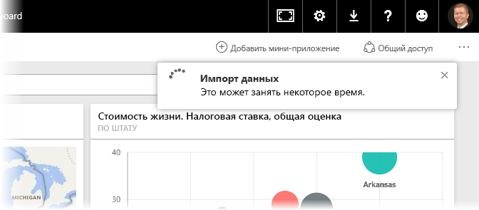
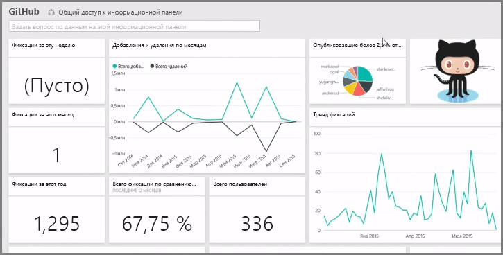
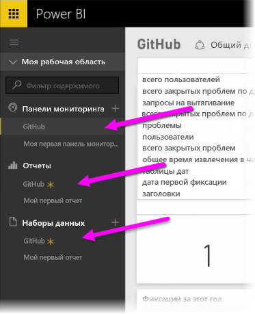
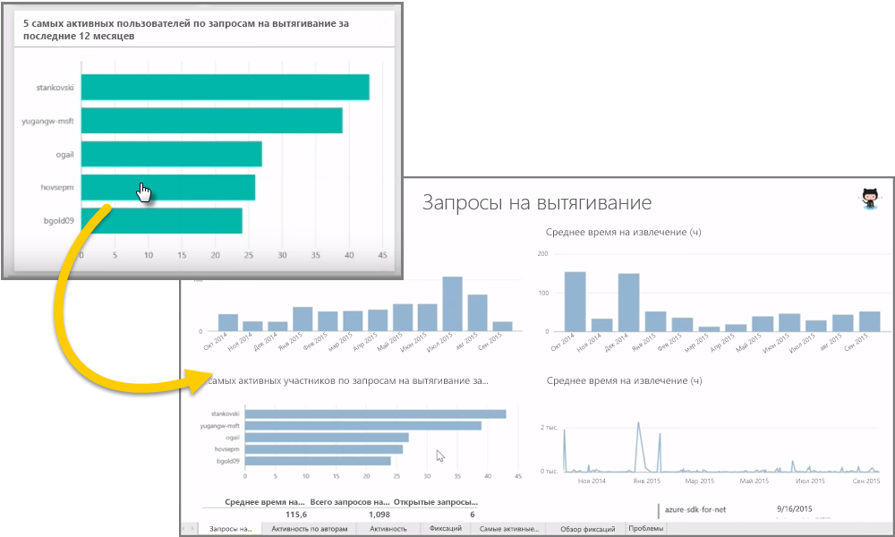
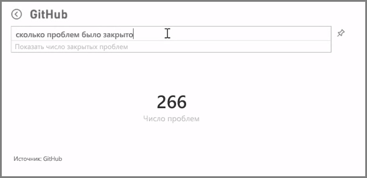
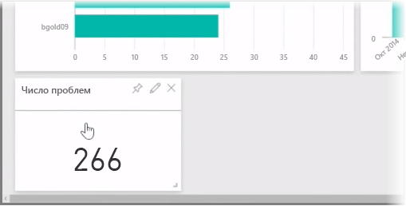
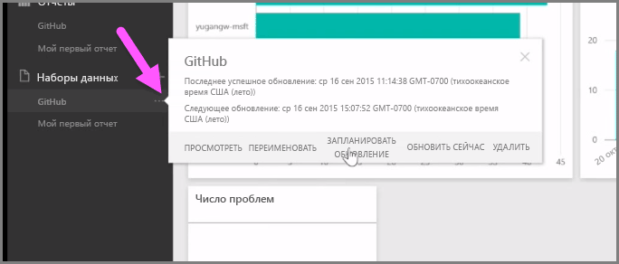

Как уже упоминалось, общий поток работы в Power BI — это создание отчета в Power BI Desktop, его публикация в службе Power BI, а затем предоставление общего доступа к нему другим пользователям, чтобы они смогли просматривать этот отчет в службе или в мобильном приложении.

Однако некоторые пользователи только начинают работу в службе Power BI, поэтому давайте кратко рассмотрим эту службу и узнаем о простом и популярном способе быстрого создания визуальных элементов в Power BI: *использование пакетов содержимого*.

**Пакет содержимого** — это коллекция предварительно настроенных, готовых визуальных элементов и отчетов, созданных на основе конкретных источников данных, таких как Salesforce. Использование пакета содержимого подобно разогреву полуфабриката в микроволновой печи или заказу пищи в заведении быстрого питания: всего несколько щелчков мышью и комментариев — и вы быстро получаете коллекцию записей, которые хорошо сочетаются. Они представлены в аккуратном, готовом к использованию пакете.

Итак, давайте коротко остановимся на пакетах содержимого, службе и на том, как это работает. Пакеты содержимого (и служба) будут рассмотрены более подробно в следующих разделах. Можете считать это дегустацией, призванной пробудить ваш аппетит.

## Создание готовых информационных панелей с использованием облачных служб
Power BI позволяет с легкостью подключаться к данным. Для этого просто нажмите в службе Power BI кнопку **Получение данных** в нижнем левом углу начального экрана.

На *холсте* (область в центре службы Power BI) отобразятся доступные источники данных в службе Power BI. Помимо общих источников данных, таких как файлы Excel, базы данных или данные Azure, в Power BI можно так же просто подключаться к **программным службам** (также называемым поставщиками SaaS или облачными службами), например Salesforce, Facebook, Google Analytics и всему набору других служб SaaS.

Для этих программных служб **в службе Power BI** предусмотрена коллекция готовых визуальных элементов, заранее упорядоченных в виде информационных панелей и отчетов, которые называются **пакетами содержимого**. Они позволяют быстро подготовиться к работе в Power BI с данными из выбранной службы. Например, при использовании пакета содержимого Salesforce Power BI подключается к вашей учетной записи Salesforce (после того, как вы предоставите учетные данные) и заполняет заранее определенную коллекцию визуальных элементов и информационных панелей в Power BI.

Power BI предоставляет пакеты содержимого для всех видов служб. На следующем изображении показан первый экран со службами в алфавитном порядке, который отображается после нажатия кнопки **Получить** в области **Службы** (показано на предыдущем изображении). Как видно на изображении ниже, есть большой выбор служб.

Для наших целей мы выберем **GitHub**. GitHub — это приложение для системы управления версиями в сети. Как только будут введены сведения и учетные данные для пакета содержимого GitHub, начнется импорт данных.

После загрузки данных отобразится заранее определенная информационная панель пакета содержимого GitHub.

Помимо **информационной панели**, доступен **отчет**, сформированный (как часть пакет содержимого GitHub) для создания информационной панели, а также **набор данных** (коллекция данных, извлеченных из GitHub), который был создан во время импорта данных и использовался для создания отчета GitHub.

Если щелкнуть любой визуальный элемент на информационной панели, автоматически откроется страница **отчета**, на основе которой был создан этот визуальный элемент. Поэтому, если щелкнуть визуальный элемент **Первые 5 пользователей по запросам на включение внесенных изменений**, в Power BI откроется страница **Запросы на включение внесенных изменений** в представлении отчета (странице отчета, на основе которой был создан этот визуальный элемент).

## Вопросы о данных
Вы также можете задавать вопросы о данных, на основе которых в службе Power BI будут создаваться визуальные элементы в режиме реального времени. На следующем изображении видно, как Power BI создает несколько визуальных элементов, отображающих число закрытых проблем, на основе данных, введенных на панели **запросов на естественном языке**.

После получения нужного визуального элемента вы можете выбрать значок **Закрепить** справа от панели запросов на естественном языке, чтобы закрепить этот элемент на информационной панели. В этом случае визуальный элемент закрепляется на информационной панели GitHub, потому что она выбрана в настоящий момент.

## Обновление данных в службе Power BI
Вы можете также **обновить** набор данных для пакета содержимого или другие данные, которые используются в Power BI. Чтобы задать параметры обновления, щелкните значок многоточия (три точки) рядом с набором данных. После этого отобразится меню.

Выберите параметр **Расписание обновления** в нижней части меню. На холсте отобразится диалоговое окно параметров, где можно задать параметры обновления в соответствии с вашими требованиями.

На этом краткий обзор службы Power BI заканчивается. Далее в нашем курсе мы расскажем о многих других вещах, которые можно делать с помощью этой службы. Помните, что существует множество разных типов данных, к которым можно подключаться, и видов пакетов содержимого, количество которых постоянно увеличивается.

Давайте перейдем к следующему разделу, где подводятся итоги раздела **Начало работы** и описаны дальнейшие шаги.

