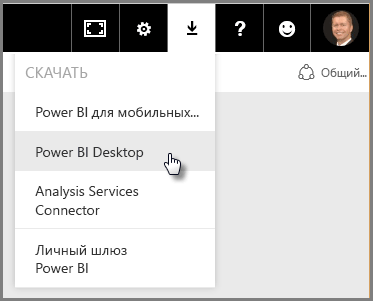
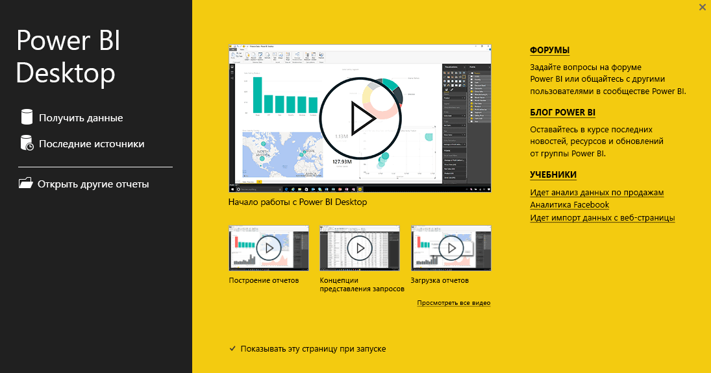

Добро пожаловать во второй раздел курса **интерактивного обучения** для Power BI, который называется **Получение данных**. В этом разделе рассматриваются многие функции и инструменты Power BI, которые ориентированы на обработку данных, сосредотачивая внимание на Power BI Desktop. Многие из этих инструментов также применяются к службе Power BI, поэтому у этого раздела двойное назначение.

Данные, которые вы получаете, иногда имеют неправильный формат и не такие *чистые*, как бы вам хотелось. Поэтому в этом разделе вы узнаете, как получить и очистить данные (иногда это называется *очистка* или *преобразование* данных), а также ознакомитесь с некоторыми дополнительными приемами, упрощающими получение данных.

Как и в предыдущих разделах этого курса, обучение основано на общем потоке работы в Power BI. Таким образом, давайте ознакомимся с использованием **Power BI Desktop** с самого начала.

## Обзор Power BI Desktop
Power BI Desktop — это инструмент, который позволяет подключиться к вашим данным, очистить и визуализировать их. С помощью Power BI Desktop можно подключаться к данным, а затем моделировать и визуализировать их разными способами. Большинство пользователей, которые работают над проектами бизнес-аналитики, будут проводить большую часть своего времени, работая с Power BI Desktop.

Вы можете скачать Power BI Desktop [из Интернета](http://go.microsoft.com/fwlink/?LinkID=521662). Также можно установить **Power BI Desktop** как приложение из [**Магазина Windows**](http://aka.ms/pbidesktopstore) или скачать приложение из службы Power BI. Чтобы скачать **Power BI Desktop** из службы, нажмите кнопку со стрелкой вниз в верхней правой части Power BI, а затем выберите Power BI Desktop.

Power BI Desktop устанавливается как приложение на компьютере Windows.

Поэтому после скачивания установка и запуск Power BI Desktop ничем не отличается от других приложений в Windows. На следующем изображении показан начальный экран Power BI Desktop, который отображается при запуске приложения.

Power BI Desktop подключается к множеству источников данных — от локальных баз данных и листов Excel до облачных служб. Он помогает очистить и отформатировать ваши данные, чтобы сделать их более пригодными для использования, включая разбивку и переименование столбцов, а также изменение типов данных и работу с датами. Кроме того, вы можете создавать связи между столбцами для более простого моделирования и анализа данных.

