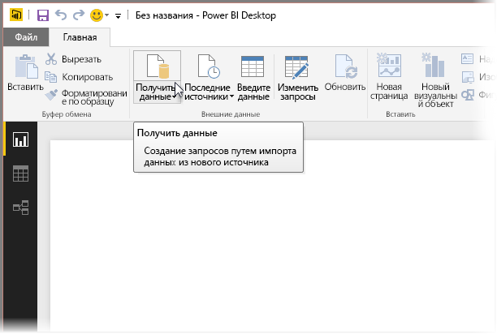
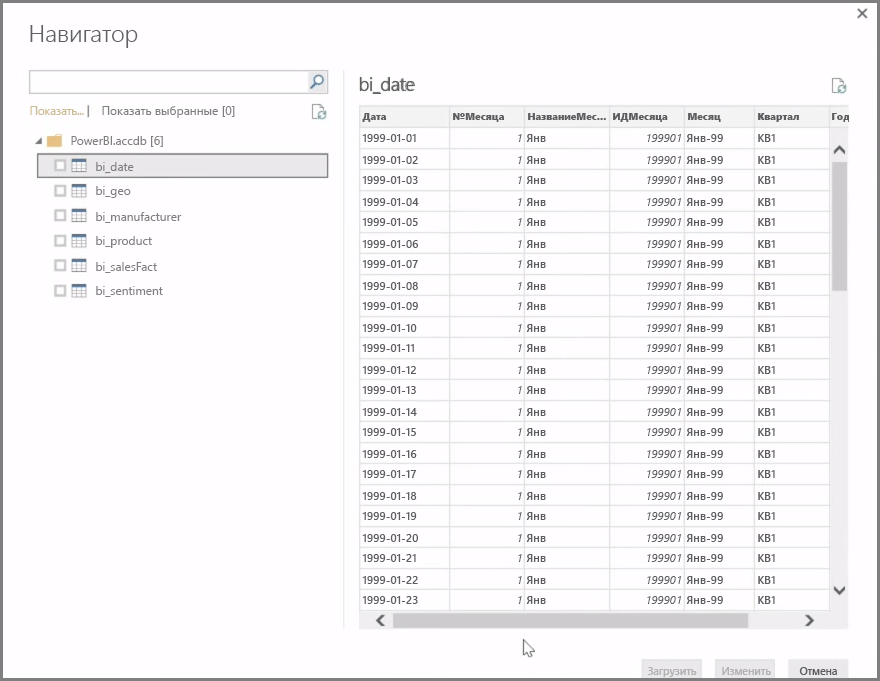
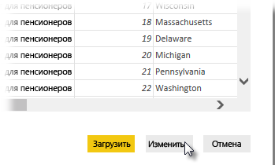

**Power BI Desktop** может подключаться к целому ряду источников данных, включая локальные базы данных, книги Excel и облачные службы. В настоящее время более 59 разных облачных служб (например, GitHub и Marketo) имеют специальные соединители. Вы можете подключаться к универсальным источникам через файлы XML, CSV, текстовые файлы и ODBC. Power BI даже считывает табличные данные непосредственно из URL-адреса веб-сайта! Но давайте начнем с самого начала, а именно с открытия Power BI Desktop и подключения к данным.

Запустив **Power BI Desktop** и пропустив начальный экран, можно выбрать элемент "Получение данных" на ленте вкладки **Главная**.

Обновления Power BI Desktop выходят ежемесячно. С каждым обновлением на страницу **новых возможностей Power BI Desktop** добавляются сведения об обновлениях, новые ссылки на блог и ссылка для скачивания.

В Power BI Desktop доступны все виды различных источников данных. Выберите источник, к которому необходимо подключиться. В зависимости от сделанного выбора вам будет предложено найти источник на вашем компьютере или в сети либо войти в службу, чтобы пройти проверку подлинности запроса.

После подключения вы увидите окно **Навигатор**. Здесь отображаются таблицы и сущности источника данных. Если щелкнуть один из элементов, отобразится окно предварительного просмотра его содержимого. Затем вы можете немедленно импортировать выбранные таблицы или сущности либо выбрать **Изменить**, чтобы преобразовать и очистить данные перед импортом.

Выбрав таблицы, которые нужно перенести в Power BI Desktop, вы можете загрузить их, нажав кнопку **Загрузить** в нижнем правом углу окна **Навигатор**. Однако иногда необходимо внести изменения в эти таблицы до их загрузки в Power BI Desktop. Вам может понадобиться только одно подмножество клиентов или отфильтровать данные таким образом, чтобы отображались продажи, осуществленные только в конкретной стране. В таких случаях вы можете нажать кнопку "Изменить" и отфильтровать или преобразовать данные, прежде чем переносить их в Power BI Desktop.

Мы выберем и изменим данные в следующем разделе.

