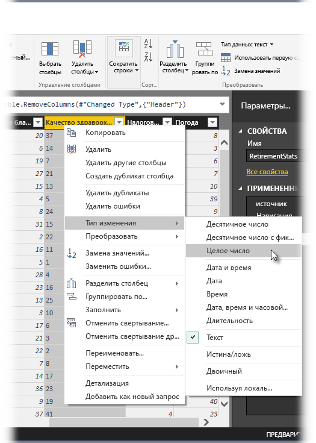
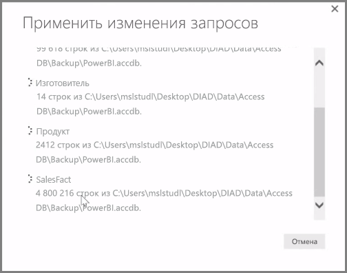

**Power BI Desktop** содержит **редактор запросов** — мощный инструмент, позволяющий изменять форму данных и преобразовывать их, чтобы подготовить к визуализации или моделированию. Когда вы выбираете значок изменения на панели "Навигатор", запускается редактор запросов, который заполняется таблицами или другими сущностями, выбранными из источника данных.

**Редактор запросов** можно также запустить непосредственно из **Power BI Desktop**, используя кнопку **Изменить запросы** на ленте **Главная**.

После загрузки редактора запросов с данными, готовыми к формированию, появится несколько разделов:

1. На ленте многие кнопки теперь можно использовать для взаимодействия с данными в запросе.
2. В левой области перечислены запросы (один для каждой таблицы или сущности), которые можно выбирать, просматривать и формировать.
3. В центральной области отображаются данные из выбранного запроса, и их можно формировать.
4. Появляется окно параметров запроса, в котором перечислены свойства запроса и примененные действия.

Если щелкнуть правой кнопкой мыши столбец в центральной области, отобразятся различные доступные преобразования, например удаление столбца из таблицы, дублирование столбца под новым именем и замена значений. В этом меню можно также разбить текстовые столбцы с помощью обычных разделителей.

Лента **редактора запросов** содержит дополнительные инструменты, такие как изменение типа данных столбцов, добавление экспоненциальных представлений и извлечение элементов из дат, например дня недели.

При применении преобразований каждый шаг отображается в списке **Примененные шаги** справа от **редактора запросов** в области **Параметры запроса**. С помощью этого списка можно отменить или просмотреть конкретные изменения или даже изменить имя шага. Чтобы сохранить преобразования, выберите пункт **Закрыть и применить** на вкладке **Главная**.

После выбора команды **Закрыть и применить** редактор запросов применяет внесенные изменения запроса, в том числе к Power BI Desktop.

Преобразование данных в **редакторе запросов** предоставляет множество возможностей, в том числе дополнительные преобразования. В следующем разделе мы рассмотрим некоторые дополнительные преобразования, чтобы дать представление о практически безмерном количестве способов преобразования данных в **редакторе запросов**.

