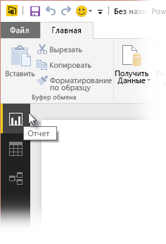
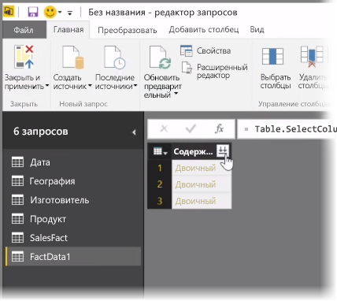
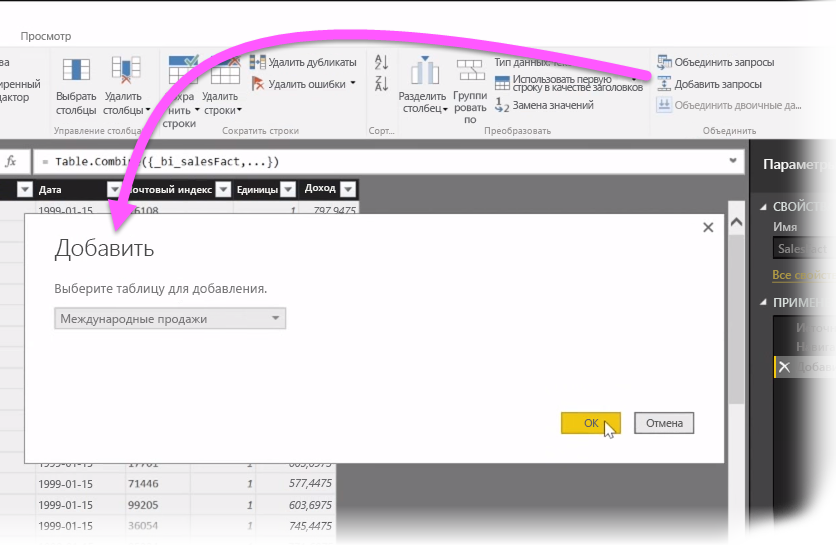
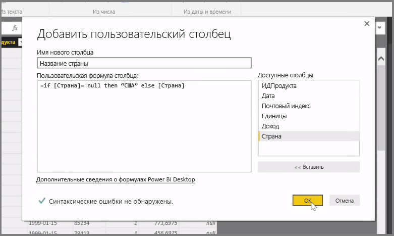

В этой статье мы рассмотрим некоторые расширенные методы импорта и очистки данных, доступные в **Power BI Desktop**. Сформированные в **редакторе запросов**, а затем перемещенные в **Power BI Desktop** данные можно просмотреть в различных представлениях. В Power BI Desktop три представления: **Отчет**, **Данные** и **Связи**. Каждое из них можно открыть, выбрав соответствующий значок в левой верхней части холста. На следующем изображении выбрано представление **Отчет**. Желтая полоска рядом со значком указывает на активное представление.

Чтобы сменить представление, нужно просто выбрать любой из двух других значков. Желтая полоска рядом со значком указывает на активное представление.

В Power BI Desktop можно объединять данные из нескольких источников в одном отчете в любое время в процессе моделирования. Чтобы добавить дополнительные источники в существующий отчет, на ленте **Главная** выберите пункт **Изменить запросы**, а затем в **редакторе запросов** выберите команду **Создать источник**.

В **Power BI Desktop** можно использовать множество различных источников данных, включая папки. Подключившись к папке, можно импортировать данные из нескольких файлов одновременно, например файлов Excel и CSV. Файлы, содержащиеся в выбранной папке, отображаются в **редакторе запросов** как двоичное содержимое. Чтобы загрузить их значения, щелкните значок с двумя стрелками в верхней части столбца **Содержимое**.

Один из самых полезных инструментов Power BI — *фильтры*. Например, если щелкнуть стрелку раскрывающегося списка рядом со столбцом, откроется контрольный список текстовых фильтров, которые можно использовать для удаления значений из модели.

Можно также объединить и добавить запросы, а также преобразовать несколько таблиц (или данные из различных файлов в папках) в одну таблицу, содержащую нужные данные. С помощью инструмента **Добавить запросы** можно добавить данные из новой таблицы в существующий запрос. Power BI Desktop сопоставляет столбцы в запросах, которые затем при необходимости можно настроить в **редакторе запросов**.

И наконец, инструмент **Добавить пользовательский столбец** позволяет опытным пользователям составлять выражения запросов с нуля на расширенном языке программирования М. Вы можете добавить пользовательский столбец на основе инструкций на языке запросов M и получить данные в желаемом виде.

