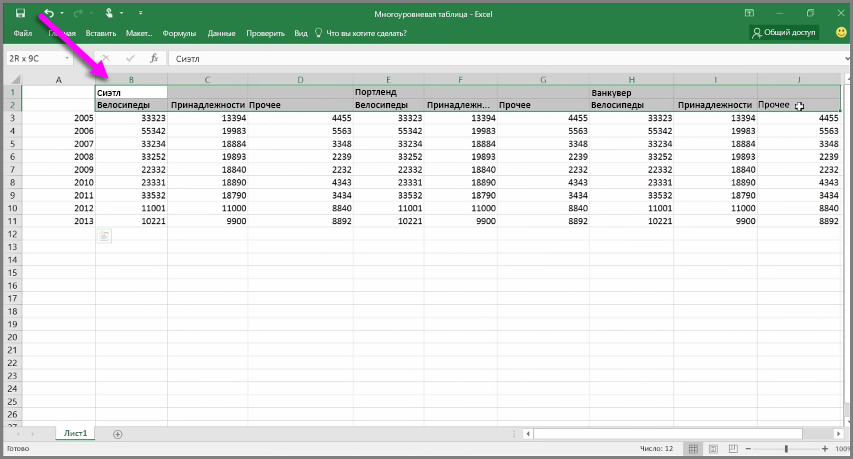
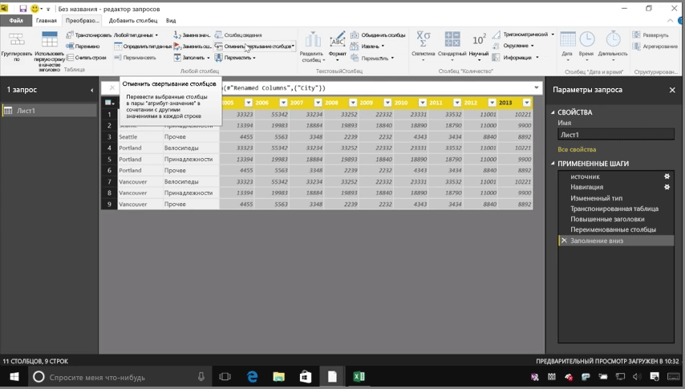
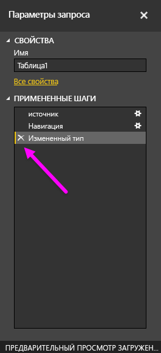
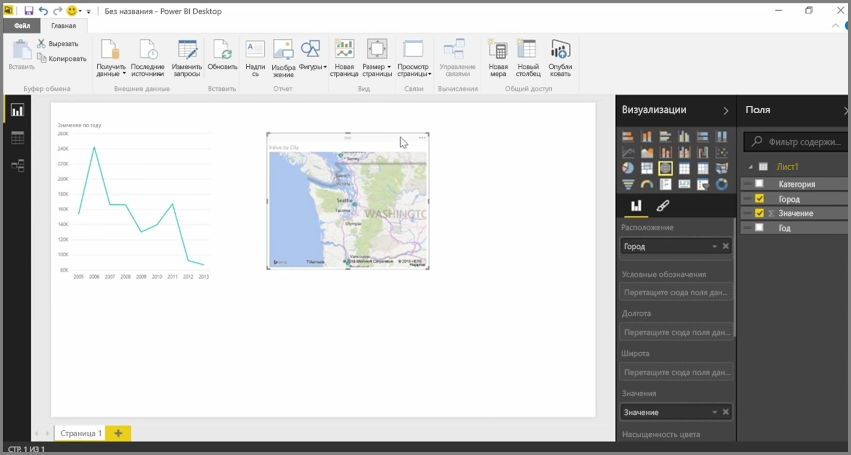

В Power BI можно импортировать данные практически из любого источника. Однако для средств визуализации и моделирования лучше всего подходят данные, расположенные в столбцах. Иногда данные не будут форматироваться в простые столбцы. Зачастую это происходит с электронными таблицами Excel, где удобная для просмотра структура таблицы не всегда оптимальна для автоматических запросов. Например, в следующей таблице содержатся заголовки, которые охватывают несколько столбцов.

К счастью, в Power BI есть средства, позволяющие быстро преобразовывать таблицы с несколькими столбцами в наборы данных, которые можно использовать.

## Транспонирование данных
Например, используя команду **Транспонировать** в **редакторе запросов**, можно отразить данные (преобразовать столбцы в строки и наоборот), чтобы разбить данные на форматы, которыми можно управлять.

Выполнив эту процедуру несколько раз, как показано в видео, мы получим формат таблицы, удобный для работы в Power BI.

## Форматирование данных
Вам может потребоваться отформатировать данные, чтобы решение Power BI классифицировало и идентифицировало их должным образом после импорта.

Здесь доступно множество преобразований, например *преобразование строк в заголовки* для разделения заголовков, функция **Заполнение**, с помощью которой можно превратить значения *Null* в значения, находящиеся выше или ниже в указанном столбце, и команда **Отменить свертывание столбцов**. Все они позволяют очистить данные и создать на их основе набор данных, который можно использовать в Power BI.

В Power BI можно поэкспериментировать с этими преобразованиями данных и определить, какие из них позволяют получить данные требуемого формата (в столбцах), поддерживаемого в Power BI. И помните, что все выполненные действия записываются в разделе "Примененные шаги" в редакторе запросов. Поэтому если преобразование не работает так, как предполагалось, можно просто щелкнуть **x** возле шага и отменить его.

## Создание визуальных элементов
После конвертации данных в формат, который можно использовать в Power BI, путем преобразования и очистки данных можно приступить к созданию визуальных элементов.

## Дальнейшие действия
**Поздравляем!** Вы изучили этот раздел курса **интерактивного обучения** для Power BI. Теперь вы знаете, как **передать данные** в Power BI Desktop, а также как *изменить форму* данных или *преобразовать* их, чтобы создавать привлекательные визуальные элементы.

Далее, чтобы научиться работать с Power BI, а также делать это *эффективно*, необходимо понять принцип **моделирования**. Как вы узнали, **набор данных** — это основной стандартный блок Power BI. Однако некоторые из них могут быть сложными. Кроме того, используемые данные могут быть получены из множества различных источников. И в некоторых случаях необходимо добавить свою "изюминку" (или *поле*) в создаваемом наборе данных.

В следующем разделе вы узнаете о **моделировании** и многом другом. До встречи!

