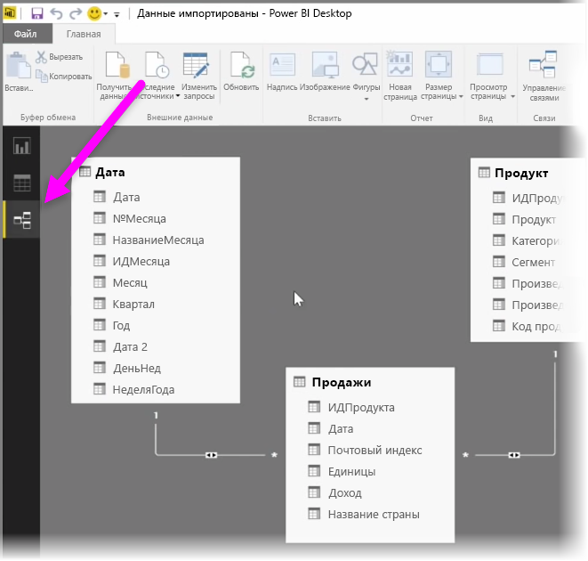
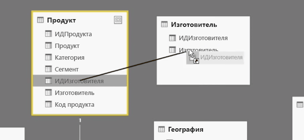
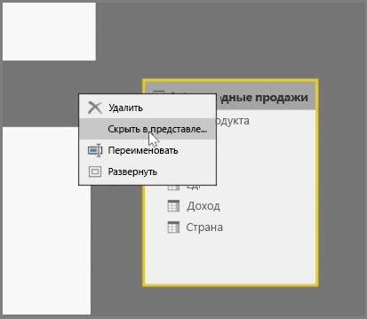
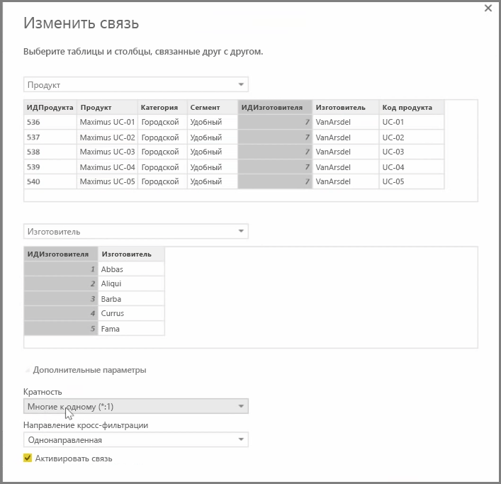

Power BI позволяет визуально установить связь между таблицами или элементами. Чтобы просмотреть схематическое представление данных, используйте **Представление связей**, которое находится в левой части экрана рядом с холстом отчетов.

В представлении **связей** можно увидеть блок, который представляет каждую таблицу и ее столбцы, а строки между ними представляют связи.

Добавлять и удалять связи просто. Чтобы удалить связь, щелкните ее правой кнопкой мыши и выберите **Удалить**. Чтобы создать связь, перетащите поля, которые необходимо связать между таблицами.

Чтобы скрыть в отчете таблицу или отдельные столбцы, щелкните эту таблицу правой кнопкой мыши в представлении связей и выберите **Скрыть в представлении отчета**.

Чтобы увидеть более подробное описание связей данных, на вкладке **Главная** выберите **Управление связями**. При этом откроется диалоговое окно **Управление связями**, в котором связи отображаются не в виде схемы, а в виде списка. Здесь можно выбрать **Автообнаружение**, чтобы найти связи в новых или обновленных данных. В диалоговом окне **Управление связями** выберите **Изменить**, чтобы изменить связи вручную. Также здесь доступны дополнительные параметры, которые позволяют задать *Кратность* и *Направление кроссфильтрации* связей.

В параметрах кратности можно выбрать *Многие к одному* или *Один к одному*. *Многие к одному* — это возможность связать разные типы измерений, например таблицу продаж с множеством строк для каждого продукта и таблицу с перечнем продуктов, в которой каждому продукту соответствует отдельная строка. *Один к одному* используется, как правило, для связывания отдельных записей в ссылочных таблицах.

По умолчанию для связей устанавливается кроссфильтрация в обоих направлениях. Кроссфильтрация только в одном направлении ограничивает некоторые возможности моделирования в связи.

Установление точных связей между данными позволяет выполнять сложные вычисления, используя разные элементы данных.

