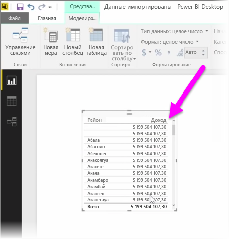
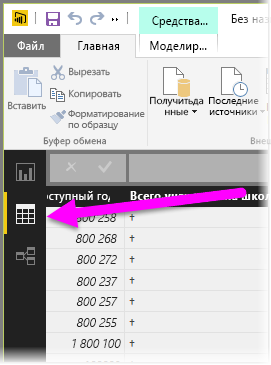
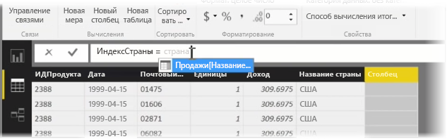
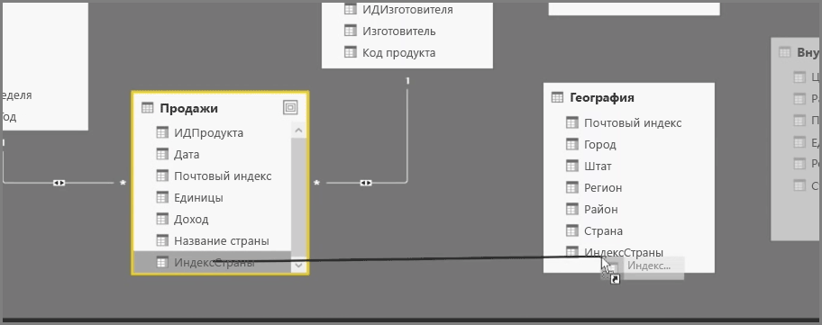
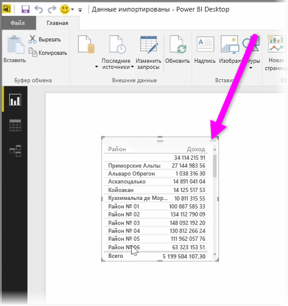

Создание вычисляемых столбцов — простой способ расширить и улучшить ваши данные. **Вычисляемый столбец** — это новый столбец, который вы создаете, определяя вычисление, преобразующее или объединяющее два или более элементов существующих данных. Например, можно создать новый столбец, объединив два столбца в один.

Одной из причин создания вычисляемого столбца является необходимость установления связи между таблицами, когда в этих таблицах отсутствуют уникальные поля, которые можно было бы использовать для установления связи. Отсутствие связи становится очевидным, когда простая таблица создается и визуализируется в Power BI Desktop, при этом для всех записей отображается одинаковое значение, хотя известно, что базовые данные разные.

Для создания связи с уникальными полями в данных можно, например, создать новый вычисляемый столбец "Полный телефонный номер", объединив значения из столбцов "Код города" и "Местный номер"(при наличии этих значений в данных). Вычисляемые столбцы являются полезным инструментом для быстрого создания моделей и визуализаций.

Чтобы создать вычисляемый столбец, в Power BI Desktop в левой части холста отчетов выберите **Представление данных**.

На вкладке "Моделирование" выберите **Создать столбец**. Появится строка формул, в которой можно ввести вычисления, используя язык DAX (выражения анализа данных). DAX — это мощный язык формул, также применяемый в Excel, который позволяет создавать надежные вычисления. При вводе формулы Power BI Desktop отображает соответствующие формулы и элементы данных, чтобы помочь вам и ускорить создание формулы.

По мере ввода выражения в строке формул Power BI будут предлагаться конкретные функции DAX и связанные столбцы данных.

После создания вычисляемых столбцов в каждой таблице их можно использовать как уникальный ключ для установления связей между таблицами. Затем можно перейти в представление **связей** и перетащить поле из одной таблицы в другую, чтобы создать связь.

Вернувшись в представление к **отчетов** вы увидите, что для всех регионов теперь отображаются разные значения.

Существует множество других возможностей, которые можно реализовать, создав вычисляемые столбцы.

